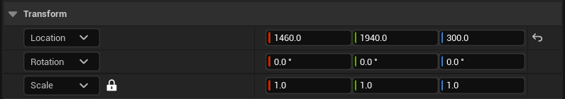
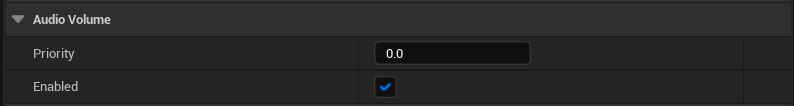
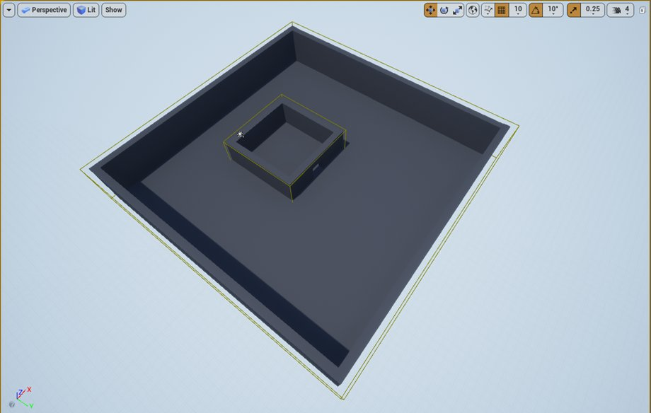
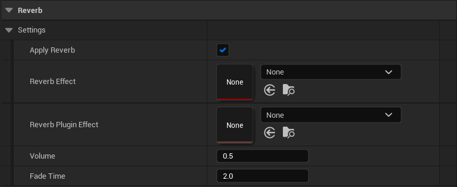
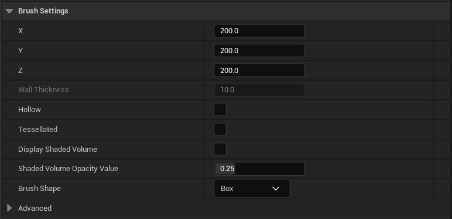
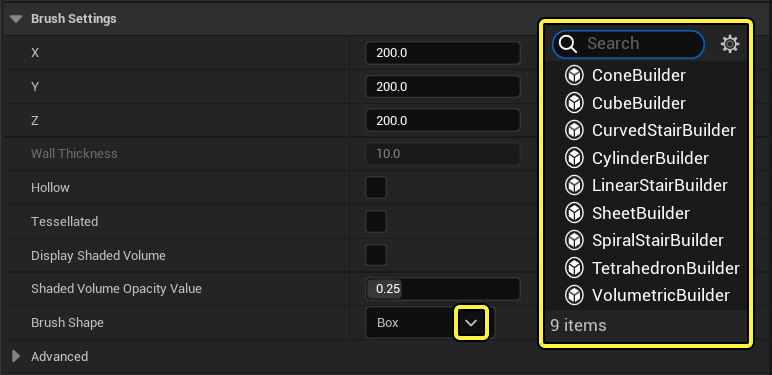
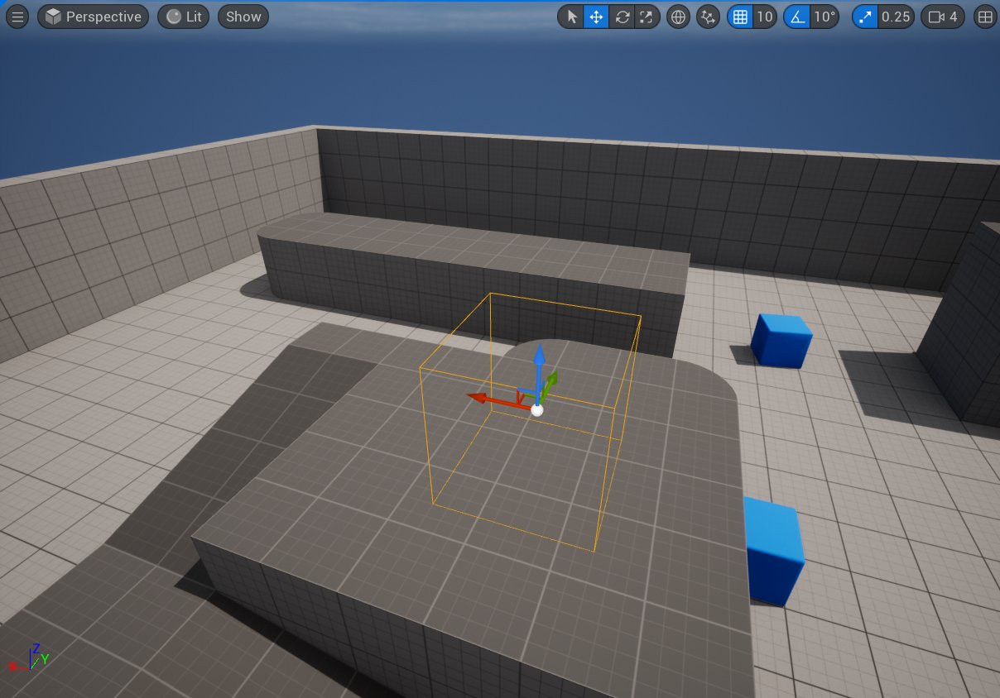
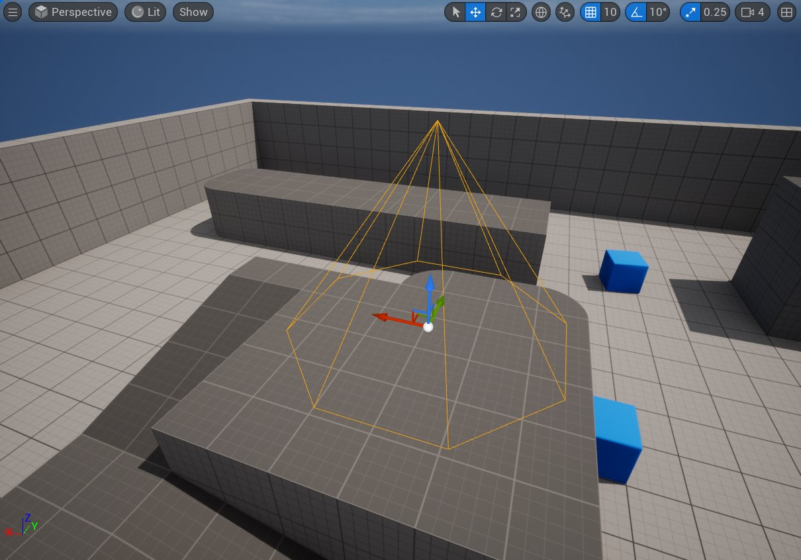

# 音频体积

> 路径：虚幻引擎5.7文档 / 处理音频 / 音频体积Actor / 音频体积

> 原始页面：https://dev.epicgames.com/documentation/unreal-engine/audio-volumes-in-unreal-engine

借助 **音频体积Actor（Audio Volume Actor）** ，你可以在蓝图中定义区域，以便处理声音，然后使用这些设置应用混响效果、设置体积、定义作用区域、模拟声音遮挡、定义声音体积的形状。

## 变换

**变换（Transform）** 设置用于更改位置、旋转和缩放。你可以使用这些设置来确保音频体积包围需要处理声音的区域。

- 位置（Location）：

  确定音频体积原点的位置。
- 旋转（Rotation）：

  确定音频体积的旋转。
- 缩放（Scale）：

  确定音频体积的缩放（尺寸）。

## 音频体积

**音频体积（Audio Volume）** 设置用于定义存在重叠体积时使用的体积设置。

- 优先级（Priority）：

  确定音频体积的优先级，该优先级用于确保在存在重叠或嵌套体积的情况下，应用正确的体积。使用的数值越高，优先级越高。当两个重叠体积的优先级相同时，则不使用优先级。
- 启用（Enabled）：

  开启或关闭音频体积。

在下图中，较小区域嵌套在较大区域内。每个空间都有自己的音频体积 （请注意两个空间周围的黄色体积轮廓），用于定义不同的混响和环境区域设置。

假如听众处于较小的那个空间内，则他们同时位于两个音频体积内，这时就需要定义音频引擎应该使用哪个音频体积。当音频体积重叠时，音频引擎会使用优先级更高的音频体积。

在这个示例中，不妨将较大的音频体积设置为1，将较小的音频体积设置为2。这样，当听众在较小空间内时，系统就会使用相应的混响和环境区域设置。

## 混响

你可以使用 **混响（Reverb）** 设置启用或禁用音频体积，选择在激活时使用的混响预设，并定义混响信号体积和混响设置间的消退时间。

- 应用混响（Apply Reverb）：

  启用或禁用下面指定的混响效果。
- 混响效果（Reverb Effect）：

  确定将使用的混响效果资产。引擎内容中包含许多混响预设，或者你也可在内容浏览器中创建自己的混响效果资产。
- 混响插件效果（Reverb Plugin Effect）：

  选择要使用的混响插件效果。如果你打算使用第三方音频插件（例如Google Resonance），请在下拉菜单选项中选择该插件将使用的混响效果。
- 体积（Volume）：

  设置混响效果的体积级别。默认设置为0.5。
- 消退时间（Fade Time）：

  在你进入并离开音频体积时，从当前混响设置到新混响设置插值所花的时间（以秒为单位）。确定关卡中区域间的过渡时间，系统的响应能力和移动程度设置需取得平衡以达到新值。例如，若要从混响非常小的空间移动到混响时间非常长的空间，则可能需使用更长的过渡时间，以避免在空间之间移动时突然发生变化。混响设置相似的空间之间的移动可更快地过渡。

## 笔刷设置

**笔刷设置（Brush settings）** 定义音频体积的整体形状，并设置体积的初始大小（在应用上面的缩放值之前）。

为音频体积选择能够提供最佳覆盖范围的 **笔刷形状（Brush Shape）** 。"笔刷形状"下的其余设置会根据所选形状相应调整。

> [!NOTE]
> 你可以使用 **几何体编辑模式（Geometry Editing mode）** 来更改提供的形状，以创建更适合关卡中特定区域的定制（自定义）形状。某些笔刷形状可设置为空心，虽然这样 *能够* 发挥作用（例如，当音频体积仅在内墙和外墙之间有效果时），但一般情况下不建议使用。**画笔编辑器（Brush Editor）** 主要用于为关卡设计师构建几何体，因此某些现成形状在音频设计中可能并不实用。

## 笔刷形状

点击 **笔刷形状（Brush Shape）** 下拉菜单，以显示内置形状列表，然后从中选择：

### 盒体（CubeBuilder）

默认形状，在下拉菜单中显示为 **CubeBuilder** 。此形状产生成立方体形状的音频体积。

对于盒体笔刷形状，以下选项可供使用：

- X、Y、Z：

  确定盒体形状音频体积首次创建时的初始大小。然后，根据上面的缩放属性值缩放这些值。
- 墙壁厚度（Wall Thickness）：

  仅在启用空心（Hollow）选项时激活。当音频体积为空心时，它用于确定墙壁厚度。
- 空心（Hollow）：

  选择音频体积是否为空心。该功能继承自从父体积类，一般情况下不建议使用。
- 曲面细分（Tessellated）

  ：确定是否为每个立方体面生成额外的内部面。
- 显示着色体积（Display Shaded Volume）

  ：选中时显示带有着色体积的笔刷。
- 着色体积不透明度值（Shaded Volume Opacity Value）

  ：值介于0–1之间，用于设置着色体积的不透明度。

### 锥体（ConeBuilder）

在下拉菜单中选择 **ConeBuilder** 可以生成锥体音频体积。

以下选项可用于此形状：

- Z：

  确定锥体从底部到尖端的初始高度。然后根据变换（Transform）设置中缩放（Scale）属性的Z值缩放。
- Z盖（Cap Z）：

  仅在启用空心（Hollow ）选项时激活。确定内锥体的高度。
- 外部半径（Outer Radius）：

  锥体形状音频体积的初始半径，可根据变换（Transform）设置中缩放（Scale）属性的X和Y值缩放。你可通过此选项生成非对称锥体。
- 内部半径（Inner Radius）：

  仅在启用空心（Hollow ）选项时激活。确定内锥体的半径。
- 边数（Sides）：

  确定锥体的边数，而边数反过来又会影响底部近似于圆形的程度。
- 空心（Hollow）：

  确定音频体积是否为空心。该功能继承自从父体积类，一般情况下不建议使用。
- 与边对齐（Align to Side）

  ：启用或禁用将笔刷与面对齐。
- 显示着色体积（Display Shaded Volume）

  ：选中时显示带有着色体积的笔刷。
- 着色体积不透明度值（Shaded Volume Opacity Value）

  ：值介于0–1之间，用于设置着色体积的不透明度。

### 旋转楼梯（CurvedStairBuilder）

在下拉菜单中选择 **CurvedStairBuilder** 可以生成旋转楼梯形状的音频体积。此形状从父体积类继承。尽管这种形状可用于音频用途，但可能并不实用。

> 图片已省略：旋转楼梯笔刷形状

以下选项可用于此形状：

- 内部半径（Inner Radius）：

  确定旋转楼梯音频体积的初始内部半径。你可根据上面的缩放（Scale）属性的X和Y值缩放此值。
- 阶梯高度（Step Height）：

  设置旋转楼梯音频体积内阶梯的初始高度。你可根据上面缩放（Scale）属性的Z值缩放此值。
- 阶梯宽度（Step Width）：

  确定旋转楼梯音频体积内阶梯的宽度。
- 曲线角度（Angle of Curve）：

  旋转楼梯音频体积总曲线的角度。
- 阶数（Num Steps）：

  旋转楼梯音频体积内阶梯的数量。
- 添加到第一级阶梯（Add to First Step）：

  体积量应降到第一级阶梯水平以下。
- 逆时针（Counter Clockwise）

  ：确定楼梯是顺时针还是逆时针旋转。
- 显示着色体积（Display Shaded Volume）

  ：选中时显示带有着色体积的笔刷。
- 着色体积不透明度值（Shaded Volume Opacity Value）

  ：值介于0–1之间，用于设置着色体积的不透明度。

### 圆柱体（CylinderBuilder）

在下拉菜单中选择 **CylinderBuilder** 可以生成圆柱体形状的音频体积。

> 图片已省略：圆柱体笔刷形状

以下选项可用于此形状：

- Z：

  确定圆柱体的初始高度。然后根据变换（Transform）设置中缩放（Scale）属性的Z值缩放。
- 外部半径（Outer Radius）：

  圆柱体形状音频体积的初始半径，可根据变换（Transform）设置缩放（Scale）属性的X和Y值缩放。你可通过此选项生成非对称圆柱体。
- 内部半径（Inner Radius）：

  仅在启用空心（Hollow ）选项时激活。它将确定内圆柱体的半径。
- 边数（Sides）：

  确定锥体的边数，而边数反过来又会影响底部近似于圆形的程度。
- 空心（Hollow）：

  确定音频体积是否为空心。该功能继承自从父体积类，一般情况下不建议使用。
- 与边对齐（Align to Side）

  ：启用或禁用将笔刷与面对齐。
- 显示着色体积（Display Shaded Volume）：

  选中时显示带有着色体积的笔刷。
- 着色体积不透明度值（Shaded Volume Opacity Value）：

  值介于0–1之间，用于设置着色体积的不透明度。

### 直线楼梯（LinearStairBuilder）

在下拉菜单中选择 **LinearStairBuilder** 可以生成直线楼梯形状的音频体积。

此形状从父体积类继承。虽然它可以用于音频，但可能并不实用。

> 图片已省略：线性楼梯笔刷形状

以下选项可用于此形状：

- 阶梯长度（Step Length）：

  确定直线楼梯音频体积内阶梯的初始长度（深度）。你可根据上面缩放（Scale）属性的X值缩放此值。
- 阶梯高度（Step Height）：

  确定直线楼梯音频体积内阶梯的初始高度。你可根据上面缩放（Scale）属性的Z值缩放此值。
- 阶梯宽度（Step Width）：

  旋转楼梯音频体积内阶梯的宽度。你可根据上面缩放（Scale）属性的Y值缩放此值。
- 阶数（Num Steps）：

  旋转楼梯音频体积内阶梯的数量。
- 添加到第一级阶梯（Add to First Step）：

  体积量应降到第一级阶梯水平以下。
- 显示着色体积（Display Shaded Volume）：

  选中时显示带有着色体积的笔刷。
- 着色体积不透明度值（Shaded Volume Opacity Value）：

  值介于0–1之间，用于设置着色体积的不透明度。

### 球体（TetrahedronBuilder）

在下拉菜单中选择 **TetrahedronBuilder** 可以生成球体状的音频体积。

> 图片已省略：球体笔刷形状

以下选项可用于此形状：

- 半径（Radius）：

  确定球体的初始半径。然后根据变换（Transform）设置缩放（Scale）属性中的X、Y和Z值缩放。你可通过此选项生成非对称球体。
- 曲面细分（Tessellation）：

  设置音频体积在计算球体形状时的迭代次数，这会影响音频体积基体与球体的近似程度。
- 显示着色体积（Display Shaded Volume）：

  选中时显示带有着色体积的笔刷。
- 着色体积不透明度值（Shaded Volume Opacity Value）：

  值介于0–1之间，用于设置着色体积的不透明度。
