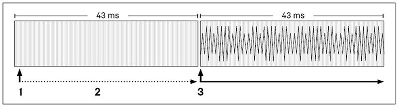
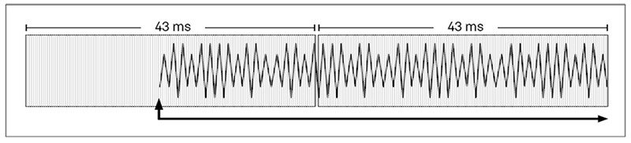
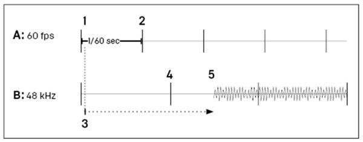

# Quartz概述

> 路径：虚幻引擎5.7文档 / 处理音频 / 音乐系统 / Quartz / Quartz概述

> 原始页面：https://dev.epicgames.com/documentation/unreal-engine/overview-of-quartz-in-unreal-engine

**Quartz** 是公开蓝图的安排系统，解决了游戏、音频逻辑和音频渲染线程之间的计时问题，以提供精确到采样的音频播放。

Quartz有许多应用。例如，你可以使用Quartz执行以下操作：

- 创建动态音乐系统。
- 控制依赖计时的音效的播放，例如自动武器开火。

## 延迟：Quartz解决的问题

**虚幻音频引擎（Unreal Audio Engine）** 在缓冲区中渲染音频采样，它们会单独发送到称为数字到模拟转换器（DAC）的输出硬件。这些缓冲区通常一次包含数百甚至数千个样本。

音频渲染命令（例如播放声音或更改声音的参数）通常在音频缓冲区渲染开始时使用。因此，渲染的缓冲区的大小控制了使用新命令的速率，并对发出的命令造成明显的延迟。

例如，如果你在相同的游戏线程更新函数上触发爆炸视觉效果和爆炸音效，视觉效果和声音之间的延迟由缓冲区大小确定。如果缓冲区包含2048个样本并以每秒48k样本(kHz)速度渲染，该缓冲区将导致最高43毫秒(ms)的听觉延迟。

如果在缓冲区开始渲染之后发出播放命令（ 1 ），该命令将在不播放（ 2 ）的情况下计入下一个周期，直至下一个缓冲区（ 3 ）开始。

此外，从游戏线程发出的命令需要一些时间才能到达音频引擎。在之前的示例中，如果线程延迟为13毫秒，而该命令刚好错过缓冲区渲染的开头，那么在最坏的情况下，延迟会是56毫秒。

雪上加霜的是，游戏线程更新函数千变万化，与音频线程计时不同步，并且在垃圾回收、资产加载等期间容易出现卡顿。

> [!NOTE]
> 这些延迟问题对于一些音频应用程序无关紧要。根据CPU负载或平台约束，你可能能够调整缓冲区大小和计数，使延迟缩短到不易察觉。

## Quartz的工作方式

无论缓冲区大小、游戏线程计时或其他可变延迟来源如何，Quartz都不是在音频缓冲区开始时渲染，而是在时间值（秒）或音乐值（小节或拍子）上安排渲染。

通过提前安排，Quartz考虑到了延迟，这样声音能够以采样级别精确度进行渲染，而没有延迟。

Quartz提供了采样级别精确度。你可以在缓冲区中间安排命令，而不必将音频渲染推迟到下一个缓冲区开始。

### 线程间通信流

在上图中， **A** 表示带有游戏帧更新划分的游戏线程， **B** 表示带有缓冲区划分的音频渲染线程。

线程间通信流按以下方式继续：

1. 游戏线程请求Quartz在给定量化边界上播放声音。
2. Quartz发出请求并将渲染排队，以便以后执行。
3. 请求会在计算的时间长度内暂挂。
4. 此请求甚至可能暂挂到缓冲区开始之后。
5. 接着会在给定量化边界上渲染请求。

## Quartz关键概念

### Quartz时钟（对象）

**Quartz时钟（Quartz Clock）** 负责在音频渲染线程上安排和触发事件。你使用 **Quartz子系统（Quartz Subsystem）** 创建Quartz时钟，并使用 **Quartz时钟句柄（Quartz Clock Handles）** 进行修改。每个Quartz时钟都有一个 **Quartz节拍器（Quartz Metronome）** 。

### Quartz节拍器（对象）

Quartz节拍器是音频渲染线程上的一个对象，用于记录时间的流逝，并基于时间签名和每分钟拍子数（BPM）等设置来安排未来命令。

### Quartz时钟句柄（对象）

Quartz时钟句柄是游戏线程上的代理，用于控制音频渲染器中运行的Quartz时钟。你可以从Quartz子系统访问Quartz时钟句柄。

### Quartz子系统（对象）

通过Quartz子系统，可以访问不与具体时钟相关的通用系统功能，包括创建时钟、验证时钟是否存在以及查询延迟信息。

### Play Quantized（函数）

**Play Quantized** 是一个函数，接受音频组件输入，并在带有指定计时的给定时钟上播放声音。

调用Play Quantized时，你可以设置输入委托以与量化音频同步。

### Subscribe to Quantization Event（函数）

**Subscribe to Quantization Event** 是一个函数，可接受Quartz时钟句柄，并在发生指定量化事件（例如每个拍子）时通知给定输入委托。

**Subscribe to All Quantization Events** 变体会在发生每个量化事件时触发。使用此变体时，你可以使用 **量化类型（Quantization Type）** 上的Switch节点，对多个计时构建你的逻辑。
