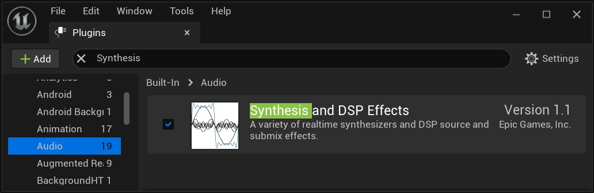
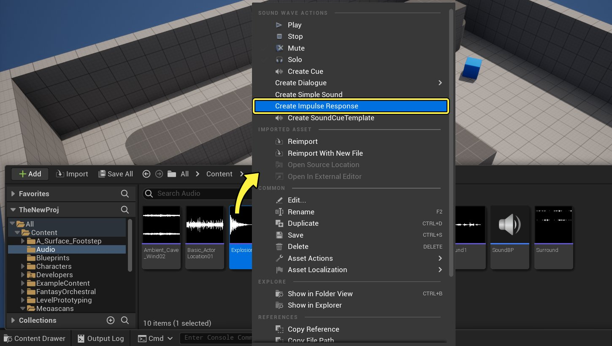
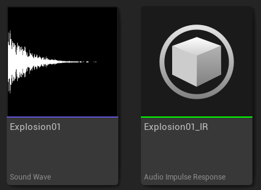
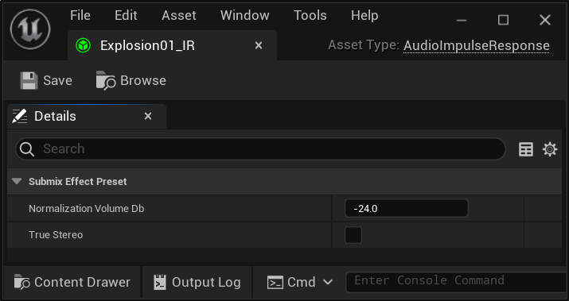
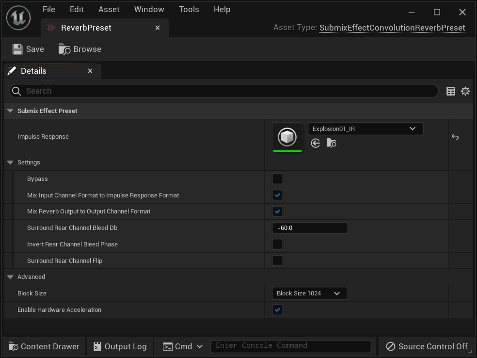
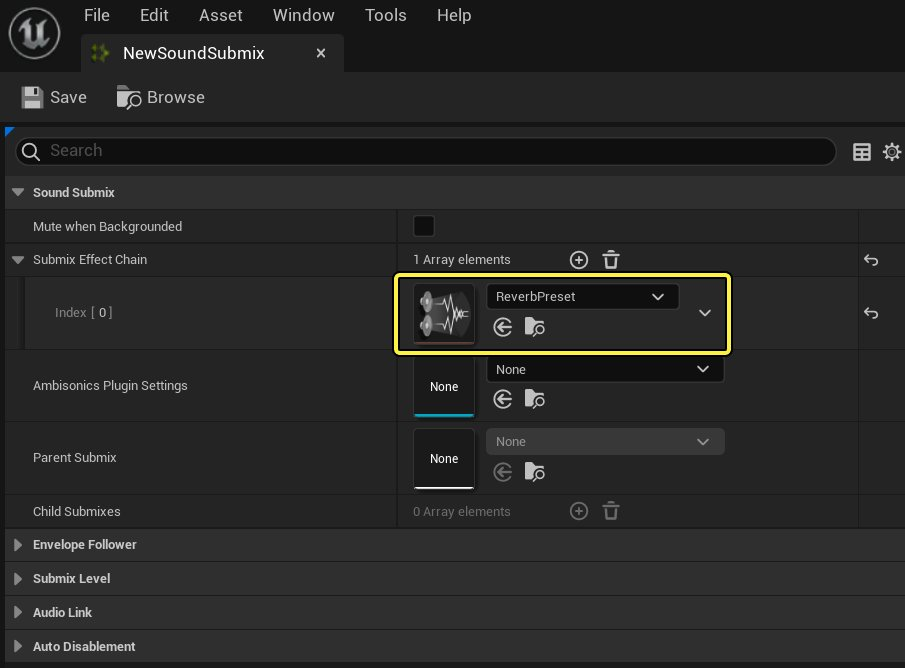

# 卷积混响

> 路径：虚幻引擎5.7文档 / 处理音频 / 混响 / 卷积混响

> 原始页面：https://dev.epicgames.com/documentation/unreal-engine/convolution-reverb-in-unreal-engine

**卷积混响（Convolution reverb）** 是一种令人振奋的技术，音效设计人员可以利用它采集任何物理位置（例如洞穴、教堂、办公室或走廊）的 **脉冲响应（IR）** ，并实时处理音频。让音频获得近似于实地播放的效果。实际上，IR *采集* 的是真实位置的混响，从而在环境音频处理中实现更高水平的真实感和沉浸感。

除了采集真实混响之外，还可以从其他声源中获取IR：算法混响输出、拟音、话外音（例如吹气或呼吸）、接触式麦克风等。可以像处理其他声音一样对IR进行编辑和处理，例如过滤、衰减、倒转、剪切，编辑等。卷积混响功能从而获得了全新的实验维度。

卷积混响提供了一种可替代传统算法混响技术的数据驱动型替代方案，结合延迟缓冲、滤波器和各种其他DSP拓扑来模拟混响。

## 背景概念

### 卷积运算

**卷积（Convolution）** 是一种数学运算，与其他数学运算一样：加法、减法、积分、点乘积或交叉乘积等。点乘积和交叉乘积可以视为不同的向量（或信号）相乘方式。同理，卷积是向量变换的第三种方式。与交叉乘积一样，卷积两个信号会生成第三个信号。

在不过度涉及复杂数学运算的情况下，要将卷积概念化，最简单的方法是将输出信号 ***y(t)*** 的每个样本视为时间移位输入信号 ***x(t)*** 的权重 ***g(t)*** 之和。这样可以将卷积视为一种模糊运算符。

### 音频中的卷积

卷积在各大领域广泛应用，包括统计、机器学习、图形渲染。在音频中，卷积是一种通过IR处理音频信号的方法。IR将代表过于复杂而无法建模的真实世界系统。

如果输入音频信号是 *f(t)*，且我们的权重 *g(t)* 是代表需要建模的复杂系统的IR，则输出 *x(t)* 就是音频信号通过该系统馈送的值。

### 计算考量

从根本上讲，卷积是一项开销高昂的数学运算。将输入信号 *f(t)* 中的每个元素与卷积信号 *g(t)* 中的每个元素相乘，然后相加，生成输出信号 *x(t)* 中的每个元素。对于代表大型混响空间的大型IR而言，开销将非常高。对于实时情景而言，直接执行卷积运算的开销通常太过高昂。

好在可以利用对称性显著加快卷积：在 *时域* 中卷积两个信号与在 *频域* 中进行信号乘积相同。信号的频域可利用 **快速傅里叶变换（FFT）** 生成。顾名思义，FFT的速度很快。对输入信号和IR执行此步骤，可以在CPU上实时计算卷积混响。不过要注意，较之于传统算法混响，这种方式的开销通常更高。

借助更强的CPU性能和卷积运算硬件加速，卷积混响已成为游戏音频中操作性更佳的选择。因此，卷积混响已成为次时代音频技术。

## 如何使用卷积混响

启用 **合成和DSP效果（Synthesis and DSP Effects）** 插件（**编辑（Edit）>插件（Plugins）>音频（Audio）>合成和DSP效果（Synthesis and DSP Effects）**）。该插件包含大量可选的合成和DSP功能。

启用插件后，在内容浏览器中右键点击导入的声波，然后选择 **创建脉冲响应（Create Impulse Response）** 。

点击查看大图。

此操作将根据所选声波创建脉冲响应。这样，任何声波都可以成为卷积混响算法的IR（可以用任何声音进行卷积）。这将创建新资产，命名后带有 **_IR** 。

> [!NOTE]
> IR的导入过程和声波文件的导入过程一样。

此资产包含卷积混响效果将使用的一些数据，以及可以对每个脉冲响应设置的规格化值。要为单个音频脉冲响应资产设置音量规格化值，请打开音频脉冲响应（Audio Impulse Response）的 **细节（Details）** 面板。

**标准化音量分贝（Normalization Volume Db）** 是应用于主动使用此脉冲响应的卷积效果的分贝衰减。此方法可轻松在各种脉冲响应之间实现同等响度。

**真实立体声（True Stereo）** 是一个复选框，用于定义脉冲响应通道是解译为真实立体声还是独立通道脉冲。

要使用卷积混响效果，请在内容浏览器（Content Browser）中右键点击并选择 **音效（Audio）>效果（Effects）>子混合效果预设（Submix Effect Preset）** ，创建 **子混合效果预设（Submix Effect Preset）** 。当你创建新资产时，界面上会显示选择子混合类（Pick Submix Class）对话框。选择 **SubmixEffectConvolutionReverbPreset** 。

[选择子混合效果类

要打开卷积混响效果的 **细节（Details）** 面板，请在内容浏览器中双击它，并将脉冲响应资产设置为要使用的资产。

点击查看大图。

其他参数包括：

- 旁通（Bypass）：

  如果为true，则输入音频直接路由到输出音频并应用任意效果。
- 将输入通道格式混合到脉冲响应格式：

  如果为true，则下混子混合输入音频，以便匹配脉冲响应资产的音频通道格式。如果为false，则输入音频通道与脉冲响应音频通道匹配。
- 将混响输出混合到输出通道格式：

  如果为true，则上混或下混混响音频，以便匹配子混合输出音频格式。如果为false，则混响音频通道与子混合输出音频通道匹配。
- 环绕后声道翻转：

  是否在发送到后声道之前翻转效果的左右声道。
- 反转后声道渗入相：

  是否在环绕声环境中反转发送到后声道的音频相。
- 环绕后声道翻转：

  是否在发送到后声道之前翻转效果的左右声道。

高级参数包括：

- 块大小：

  设置内部处理块大小，这可能会影响运行时性能。
- 启用硬件加速：

  如果目标平台上存在硬件加速，则启用硬件加速。

要将其用于副路混合效果，请将其作为副路混合效果添加到副路混合效果链中的副路混合中。

点击查看大图。

如果将此副路混合设为要使用的主混响副路混合，则可以自动将混响音频发送到副路混合。也可以手动将音频作为副路混合发送效果发送到此副路混合。
