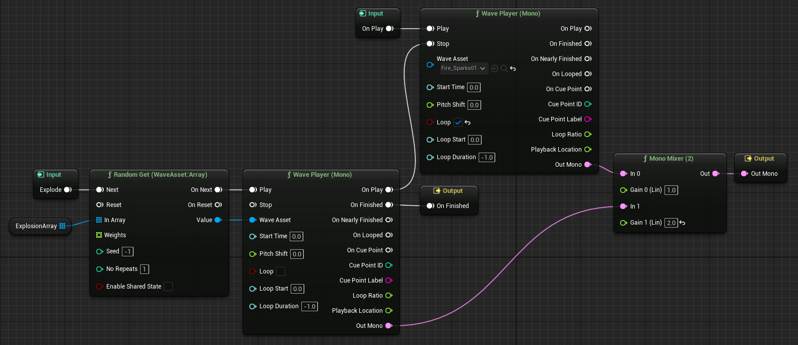
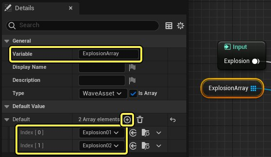
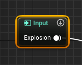
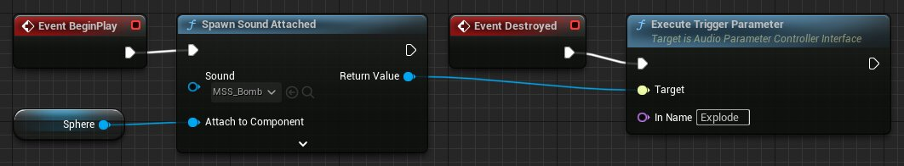
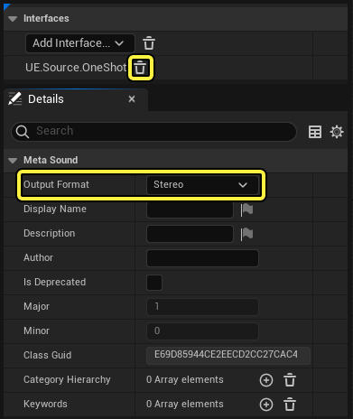
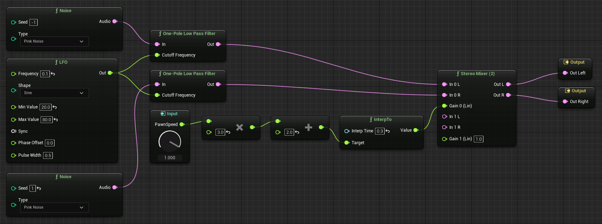
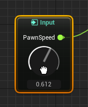
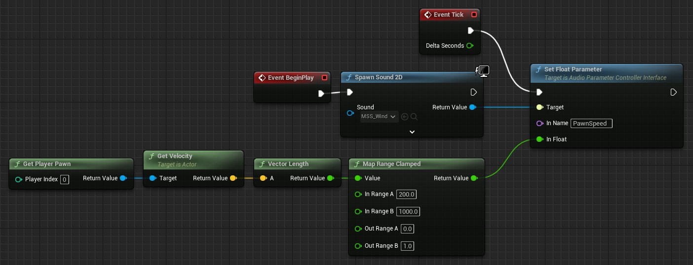

# MetaSounds快速入门

> 路径：虚幻引擎5.7文档 / 处理音频 / Sound Source / MetaSounds / MetaSounds快速入门

> 原始页面：https://dev.epicgames.com/documentation/unreal-engine/metasounds-quick-start

**MetaSound** 是一个高性能的音频系统，让音频设计师完全控制数字信号处理（DSP）图，从而生成声源。

在本指南中，你将学习如何创建两个游戏驱动的 **MetaSound源**：爆炸音效和环境风。

## 先决条件

在用本指南创建你的第一个MetaSounds之前，你必须用 **初始内容** 创建一个新的[第一人称模板](../../../../understanding-the-basics/working-with-projects-and-templates/template-reference/index.md)项目。

## 1 - 制作爆炸MetaSound

虽然步枪在发射时发出声音，但子弹是无声的。使用MetaSound，你将创建一个炸弹的声音效果，供子弹使用。

### 1A - 制作MetaSound源

由于这将是一个三维空间内的声源，所以首先要创建一个MetaSound源，并附带有 **Sound Attenuation资产**。

1. 制作一个MetaSound源。

   1. 在 **内容浏览器中**,点击 **添加** 按钮。
   2. 选择 **音频** > **Metasound源**。
   3. 命名新创建的资产（例如MSS_Bomb）
2. 双击MetaSound，打开 **MetaSound编辑器**。
3. 设置**衰减设置**，根据MetaSound相对于听众的位置，对其进行空间化和衰减。

   1. 在 **MetaSound编辑器** 中点击 **源** 按钮。
   2. 在 **细节** 面板中， 点击 **衰减 > 衰减设置** 旁边的下拉菜单。
   3. 在创建新资产标题下选择 **声音衰减**。
   4. 命名新创建的资产（例如SA_Bomb），然后保存。

### 1B - 构建MetaSound图表

点击查看大图。

建立**MetaSound图表**，控制你的MetaSound源如何发声。按照下面的说明，创建上图所示的图表。

1. 找到 **On Play输入** 节点，从引脚上拖到一个空的地方。在节点搜索中输入 "Wave Player（Mono）"来创建一个连接的节点。你可以通过拖动节点在图表中移动它。
2. 在 **Wave Player（Mono）** 节点上：

   1. 点击 **Wave资产** 下拉菜单，选择Fire_Sparks01 Sound Wave
   2. 启用 **循环**。
   3. 拖移 **输出单声道（Out Mono）** 引脚，创建一个**单声道混合器（Mono Mixer）（2）**。
   4. 拖移 **Stop** 引脚， 创建一个新的**Wave Player (Mono)**。
3. 在新的 **Wave Player（Mono）** 节点上：

   1. 将 **On Finished** 引脚连接到 **On Finished输出** 节点。
   2. 将 **Out Mono** 引脚连接到 **单声道混合器（2）** 上的 **In 1** 引脚。
   3. 将 **播放** 引脚拖移， 创建一个 **Random Get (WaveAsset:Array)** 节点。
   4. 将 **Wave Asset** 引脚连接到 **Random Get (WaveAsset:Array)** 节点的 **值（Value）** 引脚上。
4. 在 **Random Get (WaveAsset:Array)** 节点上：

   1. 拖移 **下一步（Next）** 引脚，并选择 **提升为图形输入（Promote to Graph Input）**。这将创建一个名为Next的 **触发器输入（Trigger Input）** 节点。
   2. 拖移 **在数组中（In Array）** 引脚，并选择 **提升为图形变量（Promote to Graph Variable）**。这将创建一个名为In Array的 **WaveAsset:Array Variable** 节点。
5. 在 **单声道混合器（2）** 上

   1. 输入**Gain 1 (Lin)** wei2.0。
   2. 将 **Out** 引脚连接到 **（Out Mono Output）** 节点。

### 1C - 调整Explosion Wave Player的输入

调整 "Next Trigger "和 "数组中的变量"。

1. 选择这个Next **触发器输入** 节点。
2. 在 **细节(Details)** 面板，在 **通用（Genarl）>输入（Input）** 中输入 "Explode "，并重命名它。这将是你设置的从蓝图执行的触发器的名称。
3. 选择In Array **WaveAsset:Array Variable** 节点。
4. 在 **细节(Details)** 面板，在 **通用>变量（Variable）** 中输入 "ExplosionArray"，并重命名它。
5. 单击 **添加（+）** 按钮两次，用于 **默认值（Default Value）>默认**。这些索引将保存Sound Wave的引用，以便从中随机选择。
6. 点击 **索引（Index）[0]** 下拉菜单，选择Explosion01 Sound Wave
7. 点击 **索引（Index）[1]** 下拉菜单，选择Explosion02 Sound Wave

### 1D - 播放MetaSound

MetaSound现在已经准备就绪，可以播放了。

1. 在 **MetaSound编辑器工具栏（MetaSound Editor Toolbar）** 中点击 **播放（Play）** 按钮，播放MetaSound。开火声将循环播放，直到 **Explode** 触发器执行，此时 **爆炸数组（ExplosionArray）** 中的随机爆炸声将在MetaSound结束前播放。你可以在MetaSound播放时，点击 **Trigger Input** 节点右上角的**执行（向下箭头）**按钮来模拟 **Explode** 触发器的执行。
2. 保存MetaSound源，关闭MetaSound编辑器。

在蓝图中添加爆炸逻辑

设计完爆炸声后，使用子弹的蓝图来设置运行时逻辑。

### 2A - 打开子弹蓝图

打开预建的子弹蓝图。

1. 在 **内容浏览器（Content Browser）** 中，找到 "所有/内容/第一人称/蓝图（All/Content/FirstPerson/Blueprints）"。
2. 双击 **BP_FirstPersonProjectile** 以在 **蓝图编辑器（Blueprint Editor）**中打开。

### 2B - 构建蓝图图表

添加到现有的 **蓝图图表** 中，根据子弹的生命周期控制爆炸的MetaSound。

1. 在空白处点击右键，创建一个 **开始播放事件（Event BeginPlay）** 节点。
2. 拖移 **开始播放事件** 节点，创建一个 **生成附带声音（Spawn Sound Attached）** 节点。
3. 在 **生成声音** 节点上

   1. 点击 **声音** 下拉菜单，选择你的爆炸MetaSound。
   2. 拖移 **附于组件** 引脚，创建一个 **获取球体** 节点。
   3. 拖移 **返回值（Return Value）** 引脚，创建一个 **执行触发参数（Execute Trigger Parameter）** 节点。
   4. 按住Alt键并点击 **执行输出（Exec Output）(>)** 节点，删除**生成附带声音** 和 **执行触发参数** 节点之间的连接。
4. 在 **执行触发参数** 节点上：

   1. 输入 **名称** 为 **Explode** 。
   2. 拖移 **执行输出(>)** 引脚，创建一个 **已毁事件（Event Destroyed）** 节点。
5. 保存你对蓝图的修改并关闭蓝图编辑器。

### 2C - 测试关卡

蓝图现在已经准备就绪，可以测试了。

点击 **关卡编辑器工具栏（Level Editor Toolbar）** 中的 **播放**，（通过移动鼠标）捡起步枪，然后（左键点击）开火，检验你的作品。

这些子弹会产生空间化的动态音效。开火声循环播放，直到子弹接触到蓝色盒子或在短时间后爆炸。

## 3 - 制作风声MetaSound

创建一个环境风MetaSound，为场景增加一些气氛。

### 3A - 制作MetaSound源

创建另一个MetaSound源资产这个声音不会在3D空间内被空间化，所以你不必附上声音衰减（Sound Attenuation）资产。

1. 制作一个MetaSound源。

   1. 在 **内容浏览器中**,点击 **添加** 按钮。
   2. 选择 **音频** > **Metasound源**。
   3. 给它命名（例如MSS_Wind）。
2. 双击MetaSound，打开 MetaSound编辑器。

### 3B - 调整MetaSound的细节

在创建图表之前，调整MetaSound的默认属性，以支持持续的立体声音频。

1. 在接口面板中，点击 **UE.Source.OneShot** 接口条目旁边的 **移除（垃圾箱）** 按钮。这将删除 **On Finished输出** 节点，它不用于持久的声音，如氛围音或音乐。
2. 在 **MetaSound编辑器工具栏** 中点击 **MetaSound** 按钮。
3. 在 **细节** 面板中,点击 *MetaSound >输出格式（Output Format）**下拉菜单并选择**立体声**。这将会用**输出左声道（Out Left）**和**输出右声道（Out Right）**节点替代**输出单声道** 节点。

### 3C - 构建MetaSound图表

点击查看大图。

建立**MetaSound图表**，控制你的MetaSound源如何发声。按照下面的说明，创建上图所示的图表。

1. 选择 **播放时输入** 节点并用Delete键删除它。在本图表中不需要它。
2. 拖移 **输出左声道** 引脚，创建一个**立体声混合器（Stereo Mixer ）（2）**。
3. 将 **输出右声道** 引脚连接到 **立体声混合器（2）** 上的 **Out R** 引脚。
4. 在空白处点击右键，创建一个 **噪音（Noise）** 节点。
5. 在 **噪音** 节点上，拖移 **音频** 引脚并创建一个 **One-Pole Low Pass Filter** 节点。
6. 拖动一个选择框来选择 **噪音** 和 **One-Pole Low Pass Filter** 节点。
7. 右键点击任一选定的节点并选择 **复制（Duplicate）**。
8. 在新的 **噪音** 节点上，输入 **种子（Seed）** 为1。这将在噪音生成中引入差异。
9. 在一个**One-Pole Low Pass Filter**节点上，将 **输出** 引脚与 **立体声混合器（2）** 节点上的 **In 0 L** 引脚相连。
10. 在另一个**One-Pole Low Pass Filter**节点上，将 **输出** 引脚与 **立体声混合器（2）** 节点上的 **In 0 R** 引脚相连。
11. 在空白处点击右键，创建一个 **LFO** 节点。
12. 在 **LFO** 节点上

    1. 输入 **频率（Frequency）** 为1。
    2. 输入 **最小值（Min Value）** 为20.0。
    3. 输入 **最大值（Max Value）** 为80.0。
    4. 将 **输出** 引脚连接到 **One-Pole Low Pass Filter** 节点上的两个 **截止频率（Cutoff Frequency）** 引脚。
13. 在 **立体声混合器（2）**节点上， 拖移 **Gain 0 (Lin)** 引脚，创建一个 **InterpTo** 节点。
14. 在 **InterpTo** 节点上

    1. 输入 **插值时间（Interp Time）** 为0.3。
    2. 拖移 **目标（target）** 引脚，创建一个 **添加（浮点）** 节点。
15. 在 **添加（浮点）** 节点上：

    1. 输入 **底部加数（Bottom Addend）** 为2.0。
    2. 拖移 **顶部加数（Top Addend）** 引脚，创建一个 **乘算(浮点)** 节点。
16. 在 **乘算（浮点）** 节点上：

    1. 输入 **底部乘数（Bottom Multiplicand）** 为3.0。
    2. 拖移 **顶部乘数（Top Multiplicand）** 引脚，并选择 **提升为图形输入（Promote to Graph Input）**。这将创建一个名为PrimaryOperand的 **浮点输入（Float Input）** 节点。
17. 选择这个PrimaryOperand **浮点输入** 节点。
18. 在 **细节(Details)** 面板，在 **通用（Genarl）>输入（Input）** 中输入 "PawnSpeed "，并重命名它。

### 3D - 播放MetaSound

MetaSound现在已经准备就绪，可以播放了。

1. 在 **MetaSound编辑器工具栏（MetaSound Editor Toolbar）** 中点击 **播放（Play）** 按钮，播放MetaSound。类似风的动态声音将以立体声播放，直到你点击 **停止（stop）** 按钮。信号增益受PawnSpeed **浮点输入** 节点的影响。你可以通过点击节点上的**输入部件（Dial）**并向上或向下拖动来模拟PawnSpeed值。
2. 保存MetaSound源，关闭MetaSound编辑器。

在蓝图中添加风逻辑

设计完风声后，使用蓝图来设置运行时逻辑。

### 4A - 打开关卡蓝图

要打开关卡蓝图，点击 **关卡编辑器（Level Editor）工具栏** 中的 **蓝图（Blueprint）** 按钮，然后选择 **打开关卡蓝图（Open Level Blueprint）**。

### 4B - 构建蓝图图表

点击查看大图。

建立蓝图图表，根据玩家的运动控制风的MetaSound。

1. 在空白处点击右键，创建一个 **开始播放事件（Event BeginPlay）** 节点。
2. 拖移 **开始播放事件** 节点，创建一个 **生成声音2D（Spawn Sound 2D）** 节点。
3. 在 **生成声音2D** 节点上

   1. 点击 **声音** 下拉菜单，选择你的风的MetaSound。
   2. 拖移 **返回值（Return Value）** 引脚，创建一个 **设置浮点参数（Set Float Parameter）** 节点。
   3. 按住Alt键并点击 **执行输出（Exec Output）(>)** 节点，删除**生成声音2D** 和 **设置浮点参数** 节点之间的连接。
4. 在 **设置浮点参数** 节点上：

   1. 输入"PawnSpeed"为名称。
   2. 拖移 **执行输出(>)** 引脚，创建一个 **更新事件（Event Tick）** 节点。
5. 在空白处点击右键，创建一个 **获取玩家Pawn（Get Player Pawn）** 节点。
6. 在 **获取玩家Pawn** 节点上，拖移 **返回值** 引脚， 创建一个 **获取速度** 节点。
7. 在 **获取速度** 节点上，拖移 **返回值** 引脚， 创建一个 *矢量长度（Vector Length** 节点。
8. 在 **矢量长度** 节点上，拖移 **返回值** 引脚， 创建一个 **限制地图范围** 节点。
9. 在 **限制地图范围** 节点上：

   1. 输入 **在范围A中（In Range A）** 为200.0
   2. 输入 **在范围B中（In Range B）** 为1000.0
   3. 输入 **在范围B外（Out Range B）** 为1. 0
   4. 将 **返回值** 引脚连接到 **设置浮点参数** 上的 **浮点中（In Float）** 引脚。
10. 保存你对蓝图的修改并关闭蓝图编辑器。

### 4C - 测试关卡

蓝图现在已经准备就绪，可以测试了。

点击 **关卡编辑器工具栏** 上的 **播放** 按钮，并通过四处移动检验你的作品。

怠速时，风声将以低音量播放，随着你的速度增加，风声会越来越大。

## 5 - 自行尝试！

现在，你已经完成了两个基本的MetaSound的创建，可以考虑进一步推进这个项目。下面是关于自行尝试的一些建议：

- 用一些额外的节点修改你的MetaSounds。关于节点库和其他MetaSound功能的信息，请参阅[MetaSounds参考指南](../metasounds-reference-guide/index.md)。
- 用MetaSound替换默认的步枪射击声。考虑根据射速、射击角度或其他变量来动态地改变声音。
- 为玩家的行动添加MetaSounds，如行走、跳跃和拾取物品。
- 改进你根据本指南创建的简单风的示例。参阅[Lyra Sample Game](../../../../samples-and-tutorials/sample-game-projects/lyra-sample-game/index.md)项目，了解一个支持额外功能的高级示例的例子，例如平移和环境响应。
