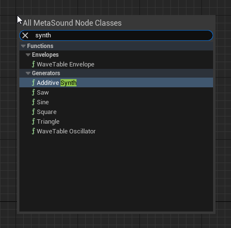
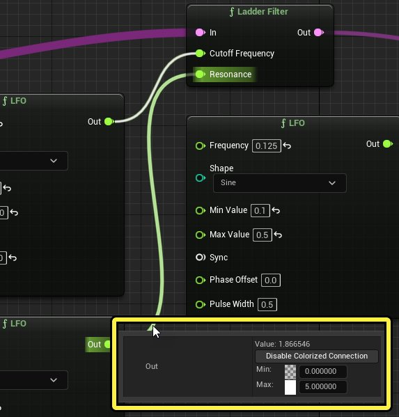
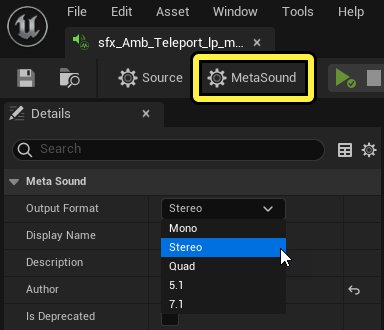
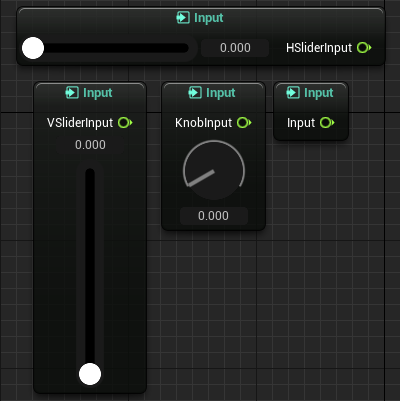
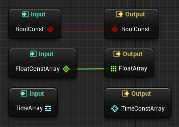
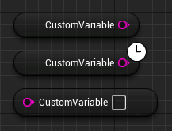
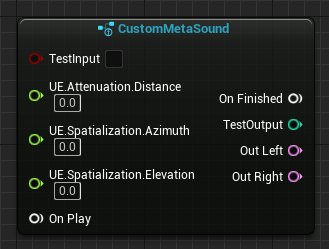
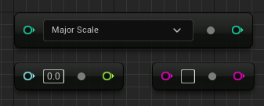

# MetaSounds参考指南

> 路径：虚幻引擎5.7文档 / 处理音频 / Sound Source / MetaSounds / MetaSounds参考指南

> 原始页面：https://dev.epicgames.com/documentation/unreal-engine/metasounds-reference-guide-in-unreal-engine

**MetaSound编辑器** 可以创建、修改和预览MetaSounds。MetaSound编辑器中包含的 **MetaSound图表（MetaSound Graph）** 由各种引脚和节点组成，它们构成了每个MetaSound的设计。

> [!NOTE]
> **MetaSound图表（MetaSound Graph）** 的运作方式与蓝图中的图表稍有不同。在蓝图中，图表作为执行图表运作，而在MetaSound中，图表作为流程图表运作。

> [!TIP]
> 本文档中列出的引脚和节点类型是内置的类型，但你可以使用C++ API添加自己的类型。

## 资产类型

MetaSounds随附两种不同的资产类型： **MetaSound源（MetaSound Source）** 和 **MetaSound补丁（MetaSound Patch）** 。这两种类型在图表操控方面完全相同；但是，只有MetaSound源可以自行生成音频。

点击 **内容浏览器（Content Browser）** 中的 **添加（Add）** 按钮，然后选择 **音效（Audio）> Metasound源（MetaSound Source）** 或 **音效（Audio）> MetaSound > Metasound补丁（MetaSound Patch）** ，可以创建Metasound资产。在 **内容浏览器（Content Browser）** 中双击Metasound资产，或右键点击该资产并从上下文菜单中选择 **编辑...（Edit...），可以在MetaSound编辑器中编辑Metasound资产。

## 预设

**Metasound预设** 是一种特殊类型的资产，它从父Metasound继承只读图表，并可以覆盖默认输入数值。这样你就可以使用不同的输入集创建同一Metasound的多个版本，从而有助于减少图表重复。

> [!NOTE]
> 对父Metasound资产所做的全部更改都将反映在子预设中。这可以确保受影响资产之间的一致性，并降低在多个Metasound中应用更改的工作负荷。

在 **内容浏览器（Content Browser）** 中，你可以右键点击希望作为父项的Metasound源或补丁，然后从上下文菜单中选择 **创建Metasound预设（Create MetaSound Preset）** ，从而创建Metasound预设。在Metasound编辑器中，你可以执行以下操作修改预设的输入数值：在 **成员（Members）** 面板中选择一个输入，在 **细节（Details）** 面板中启用 **默认数值（Default Value）> 覆盖继承的默认值（Override Inherited Default）** ，然后更改 **默认数值（Default Value）> 默认值（Default）** 。

> [!NOTE]
> 如果你想将Metasound预设转换为标准Metasound资产，可以点击Metasound编辑器顶部工具栏上的 **从预设转换（Convert From Preset）** 按钮。

## 添加节点

右键点击图表中的空白区，然后从上下文菜单中选择所需的节点类型，可以向你的图表中添加节点。你也可以将引脚连接拖动到空白区域，从而创建相连节点。

上下文菜单配备了一个搜索框，可用于按名称和标签查找节点类型。例如，搜索"synth"将找到名称包含"synth"的节点，但也会找到与synthesis相关的节点。

## 引脚类型

MetaSound节点通过引脚连接与各种数据类型交互，包括单独（圆圈连接器）和数组（区块连接器）。

| 引脚类型 | 说明 |
| --- | --- |
| 触发器引脚 触发器 | 相当于模块化合成触发器，用于执行其他节点，这与蓝图中的执行引脚相似。它们可以同时连接到多个（甚至是零个）其他节点。 |
| 音频引脚 音频 | 表示可以由MetaSound节点操控的实际音频缓冲区。在一些情况下，这些引脚可以是旨在按音频速率使用的参数，例如针对频率调制合成。 |
| 时间引脚 时间数组引脚 时间 | 表示时间值。在大部分情况下，它们使用秒作为MetaSound编辑器中的默认时间单位。 |
| 字符串引脚 字符串数组引脚 字符串 | 提供标记和调试功能。这些引脚并不直接在播放期间使用，但很适合向音频设计师转发信息，例如将节点信息输出到控制台日志。 |
| UObject引脚 UObject数组引脚 UObject | 表示支持的UObject类型，例如USoundWave，这常用于提供 **Wave Player** 节点，其中带有要播放的资产的引用。 |
| 布尔引脚 布尔数组引脚 布尔 | 表示布尔变量。 |
| 浮点引脚 浮点数组引脚 浮点 | 表示浮点数变量。 |
| Int32引脚 Int32数组引脚 Int32 | 表示整型（4字节）变量。 |
| Int32引脚 Int32数组引脚 枚举 | 表示枚举变量。 |

> [!NOTE]
> 触发器节点通过时序节点或通过Gameplay事件触发时，它们准确到采样级别，并将在音频渲染区块中的精确采样索引上执行。但是，由于其他节点类型不按音频速率运行，触发器输入可能会在连接到其他节点类型时生成区块速率输出。

## 连接

> 动图已省略：连接

节点之间的连接会在播放时直观呈现，以便理解其行为。触发器连接在激活时会产生脉冲，音频连接的粗细会随信号强度而变化，浮点连接的颜色会随数值而变化。

默认情况下，浮点连接可视化处于禁用状态。播放Metasound时，你可以将鼠标光标悬停在连接上，直到出现上下文菜单，从而启用它。上下文菜单提供了启用或禁用可视化的开关、两个用于定义预期数值范围的数值输入，以及两个用于相互混合的颜色输入。

> [!TIP]
> **编辑器偏好设置（Editor Preferences）> Metasound编辑器（MetaSound Editor）> 图表动画（Graph Animation）** 中提供了其他可视化设置。

> 动图已省略：重路由节点

你可以使用重路由节点来保持连接的条理性。Metasound重路由节点的功能与蓝图中的节点类似。你可以双击连接来创建一个重路由节点。然后，你可以拖动将它选定时出现的边框来移动它。从节点本身拖出引线，可以从节点建立其他连接。

> 动图已省略：连接拉直

你还可以选择所有相关节点，右键点击所选节点，然后从上下文菜单中选择所需操作，通过对齐和分布操作来整理图表。

## 输入和输出节点

输入节点 输出节点

通过 **输入** 和 **输出** 节点，可以访问通常开始或结束经过MetaSound的数据流的引脚。例如，每个MetaSound开始于 **On Play** 输入节点，结束于 **On Finished** 输出节点。On Play输入节点包含触发器引脚输出，用于在MetaSound播放时指示其他节点开始，而On Finished输出节点包含触发器引脚输入，用于在MetaSound完成播放时接收信号。

> [!WARNING]
> On Finished输出节点通过 `UE.Source.OneShot` 接口添加到图表，新的Metasound源默认启用该接口。如果未触发On Finished节点，Metasound将无限期播放。要创建时长无限期的声音（如音乐或氛围声音），请删除 **接口（Interfaces）** 面板中的 `UE.Source.OneShot` 接口。

某些输出节点（如 **Out Left** ）对应某个音频通道输出。每个Metasound都有一个输出格式设置，用于支持不同的音频通道配置，包括单声道、立体声、四声道（4.0）、5.1和7.1。点击 **播放（Play）** 按钮旁的 **Metasound** 按钮，然后查看 **细节（Details）** 面板，即可找到该设置。

更多输入和输出可以在MetaSound编辑器的 **成员（Members）** 面板中创建。此后，可以在 **细节（Details）** 面板中设置所需属性，例如 **显示名称（Display Name）** 和 **类型（Type）** 。接下来，你可以右键点击图表中的空白空间，从上下文菜单选择对应 **Get Input** 或 **Set Output** 节点选项，创建新的节点实例。你还可以从 **成员（Members）** 面板将输入或输出拖入图表中，创建新的输入节点实例。

你可以在播放Metasound时使用Float Input和Time Input节点上的 **滑块（Slider）** 或 **旋钮（Knob）** 控件更改数值，显著提高工作流程的流畅度。这在 **细节（Details）** 面板（该输入选定时）中的 **编辑器选项（Editor Options）> 控件（Widget）** 下设置。你还可以在该面板中更改 **范围（Range）** 、 **方向（Orientation）** （对于滑块）和 **数值类型（Value Type）** 。

## 构造函数引脚

**构造函数（Constructor）** 引脚由菱形图标表示。它们拥有只读值，由于在运行时不会动态更新，可提高MetaSound的性能。这样一来，它们就与C++中的 `const` 声明相似。

在 **细节（Details）** 面板中选中 **是构造函数引脚（Is Constructor Pin）** 复选框，可在构造函数引脚中创建 **Input** 和 **Output** 节点。所有支持副本分配和构造的数据类型（包括数组类型）都可以支持构造函数引脚。但是， **触发器（Trigger）** 和 **音频（Audio）** 类型不能是构造函数引脚。

构造函数引脚值只能在播放MetaSound之前设置。你还可以在 **细节（Details）** 面板中或在蓝图中使用 **SetParameter** 节点这样做。

在使用构造函数引脚时，连接约束适用。输出构造函数引脚可以连接到构造函数和非构造函数输入引脚，但输入构造函数引脚只能连接到构造函数输出引脚。

> [!NOTE]
> 不能在MetaSound预设中覆盖构造函数引脚状态。

## 变量节点

你可以使用 **变量** 节点访问和操控支持MetaSound中函数节点的变量。资产中的每个单独变量都存在三种节点类型： **Get Variable** 、 **Get Delayed Variable** 和 **Set Variable** 。Get Variable和Set Variable提供了对关联变量的直接读或写访问权限，而Get Delayed Variable则将读操作延迟一个区块，并可以用于缓解周期。

> [!NOTE]
> 播放Metasound时不会记录对变量的更改。改用输入可以在播放期间更改数值。

与输入和输出一样，变量可以在MetaSound编辑器的 **成员（Members）** 面板中创建，并且其属性可以在 **细节（Details）** 面板中设置。你可以使用图表中的右键点击上下文菜单创建变量节点实例，但只有Get Variable节点可以通过从 **成员（Members）** 面板拖动来创建。

> [!NOTE]
> MetaSound变量不能由蓝图访问。

## 接口

**接口** 提供了对专门输入和输出的访问，使得Metasound能够与虚幻音频引擎内的其他系统一起工作。你可以从Metasound编辑器的 **接口（Interfaces）** 面板添加或删除Metasound的接口。

可以使用以下接口：

- UE.Source.OneShot

  - 提供在触发时停止MetaSound的

  完成时（On Finished）

  输出，从而创建一次性声音。此接口默认添加，在时长无限期的Metasound上应予删除。
- UE.Attenuation

  - 提供一个

  距离（Distance）

  输入，其数值取决于Metasound与监听器之间的距离。
- UE.Spatialization

  - 提供

  方位角（Azimuth）

  和

  仰角（Elevation）

  ，其数值取决于Metasound相对于监听器的位置。

## 图表节点

使用 **图表** 节点可实现组合功能，因为它们提供了对项目中其他MetaSound的图表的访问点。这些节点拥有基于其他MetaSound的输入和输出的连接引脚，因此你可以使用它们来影响包含它的MetaSound的设计。

图表节点可以提供许多工作流程改进。你可以使用图表节点执行以下操作：

- 将功能分成几个较小的Metasound，降低Metasound的复杂性和大小。
- 重复利用现有Metasound的功能，并无需复制。
- 通过更改引用的图表，同时改动包含相同图表节点的Metasound。

> [!NOTE]
> 使用表示Metasound补丁的图表节点时，你必须在复合中使用Metasound才能听到声音。

## 转换节点

**转换** 节点将一种引脚类型更改为另一种支持的引脚类型，这与蓝图转换节点相似。

#### 支持的转换

| 源 | 目标 |
| --- | --- |
| 音频 | 浮点 |
| 布尔 | 浮点或Int32 |
| 浮点 | 音频、布尔、Int32或时间 |
| 频率乘数 | 半音 |
| Int32 | 布尔、浮点、时间或枚举 |
| 半音 | 频率乘数 |
| 字符串 | 传输:地址 |
| 时间 | 浮点或Int32 |
| 枚举 | Int32 |

## 注释

> 动图已省略：注释框

在你的图表中添加注释是整理和记录设计的好方法。你可以通过以下步骤向图表添加注释框：右键点击空白区域，从上下文菜单中选择 **添加注释（Add Comment）** ，或选择多个节点，右键点击，然后从上下文菜单中选择 **根据选定项创建注释（Create Comment from Selection）** 。之后，你可以双击文本将其选中，并键入所需的注释来更改注释。

拖动右下角显示的手柄，可以调整注释框的大小。你还可以选择注释框，修改 **细节（Details）** 面板中的 **注释颜色（Comment Color）** 属性，从而更改注释框的颜色。

> [!TIP]
> 默认情况下，移动图表中的注释框时，也会移动内含的所有节点。如果需要，你可以在 **细节（Details）** 面板中将注释框的 **移动模式（Move Mode）** 更改为 **注释（Comment）** ，从而删除此行为。

> 动图已省略：注释气泡

你还可以执行以下操作，在单个节点上放置注释气泡：将指针悬停在节点上，选择左上角出现的注释气泡按钮，或者右键点击节点，在 **节点注释（Node Comment）** 文本框中输入所需注释。

## 函数节点

**函数** 节点有各种各样的不同类型，提供了播放音频文件、混合声音、应用滤波器和效果等所需的功能。

### 通用

#### BPM To Seconds

> 图片已省略：BPM To Seconds

**BPM To Seconds** 节点根据给定每分钟拍子数（BPM）、拍子乘数和全音划分来计算拍子时间，以秒为单位。

##### BPM To Seconds输入

| 输入 | 说明 |
| --- | --- |
| **BPM** | 输入目标BPM。 |
| **拍子乘数（Beat Multiplier）** | 要应用于BPM的乘数值。 |
| **全音划分（Division of Whole Note）** | 全音的划分。 |

##### BPM To Seconds输出

| 输出 | 说明 |
| --- | --- |
| **秒（Seconds）** | 输出拍子时间，以秒为单位。 |

#### Envelope Follower

> 图片已省略：Envelope Follower

**Envelope Follower** 节点从输入音频信号输出波封。

##### Envelope Follower输入

| 输入 | 说明 |
| --- | --- |
| **输入（In）** | 输入音频信号。 |
| **起音时间（Attack Time）** | 起音时间（以秒为单位）。 |
| **释音时间（Release Time）** | 释音时间（以秒为单位）。 |
| **峰值模式（Peak Mode）** | 波封跟踪器的跟踪方法： **MS** ：波封跟踪音频信号的流水式均方。 **RMS** ：波封跟踪音频信号的流水式均方根。 **峰值（Peak）** ：波封跟踪音频信号中的峰值。 |

##### Envelope Follower输出

| 输出 | 说明 |
| --- | --- |
| **波封（Envelope）** | 输出波封值（区块速率）。 |
| **音频波封（Audio Envelope）** | 输出波封值（音频速率）。 |

#### Flanger

> 图片已省略：Flanger

**Flanger** 节点将镶边器效果应用于输入音频。

##### Flanger输入

| 输入 | 说明 |
| --- | --- |
| **输入音频（In Audio）** | 要将镶边器效果应用到的输入音频信号。 |
| **调制速率（Modulation Rate）** | 变化延迟时间的低频振荡器（LFO）速率（以赫兹为单位）。该值限制为区块速率。 |
| **调制深度（Modulation Depth）** | 缩放延迟时间的LFO振幅（强度）。 |
| **中心延迟（Center Delay）** | 中心延迟数量（以毫秒为单位）。 |
| **混音级别（Mix Level）** | 原始和延迟信号之间的平衡。值应该介于0到1.0之间。例如，值为0.5时将使用同等数量的每个信号，值大于0.5时使用的延迟信号多余非延迟信号。 |

##### Flanger输出

| 输出 | 说明 |
| --- | --- |
| **输出音频（Out Audio）** | 应用镶边器效果的输出音频信号。 |

#### Get Wave Duration

> 图片已省略：Get Wave Duration

**Get Wave Duration** 节点返回输入波形资产的时长（以秒为单位）。

##### Get Wave Duration输入

| 输入 | 说明 |
| --- | --- |
| **波形（Wave）** | 要获取其时长（以秒为单位）的波形资产。 |

##### Get Wave Duration输出

| 输出 | 说明 |
| --- | --- |
| **时长（Duration）** | 波形资产的时长（以秒为单位）。 |

#### Get WaveTable From Bank

> 图片已省略：Get WaveTable From Bank

**Get WaveTable From Bank** 节点从给定的波表库资产检索（或生成内插）波表。

##### Get WaveTable From Bank输入

| 输入 | 说明 |
| --- | --- |
| **WaveTableBank** | 作为内插波表检索或生成来源的波表库资产。 |
| **TableIndex** | 要检索的波表的索引。如果设置在两个整数数值之间，则位于两个最近索引处的波表会混合在一起。如果设置的数值超出波表库的范围，则将调整该数值以进行循环。例如，如果波表库有3个索引，则数值3.0将检索索引0处的波表。 |

##### Get WaveTable From Bank输出

| 输出 | 说明 |
| --- | --- |
| **Out** | 检索的波表。 |

#### InterpTo

> 图片已省略：InterpTo

**InterpTo** 节点在指定时间内的当前值和目标值之间插值。

##### InterpTo输入

| 输入 | 说明 |
| --- | --- |
| **插值时间（Interp Time）** | 要从当前值插值到目标值的时间。 |
| **目标（Target）** | 要插值到的值。 |

##### InterpTo输出

| 输出 | 说明 |
| --- | --- |
| **值（Value）** | 当前值。 |

#### RingMod

> 图片已省略：RingMod

**RingMod** 节点使用载波信号和调制器信号执行环形调制。

##### RingMod输入

| 输入 | 说明 |
| --- | --- |
| **载波输入（In Carrier）** | 载波音频信号。 |
| **调制器输入（In Modulator）** | 调制器音频信号。 |

##### RingMod输出

| 输出 | 说明 |
| --- | --- |
| **音频输出（Out Audio）** | 调制音频信号。 |

#### Wave Player

> 图片已省略：Wave Player

**Wave Player** 节点用于播放声波资产。此节点有多个版本，用于支持多个不同的通道配置，如单声道、立体声、四声道（4.0）、5.1和7.1。

##### Wave Player输入

| 输入 | 说明 |
| --- | --- |
| **播放/停止（Play/Stop）** | 播放和停止触发器按精确到采样的时刻开始和停止Wave Player播放。 |
| **波形资产（Wave Asset）** | Wave Player在播放期间播放的波形资产。此资产使用与虚幻引擎中所有其他声源相同的实时解码器。 |
| **开始时间（Start Time）** | 波形资产中开始播放音频文件的时间。这也称为寻道时间。 |
| **音高变化（Pitch Shift）** | 要用于Wave Player的音高变化。这以半音为单位定义，以考虑到频率缩放的非线性性质。 |
| **循环（Loop）** | Wave Player是循环播放音频文件还是在完成时停止。这可以在播放期间随时从图表切换。 |
| **循环起点（Loop Start）** | 循环起点指示Wave Player循环播放音频文件的时间点。 |
| **循环时长（Loop Duration）** | 循环时长代表循环播放的总时间。除-1外的值会将循环的终点设置为循环起始和循环时长值的总和，而使用值-1时将循环播放整个音频文件。 |

##### Wave Player输出

| 输出 | 说明 |
| --- | --- |
| **播放时（On Play）** | 在Wave Player的播放引脚触发时触发。 |
| **完成时（On Finished）** | 在Wave Player完成音频文件播放时触发。音频文件完成播放时，此引脚将在同一示例点触发。 |
| **接近完成时（On Nearly Finished）** | 在音频文件即将完成播放之前，在音频渲染区块上触发。这通常用于循环播放并为Wave Player选择新的音频文件变体。 |
| **循环时（On Looped）** | 在声音基于循环设置循环的取样上触发。 |
| **出现提示点时（On Cue Point）** | 在Wave Player中解析提示点时触发。提示点是在导入时嵌入到音频波形文件中的元数据。 音效设计师通常使用提示点在确切的时间点触发音频中的事件或循环点。借助此功能，音效设计师可以根据导入音频波形文件中的嵌入数据以程序方式触发MetaSound行为。 此引脚在执行时准确到采样级别，但与提示点关联的整型和标签按区块速率读取。音频波形文件中比MetaSound的区块速率更近的提示点将仅在该区块中的最后一个提示点上触发。 |
| **提示点ID（Cue Point ID）** | 从导入的音频波形文件解析的提示点ID。 |
| **提示点标签（Cue Point Label）** | 从导入的音频波形文件解析的提示点标签。 |
| **循环百分比（Loop Percent）** | 给定循环区域中音频波形文件中的当前位置。 |
| **播放位置（Playback Location）** | 音频波形文件中占音频波形文件总长度一部分的当前位置。 |
| **输出X（Out X）** | 立体声音频文件的X声道。 |

> [!NOTE]
> 对于单声道文件播放，左右声道中的音频使用单声道复制进行上混。

#### WaveShaper

> 图片已省略：WaveShaper

**WaveShaper** 节点将非线性塑形应用于输入音频信号。

##### WaveShaper输入

| 输入 | 说明 |
| --- | --- |
| **输入（In）** | 要将非线性塑形应用到的输入音频信号。 |
| **数量（Amount）** | 要应用的非线性波形塑形数量。 |
| **偏差（Bias）** | 要在波形塑形之前应用的DC偏移。 |
| **OutputGain** | 要在处理之后应用的增益数量。 |
| **类型（Type）** | 要用于处理音频的算法类型： **正弦（Sine）** 、 **反正切（Inverse Tangent）** 、 **双曲正切（Hyperbolic Tangent）** 、 **三次多项式（Cubic Polynomial）** 或 **毛发修剪（Hard Clip）** |

##### WaveShaper输出

| 输出 | 说明 |
| --- | --- |
| **输出（Out）** | 应用非线性塑形的输出音频信号。 |

### 数组

**数组（Array）** 函数提供了在MetaSound中操控数组的选项。其中每个函数有不同的版本，允许它们支持多种常见数据类型的数组，包括：布尔、浮点、Int32、字符串、传输:地址、AudioBusAsset、WaveTableBankAsset和WaveAsset。

#### Concatenate

> 图片已省略：Concatenate

**Concatenate** 节点连接给定触发器上的两个数组。

##### Concatenate输入

| 输入 | 说明 |
| --- | --- |
| **触发器（Trigger）** | 在其上连接输入数组的触发器。 |
| **左/右数组（Left / Right Array）** | 输入数组。 |

##### Concatenate输出

| 输出 | 说明 |
| --- | --- |
| **数组（Array）** | 连接的数组。 |

#### Get

> 图片已省略：Get

**Get** 节点从数组检索给定索引的元素。

##### Get输入

| 输入 | 说明 |
| --- | --- |
| **触发器（Trigger）** | 在其上检索指定数组元素的触发器。 |
| **数组（Array）** | 从中检索元素的数组。 |
| **索引（Index）** | 要检索的元素的索引。 |

##### Get输出

| 输出 | 说明 |
| --- | --- |
| **元素（Element）** | 检索的元素的值。 |

#### Num

> 图片已省略：Num

**Num** 节点返回给定数组中的元素数量。

##### Num输入

| 输入 | 说明 |
| --- | --- |
| **数组（Array）** | 将计算其元素数量的数组。 |

##### Num输出

| 输出 | 说明 |
| --- | --- |
| **数量（Num）** | 给定数组中元素的数量。 |

#### Random Get

> 图片已省略：Random Get

**Random Get** 节点从输入数组随机检索元素。可以选择提供权重数组来调整随机性。

##### Random Get输入

| 输入 | 说明 |
| --- | --- |
| **下一个（Next）** | 在其上获取数组中下一个随机值的触发器。 |
| **重置（Reset）** | 在其上重置数组的随机化种子的触发器。 |
| **输入数组（In Array）** | 要从中随机检索元素的输入数组。 |
| **权重（Weights）** | （可选）用于定义每个所检索条目的概率的权重输入数组。如果不提供，将为所有元素采用均等的概率。如果此数组短于输入数组，它将重复，直至匹配大小。 |
| **种子（Seed）** | 用于随机打乱的种子。使用默认值-1时将使用当前时间。 |
| **无重复（No Repeats）** | 要追踪以避免连续重复的元素数量。例如，使用值2时，可防止此节点重复最后两个所选元素。 |
| **启用共享状态（Enabled Shared State）** | 如果启用，此节点的状态将在此MetaSound的实例之间共享，避免同时播放完全相同的变体。 |

##### Random Get输出

| 输出 | 说明 |
| --- | --- |
| **下一个时（On Next）** | 在触发"下一个（Next）"输入时触发。 |
| **重置时（On Reset）** | 在触发"打乱（Shuffle）"输入时或数组自动打乱时触发。 |
| **值（Value）** | 从输入数组随机选择的值。 |

#### Set

> 图片已省略：Set

**Set** 节点设置给定数组中指定索引的值。

##### Set输入

| 输入 | 说明 |
| --- | --- |
| **触发器（Trigger）** | 在其上设置数组中的值的触发器。 |
| **数组（Array）** | 将在其中设置值的数组。 |
| **索引（Index）** | 要在目标数组中设置的索引。 |
| **值（Value）** | 所选索引要设置为的值。 |

##### Set输出

| 输出 | 说明 |
| --- | --- |
| **数组（Array）** | 完成设置操作之后的数组。 |

#### Shuffle

> 图片已省略：Shuffle

**Shuffle** 节点输出打乱的数组中的元素。

##### Shuffle输入

| 输入 | 说明 |
| --- | --- |
| **下一个（Next）** | 在其上获取打乱的数组中下一个值的触发器。 |
| **打乱（Shuffle）** | 在其上手动打乱数组的触发器。 |
| **重置种子（Reset Seed）** | 在其上重置随机种子流的触发器。 |
| **输入数组（In Array）** | 从中打乱和输出元素的数组。 |
| **种子（Seed）** | 用于随机打乱的种子。使用默认值-1时将使用当前时间。 |
| **自动打乱（Auto Shuffle）** | 如果启用，将在数组已完全读取时自动打乱。 |
| **启用共享状态（Enabled Shared State）** | 如果启用，该状态将在此MetaSound的实例之间共享。 |

##### Shuffle输出

| 输出 | 说明 |
| --- | --- |
| **下一个时（On Next）** | 在触发"下一个（Next）"输入时触发。 |
| **打乱时（On Shuffle）** | 在触发"打乱（Shuffle）"输入时或数组自动打乱时触发。 |
| **重置种子时（On Reset Seed）** | 在触发"重置种子（Reset Seed）"输入时触发。 |
| **值（Value）** | 当前所选元素的值。 |

#### Subset

> 图片已省略：Subset

**Subset** 节点返回输入数组的子集。

##### Subset输入

| 输入 | 说明 |
| --- | --- |
| **触发器（Trigger）** | 在其上生成子集的触发器。 |
| **数组（Array）** | 要从中获取子集的输入数组。 |
| **开始/结束索引（Start / End Index）** | 要包含在子集内的第一个和最后一个索引。 |

##### Subset输出

| 输出 | 说明 |
| --- | --- |
| **数组（Array）** | 输入数组的子集。 |

### 调试

#### Print Log

> 图片已省略：Print Log

**Print Log** 节点用于将值记录到给定触发器上的输出日志，用于调试。此节点有多个版本，以便支持多种常见数据类型，包括：布尔、浮点、Int32和字符串。

##### Print Log输入

| 输入 | 说明 |
| --- | --- |
| **触发器（Trigger）** | 在其上将设置值写入日志的触发器。 |
| **标签（Label）** | 要附加到所记录值的标签。 |
| **要记录的值（Value To Log）** | 触发时要记录到日志的值。 |

### Delay

#### Delay

> 图片已省略：Delay

**Delay** 节点提供支持干度、湿度和反馈的单声道缓冲区延迟。对于多声道缓冲区延迟，请使用 **Stereo Delay** 节点。

##### Delay输入

| 输入 | 说明 |
| --- | --- |
| **输入（In）** | 要将延迟应用于的音频信号。 |
| **延迟时间（Delay Time）** | 延迟音频的时间长度（以秒为单位）。 |
| **干度（Dry Level）** | 未处理（干）信号的程度 |
| **湿度（Wet Level）** | 已处理（湿）信号的程度。 |
| **反馈（Feedback）** | 要使用的反馈数量。 |
| **最长延迟时间（Max Delay Time）** | 要使用的反馈量。 |

##### Delay输出

| 输出 | 说明 |
| --- | --- |
| **输出（Out）** | 延迟的音频信号。 |

#### Delay Pitch Shift

> 图片已省略：Delay Pitch Shift

**Delay Pitch Shift** 节点音高将使用基于延迟的多普勒频移方法对音频缓冲区进行移位。这样便可使用内部延迟缓冲区在不改变音频文件长度的情况下进行音高移位。音高会移位，但声音不会加快或减慢。

##### Delay Pitch Shift输入

| 输入 | 说明 |
| --- | --- |
| **输入（In）** | 要处理的音频缓冲区。 |
| **音高移位（Pitch Shift）** | 要应用的音高移位量（以半音为单位）。 |
| **延迟长度（Delay Length）** | 要应用的延迟量（介于10和100毫秒之间）。更改此值可以减少某些音高移位区域中的瑕疵。 |

##### Delay Pitch Shift输出

| 输出 | 说明 |
| --- | --- |
| **输出（Out）** | 已处理的音频缓冲区。 |

#### Diffuser

> 图片已省略：Diffuser

**Diffuser** 节点将漫反射应用于传入音频。

##### Diffuser输入

| 输入 | 说明 |
| --- | --- |
| **输入音频（Input Audio）** | 要将扩散应用于的音频。 |
| **深度（Depth）** | 要用于扩散音频的滤波器数量（1到5之间）。这不会在运行期间更新。 |
| **反馈（Feedback）** | 要用于每个扩散器的反馈数量（0到1之间）。 |

##### Diffuser输出

| 输出 | 说明 |
| --- | --- |
| **输出音频（Output Audio）** | 扩散的音频。 |

#### Grain Delay

> 图片已省略：Grain Delay

**Grain Delay** 节点可对给定音频缓冲区进行"粒度"采样，并在设置的延迟后播放它们，从而执行延迟的音频粒化。

##### Grain Delay输入

| 输入 | 说明 |
| --- | --- |
| **音频输入（In Audio）** | 要进行粒度延迟的音频缓冲区。 |
| **粒度生成（Grain Spawn）** | 生成新音频颗粒所用的触发器。 |
| **粒度延迟（Grain Delay）** | 生成下一个粒度的延迟（以毫秒为单位，介于0和2000之间）。 |
| **粒度延迟范围（Grain Delay Range）** | 用于相对于中心粒度延迟数值随机化延迟的范围增量（以毫秒为单位）。 |
| **粒度时长（Grain Duration）** | 生成的下一个粒度的时长（以毫秒为单位）。 |
| **粒度时长范围（Grain Duration Range）** | 用于相对于中心粒度时长数值随机化时长的范围增量（以毫秒为单位）。 |
| **音高移位（Pitch Shift）** | 用于更改所有渲染粒度的粒度音高的音高数值（以半音为单位）。 |
| **音高移位范围（Pitch Shift Range）** | 用于相对于中心音高移位数值随机化音高移位的音高移位增量（以半音为单位）。 |
| **粒度包络（Grain Envelope）** | 用于粒度的包络类型：**高斯（Gaussian）** 、 **三角形（Triangle）** 、 **倒三角形（Downward Triangle）** 、 **正三角形（Upward Triangle）** 、 **指数式衰减（Exponential Decay）** 或 **指数式起音（Exponential Attack）** |
| **最大粒度计数（Max Grain Count）** | 一次最多渲染的粒度数（介于1和100之间）。 |
| **反馈量（Feedback Amount）** | 每个粒度的反馈量。如果应用反馈，则粒度延迟会将其音频输出反馈回其自身。 |

> [!WARNING]
> **最大粒度计数（Max Grain Count）** 输入会耗费CPU资源，因此将其设置为高数值会降低性能并引入削波。

##### Grain Delay输出

| 输出 | 说明 |
| --- | --- |
| **音频输出（Out Audio）** | 粒度延迟音频缓冲区。 |

#### Stereo Delay

> 图片已省略：Stereo Delay

**Stereo Delay** 节点提供多声道缓冲区延迟。与提供单声道缓冲区延迟的 **Delay** 节点一样，此节点支持干度、湿度和反馈，但也支持其他延迟模式。

##### Stereo Delay输入

| 输入 | 说明 |
| --- | --- |
| **左入/右入（In Left / Right）** | 要将延迟应用于的输入音频信号（左声道/右声道）。 |
| **延迟模式（Delay Mode）** | 要使用的延迟方法： **正常（Normal）** ：左声道输入与左声道延迟输出混合，并反馈到左声道输出。 **交叉（Cross）** ：左声道输入与右声道延迟输出混合，并反馈到右声道输出。 **乒乓效应（Ping Pong）** ：左声道输入与左声道延迟输出混合，并反馈到右声道输出。 |
| **延迟时间（Delay Time）** | 延迟音频的时间长度（以秒为单位）。 |
| **延迟率（Delay Ratio）** | 要应用于左右声道的延迟率。这意味着声道可以有不同的延迟数量。例如，值为-1时不会向左声道应用延迟，同时完全延迟右声道，这对于立体声声道解相关很有用。 |
| **干度（Dry Level）** | 未处理（干）信号的程度 |
| **湿度（Wet Level）** | 已处理（湿）信号的程度。 |
| **反馈（Feedback）** | 要使用的反馈数量。 |

##### Stereo Delay输出

| 输出 | 说明 |
| --- | --- |
| **左出/右出（Out Left / Right）** | 输出音频信号（左声道/右声道）。 |

### 动态范围

#### Compressor

> 图片已省略：Compressor

**Compressor** 节点降低输入音频信号的动态范围。

##### Compressor输入

| 输入 | 说明 |
| --- | --- |
| **音频（Audio）** | 要压缩的音频信号。 |
| **比率（Ratio）** | 要应用的增益缩减比率。例如，值为1时不产生增益衰减，值大于1时产生增益缩减。 |
| **阈值dB（Threshold dB）** | 振幅阈值（以分贝为单位），高于阈值将缩减增益。 |
| **起音时间（Attack Time）** | 高于阈值（dB）的音频达到压缩音量水平所需的时间长度。 |
| **释音时间（Release Time）** | 低于阈值（dB）的音频恢复原始音量水平所需的时间长度。 |
| **先行时间（Lookahead Time）** | 在分析的输入信号之后延迟压缩信号所需的时间长度。 |
| **拐点（Knee）** | 确定增益缩减混合的软硬程度的分贝值。值为0 dB时没有混合。 |
| **侧链（Sidechain）** | （可选）用于控制压缩器的外部音频信号。如果未设置，将使用输入音频信号。 |
| **波封模式（Envelope Mode）** | 压缩器将用于增益检测的波封跟踪方法： **MS** ：波封跟踪音频信号的流水式均方。 **RMS** ：波封跟踪音频信号的流水式均方根。 **峰值（Peak）** ：波封跟踪音频信号中的峰值。 |
| **模拟模式（Analog Mode）** | 如果启用，则将模拟模式用于压缩器的波封跟踪器。 |
| **向上模式（Upwards Mode）** | 如果启用，将使用向上压缩器，而不是标准向下压缩器。 |
| **湿/干（Wet/Dry）** | 已处理（湿）和未处理（干）信号之间的比率。例如，值为0表示全干，值为1表示全湿。 |

##### Compressor输出

| 输出 | 说明 |
| --- | --- |
| **音频（Audio）** | 应用压缩器效果的输出音频信号。 |
| **增益波封（Gain Envelope）** | 应用于信号的增益数量。 |

#### Decibels to Linear Gain

> 图片已省略：Decibels to Linear Gain

**Decibels to Linear Gain** 节点将对数（dB）增益值转换为线性增益值。

##### Decibels to Linear Gain输入

| 输入 | 说明 |
| --- | --- |
| **分贝（Decibels）** | 输入对数（dB）增益值。 |

##### Decibels to Linear Gain输出

| 输出 | 说明 |
| --- | --- |
| **线性增益（Linear Gain）** | 输出线性增益值。 |

#### Limiter

> 图片已省略：Limiter

**Limiter** 节点防止信号超出给定阈值。

##### Limiter输入

| 输入 | 说明 |
| --- | --- |
| **音频（Audio）** | 要限制的输入音频信号。 |
| **输入增益dB（Input Gain dB）** | 要在限制之前应用于输入的增益数量（以分贝为单位）。 |
| **阈值dB（Threshold dB）** | 振幅阈值（以分贝为单位），高于阈值将缩减增益。 |
| **释音时间（Release Time）** | 低于阈值的音频恢复原始音量水平所需的时间。 |
| **拐点（Knee）** | 拐点模式确定增益缩减混合是硬还是软。 |

##### Limiter输出

| 输出 | 说明 |
| --- | --- |
| **音频（Audio）** | 限制的音频信号。 |

#### Linear Gain to Decibels

> 图片已省略：Linear Gain to Decibels

**Linear Gain to Decibels** 节点将线性增益值转换为对数（dB）增益值。

##### Linear Gain to Decibels输入

| 输入 | 说明 |
| --- | --- |
| **线性增益（Linear Gain）** | 输入线性增益值。 |

##### Linear Gain to Decibels输出

| 输出 | 说明 |
| --- | --- |
| **分贝（Decibels）** | 输出对数（dB）增益值。 |

### Envelopes

MetaSound提供了 **Envelope** 节点，这样音频设计师可以随时间推移更改音效的各个方面。除 **WaveTable Envelope** 和 **Evaluate WaveTable** 节点外，每种类型的包络节点都有两个不同的版本，用于支持音频（音频速率）和浮点（区块速率）数据类型。

> [!NOTE]
> 音频设计师可以使用节点中包含的各种曲线值自定义其曲线值。对于起音时间值，小于1.0的曲线值是对数曲线（开始上升很快，在结束时变慢），大于1.0的值是指数曲线（开始时上升很慢，在接近结束时变快）。衰减和释音曲线的行为相反。这些曲线在值为1.0时是线性曲线。

#### AD Envelope

> 图片已省略：AD Envelope

**AD Envelope** 节点在触发时生成起音衰减波封值输出。

> [!TIP]
> 该节点提供了额外的选项，用于循环起音-衰减曲线，方式与低频振荡器（LFO）或波形发生器相似。与 **Map Range** 节点配对时，这可在各种应用中带来极好的效果。

##### AD Envelope输入

| 输入 | 说明 |
| --- | --- |
| **触发器（Trigger）** | 在其上开始波封发生器的起音阶段的触发器。 |
| **起音时间（Attack Time）** | 达到最大波封值（1.0）的时间长度（以秒为单位）。 |
| **延迟时间（Delay Time）** | 达到最小波封值（0.0）的时间长度（以秒为单位）。 |
| **起音曲线（Attack Curve）** | 起音阶段的指数曲线因子。例如，值为1.0时产生线性增长，值小于1.0时产生对数增长，值大于1.0时产生指数增长。 |
| **衰减曲线（Decay Curve）** | 衰减阶段的指数曲线因子。例如，值为1.0时产生线性衰减，值大于1.0时产生对数衰减，值小于1.0时产生指数衰减。 |
| **循环（Looping）** | 如果启用，波封将循环。 |

##### AD Envelope输出

| 输出 | 说明 |
| --- | --- |
| **触发时（On Trigger）** | 在触发波封时触发。 |
| **完成时（On Done）** | 在波封完成或向后循环（如果启用了循环）时触发。 |
| **输出波封（Out Envelope）** | 波封的输出值。 |

#### ADSR Envelope

> 图片已省略：ADSR Envelope

**ADSR Envelope** 节点在触发时生成"起音-衰减-延持-释音"波封值输出。该节点与 **AD Envelope** 节点相似，但需要单独的释音触发器，波封的释音阶段才能开始。

##### ADSR Envelope输入

| 输入 | 说明 |
| --- | --- |
| **触发器起音（Trigger Attack）** | 在其上开始波封发生器的起音阶段的触发器。 |
| **触发器释音（Trigger Release）** | 在其上开始波封发生器的释音阶段的触发器。 |
| **起音时间（Attack Time）** | 达到最大波封值（1.0）的时间长度（以秒为单位）。 |
| **延迟时间（Delay Time）** | 达到最小波封值（0.0）的时间长度（以秒为单位）。 |
| **延持水平（Sustain Level）** | 波封的延持水平。 |
| **释音时间（Release Time）** | 波封的释音时间。 |
| **起音曲线（Attack Curve）** | 起音阶段的指数曲线因子。例如，值为1.0时产生线性增长，值小于1.0时产生对数增长，值大于1.0时产生指数增长。 |
| **衰减曲线（Decay Curve）** | 衰减阶段的指数曲线因子。例如，值为1.0时产生线性衰减，值大于1.0时产生对数衰减，值小于1.0时产生指数衰减。 |
| **释音曲线（Release Curve）** | 释音阶段的指数曲线因子。例如，值为1.0时产生线性释音，值大于1.0时产生对数释音，值小于1.0时产生指数释音。 |

##### ADSR Envelope输出

| 输出 | 说明 |
| --- | --- |
| **触发起音时（On Attack Triggered）** | 在触发波封起音阶段时触发。 |
| **触发衰减时（On Decay Triggered）** | 在触发波封衰减阶段时触发。 |
| **触发延持时（On Sustain Triggered）** | 在触发波封延持阶段时触发。 |
| **触发释音时（On Release Triggered）** | 在触发波封释音阶段时触发。 |
| **完成时（On Done）** | 在波封完成时触发。 |
| **输出波封（Out Envelope）** | 波封的输出值。 |

#### Crossfade

> 图片已省略：Crossfade

**Crossfade** 节点使用提供的区块速率浮点参数在输入之间线性混合。该节点有多个版本，可支持不同的输入数量（2到8之间）。

##### Crossfade输入

| 输入 | 说明 |
| --- | --- |
| **交叉过渡值（Crossfade Value）** | 表示提供的输入之间的当前混合的值。例如，对于输入值2和4，值为0.5将产生输出3。 |
| **输入X（In X）** | 与位置X对应的输入。 |

##### Crossfade输出

| 输出 | 说明 |
| --- | --- |
| **输出（Out）** | 从交叉过渡生成的值。 |

#### Evaluate WaveTable

> 图片已省略：Evaluate WaveTable

**评估波表（Evaluate WaveTable）** 节点在给定的输入相位输出WaveTable的值，让你能用WaveTable绘制图表中的曲线。

##### Evaluate WaveTable输入

| 输入 | 说明 |
| --- | --- |
| **WaveTable** | 需要评估的WaveTable。 |
| **输入（Input）** | 用于评估WaveTable的输入。值限制为0.0到1.0的范围 。 |
| **插值（Interpolation）** | 在WaveTable值之间使用的插值方法：**无(步骤)**, **线性式**,或 **立体式** |

##### Evaluate WaveTable输出

| 输出 | 说明 |
| --- | --- |
| **输出（Output）** | 当前的插值。 |

#### WaveTable Envelope

> 图片已省略：WaveTable Envelope

**WaveTable Envelope** 节点在给定时长内通读给定的波表。

##### WaveTable Envelope输入

| 输入 | 说明 |
| --- | --- |
| **波表（WaveTable）** | 要读取的波表。 |
| **播放（Play）** | 播放包络所用的触发器。 |
| **停止（Stop）** | 停止包络所用的触发器。 |
| **暂停（Pause）** | 暂停包络所用的触发器。 |
| **时长（Duration）** | 时长（以秒为单位）。 |
| **模式（Mode）** | 确定包络在哪个值上完成以及是否循环： **循环（Loop）** ：内插波表中的最后一个数值和第一个数值，并在完成时重新开始包络的内插。 **保留（Hold）** ：如果播放时间超过波表的长度，则保留表中的最后一个值。 **单位（Unit）** ：如果播放时间超过波表的长度，则用1.0内插表中的最后一个值。 **归零（Zero）** ：如果播放时间超过波表的长度，则用0.0内插表中的最后一个值。 |
| **插值（Interpolation）** | 确定包络如何在波表数值之间内插： **无（步骤）** ：不在数值之间进行内插。使用最小值。 **线性（Linear）** ：在数值之间进行线性内插。 **三次（Cubic）** ：在数值之间进行三次内插。 |

##### WaveTable Envelope输出

| 输出 | 说明 |
| --- | --- |
| **完成时（OnFinished）** | 包络完成时触发。 |
| **输出（Out）** | 输出数值。 |

### 外部IO

#### Audio Bus Reader

> 图片已省略：Audio Bus Reader

**Audio Bus Reader** 节点从音频总线资产输出音频数据。此节点有两个版本，用于支持不同的通道数量（1或2）。

##### Audio Bus Reader输入

| 输入 | 说明 |
| --- | --- |
| **音频总线（Audio Bus）** | 作为数据读取来源的音频总线资产。 |

##### Audio Bus Reader输出

| 输出 | 说明 |
| --- | --- |
| **X输出（Out X）** | 通道X的音频输出。 |

#### Wave Writer

> 图片已省略：Wave Writer

**Wave Writer** 节点将音频信号写入磁盘。该节点有多个版本，可支持不同的声道数量（1到8之间）。

> [!NOTE]
> 文件按48,000 Hz渲染，并保存到 **Saved> AudioCaptures** 文件夹。

##### Wave Writer输入

| 输入 | 说明 |
| --- | --- |
| **文件名前缀（Filename Prefix）** | 用于输出文件的文件名前缀。 |
| **启用（Enabled）** | 如果启用，该节点将音频信号写入磁盘。 |
| **输入X（In X）** | 与声道X对应的音频输入。 |

### 滤波器

#### Biquad Filter

> 图片已省略：Biquad Filter

**Biquad Filter** 节点提供了简单的双极双二阶滤波器，支持各种配置。

##### Biquad Filter输入

| 输入 | 说明 |
| --- | --- |
| **输入（In）** | 要进行双二阶滤波处理的音频。 |
| **截止频率（Cutoff Frequency）** | 截止频率的值。 |
| **带宽（Bandwidth）** | 适用时，控制当前滤波器类型的带宽。 |
| **增益（Gain (dB)）** | 参数化模式下应用于频带的增益（以分贝为单位）。 |
| **类型（Type）** | 要使用的双二阶滤波器类型。 |

##### Biquad Filter输出

| 输出 | 说明 |
| --- | --- |
| **输出（Out）** | 经过了双二阶滤波处理的音频。 |

#### Bitcrusher

> 图片已省略：Bitcrusher

**Bitcrusher** 节点进行下采样，并降低传入音频信号的位深度。

##### Bitcrusher输入

| 输入 | 说明 |
| --- | --- |
| **音频（Audio）** | 要进行降比特的音频信号。 |
| **采样速率（Sample Rate）** | 要将音频下采样到的采样频率。 |
| **位深度（Bit Depth）** | 要将音频缩减到的位分辨率。 |

##### Bitcrusher输出

| 输出 | 说明 |
| --- | --- |
| **音频（Audio）** | 经过了降比特处理的音频信号。 |

#### Dynamic Filter

> 图片已省略：Dynamic Filter

**Dynamic Filter** 节点基于输入信号的强度对音频频带进行滤波。

##### Dynamic Filter输入

| 输入 | 说明 |
| --- | --- |
| **音频（Audio）** | 要进行滤波的音频信号。 |
| **侧链（Sidechain）** | （可选）用于控制滤波器的外部音频信号。如果未设置，将使用输入音频信号。 |
| **滤波器类型（FilterType）** | 要使用的滤波器形状。 |
| **频率（Frequency）** | 滤波器的中心频率。 |
| **Q** | 滤波器的Q或谐振，用于控制滤波器的陡度。 |
| **阈值dB（Threshold dB）** | 振幅阈值（dB），高于阈值将缩减增益。 |
| **比率（Ratio）** | 要应用的增益缩减数量。值为1时不应用缩减，值越高，提供的缩减越多。 |
| **拐点（Knee）** | 确定增益缩减混合的软硬程度的分贝值。值为0 dB时没有混合。 |
| **范围（Range）** | 允许的最大增益缩减（以分贝为单位）。使用负值时应用压缩，使用正值时会翻转为扩展器。 |
| **增益（Gain (dB)）** | 要应用的构成增益数量（以分贝为单位）。 |
| **起音时间（AttackTime）** | 高于阈值的音频达到压缩音量水平所需的时间长度（以秒为单位）。 |
| **释音时间（ReleaseTime）** | 低于阈值的音频恢复原始音量水平所需的时间（以秒为单位）。 |
| **波封模式（EnvelopeMode）** | 压缩器用于增益检测的波封跟踪方法。 |
| **模拟模式（AnalogMode）** | 如果启用，则将模拟模式用于压缩器的波封跟踪器。 |

##### Dynamic Filter输出

| 输出 | 说明 |
| --- | --- |
| **音频（Audio）** | 经过了滤波处理的音频信号。 |

#### Ladder Filter

> 图片已省略：Ladder Filter

**Ladder Filter** 节点提供了虚拟模拟滤波器，其中包含悦耳且经典的滚降和谐振。

##### Ladder Filter输入

| 输入 | 说明 |
| --- | --- |
| **输入（In）** | 要由梯形滤波器处理的音频。 |
| **截止频率（Cutoff Frequency）** | 截止频率的值。 |
| **谐振（Resonance）** | 滤波器谐振的值。 |

##### Ladder Filter输出

| 输出 | 说明 |
| --- | --- |
| **输出（Out）** | 经过了梯形滤波处理的音频。 |

#### Mono Band Splitter

> 图片已省略：Mono Band Splitter

**Mono Band Splitter** 节点将传入音频拆分为单独的频带。该节点有多个版本，可支持不同的输入和输出数量（2到5之间）。

##### Mono Band Splitter输入

| 输入 | 说明 |
| --- | --- |
| **输入（In）** | 基础音频输入声道。 |
| **滤波器顺序（Filter Order）** | 交叠滤波器的陡度。 |
| **相位补偿（Phase Compensate）** | 如果启用，每个频带会进行相位补偿，这样就可以正确地将其加总回来。 |
| **Crossover X** | 从 **波段X（Band X）** 到下一个分音器的频率。 |

##### Mono Band Splitter输出

| 输出 | 说明 |
| --- | --- |
| **频带X输出（Band X Out）** | 与声道X对应的音频输出。 |

#### One-Pole High Pass Filter

> 图片已省略：One-Pole High Pass Filter

**One-Pole High Pass Filter** 节点是一种所需计算资源很少的滤波器，很适合多种简单的应用，例如模拟遮挡。

##### One-Pole High Pass Filter输入

| 输入 | 说明 |
| --- | --- |
| **输入（In）** | 要进行滤波处理的音频信号。 |
| **截止频率（Cutoff Frequency）** | 截止频率的值。 |

##### One-Pole High Pass Filter输出

| 输出 | 说明 |
| --- | --- |
| **输出（Out）** | 经过了滤波处理的音频信号。 |

#### One-Pole Low Pass Filter

> 图片已省略：One-Pole Low Pass Filter

**One-Pole Low Pass Filter** 节点是一种所需计算资源很少的滤波器，很适合多种简单的应用，例如模拟空气吸收

##### One-Pole Low Pass Filter输入

| 输入 | 说明 |
| --- | --- |
| **输入（In）** | 要进行滤波处理的音频信号。 |
| **截止频率（Cutoff Frequency）** | 截止频率的值。 |

##### One-Pole Low Pass Filter输出

| 输出 | 说明 |
| --- | --- |
| **输出（Out）** | 经过了滤波处理的音频信号。 |

#### Sample And Hold

> 图片已省略：Sample and Hold

**Sample And Hold** 节点在触发时将输入音频信号的单个值输出。

##### Sample And Hold输入

| 输入 | 说明 |
| --- | --- |
| **采样并保留（Sample And Hold）** | 在其上采样并保留输入音频的触发器。 |
| **输入（In）** | 要进行采样的音频信号。 |

##### Sample And Hold输出

| 输出 | 说明 |
| --- | --- |
| **在采样并保留时（On Sample And Hold）** | 在触发"采样并保留（Sample and Hold）"输入时触发。 |
| **输出（Out）** | 进行了采样的音频信号。 |

#### State Variable Filter

> 图片已省略：State Variable Filter

**State Variable Filter** 节点提供了许多合成应用中使用的虚拟模拟滤波器。

##### State Variable Filter输入

| 输入 | 说明 |
| --- | --- |
| **输入（In）** | 要由滤波器处理的音频。 |
| **截止频率（Cutoff Frequency）** | 截止频率的值。 |
| **谐振（Resonance）** | 滤波器谐振的值。 |
| **带阻控制（Band Stop Control）** | 应用于带阻输出的控制值。 |

##### State Variable Filter输出

| 输出 | 说明 |
| --- | --- |
| **低通滤波器（Low Pass Filter）** | 低通滤波器输出。 |
| **高通滤波器（High Pass Filter）** | 高通滤波器输出。 |
| **带通（Band Pass）** | 带通滤波器输出。 |
| **带阻（Band Stop）** | 带阻滤波器输出。 |

#### Stereo Band Splitter

> 图片已省略：Stereo Band Splitter

**Stereo Band Splitter** 节点将传入音频拆分为单独的频带。该节点有多个版本，可支持不同的输入和输出数量（2到5之间）。

##### Stereo Band Splitter输入

| 输入 | 说明 |
| --- | --- |
| **左入/右入（In L / R）** | 基础音频输入声道。 |
| **滤波器顺序（Filter Order）** | 交叠滤波器的陡度。 |
| **相位补偿（Phase Compensate）** | 如果启用，每个频带会进行相位补偿，这样就可以正确地将其加总回来。 |
| **Crossover X** | 从 **波段X（Band X）** 到下一个分音器的频率。 |

##### Stereo Band Splitter输出

| 输出 | 说明 |
| --- | --- |
| **频带X左/右（Band X L / R）** | 与声道X对应的音频输出（在左声道/右声道中）。 |

### 发生器

MetaSound有多种音频速率发生器，可提供频率调制选项。

> [!TIP]
> 除了 **Noise** 节点之外，所有这些节点都支持同步触发，这会重置其相位。与音频速率触发器重复或阈值触发器结合使用时，这可以创建许多独特的合成效果。

#### Additive Synth

> 图片已省略：Additive Synth

**Additive Synth** 节点通过将给定正弦波相叠加来合成音频。

##### Additive Synth输入

| 输入 | 说明 |
| --- | --- |
| **基础频率（Base Frequency）** | 和声所基于的正弦波频率。该值限制为从0.0到Nyquist频率。 |
| **HarmonicMultipliers** | 应用于基础频率的和声乘数数组。使用的正弦波数量取决于此数组的大小。值限制为从0.0到某个最大值，以便生成的频率不会高于Nyquist频率。 |
| **振幅（Amplitudes）** | 正弦波振幅的数组。值限制为0.0到1.0的范围 |
| **相位（Phases）** | 正弦波相位（以度为单位）的数组。值限制为0.0到360的范围。 |
| **声场定位数量（Pan Amounts）** | 声场定位数量（使用等功率法则）的数组。例如，值为-1.0表示全左，值为1.0表示全右。 |

##### Additive Synth输出

| 输出 | 说明 |
| --- | --- |
| **左出/右出音频（Out Left / Right Audio）** | 合成的音频输出（左声道/右声道）。 |

#### 低频噪声

> 图片已省略：Low Frequency Noise

**低频噪声** 节点以设定的频率产生随机值，低频噪声**节点以设定的频率产生随机值，并在其中平滑地内插，以增加信号的周期变化。

##### 低频噪声输入

| 输入 | 说明 |
| --- | --- |
| **速率（Rate）** | 每个新值的速率（Hz）。该值由区块速率限制。 |
| **种子（Seed）** | 用于随机打乱的种子。默认值-1使用的是当前的时间。 |
| **重置种子（Reset Seed）** | 重置种子的触发器。 |
| **同步（Sync）** | 重置发生器相位的触发器 |
| **插值（Interpolation）** | 在值之间使用的插值方法：**无**, **线性式**,或 **立体式** |
| **抖动速率（Rate Jitter）** | 用于随机修改（+/-）**速率** 的百分比。值限制为0.0到1.0之间的范围 。 |
| **步骤限制（Step Limit）** | 用于限制下一个随机数序列的百分比。值限制为0.0到1.0之间的范围 。 |
| **最小值（Min Value）** | 最小输出值。 |
| **最大值（Max Value）** | 最大输出值。 |

##### 低频噪声输出

| 输出 | 说明 |
| --- | --- |
| **输出（Out）** | 根据 **最小值** 和 **最大值** 比例的输出。 |
| **规格化（Normalized）** | 规格化的输出。 |

#### 低频振荡器（LFO）

> 图片已省略：LFO

**LFO** 节点提供了低频振荡器，可用于创建各种音频效果，例如移相、颤音和震音。

##### LFO输入

| 输入 | 说明 |
| --- | --- |
| **频率（Frequency）** | LFO的频率（赫兹）（限制为区块速率）。 |
| **形状（Shape）** | LFO的波形形状。 |
| **最小/最大值（Min / Max Value）** | 最小/最大输出值。 |
| **同步（Sync）** | 重置发生器的相位。你可以将其与其他节点结合使用，获取音频速率相位同步的发生器。 |
| **相位偏移（Phase Offset）** | 相位偏移（以度为单位，0到360之间）。 |
| **脉冲宽度（Pulse Width）** | 脉冲宽度（0到1之间）。 |

##### LFO输出

| 输出 | 说明 |
| --- | --- |
| **输出（Out）** | LFO的输出值（限制为区块速率）。 |

#### 噪点

> 图片已省略：Noise

**Noise** 节点生成粉色或白色噪点。

##### Noise输入

| 输入 | 说明 |
| --- | --- |
| **种子（Seed）** | 随机数发生器的种子。使用默认值-1时将使用当前时间。 |
| **类型（Type）** | 要生成的噪点类型。 |

##### Noise输出

| 输出 | 说明 |
| --- | --- |
| **音频（Audio）** | 生成的噪点输出。 |

#### Perlin噪声

> 图片已省略：Noise

**佩林噪声（Perlin Noise）** 节点评估了一维的佩林值噪声，用于增加信号的自然粗糙感。该节点有两个版本，可以支持不同的数据类型（音频或浮点）。

##### Perlin噪声输入

| 输入 | 说明 |
| --- | --- |
| **X** | Perlin函数的输入值。默认情况下，使用内部时钟（单位：秒）。 |
| **层（Layers）** | 八度噪声的数目和。 |
| **种子（Seed）** | 用于随机打乱的种子。默认值-1使用的是当前的时间。 |
| **最小值（Min Value）** | 最小输出值。 |
| **最大值（Max Value）** | 最大输出值。 |

##### Perlin噪声输出

| 输出 | 说明 |
| --- | --- |
| **输出（Output）** | 根据 **最小值** 和 **最大值** 比例的输出。 |
| **规格化（Normalized）** | 规格化的输出。 |

#### Saw

> 图片已省略：Saw

**Saw** 节点发射带有给定属性的锯齿波的音频信号。

##### Saw输入

| 输入 | 说明 |
| --- | --- |
| **启用（Enabled）** | 如果启用，振荡器将生成信号。 |
| **双极（Bi Polar）** | 如果启用，输出将是双极的(-1, 1)。否则，输出将是单极的(0, 1)。 |
| **频率（Frequency）** | 振荡器的基础频率（以赫兹为单位）。 |
| **调制（Modulation）** | 用于调制基础频率的音频速率输入。 |
| **同步（Sync）** | 重置发生器的相位。你可以将其与其他节点结合使用，获取音频速率相位同步的发生器。 |
| **相位偏移（Phase Offset）** | 相位偏移（以度为单位，0到360之间）。 |
| **滑音（Glide）** | 更改频率时使用的滑音数量（随时间推移的平滑插值）。例如，值为0.0时不产生滑音，值为1.0时产生大量滑音。 |
| **类型（Type）** | 用于创建锯齿波的发生器类型： **聚平滑（Poly Smooth）** ：生成锯齿波的平滑版本。 **细微（Trivial）** ：使用基本实现来生成锯齿波。 |

##### Saw输出

| 输出 | 说明 |
| --- | --- |
| **音频（Audio）** | 锯齿波音频信号。 |

#### Sine

> 图片已省略：Sine

**Sine** 节点发射带有给定属性的正弦波的音频信号。

##### Sine输入

| 输入 | 说明 |
| --- | --- |
| **启用（Enabled）** | 如果启用，振荡器将生成信号。 |
| **双极（Bi Polar）** | 如果启用，输出将是双极的(-1, 1)。否则，输出将是单极的(0, 1)。 |
| **频率（Frequency）** | 振荡器的基础频率（以赫兹为单位）。 |
| **调制（Modulation）** | 用于调制基础频率的音频速率输入。 |
| **同步（Sync）** | 重置发生器的相位。你可以将其与其他节点结合使用，获取音频速率相位同步的发生器。 |
| **相位偏移（Phase Offset）** | 相位偏移（以度为单位，0到360之间）。 |
| **滑音（Glide）** | 更改频率时使用的滑音数量（随时间推移的平滑插值）。例如，值为0.0时不产生滑音，值为1.0时产生大量滑音。 |
| **类型（Type）** | 用于创建正弦波的发生器类型： **2D旋转（2D Rotation）** ：围绕单位圆圈旋转，生成正弦波。 **纯数学（Pure Math）** ：使用标准数学库生成正弦波（成本最高的方法）。 **婆什迦罗** ：使用婆什迦罗方法法粗略估计正弦波。 **波表（Wave Table）** ：使用波表来生成正弦波。 |

##### Sine输出

| 输出 | 说明 |
| --- | --- |
| **音频（Audio）** | 正弦波音频信号。 |

#### Square

> 图片已省略：Square

**Square** 节点发射带有给定属性的方形波的音频信号。

##### Square输入

| 输入 | 说明 |
| --- | --- |
| **启用（Enabled）** | 如果启用，振荡器将生成信号。 |
| **双极（Bi Polar）** | 如果启用，输出将是双极的(-1, 1)。否则，输出将是单极的(0, 1)。 |
| **频率（Frequency）** | 振荡器的基础频率（以赫兹为单位）。 |
| **调制（Modulation）** | 用于调制基础频率的音频速率输入。 |
| **同步（Sync）** | 重置发生器的相位。你可以将其与其他节点结合使用，获取音频速率相位同步的发生器。 |
| **相位偏移（Phase Offset）** | 相位偏移（以度为单位，0到360之间）。 |
| **滑音（Glide）** | 更改频率时使用的滑音数量（随时间推移的平滑插值）。例如，值为0.0时不产生滑音，值为1.0时产生大量滑音。 |
| **类型（Type）** | 用于创建方形波的发生器类型： **聚平滑（Poly Smooth）** ：生成方形波的平滑版本。 **细微（Trivial）** ：使用基本实现来生成方形波。 |
| **脉冲宽度（Pulse Width）** | 方形波的相对脉冲宽度。 |

##### Square输出

| 输出 | 说明 |
| --- | --- |
| **音频（Audio）** | 方形波音频信号。 |

#### SuperOscillator

> 图片已省略：SuperOscillator

@@**超级振荡器（SuperOscillator）** 节点利用多个内部振荡器产生音频。你可以使用 **失谐（Detune）** 和 **熵（Entropy）** 参数对每个内部振荡器进行均匀或随机的失谐。它支持基础振荡器节点的所有功能，并增加了一个内置的限制器，以便在有多个较高的声音时限制振幅。该节点有两个版本，可以支持不同的通道配置（立体声或单声道）。

##### SuperOscillator输入

| 输入 | 说明 |
| --- | --- |
| **已启用（Enabled）** | 启用时，振荡器会产生一个信号。 |
| **限制输出（Limit Output）** | 启用时，输出音量将会受到限制。 |
| **声音（Voices）** | 要使用的振荡器的数量。值限制为1到16之间的范围 。 |
| **（频率）Frequency** | 振荡器的基准频率（Hz）。 |
| **调制（Modulation）** | 调制频率。 |
| **失谐（Detune）** | 最大的音高偏移（以半音为单位）。只有超过2级的振荡器才会被失谐。 |
| **熵（Entropy）** | 声音在音调上的分布均匀程度由这个值控制。值限制为0.0到1.0之间的范围 。 |
| **混合（Blend）** | 失谐的声音相对于主音的音量（以分贝为单位）。 |
| **滑音（Glide）** | 改变频率时使用的滑音（随时间推移的平滑插值）。例如，值为0.0表示无滑音，值为1.0表示大量滑音。 |
| **脉冲宽度（Pulse Width）** | 方形段的波宽。仅适用于 **方形** 波。 |
| **宽度（Width）** 振荡器的立体声宽度。值限制为0.0到1.0之间的范围 。 |  |
| **种类（Type）** | 振荡器的形状：**正弦（Sine**,**@@锯齿状（Saw）**,**三角形（Triangle）**,或者 **正方形（Square）** |

##### SuperOscillator输出

| 输出 | 说明 |
| --- | --- |
| **音频（Audio）** | 输出音频信号。 |

#### Triangle

> 图片已省略：Triangle

**Triangle** 节点发射带有给定属性的三角波的音频信号。

##### Triangle输入

| 输入 | 说明 |
| --- | --- |
| **启用（Enabled）** | 如果启用，振荡器将生成信号。 |
| **双极（Bi Polar）** | 如果启用，输出将是双极的(-1, 1)。否则，输出将是单极的(0, 1)。 |
| **频率（Frequency）** | 振荡器的基础频率（以赫兹为单位）。 |
| **调制（Modulation）** | 用于调制基础频率的音频速率输入。 |
| **同步（Sync）** | 重置发生器的相位。你可以将其与其他节点结合使用，获取音频速率相位同步的发生器。 |
| **相位偏移（Phase Offset）** | 相位偏移（以度为单位，0到360之间）。 |
| **滑音（Glide）** | 更改频率时使用的滑音数量（随时间推移的平滑插值）。例如，值为0.0时不产生滑音，值为1.0时产生大量滑音。 |
| **类型（Type）** | 用于创建三角波的发生器类型： **聚平滑（Poly Smooth）** ：生成三角波的平滑版本。 **细微（Trivial）** ：使用基本实现来生成三角波。 |

##### Triangle输出

| 输出 | 说明 |
| --- | --- |
| **音频（Audio）** | 三角波音频信号。 |

#### WaveTable Oscillator

> 图片已省略：WaveTable Oscillator

**WaveTable Oscillator** 节点按给定频率通读给定的波表。

##### WaveTable Oscillator输入

| 输入 | 说明 |
| --- | --- |
| **播放（Play）** | 播放振荡器所用的触发器（区块速率）。 |
| **停止（Stop）** | 停止振荡器所用的触发器（区块速率）。 |
| **波表（WaveTable）** | 要读取的波表。 |
| **频率（Freq）** | 每秒对波表的一个周期进行采样的次数。该频率应设置在-20000 Hz和20000 Hz之间。 |
| **同步（Sync）** | 在触发器边界（采样率）上重新开始播放波表所用的触发器。 |
| **相位调制器（Phase Modulator）** | 用于调制所提供波表的振荡相位的音频源。数值为0时不产生相位调制，数值为1时产生全表长度（360度）相移。 |

##### WaveTable Oscillator输出

| 输出 | 说明 |
| --- | --- |
| **输出（Out）** | 输出音频缓冲区。 |

#### WaveTable Player

> 图片已省略：WaveTable Player

**WaveTable Player** 节点会从给定索引处的 WaveTable Bank 条目中读取信息。

##### WaveTable Player输入

| 输入 | 介绍 |
| --- | --- |
| **Play** | 触发器，播放振荡器（块速率）。 |
| **Stop** | 触发器，停止振荡器（块速率）。 |
| **Sync** | 触发器，用于在触发边界内重新播放 WaveTable （采样速率）。 |
| **Bank** | 要从中播放的 WaveTable Bank。 |
| **索引** | 要播放 WaveTable Bank中的 WaveTable 的索引。 |
| **Pitch Shift** | 要改变所给 WaveTable 音高的程度。 |
| **Loop** | 启用后，WaveTable将开启循环。 |

##### WaveTable Player输出

| 输出 | 介绍 |
| --- | --- |
| **Mono Out** | 输出音频缓冲（单声道。 |
| **On Finished** | 触发器，WaveTable Player播放完 WaveTable 后触发。 |

### 数学

MetaSounds具有各种基于给定输入执行基本数学运算的节点。

> [!NOTE]
> 对音频数据类型的运算逐个采样执行。

#### Abs

> 图片已省略：Abs

**Abs** 节点将返回给定输入的绝对值。例如，如果输入数值为-2.0，将输出2.0。该节点有不同的版本，支持多种常见数据类型，包括：音频、浮点、Int32和时间。

#### Add

> 图片已省略：Add

**Add** 节点对提供的输入执行加法运算。该节点有不同的版本，支持多种常见数据类型，包括：音频、浮点到音频、浮点、Int32和时间。

#### Clamp

> 图片已省略：Clamp

**Clamp** 节点返回给定值范围内输入的限制值。该节点有不同的版本，支持多种常见数据类型，包括：音频、浮点和Int32。

##### Clamp输入

| 输入 | 说明 |
| --- | --- |
| **输入（In）** | 要限制的输入值。 |
| **最小/最大值（Min / Max）** | 要将输入值限制到的最小/最大值。 |

##### Clamp输出

| 输出 | 说明 |
| --- | --- |
| **值（Value）** | 限制的值。 |

#### Divide

> 图片已省略：Divide

**Divide** 节点对提供的输入执行除法运算。该节点有不同的版本，支持多种常见数据类型，包括：浮点、Int32和浮点时间。

#### Filter Q To Bandwidth

> 图片已省略：Filter Q To Bandwidth

**Filter Q To Bandwidth** 节点会将用于滤波器控制的给定Q（品质因子）参数转换为带宽数值。

#### Linear To Log Frequency

> 图片已省略：Linear To Log Frequency

**Linear To Log Frequency** 节点将线性空间输入值转换为对数频率输出。

##### Linear To Log Frequency输入

| 输入 | 说明 |
| --- | --- |
| **值（Value）** | 要映射到对数频率输出的线性输入值。 |
| **最小/最大域（Min / Max Domain）** | 输入值的最小/最大域。输入和输出值限制为该域。 |
| **最小/最大范围（Min / Max Range）** | 输出频率（赫兹）值的最小/最大正数范围。输入和输出值限制为该范围。 |

##### Linear To Log Frequency输出

| 输出 | 说明 |
| --- | --- |
| **频率（Frequency）** | 以输入值的对数频率表示的输出频率（赫兹）。 |

#### Log

> 图片已省略：Log

**Log** 节点计算一个浮点的以另一个浮点为底的对数。

#### Map Range

> 图片已省略：Map Range

**Map Range** 节点将给定输入范围中的输入值映射到给定输出范围。结果也可以进行限制。该节点有不同的版本，支持多种常见数据类型，包括：音频、浮点和Int32。这些节点与 **Blueprint Map Range** 节点相似。

> [!TIP]
> 该节点的音频版本执行逐个采样的映射。将音频速率信号映射到音频速率调制参数（例如FM合成中的频率调制器）时，此节点很有用。

##### Map Range输入

| 输入 | 说明 |
| --- | --- |
| **输入（In）** | 要映射的输入值。 |
| **输入范围A/B（In Range A / B）** | 最小和最大输入值范围。 |
| **输出范围A/B（Out Range A / B）** | 最小和最大输出值范围。 |
| **限制（Clamped）** | 如果启用，输入将限制为指定输入范围。 |

##### Map Range输出

| 输出 | 说明 |
| --- | --- |
| **输出值（Out Value）** | 映射的输出值。 |

#### Max

> 图片已省略：Max

**Max** 节点返回A和B中的较大者（最大值）。该节点有不同版本，可支持多种常见数据类型，包括：音频、浮点和Int32。

##### Max输入

| 输入 | 说明 |
| --- | --- |
| **A / B** | 要比较的输入值。 |

##### Max输出

| 输出 | 说明 |
| --- | --- |
| **值（Value）** | A和B中的较大者（最大值）。 |

#### Min

> 图片已省略：Min

**Min** 节点返回A和B中的较小者（最小值）。该节点有不同版本，可支持多种常见数据类型，包括：音频、浮点和Int32。

##### Min输入

| 输入 | 说明 |
| --- | --- |
| **A / B** | 要比较的输入值。 |

##### Min输出

| 输出 | 说明 |
| --- | --- |
| **值（Value）** | A和B中的较小者（最小值）。 |

#### Modulo

> 图片已省略：Modulo

**Modulo** 节点返回两个给定Int32值进行除法运算的余数。

#### Multiply

> 图片已省略：Multiply

**Multiply** 节点对提供的输入执行乘法运算。该节点有不同的版本，支持多种常见数据类型，包括：浮点音频、音频、浮点、Int32和浮点时间。

> [!TIP]
> 该节点可用于提供环形调制类型效果和音频速率振幅调制。

#### Power

> 图片已省略：Power

**Power** 节点计算给定浮点的另一个浮点次方。

#### Subtract

> 图片已省略：Subtract

**Subtract** 节点对提供的输入执行减法运算。该节点有不同的版本，支持多种常见数据类型，包括：音频、浮点、Int32和时间。

### 混合

MetaSound提供了两种节点类型来创建音频混合，即 **Mono Mixer** 节点和 **Stereo Mixer** 节点。这些节点有不同的版本，支持2到8个输入音频缓冲区，它们通过使用输入声道的对应增益值并加总起来，合并为单个缓冲区。

> [!NOTE]
> 增益值不受限制，因此可用于衰减和反转音频信号。

> [!TIP]
> 这些节点适合用于将音频速率缓冲区映射到不同的范围，调制各种支持音频速率的参数。

#### Mono Mixer

> 图片已省略：Mono Mixer

#### Stereo Mixer

> 图片已省略：Stereo Mixer

### 音乐

#### Frequency To MIDI

> 图片已省略：Frequency To MIDI

**Frequency To MIDI** 节点将频率值（以赫兹为单位）转换为标准MIDI音阶音符值（其中中央C音是60）。

##### Frequency To MIDI输入

| 输入 | 说明 |
| --- | --- |
| **输入频率（Frequency In）** | 输入频率值（以赫兹为单位）。 |

##### Frequency To MIDI输出

| 输出 | 说明 |
| --- | --- |
| **输出MIDI（Out MIDI）** | 输出MIDI音符值。 |

#### MIDI Note Quantizer

> 图片已省略：MIDI Note Quantizer

**MIDI Note Quantizer** 节点将MIDI音符量化到与提供的条件相匹配的最接近音符。

##### MIDI Note Quantizer输入

| 输入 | 说明 |
| --- | --- |
| **输入音符（Note In）** | 要量化的MIDI音符。 |
| **根音（Root Note）** | 要视为根音的MIDI音符。例如，值0相当于C，值1相当于C#/Db，以此类推。倍频不重要。此外，所有小于0的值都限制为0。 |
| **音级（Scale Degrees）** | 包含表示半音的一组音符（按升序）的数组。数组必须从表示根音的0.0开始，数组中的最高值必须表示更高倍频中的根音，例如用于单倍频范围的12.0，或用于两倍频范围的24.0。 |

##### MIDI Note Quantizer输出

| 输出 | 说明 |
| --- | --- |
| **输出音符（Note Out）** | 量化的音符。 |

#### MIDI To Frequency

> 图片已省略：MIDI To Frequency

**Frequency to MIDI** 节点将标准MIDI音阶音符值（其中中央C音是60）转换为频率值（以赫兹为单位）。该节点有两个不同的版本，分别支持浮点和Int32数据类型。

> [!TIP]
> 你可以使用此节点，以音乐方式控制以频率（赫兹）为输入的发生器。此外，浮点版本可以采用分数MIDI音符值，这对于微分音和自定义调音很有用。

##### MIDI To Frequency输入

| 输入 | 说明 |
| --- | --- |
| **输入MIDI（MIDI In）** | 表示MIDI音符值的输入值。 |

##### MIDI To Frequency输出

| 输出 | 说明 |
| --- | --- |
| **输出频率（Out Frequency）** | 输出频率值（以赫兹为单位）。 |

#### Scale to Note Array

> 图片已省略：Scale to Note Array

**Scale to Note Array** 节点返回表示所选音阶的音符的浮点数数组。

> [!TIP]
> 该节点很适合使用 **仅和弦音（Chord Tones Only）** 切换开关在全音阶与和弦音之间切换，创建编程音乐。

##### Scale to Note Array输入

| 输入 | 说明 |
| --- | --- |
| **音级（Scale Degrees）** | 要获取其音符的预设音阶。 |
| **仅和弦音（Chord Tones Only）** | 如果启用，将返回表示和弦音的音阶子集。例如，音级1、3、5和7。 |

##### Scale to Note Array输出

| 输出 | 说明 |
| --- | --- |
| **输出音级数组（Scale Array Out）** | 以根音上方的半音表示的音阶数组表示。该集含两端的值（开始于0.0f，结束于12.0f）。 |

### Random

> 图片已省略：Random

MetaSound提供了几个 **Random** 节点，按输出值类型分类，包括布尔、浮点、整型和时间。这些节点从其输入类型和种子输出随机值。

> [!TIP]
> 将重置触发器用于完全相同的种子会产生相同结果。这很适合获取随机化重复。

##### Random输入

| 输入 | 说明 |
| --- | --- |
| **下一个（Next）** | 在其上生成下一个随机值的触发器。 |
| **重置（Reset）** | 在其上使用提供的种子重置随机序列的触发器。 |
| **种子（Seed）** | 要用于随机化的种子值。使用默认值-1时将使用随机种子。 |
| **最小/最大值（Min / Max）** | 随机值的闭区间。 |

##### Random输出

| 输出 | 说明 |
| --- | --- |
| **下一个时（On Next）** | 在触发"下一个（Next）"输入时触发。 |
| **重置时（On Reset）** | 在触发"重置（Reset）"输入时触发。 |
| **值（Value）** | 随机生成的值。 |

### 空间化

#### ITD Panner

> 图片已省略：ITD Panner

**ITD Panner** 节点使用耳间时间延迟方法对输入音频信号进行声场定位。

##### ITD Panner输入

| 输入 | 说明 |
| --- | --- |
| **输入（In）** | 要空间化的输入音频。 |
| **角度（Angle）** | 声源角度（以度为单位）。值90度表示前方，0度表示右方，270度表示后方，180度表示左方。 |
| **距离因子（Distance Factor）** | 要用于双耳声级差（ILD）计算的规格化距离因子（0.0到1.0）。值为0.0表示近，值为1.0表示远。输入音频越远，双耳之间的声级差（增益）越小。 |
| **头部宽度（Head Width）** | 聆听者头部的宽度（以厘米为单位）。 |

##### ITD Panner输出

| 输出 | 说明 |
| --- | --- |
| **左出/右出（Out Left / Right ）** | 音频输出（左声道/右声道）。 |

#### Mid-Side Decode

> 图片已省略：Mid-Side Decode

**Mid-Side Decode** 节点将带有中央和侧声道的立体声信号转换为左右声道。

##### Mid-Side Decode输入

| 输入 | 说明 |
| --- | --- |
| **输入中央/侧（In Mid / Side）** | 要转换的音频声道。 |
| **扩频数量（Spread Amount）** | 立体声扩频数量。值0.0表示无扩频，值0.5表示原始信号，值1.0表示全宽。 |
| **等功率（Equal Power）** | 如果启用，将维持输入音频声道之间的等功率关系。 |

##### Mid-Side Decode输出

| 输出 | 说明 |
| --- | --- |
| **左出/右出（Out Left / Right）** | 输出音频声道。 |

#### Mid-Side Encode

> 图片已省略：Mid-Side Encode

**Mid-Side Encode** 节点将带有左右声道的立体声信号转换为中央和侧声道。

##### Mid-Side Encode输入

| 输入 | 说明 |
| --- | --- |
| **左入/右入（In Left / Right）** | 要转换的音频声道。 |
| **扩频数量（Spread Amount）** | 立体声扩频数量。值0.0表示无扩频，值0.5表示原始信号，值1.0表示全宽。 |
| **等功率（Equal Power）** | 如果启用，将维持输入音频声道之间的等功率关系。 |

##### Mid-Side Encode输出

| 输出 | 说明 |
| --- | --- |
| **输出中央/侧（Out Mid / Side）** | 输出音频声道。 |

#### Stereo Panner

> 图片已省略：Stereo Panner

**Stereo Panner** 节点将输入音频信号平移到左右输出。

##### Stereo Panner输入

| 输入 | 说明 |
| --- | --- |
| **输入（In）** | 要进行平移的输入音频信号。 |
| **平移量（Pan Amount）** | 音频信号的平移量（-1.0表示全左，1.0表示全右）。 |
| **平移法则（Panning Law）** | 要使用的平移法则： **等功率（Equal Power）** ：音频信号的功率在平移时保持恒定。 **线性（Linear）** ：音频信号的振幅在平移时保持恒定。 |

##### Stereo Panner输出

| 输出 | 说明 |
| --- | --- |
| **左出/右出（Out Left / Right）** | 输出音频信号（左声道/右声道）。 |

### 触发器

#### Trigger Accumulate

> 图片已省略：Trigger Accumulate

**Trigger Accumulate** 节点在所有连接的输入触发器至少触发一次后触发。该节点有多个版本，可支持不同的输入数量（1到8之间）。

> [!TIP]
> 该节点可用于检测多个 **Wave Player** 节点何时完成，然后触发On Finished输出触发器。

##### Trigger Accumulate输入

| 输入 | 说明 |
| --- | --- |
| **输入X（In X）** | 触发器输入。 |
| **自动重置（Auto Reset）** | 在其上重置此节点上的累积的触发器。 |

##### Trigger Accumulate输出

| 输出 | 说明 |
| --- | --- |
| **输出（Out）** | 在所有输入触发器都已累积时触发。 |

#### Trigger Any

> 图片已省略：Trigger Any

**Trigger Any** 节点在任意已连接输入触发器激活时触发。该节点有不同的版本，可支持不同的输入数量（2到8之间）。

> [!TIP]
> 如果你想让许多不同的触发器来源执行另一个节点的输入，该节点很有用。

##### Trigger Any输入

| 输入 | 说明 |
| --- | --- |
| **输入X（In X）** | 触发器输入。 |

##### Trigger Any输出

| 输出 | 说明 |
| --- | --- |
| **输出（Out）** | 在任意输入触发器触发时触发。 |

#### Trigger Compare

> 图片已省略：Trigger Compare

**Trigger Compare** 节点基于已连接输入的比较触发true或false。该节点有不同的版本，支持多种常见数据类型，包括：布尔、浮点和Int32。

##### Trigger Compare输入

| 输入 | 说明 |
| --- | --- |
| **比较（Compare）** | 在其上比较A和B的触发器。 |
| **A / B** | 要比较的值。 |
| **类型（Type）** | 要比较的类型：**等于** 、 **不等于** 、 **小于** 、 **大于** 、 **小于或等于** 、 **在于或等于** |

##### Trigger Compare输出

| 输出 | 说明 |
| --- | --- |
| **True / False** | 在做出比较之后使用生成的触发器触发。 |

#### Trigger Control

> 图片已省略：Trigger Control

**Trigger Control** 节点用于控制是允许还是阻止触发器信号传递到输出。

##### Trigger Control输入

| 输入 | 说明 |
| --- | --- |
| **输入触发器（Trigger In）** | 要控制的输入触发器。 |
| **打开（Open）** | 在其上允许输入触发器通过的触发器。 |
| **关闭（Close）** | 在其上阻止输入触发器通过的触发器。 |
| **切换（Toggle）** | 在其上切换该节点的打开/关闭状态的触发器。 |
| **开始关闭（Start Closed）** | 如果启用，该节点将以关闭状态开始。 |

##### Trigger Control输出

| 输出 | 说明 |
| --- | --- |
| **输出触发器（Trigger Out）** | 节点打开时通过的输出触发器。 |

#### Trigger Counter

> 图片已省略：Trigger Counter

**Trigger Counter** 节点计算已连接输入触发器激活的数量。

> [!TIP]
> 该节点很适合按顺序进行的数组输入和大量其他流程性用例。

##### Trigger Counter输入

| 输入 | 说明 |
| --- | --- |
| **输入（In）** | 要为其计算激活数量的输入触发器。 |
| **重置（Reset）** | 在其上将计数器重置为零并将值重置回开始值的触发器。 |
| **开始值（Start Value）** | 在初始化时和重置时的开始值。 |
| **步进大小（Step Size）** | 要添加到每个输入触发器的当前值的值。这可以是负数。 |
| **重置数量（Reset Count）** | 要在自动重置之前计算的输入触发器数量。如果值设置为0，该节点不会自动重置。 |

##### Trigger Counter输出

| 输出 | 说明 |
| --- | --- |
| **触发时（On Trigger）** | 在触发输入触发器并更新数量时触发。 |
| **重置时（On Reset）** | 在触发输入触发器时或计数器自动重置时触发。 |
| **数量（Count）** | 当前触发器数量。 |
| **值（Value）** | 当前值。 |

#### Trigger Delay

> 图片已省略：Trigger Delay

**Trigger Delay** 节点在离最近执行输入触发器给定延迟时间之后执行触发器。

> [!NOTE]
> 该节点与 **Trigger Pipe** 节点相似，但不同之处在于，仅考虑最近的触发器执行。这意味着，延迟时间内发生的额外触发器将重置定时器，并导致输出触发器再次延迟。

##### Trigger Delay输入

| 输入 | 说明 |
| --- | --- |
| **输入（In）** | 要延迟的输入触发器。 |
| **重置（Reset）** | 在其上重置延迟并清除执行任务（如果该任务待处理）的触发器。 |
| **延迟时间（Delay Time）** | 延迟触发器的时间长度（以秒为单位）。 |

##### Trigger Delay输出

| 输出 | 说明 |
| --- | --- |
| **输出（Out）** | 延迟的输出触发器。 |

#### Trigger Filter

> 图片已省略：Trigger Filter

**Trigger Filter** 节点通过随机激活两个输出触发器之一来响应触发器。

##### Trigger Filter输入

| 输入 | 说明 |
| --- | --- |
| **触发器（Trigger）** | 在其上随机激活输出触发器的触发器。 |
| **重置（Reset）** | 在其上使用提供的种子重置随机序列的触发器。 |
| **种子（Seed）** | 要用于随机化的种子值。值为-1时，将使用随机种子。 |
| **概率（Probability）** | 特定输出触发器将激活的概率。例如，值0.0表示总是正面，值1.0表示总是反面，0.5表示几率均等。 |

##### Trigger Filter输出

| 输出 | 说明 |
| --- | --- |
| **正面/反面（Heads / Tails）** | 可能的输出触发器。 |

#### Trigger On Threshold

> 图片已省略：Trigger On Threshold

**Trigger On Threshold** 节点作为边缘检测器运作，并在输入音频沿指定方向移动时跨越给定阈值时触发。

> [!TIP]
> 如果设置为"上升边缘（Rising Edge）"，将在信号以正斜率跨越阈值时输出触发器。这很适合与发生器节点配对并连接到另一个发生器的同步触发器输入。

##### Trigger On Threshold输入

| 输入 | 说明 |
| --- | --- |
| **输入（In）** | 输入音频信号。 |
| **阈值（Threshold）** | 触发输出的阈值。 |
| **类型（Type）** | 触发器阈值的类型。 |

##### Trigger On Threshold输出

| 输出 | 说明 |
| --- | --- |
| **输出（Out）** | 输出阈值触发器。 |

#### Trigger On Value Change

> 图片已省略：Trigger On Value Change

**Trigger On Value Change** 节点在给定值更改时触发。该节点有不同的版本，支持多种常见数据类型，包括：布尔、浮点和Int32。

##### Trigger On Value Change输入

| 输入 | 说明 |
| --- | --- |
| **值（Value）** | 要观察的输入值。 |

##### Trigger On Value Change输出

| 输出 | 说明 |
| --- | --- |
| **触发器（Trigger）** | 输出触发器。 |

#### Trigger Once

> 图片已省略：Trigger Once

**Trigger Once** 节点在输入触发器首次激活时触发，并忽略所有其他发生情况，除非被重置。

##### Trigger Once输入

| 输入 | 说明 |
| --- | --- |
| **输入触发器（Trigger In）** | 输入触发器。 |
| **重置（Reset）** | 在其上打开节点并允许另一个触发器通过的触发器。 |
| **开始关闭（Start Closed）** | 如果启用，该节点将在播放开始时关闭。 |

##### Trigger Once输出

| 输出 | 说明 |
| --- | --- |
| **输出触发器（Trigger Out）** | 输出触发器。 |

#### Trigger Pipe

> 图片已省略：Trigger Pipe

**Trigger Pipe** 节点将所有输入触发器信号的执行延迟给定延迟时间。

> [!NOTE]
> 该节点与 **Trigger Delay** 节点相似，但在收到更多触发器时并不重置定时器。

##### Trigger Pipe输入

| 输入 | 说明 |
| --- | --- |
| **输入（In）** | 要延迟的输入触发器。 |
| **重置（Reset）** | 在其上重置触发器延迟并清除所有待处理执行任务的触发器。 |
| **延迟时间（Delay Time）** | 延迟输入触发器的时间（以秒为单位）。 |

##### Trigger Pipe输出

| 输出 | 说明 |
| --- | --- |
| **输出（Out）** | 延迟的输出触发器。 |

#### Trigger Repeat

> 图片已省略：Trigger Repeat

**Trigger Repeat** 节点按给定的样本精度和任意精确率定期发射触发器。

##### Trigger Repeat输入

| 输入 | 说明 |
| --- | --- |
| **开始/停止（Start / Stop）** | 在其上开始或停止执行定期输出触发器的触发器。 |
| **周期（Period）** | 要触发的周期（以秒为单位）。 |

##### Trigger Repeat输出

| 输出 | 说明 |
| --- | --- |
| **RepeatOut** | 定期生成的输出触发器。 |

#### Trigger Route

> 图片已省略：Trigger Route

**Trigger Route** 节点将不同的输入值路由到单个输出值。该节点有多个版本，用于不同的输入数量（2到8之间）和每种支持的数据类型，包括：音频、布尔、浮点、Int32和时间。

##### Trigger Route输入

| 输入 | 说明 |
| --- | --- |
| **设置X（Set X）** | 初始化路由的输入触发器。默认选项为0。 |
| **值X（Value X）** | 由对应触发器触发时要路由到输出的输入值。 |

##### Trigger Route输出

| 输出 | 说明 |
| --- | --- |
| **设置时（On Set）** | 在设置任意输入触发器时触发。 |
| **值（Value）** | 激活的输入触发器设置的输出值。 |

#### Trigger Select

> 图片已省略：Trigger Select

**Trigger Select** 节点会将触发器传递到当前选定的输出触发器。此节点具有多个版本，用于不同的输入计数（2到8之间）。

##### Trigger Select输入

| 输入 | 说明 |
| --- | --- |
| **输入（In）** | 要传递的触发器。 |
| **索引（Index）** | 要触发的输出索引。如果提供的数值超出范围，将予以忽略。 |

##### Trigger Select输出

| 输出 | 说明 |
| --- | --- |
| **X输出（Out X）** | 索引X处的输出触发器。 |

#### Trigger Sequence

> 图片已省略：Trigger Sequence

**Trigger Sequence** 节点通过发送序列中的下一个输出触发器来响应输入触发器。该节点有不同的版本，可提供不同数量的输出触发器（2到8之间）。

##### Trigger Sequence输入

| 输入 | 说明 |
| --- | --- |
| **输入（In）** | 输入触发器。 |
| **重置（Reset）** | 在其上将序列重置回0的触发器。 |
| **循环（Loop）** | 如果启用，序列会在所有触发器激活后自动循环回0。 |

##### Trigger Sequence输出

| 输出 | 说明 |
| --- | --- |
| **输出X（Out X）** | 序列中的触发器输出。 |

#### Trigger Toggle

> 图片已省略：Trigger Toggle

**Trigger Toggle** 节点将布尔值切换为开或关。

##### Trigger Toggle输入

| 输入 | 说明 |
| --- | --- |
| **开/关（On / Off）** | 在其上将布尔输出切换为开或关的触发器。 |
| **初始（Init）** | 布尔的初始状态。 |

##### Trigger Toggle输出

| 输出 | 说明 |
| --- | --- |
| **输出（Out）** | 在切换布尔时触发。 |
| **值（Value）** | 当前布尔值。 |

### Value

> 图片已省略：Value

**Value** 节点在触发器上设置变量值。该节点有不同的版本，用于每种支持的数据类型，包括：布尔、浮点、Int32和字符串。

##### Value输入

| 输入 | 说明 |
| --- | --- |
| **设置（Set）** | 在其上将设置值写入输出的触发器。 |
| **重置（Reset）** | 在其上将值重置为初始值的触发器。 |
| **初始值（Init Value）** | 要将输出值初始化为的值。 |
| **目标值（Target Value）** | 要在触发时将输出设置为的值。 |

##### Value输出

| 输出 | 说明 |
| --- | --- |
| **设置时（On Set）** | 在设置值时触发。 |
| **重置时（On Reset）** | 在重置值时触发。 |
| **输出值（Output Value）** | 当前输出值。 |
