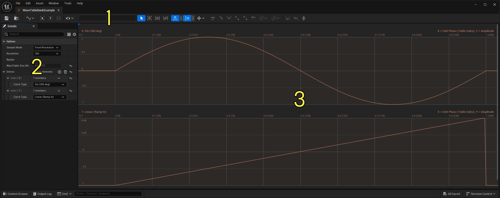

# WaveTable概述

> 路径：虚幻引擎5.7文档 / 处理音频 / Sound Source / MetaSounds / WaveTable概述

> 原始页面：https://dev.epicgames.com/documentation/unreal-engine/wavetables-overview-in-unreal-engine

**WaveTable** 会在查找表中存储周期波数据，并提供一种在 **MetaSound** 中执行wavetable合成和采样的方法。

## WaveTable库

虚幻引擎会在 **WaveTable Bank** 资产中存储WaveTable。

你可以在 **内容浏览器（Content Browser）** 中点击 **添加（Add）** 按钮，然后选择 **音频（Audio）> WaveTable（WaveTable）> WaveTable库（WaveTable Bank）** ，以创建WaveTable库。

### 编辑器

点击查看大图。

你可以在 **WaveTable库编辑器（WaveTable Bank Editor）** 中编辑WaveTable库。在内容浏览器中双击WaveTable库以打开WaveTable库编辑器。

WaveTable库编辑器有三个主要UI组件。

1. 曲线编辑器工具栏（Curve Editor Toolbar）

   - 使用这些工具更改你的查看模式或编辑自定义曲线类型WaveTable。如需有关工具栏和编辑曲线的更多信息，请参阅

   曲线编辑器

   。
2. 细节（Details）

   面板（Panel）

   - 编辑WaveTable库的属性。
3. 变换曲线（Transform Curve）

   面板（Panel）

   - 查看WaveTable库中的所有WaveTable曲线。

### 属性

你可以在细节（Details）面板中找到WaveTable库的属性。

| **属性** | **说明** |
| --- | --- |
| **示例模式（Sample Mode）** | 用于库的采样模式。选项包括： **固定分辨率（Fixed Resolution）** - 强制库中所有WaveTable的分辨率统一。此模式支持同步运行混合、插值和空间化，非常适用于振荡或Envelopes。 **固定采样率（Fixed Sample Rate）** - 强制库中所有WaveTable的采样率统一。该模式支持以共享速度播放离散音频，非常适用于采样和造粒。 |
| **分辨率/采样率（Resolution/Sample Rate）** | 为各个库条目缓存的样本数量。 |
| **双极（Bipolar）** | 如果启用此选项，曲线夹在-1.0与1.0之间，适用于波形的生成和振荡。如果禁用此选项，曲线夹在0.0与1.0之间，适用于Envelopes。 |
| **WaveTable大小（MB）（WaveTable Size (MB)）** | （只读）库中所有WaveTable数据的总大小。 |
| **条目（Entries）** | 库中WaveTable的数组。 |
| **曲线类型（Curve Type）** | 变换输出时应用的曲线。选项包括： 预设（Presets），例如正弦（360度）（Sine (360 deg) ）和线性（斜入）（Linear (Ramp In)）。 **共享（Shared）** - 参考共享 **曲线** 资产。 **自定义（Custom）** - 设计自定义曲线。 **文件（File）** - 从音频文件生成WaveTable。 |
| **时长（秒）（Duration (Sec)）** | （仅固定采样率）曲线的时长。 |

## MetaSound节点

WaveTableMetaSound节点有三种类型。

- 发生器
- Envelopes
- 工具

有关下文各个节点的更多信息，请参阅[MetaSound参考指南](../metasounds-reference-guide/index.md)。

### 发生器

MetaSound支持多个核心发生器节点，例如 **正弦（Sine）** 和 **锯齿（Saw）** 。它们是强大的合成工具，但WaveTable发生器节点更是如此。

利用WaveTable发生器节点，你可以使用自定义波和样本来驱动合成。

这些节点包括：

- WaveTable Player

  - 在WaveTable库的给定索引处播放WaveTable。此节点需要一个固定采样率的WaveTable库。
- WaveTable Oscillator

  - 以给定频率播放WaveTable。此节点需要一个固定分辨率的WaveTable库。

### Envelopes

MetaSound还支持多个核心Envelopes节点，例如 **AD Envelope** 和 **ADSR Envelope** 。WaveTableEnvelopes节点还改进了那些传统选项。

利用WaveTable Envelopes节点，你可以使用自定义波和样本进行更强大的调制。

这些节点包括：

- WaveTable Envelope

  - 在给定时长内读取WaveTable。此节点需要一个固定分辨率的WaveTable库。
- Evaluate WaveTable

  - 根据给定输入值评估WaveTable。

### 工具

你可以使用 **Get WaveTable From Bank** 节点获取WaveTable，作为另一个节点的输入。**TableIndex** 浮点输入支持在固定分辨率库中将各个WaveTable进行混合。
