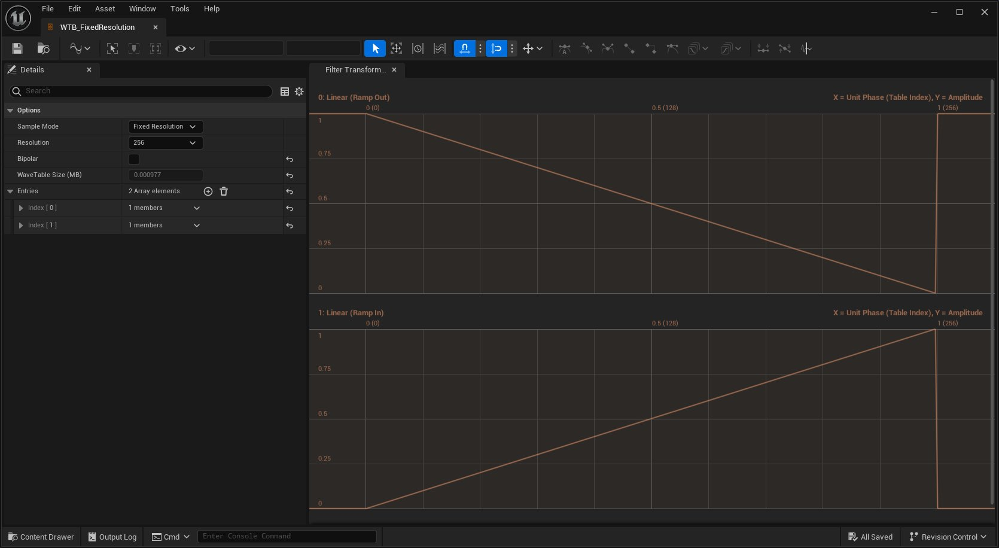
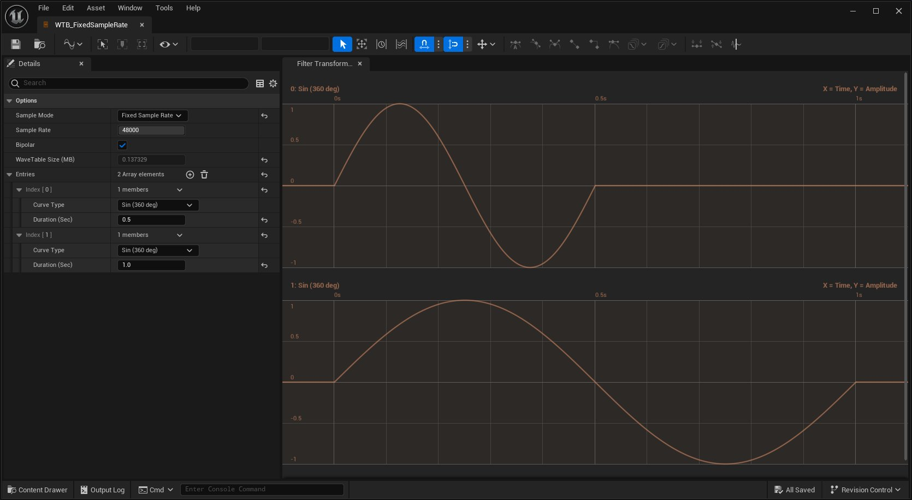
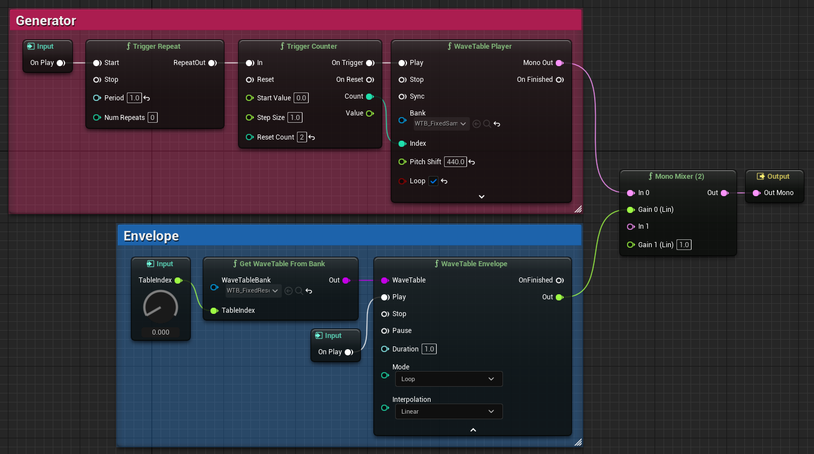

# WaveTable快速入门

> 路径：虚幻引擎5.7文档 / 处理音频 / Sound Source / MetaSounds / WaveTable快速入门

> 原始页面：https://dev.epicgames.com/documentation/unreal-engine/wavetables-quick-start-in-unreal-engine

**WaveTable** 会在查找表中存储周期波数据，并提供一种在 **MetaSound** 中执行wavetable合成和采样的方法。

本指南将教你如何创建由两个使用不同采样模式的WaveTable驱动的MetaSound。

- 固定分辨率（Fixed Resolution）

  - 强制库中所有WaveTable的分辨率统一。此模式支持同步运行混合、插值和空间化，非常适用于振荡或Envelope。
- 固定采样率（Fixed Sample Rate）

  - 强制库中所有WaveTable的采样率统一。该模式支持以共享速度播放离散音频，非常适用于采样和造粒。

## 创建固定分辨率WaveTable库

点击查看大图。

要创建固定分辨率WaveTable库：

1. 在

   内容浏览器（Content Browser）

   中点击

   添加（Add）

   按钮。
2. 选择

   音频（Audio）> WaveTable（WaveTable）> WaveTable库（WaveTable Bank）

   。
3. 将WaveTable库命名为

   WTB_FixedResolution

   。
4. 双击WaveTable库以打开

   WaveTable库编辑器

   。
5. 在

   细节（Details）

   面板中：

   1. 禁用

      双极（Bipolar）

      。
   2. 点击

      条目（Entries）

      的

      添加元素（+）（Add Element (+)）

      按钮两次。
   3. 展开

      索引[0]（Index [0]）

      并将

      曲线类型（Curve Type）

      设置为

      线性（斜出）（Linear (Ramp Out)）

      。
   4. 展开

      索引[1]（Index [1]）

      并将

      曲线类型（Curve Type）

      设置为

      线性（斜入）（Linear (Ramp In)）

      。
6. 保存WaveTable库。
7. 关闭

   WaveTable库编辑器

   。

## 创建固定采样率WaveTable库

点击查看大图。

要创建固定采样率WaveTable库：

1. 在

   内容浏览器（Content Browser）

   中点击

   添加（Add）

   按钮。
2. 选择

   音频（Audio）> WaveTable（WaveTable）> WaveTable库（WaveTable Bank）

   。
3. 将WaveTable库命名为

   WTB_FixedSampleRate

   。
4. 双击WaveTable库以打开

   WaveTable库编辑器

   。
5. 在

   细节（Details）

   面板中：

   1. 点击

      条目（Entries）

      的

      添加元素（+）（Add Element (+)）

      按钮两次。
   2. 展开

      索引[0]（Index [0]）

      ：

      1. 将

         曲线类型（Curve Type）

         设置为

         正弦（360度）（Sine (360 deg)）
      2. 将

         时长（秒）（Duration (Sec)）

         设置为 0.5。
   3. 展开

      索引[1]（Index [0]）

      ：

      1. 将

         曲线类型（Curve Type）

         设置为

         正弦（360度）（Sine (360 deg)）

         。
      2. 将

         时长（秒）（Duration (Sec)

         设置为 1.0。
6. 保存WaveTable库。
7. 关闭

   WaveTable库编辑器

   。

## 创建MetaSound源

点击查看大图。

构造一个使用WaveTable库进行生成和Envelope的MetaSound。请按照下面的步骤使用上述图表构建MetaSound。

1. 在

   内容浏览器（Content Browser）

   中点击

   添加（Add）

   按钮。
2. 选择

   音频（Audio）> MetaSound源（MetaSound Source）

   。
3. 将新的MetaSound命名为

   MSS_WaveTableDemo

   。
4. 双击MetaSound打开

   MetaSound Editor

   。
5. 在

   界面（Interfaces）

   面板中，点击

   UE.Source.OneShot

   界面条目旁边的

   删除（回收站）（Remove (Trash Bin)）

   按钮。这会删除On Finished Output节点，它不在循环声音上使用。

### 构建发生器部分

1. 找到图表中的

   On Play Input

   节点并将引脚拖移到空白区域。在节点搜索中输入"Trigger Repeat"，创建连接的节点。你可以拖动节点，在图表内四处移动。
2. 在

   Trigger Repeat

   节点上：

   1. 将

      周期（Period）

      设置为1.0。
   2. 拖移

      **

      RepeatOut

      引脚并创建

      Trigger Counter** 节点。
3. 在

   Trigger Counter

   节点上：

   1. 将

      重置计数（Reset Count）

      设为2.0。
   2. 拖移

      触发时（On Trigger）

      引脚并创建

      WaveTable

      Player

      节点。
   3. 将

      计数（Count）

      引脚连接到

      WaveTable Player

      节点上的

      索引（Index）** 引脚。
4. 在

   WaveTable Player

   节点上：

   1. 点击

      库（Bank）

      下拉菜单并将其设置为

      WTB_FixedSampleRate

      。
   2. 将

      音高变化（Pitch Shift）

      设置为440.0。
   3. 启用

      循环（Loop）

      。

### 构建Envelope部分

1. 右键点击空白区域并添加

   Get WaveTable From Bank

   节点。
2. 在

   Get WaveTable From Bank

   节点上：

   1. 点击

      库（Bank）

      下拉菜单并将其设置为

      WTB_FixedResolution

      。
   2. 拖移

      TableIndex

      引脚并选择

      提升到图表输入（Promote to Graph Input）

      。这会创建名为TableIndex的

      Float Input

      节点。
   3. 拖移

      输出（Out）

      引脚并创建

      WaveTable Envelope

      节点。
3. 在

   WaveTable Envelope

   节点上：

   1. 拖移

      播放时（On Play）

      引脚并创建

      Get On Play

      节点。
   2. 点击节点底部的向下箭头以展开引脚列表。
   3. 将

      模式（Mode）

      设置为循环（Loop）。

### 连接输出

1. 右键点击空白区域并创建

   Mono Mixer (2)

   节点。
2. 在

   Mono Mixer (2)

   节点上：

   1. 将

      输入0（In 0）

      引脚连接到

      WaveTable Player

      节点上的

      单声道输出（Mono Out）** 引脚。
   2. 将

      增益0（Lin）（Gain 0 (Lin)）

      引脚连接到

      WaveTable Envelope

      节点的

      输出（Out）** 引脚。
   3. 将

      输出（Out）

      引脚连接到

      Out Mono Output

      节点。
3. 保存MetaSound。

## 测试MetaSound

点击 **MetaSound编辑器工具栏（MetaSound Editor Toolbar）** 上的 **播放（Play）** 按钮，播放MetaSound。你可以单击节点上的 **Input Widget (Dial)** 并上下拖动，以调整 **TableIndex** 图表输入值。

`WTB_FixedSampleRate` 中的WaveTable每秒交替播放。增益由WaveTable从 `WTB_FixedResolution` 进行控制，它由TableIndex图表输入进行选择。介于0到1之间的TableIndex值会将库中的WaveTable生成一个混合体。

## 自行尝试！

现在你已经完成了本快速入门指南，可以考虑进一步推进此项目。下面是关于自行尝试的一些建议。

- 使用本指南中未使用的WaveTable节点构建MetaSound，例如

  WaveTable Oscillator

  节点和

  Evaluate WaveTable

  节点。有关WaveTable节点的更多信息，请参阅

  MetaSound参考指南

  。
- 通过将

  曲线类型（Curve Type）

  设置为

  自定义（Custom）

  ，自定义你的WaveTable曲线。如需有关工具栏和编辑曲线的更多信息，请参阅

  曲线编辑器

  。
- 将

  曲线类型（Curve Type）

  设置为

  文件（File）

  并找到

  WaveTable设置（Wave Table Settings）> 文件路径（File Path）

  ，可将音频文件导入为WaveTable。
