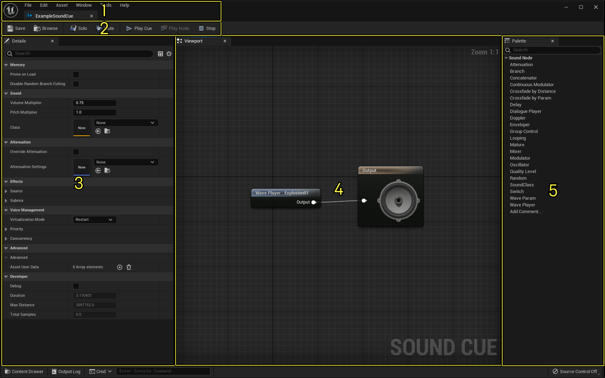
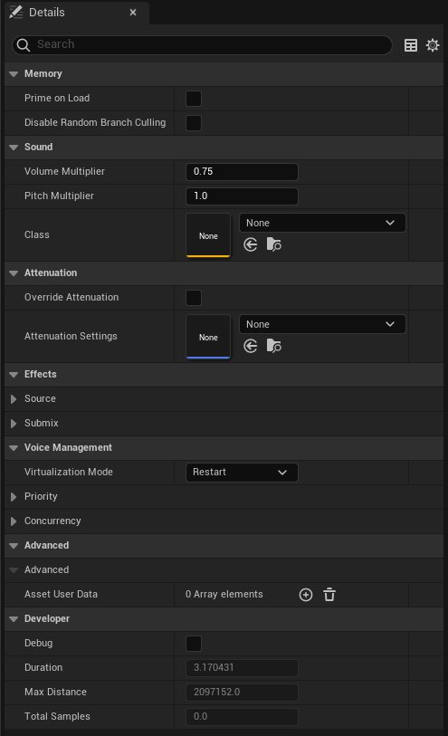
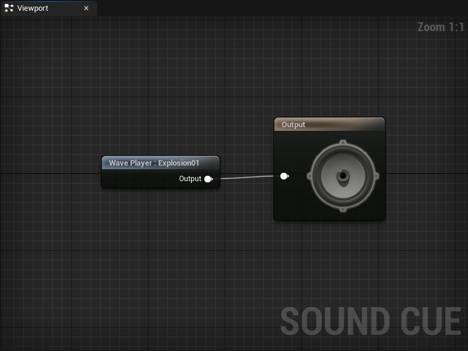
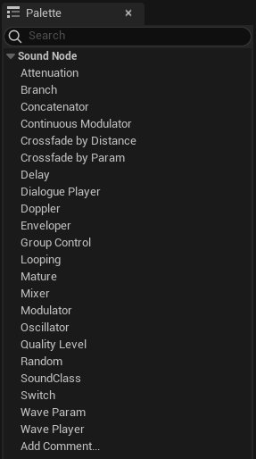

# Sound Cue编辑器UI

> 路径：虚幻引擎5.7文档 / 处理音频 / Sound Source / Sound Cue / Sound Cue编辑器UI

> 原始页面：https://dev.epicgames.com/documentation/unreal-engine/sound-cue-editor-ui-in-unreal-engine

**Sound Cue编辑器** 界面有以下几个区域：

1. 菜单栏
2. 工具栏
3. 细节面板
4. 视口面板
5. 控制板面板

> [!TIP]
> 点击选项卡右上角的小 "X" 可以关闭任何面板。要打开之前关闭的面板，在 **窗口（Window）** 菜单中点击该面板名称。
>
> 选项卡也可以隐藏，右键点击选项卡，然后在菜单中点击 **隐藏选项卡（Hide Tab）**。类似地，点击面板左上角的蓝色小箭头可以显示隐藏的选项卡。

## 菜单栏

**文件（File）**

- 打开资产（Open Asset…）

  - 显示

  打开资产（Open Asset）

  面板来快速找到资产并打开对应的编辑器。
- 保存全部（Save All）

  - 保存项目中所以未保存的关卡和资产。
- 选择保存文件（Choose Files to Save…）

  - 打开一个对话框来选择保存项目中的哪些关卡和资产。
- 保存（Save）

  - 保存当前资产。
- 另存为（Save As…）

  - 用一个不同的文件名或路径来保存当前资产。

**编辑（Edit）**

- 取消（Undo）

  - 撤销最近的一次操作。
- 恢复（Redo）

  - 恢复最近一次撤销的操作，如果上一次操作是撤销的话。
- 撤销历史（Undo History）

  - 显示

  取消操作历史（Undo History）

  面板。
- 编辑器偏好设置（Editor Preferences…）

  - 显示

  编辑器偏好设置（Editor Preferences）

  面板，在这里可以修改虚幻编辑器的偏好设置。
- 项目设置（Project Settings…）

  - 显示

  项目设置（Project Settings）

  面板，在这里可以修改虚幻引擎项目的各种设置。
- 插件（Plugins）

  - 显示

  插件（Plugins）

  面板，在这里可以为虚幻引擎控制启用的插件。

**资产（Asset）**

- 在内容浏览器中查找（Find in Content Browser…）

  - 在

  内容浏览器（Content Browser）

  中找到并显示当前资产。
- 引用查看器（Reference Viewer…）

  - 显示

  引用查看器（Reference Viewer）

  面板，在这里可以看到该资产的引用信息。
- 尺寸贴图（Size Map…）

  - 显示

  尺寸贴图（Size Map）

  面板，在这里可以看到当前资产的尺寸信息。
- 审计资产（Audit Assets…）

  - 显示

  审计资产（Asset Audit）

  面板。
- 着色器烘焙数据（Shader Cook Statistics…）

  - 显示

  数据（Statistics）

  面板，并且应用着色器烘焙数据筛选器。

**窗口（Window）**

- 视口（Viewport）

  - 显示

  视口（Viewport）

  面板。
- 细节（Details）

  - 显示

  细节（Details）

  面板。
- 控制板（Palette）

  - 显示

  控制板（Palette）

  面板。
- 内容浏览器（Content Browser）

  - 在另一个窗口中打开

  内容浏览器（Content Browser）

  。
- 设备输出日志（Device Output Log）

  - 显示

  设备输出日志（Device Output Log）

  面板。
- 交换结果浏览器（Interchange Results Browser）

  - 显示

  （Interchange Results Browser）

  面板。
- 信息日志（Message Log）

  - 显示

  信息日志（Message Log）

  panel
- 输出日志（Output Log）

  - 显示

  输出日志（Output Log）

  面板。
- 打开商城（Open Marketplace）

  - 打开虚幻引擎商城。
- 加载布局（Load Layout）

  - 加载选中的面板布局。
- 保存布局（Save Layout）

  - 将当前的面板布局保存为新的默认布局。
- 移除布局（Remove Layout）

  - 从虚幻编辑器中移除选中的布局。
- 启用全屏（Enable Fullscreen）

  - 启用应用的全屏模式，占用整个显示器。

**工具（Tools）**

- 新建C++类（New C++ Class…）

  - 打开一个对话框来为项目新建一个C++类。
- 刷新Visual Studio项目（Refresh Visual Studio Project）

  - 刷新你的Visual Studio C++项目。
- 打开Visual Studio（Open Visual Studio）

  - 在Visual Studio中打开你的C++代码。
- 在蓝图中寻找（Find in Blueprints）

  - 显示

  在蓝图中寻找（Find in Blueprints）

  面板。
- 缓存数据（Cache Statistics）

  - 显示

  缓存数据（Cache Statistics）

  面板。
- 类查看器（Class Viewer）

  - 显示

  类查看器（Class Viewer）

  面板。
- CSV到SVG（CSV to SVG）

  - 显示

  CSV到SVG（CSV to SVG）

  面板。
- 本地化控制板（Localization Dashboard）

  - 显示

  本地化控制板（Localization Dashboard）

  面板。
- 合并Actor（Merge Actors）

  - 显示

  合并Actor（Merge Actors）

  面板。
- 项目启动程序（Project Launcher）

  - 显示

  项目启动程序（Project Launcher）

  面板。
- 资源使用（Resource Usage）

  - 显示

  资源使用（Resource Usage）

  面板。
- 会话前端（Session Frontend）

  - 显示

  会话前端（Session Frontend）

  面板。
- 结构查看器（Struct Viewer）

  - 显示

  结构查看器（Struct Viewer）

  面板。
- 虚拟资产（Virtual Assets）

  - 显示

  虚拟资产（Virtual Assets）

  面板。
- 调试（Debug）

  - 该选项中包含以下选项。

  - 蓝图调试器（Blueprint Debugger）

    - 显示

    蓝图调试器（Blueprint Debugger）

    面板。
  - 碰撞分析器（Collision Analyzer）

    - 显示

    碰撞分析器（Collision Analyzer）

    面板。
  - 调试工具（Debug Tools）

    - 显示

    调试工具（Debug Tools）

    面板。
  - 模块（Modules）

    - 显示

    模块（Modules）

    面板。
  - Niagara调试器（Niagara Debugger）

    - 显示

    Niagara调试器（Niagara Debugger）

    面板。
  - 像素检视器（Pixel Inspector）

    - 显示

    像素检视器（Pixel Inspector）

    面板。
  - 笔尖输入调试（Stylus Input Debug）

    - 显示

    笔尖输入调试（Stylus Input Debug）

    面板。
  - 可视化记录工具（Visual Logger）

    - 显示

    可视化记录工具（Visual Logger）

    面板。
  - 控件反射器（Widget Reflector）

    - 显示

    控件反射器（Widget Reflector）

    面板。
- 分析（Profile）

  - 该选项中包含以下选项。

  - 分析数据查看器（Profile Data Visualizer）

    - 显示

    分析数据查看器（Profile Data Visualizer）

    面板。
  - 检测数据过滤（Trace Data Filtering）

    - 显示

    检测数据过滤（Trace Data Filtering）

    面板。
- 审计（Audit）

  - 该选项中包含以下选项。

  - 资产审计（Asset Audit）

    - 显示

    资产审计（Asset Audit）

    面板。
  - 材质分析器（Material Analyzer）

    - 显示

    材质分析器（Material Analyzer）

    面板。
- 平台（Platforms）

  - 该选项中包含以下选项。

  - 设备管理器（Device Manager）

    - 显示

    设备管理器（Device Manager）

    面板。
  - 设备描述文件（Device Profiles）

    - 显示

    设备描述文件（Device Profiles）

    面板。
- 查看变更列表（View Changelists）

  - 打开一个对话框来显示当前的变更列表。
- 提交内容（Submit Content）

  - 打开一个对话框提供内容和关卡提交选项。
- 连接到源码管理（Connect to Source Control…）

  - 打开一个对话框，用于选择或使用虚幻编辑器能够整合使用的源码管理系统。
- 运行Unreal Insights（Run Unreal Insights）

  - 运行

  Unreal Insights

  独立应用。

**帮助（Help）**

- SoundCue编辑器文档（SoundCue Editor Documentation）

  - 打开

  Sound Cue编辑器（SoundCue Editor）

  文档页面。
- 文档主页（Documentation Home）

  - 打开虚幻引擎文档主页。
- C++ API参考（C++ API Reference）

  - 打开C++ API参考文档页面。
- 控制台变量（Console Variables）

  - 打开控制台变量和指令文档页面。
- 在线学习（Online Learning）

  - 打开Epic开发者社区网站，其中包括视频教程和学习指引。
- 论坛（Forums）

  - 打开虚幻引擎论坛网站。
- 问答（Q&A）

  - 打开虚幻引擎论坛网站的问答部分。
- 支持（Support）

  - 打开虚幻引擎支持网站。
- 报告bug（Report a Bug）

  - 打开虚幻引擎bug提交论坛页面。
- 问题追踪库（Issue Tracker）

  - 打开虚幻引擎问题页面。
- 关于虚幻编辑器（About Unreal Editor）

  - 打开一个对话框，显示安装的虚幻编辑器的相关信息。
- 制作人员（Credits）

  - 打开一个对话框，显示安装的虚幻引擎版本的制作人员名单。
- 访问UnrealEnginge.com（Visit UnrealEngine.com）

  - 在浏览器窗口中打开UnrealEngine.com

## 工具栏

| **按钮（Button）** | **描述（Description）** |
| --- | --- |
| 工具栏保存按钮 | 保存当前的Sound Cue. |
| 工具栏浏览按钮 | 在内容浏览中找到并选中当前的Sound Cue。 |
| 工具栏单独按钮 | 将除了当前Sound Cue以外的声音源静音。 |
| 工具栏静音按钮 | 将当前Sound Cue静音。 |
| 工具栏播放Cue按钮 | 播放当前的Sound Cue。 |
| 工具栏播放节点按钮 | 在视口面板中仅播放当前选中的节点。只有在选中一个节点时该项才可用。 |
| 工具栏停止按钮 | 停止播放Sound Cue或者节点。 |

## 细节面板

**细节（Details）** 面板显示当前选中节点的属性。如果选中了多个节点，**细节（Details）** 面板仅显示这些节点所共有的属性。

## 视口面板

**视口（Viewport）** 面板包含声音节点图表，用来显示音频信号在引线连接的声音节点之间的路径，数据通过Sound Cue时，由节点来操作信号。

有关 **Sound Cue编辑器（Sound Cue Editor）** 和使用声音节点图表的相关信息，参见[Sound Cue 编辑器](../sound-cue-editor/index.md)文档。

## 控制板面板

**控制板（Palette）** 面板罗列了Sound Cue中可用的所有声音节点类型。你可以通过从 **控制板（Palette）** 面板中向 **视口（Viewport）** 面板拖入节点类型来在声音节点图表中添加节点。

要了解声音节点类型及其属性的详细信息，请参考[Sound Cue参考] (working-with-audio/sound-sources/sound-cues/sound-cue-reference)文档。
