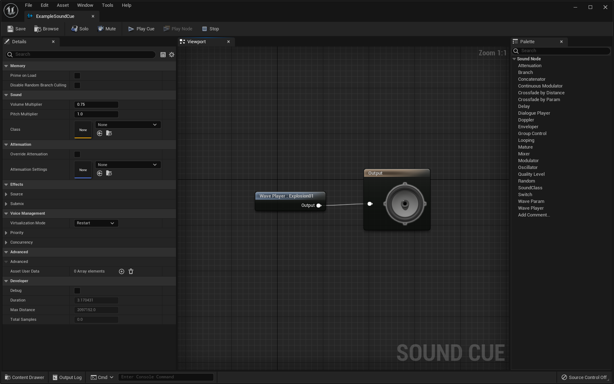
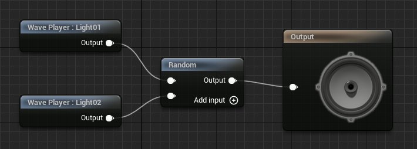
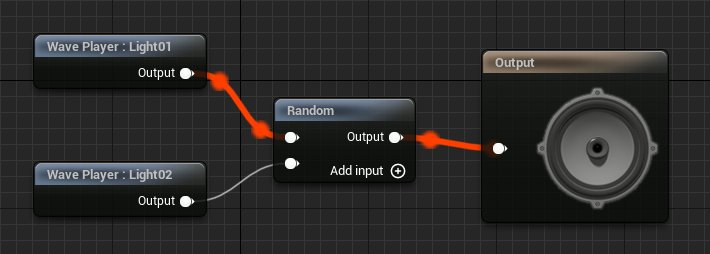

# Sound Cue编辑器

> 路径：虚幻引擎5.7文档 / 处理音频 / Sound Source / Sound Cue / Sound Cue编辑器

> 原始页面：https://dev.epicgames.com/documentation/unreal-engine/sound-cue-editor-in-unreal-engine

Sound Cue编辑器是一个节点式的编辑器，用于设计Sound Cue资产。Sound Cue包含一个音频节点图表（Sound Node Graph），其中可以保存你导入的音频资产（Sound Wave）的引用。音频节点图表还可以包含音频资产的操作指令。

## Sound Wave

**Sound Wave（Sound Wave）** 资产会在你导入 .wav 音频文件时自动创建，并且会包含一些额外的属性和控制选项。双击Sound Wave资产，或者右键点击然后选择编辑，便可以找到这些属性。

在Sound Cues中，Sound Wave引用通过Wave Player Sound节点或Wave Param Sound节点参与到音频节点图表中。

请参阅[导入音频文件](../../sound-waves/importing-audio-files/index.md)，了解有关如何创建声波的信息。

> [!NOTE]
> 声波（Sound Wave）的属性将发挥基础性作用，可以影响所有包含它的Sound Cue。例如，若增加音高或音量，将在引用它的所有位置增加音高或音量。

## Sound Cue

**Sound Cue** 资产可以作为音频行为信息的容器。Sound Cue由音频节点构成，它们是各自独立的模块，每个都对音频产生影响。音频节点排列在图表中，显示各个节点之间的关系以及其中的数据流。

## 创建Sound Cue

要创建一个Sound Cue，执行一下操作：

1. 在

   内容浏览器（Content Browser）

   中，点击

   

   按钮或者右键点击空白处打开菜单。
2. 在

   创建高级资产（Create Advanced Assets）

   部分，点击

   音频（Sounds）

   ，然后点击

   Sound Cue

   。
3. 为你的新建Sound Cue命名。

## 打开Sound Cue编辑器

要打开Sound Cue编辑器，可以在 **内容浏览器（Content Browser）** 中双击一个Sound Cue资产，或者右键点击它，然后在菜单中点击 **编辑（Edit）** 。

关于Sound Cue编辑器的用户界面，请参考[Sound Cue编辑器UI](../sound-cue-editor-ui/index.md)文档。

## 音频节点图表

音频节点图表位于 **视口（Viewport）** 面板中，显示音频信号在引线连接的节点之间的路径，这些节点会对Sound Cue中通过的信号做出处理。

要添加音频节点，可以在 **视口（Viewport）** 面板的空白处点击鼠标右键，或者从已有的节点向空白处拖出引线。两种操作都会弹出一个可以进行搜索的菜单，用于选择要添加的新节点的音频节点类型。

> 动图已省略：添加节点和搜索菜单

你还可以从 **调色板（Palette）** 面板将音频节点类型拖入图表的空白处或者已有节点的连接引脚，以此来添加新的音频节点。

> 动图已省略：从调色板拖入空白处

> 动图已省略：从调色板拖至引脚

要预览播放，使用Sound Cue编辑器顶部工具栏中的播放按钮。 **播放Cue（Play Cue）** 按钮会播放整个Sound Cue， **播放节点（Play Node）** 按钮会从选中的节点来播放音频。（如果选中了多个节点， **播放节点（Play Node）** 按钮会变灰并且不可用。）

当Sound Cue正在播放时，为了辅助调试，当前激活的节点的引线会变红。这样会使实时跟踪Sound Cue的构建变得更加容易。

> [!TIP]
> 由于音频节点上连接引脚的位置，我们强烈建议从左至右来构建音频节点图表。从Sound Wave播放节点开始（比如Wave Player或Wave Param)，然后添加相关的控制节点（比如Delay或者Modulator），最后添加输出节点。

要详细了解Sound Cue编辑器中可使用的节点，请参考[Sound Cue 参考](../sound-cue-reference/index.md)文档。
