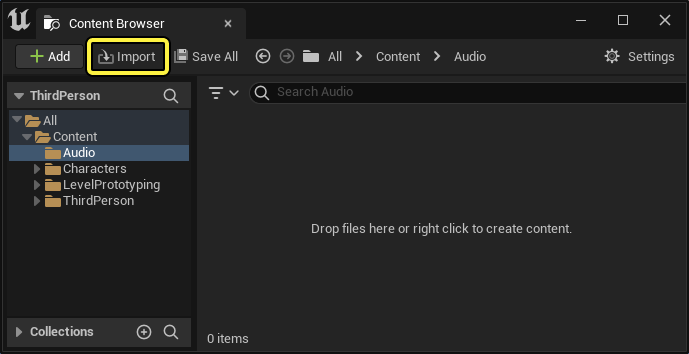
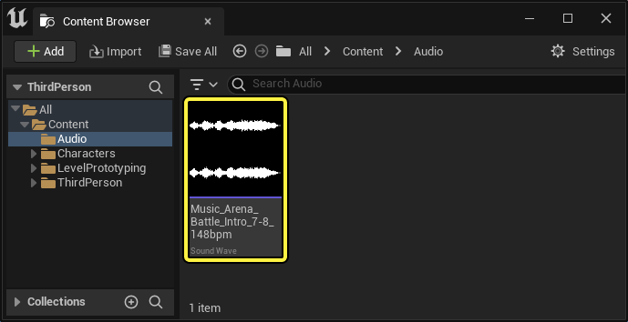
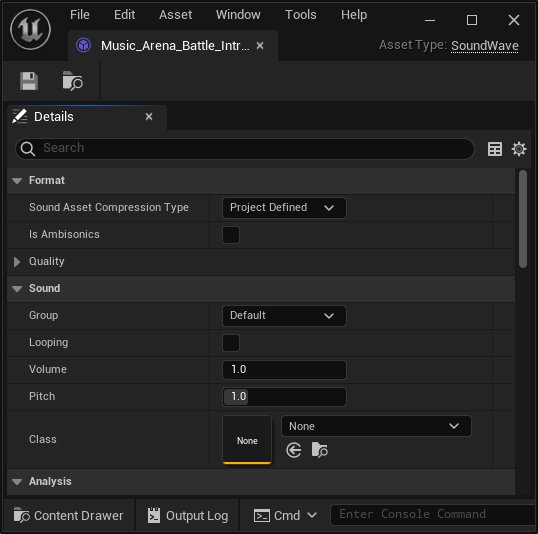

# 导入音频文件

> 路径：虚幻引擎5.7文档 / 处理音频 / Sound Source / 声波 / 导入音频文件

> 原始页面：https://dev.epicgames.com/documentation/unreal-engine/importing-audio-files

虚幻引擎提供了多种功能，供你为项目创建所需的音频。**声波（Sound Wave）** 资产表示音频文件，是其中许多功能需要用到的基本构建块之一。将音频文件导入虚幻编辑器可创建声波。

### 支持的音频文件

| 列 1 | 列 2 |
| --- | --- |
| **格式（Format）** | `.wav` 、 `.ogg` 、 `.flac` 、 `.aif` |
| **位深度（Bit Depth）** | 16、24（Windows） |
| **采样率（Sample Rate）** | 任意 |
| **扬声器信道（Speaker Channels）** | Mono、Stereo、4.0、5.1、7.1 |

> [!NOTE]
> 所有导入的音频文件会在内部转换为16位 `.wav` 文件。因此，导出操作（右键点击声波，选择 **资产操作（Asset Actions） > 导出（Export...）** ）将生成转换后的文件，而不是原先导入的文件。此外，24位文件在转换期间不会发生抖色，因此推荐导入16位文件。

### 如何导入音频文件

1. 在内容浏览器中，点击 **导入（Import）** 按钮。

   
2. 使用 **文件资源管理器（File Explorer）** 选择你想导入的文件。
3. 找到新创建的 **声波（Sound Wave）** 资产。

   
4. 要预览声波，请将鼠标悬停在其上方，直至显示 **播放/停止（Play/Stop）** 切换按钮，然后点击该按钮。

   播放声波 停止声波
5. 双击该声波打开 **细节（Details）** 面板。你可以在此处查看和编辑资产的属性。

   

> [!TIP]
> 将音频文件从Windows资源管理器直接拖入 **内容浏览器（Content Browser）** ，也可以导入音频文件。

> [!NOTE]
> 虚幻引擎还支持导入一阶环境立体声文件。请参阅[原生声场环境立体声渲染](../../../submixes/native-soundfield-ambisonics-rendering/index.md)，了解有关导入和使用环境立体声资产的信息。

### 压缩

所有音频资产都使用 **项目设置（Project Settings）** 中指定的 **默认音频压缩类型（Default Audio Compression Type）** 进行压缩。你可以根据项目的需要更改此值。

- Bink音频（Bink Audio）

  ：一种基于感知的编码解码器，支持所有平台中的所有功能。这是默认选项。
- ADPCM

  ：一种时域编码解码器，具有固定大小的质量和大约4倍的压缩率，但解码成本相对较低。
- PCM

  ：使用未压缩音频，会造成更高的内存使用率，因为流式处理的数据块每块包含更少的音频，但解码成本极低，并支持所有功能。
- 特定于平台（latform Specific）

  ：以特定于平台的格式对资产编码。不支持搜索。
