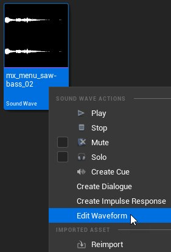
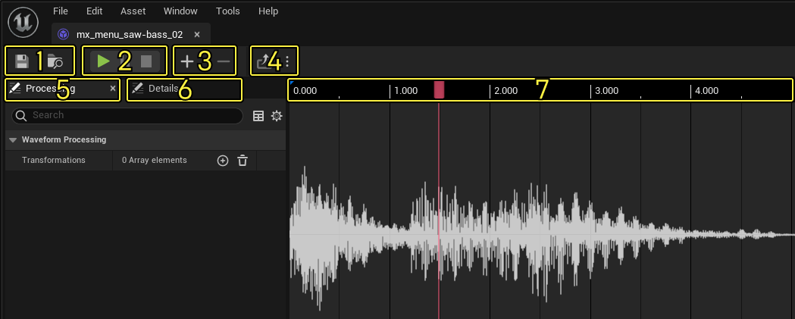
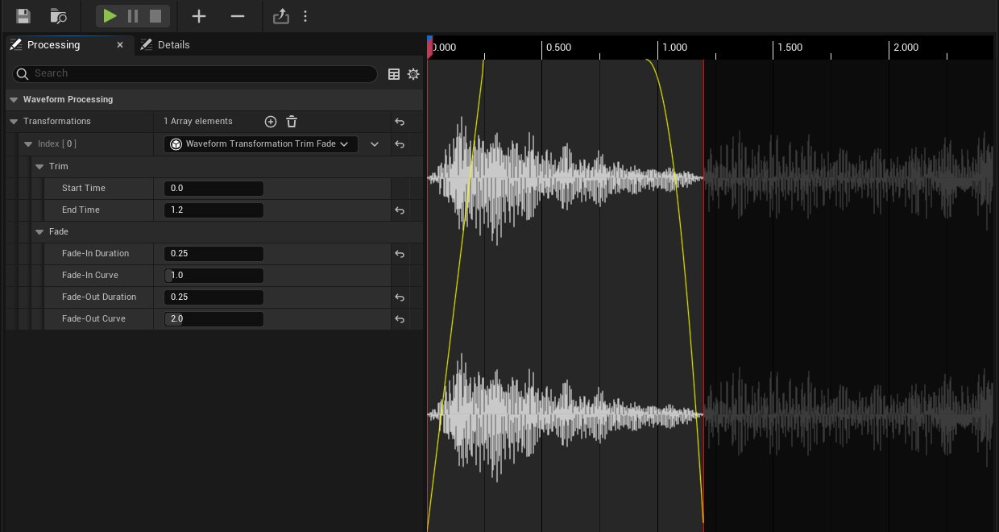
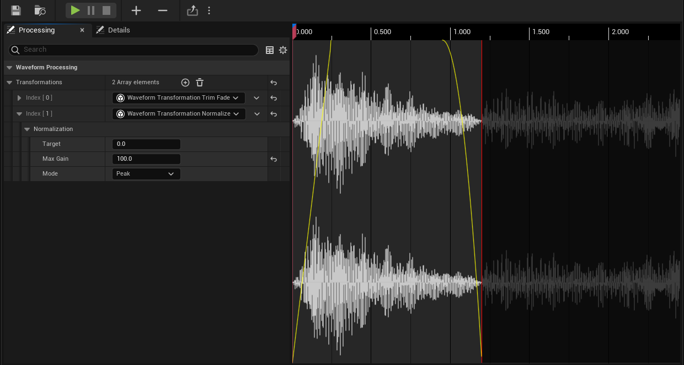
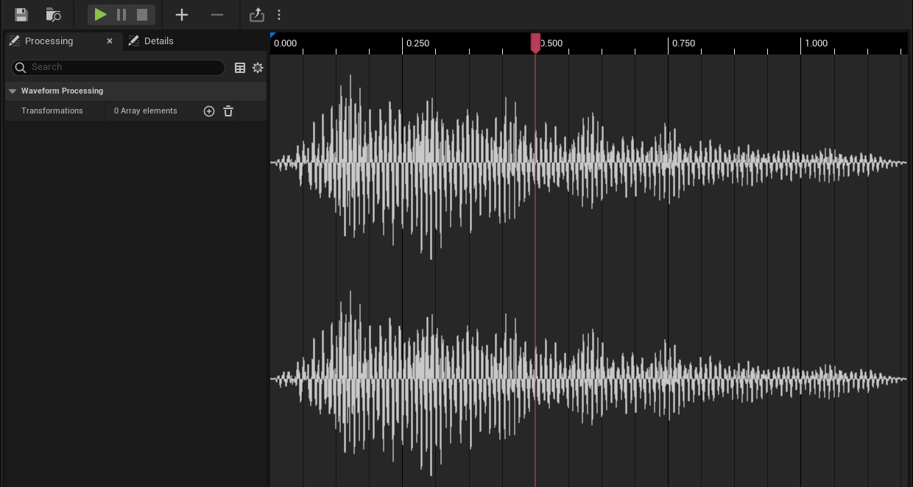
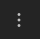

# 波形编辑器快速入门

> 路径：虚幻引擎5.7文档 / 处理音频 / Sound Source / 波形编辑器快速入门

> 原始页面：https://dev.epicgames.com/documentation/unreal-engine/waveform-editor-quick-start-in-unreal-engine

你可以使用 **波形编辑器（Waveform Editor）** ，通过修剪消退和规格化等基本变换来编辑声波。

> [!NOTE]
> 波形编辑器（Waveform Editor）并非旨在取代传统的数字音频工作站（DAW）。

## 先决条件

- 波形编辑器（Waveform Editor）插件默认禁用。要启用它，请选择

  编辑（Edit）> 插件（Plugins）

  ，打开

  插件（Plugin）

  面板，使用搜索栏查找插件，然后选中相应的复选框。
- 本指南还要求你的项目中包含

  声波（Sound Wave）

  资产。请参阅

  导入音频文件

  ，了解有关如何创建声波的信息。

## 1 - 打开波形编辑器

要编辑声波资产，你需要打开波形编辑器（Waveform Editor）。

1. 在

   内容浏览器（Content Browser）

   中，右键点击你想编辑的

   声波（Sound Wave）

   文件。
2. 从上下文菜单中选择

   编辑波形（Edit Waveform）

   。此操作会在新窗口中打开波形编辑器（Waveform Editor）。

## 2 - 熟悉UI

现在你已经打开了波形编辑器（Waveform Editor），请花点时间熟悉其用户界面。

1. 文件控件（File Controls）

   ：保存当前声波，或在内容浏览器（Content Browser）中找到它。
2. 传输控件（Transport Controls）

   ：播放、暂停和停止活动的声波。
3. 缩放控件（Zoom Controls）

   ：放大或缩小波形。
4. 导出选项（Export Options）

   ：将当前编辑导出到另一个声波资产或更改通道格式（单声道或立体声）。
5. 处理面板（Processing Panel）

   ：查看或应用波形变换。
6. 细节面板（Details Panel）

   ：查看或修改声波资产细节。
7. 时间标尺（Time Ruler）

   ：显示当前声波的时序，或通过移动播放头来跟踪和更改播放。

> [!TIP]
> 你可以在 **编辑器偏好设置（Editor Preferences）> 波形编辑器显示（Waveform Editor Display）** 中更改波形编辑器（Waveform Editor）的颜色、线条粗细和其他显示设置。

## 3 - 修剪消退

你可以使用 **修剪消退（Trim Fade）** 变换来编辑时序，以及在声音的开头和末尾添加消退。

1. 在

   处理（Processing）

   面板中找到变换数组。
2. 点击 **添加元素（Add Element）** 向数组添加变换。

   

   添加元素（Add Element）按钮
3. 从新索引的下拉菜单中选择

   波形变换修剪消退（Waveform Transformation Trim Fade）

   。
4. 点击索引，

   修剪（Trim）

   组和

   消退（Fade）

   组左侧的箭头，展开变换属性。
5. 根据你的喜好更改修剪属性。

   - 开始时间（Start Time）

     ：修剪后声音的开始时间（以秒为单位）。
   - 结束时间（End Time）

     ：修剪后声音的结束时间（以秒为单位）。
6. 根据你的喜好更改消退属性。

   - 淡入时长（Fade-In Duration）

     ：淡入的时长（以秒为单位）。
   - 淡入曲线（Fade-In Curve）

     ：淡入的形状。
   - 淡出时长（Fade-Out Duration）

     ：淡出的时长（以秒为单位）。
   - 淡出曲线（Fade-Out Curve）

     ：淡出的形状。

> [!TIP]
> 你可以使用鼠标控制修剪消退变换的属性。
>
> - 拖动修剪边界来更改开始时间（Start Time）和结束时间（End Time）。
> - 从左上角拖动以更改淡入时长（Fade-In Duration）。
> - 从右上角拖动以更改淡出时长（Fade-Out Duration）。
> - 在消退线上滚动鼠标滚轮以更改消退曲线。

## 4 - 规格化

你可以使用 **规格化（Normalize）** 变换来应用恒量增益，以达到最大音量水平目标。如果在 **修剪消退（Trim Fade）** 变换后执行此操作，规格化将仅应用于修剪过的波形部分。

1. 在

   处理（Processing）

   面板中找到变换数组。
2. 点击

   添加元素（Add Element）

   再向数组添加一个变换。
3. 从新索引的下拉菜单中选择

   波形变换规格化（Waveform Transformation Normalize）

   。
4. 点击索引和规格化（Normalization）组左侧的箭头，展开

   变换（Transformation）

   属性。
5. 根据你的喜好更改

   规格化（Normalization）

   属性。

   - 目标（Target）

     ：目标最大音量（以分贝表示）。
   - 最大增益（Max Gain）

     ：要应用的最大增益。
   - 模式（Mode）

     ：查找峰值时所用分析的类型。

## 5 - 导出编辑

完成编辑后，你可以将编辑过的波形导出到新的声波资产。

1. 点击 **导出选项（Export Options）** ，选择所需的通道格式。

   

   导出选项（Export Options）按钮
2. 点击 **导出（Export）** 按钮。出现 **保存内容（Save Content）** 窗口。

   > 图片已省略：导出按钮

   导出（Export）按钮
3. 点击

   保存内容（Save Content）

   窗口中的

   保存选定项（Save Selected）

   。
4. 你现在可以使用

   内容浏览器（Content Browser）

   ，在原始声波资产所在的目录中，找到在其原始名称后追加了

   _Edited

   的新编辑声波资产。
5. 如果你想重命名资产，请右键点击并从上下文菜单中选择

   重命名（Rename）

   。

## 结果

你的编辑过的声波资产现在已可在项目中使用。

> [!TIP]
> 你可以设置默认变换，以每次在 **编辑器偏好设置（Editor Preferences）> 波形编辑器变换（Waveform Editor Transformations）** 内打开波形编辑器（Waveform Editor）时应用。
