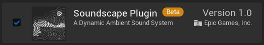
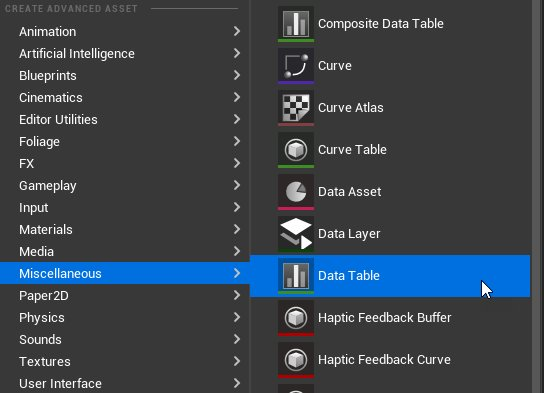
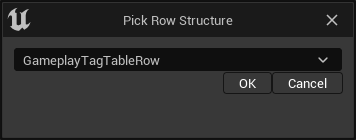
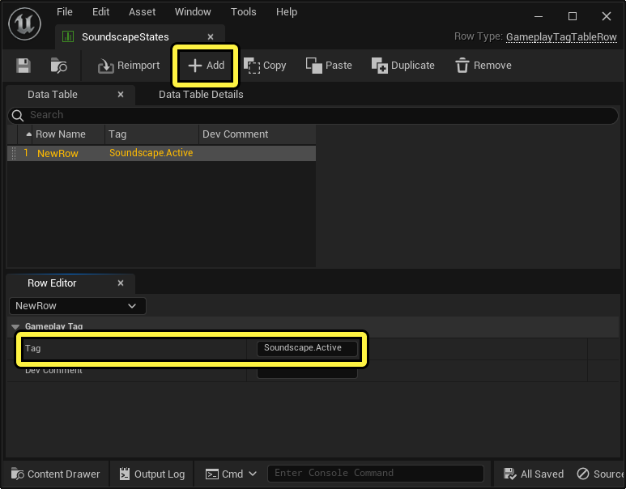
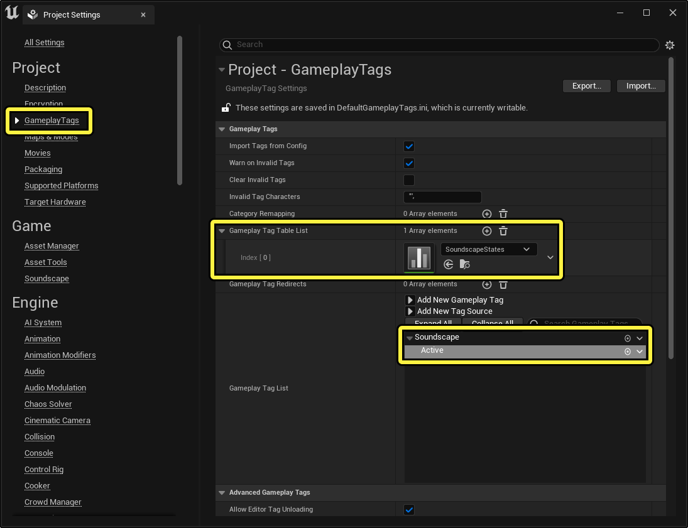
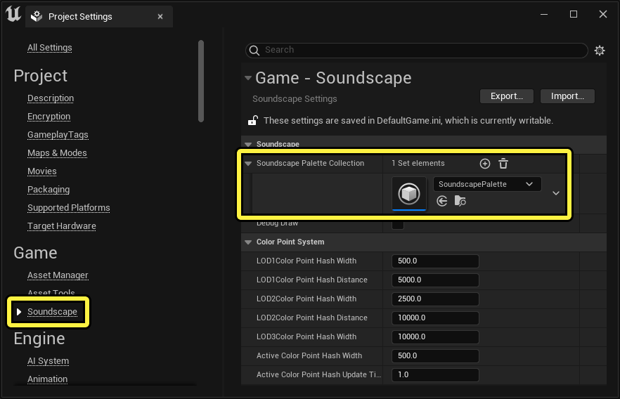
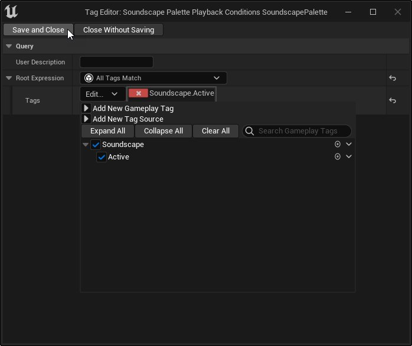
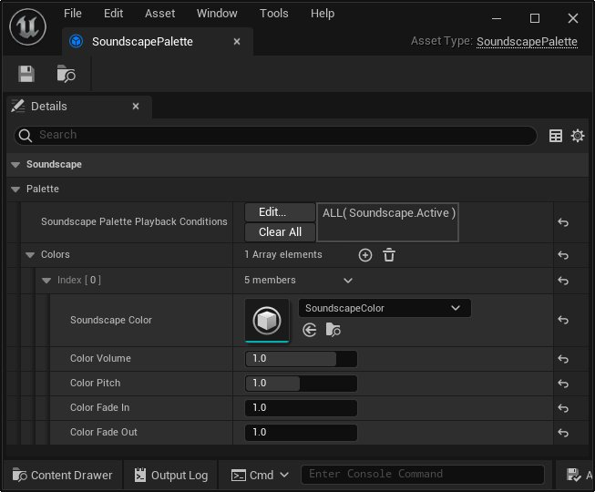

# 音景快速入门

> 路径：虚幻引擎5.7文档 / 处理音频 / Soundscape / 音景快速入门

> 原始页面：https://dev.epicgames.com/documentation/unreal-engine/soundscape-quick-start

**音景（Soundscape）** 按程序生成玩家于世界内周游时流送的环境音效。设置之后，该插件会自主管理和构建这些音效系统，不需要手动创建。

在本指南中，你将了解如何设置自己的基本音景。

## 先决条件

- 音景插件默认禁用。要启用它，请选择

  编辑（Edit）> 插件（Plugins）

  ，打开

  插件（Plugin）

  面板，使用搜索栏查找插件，然后点击相应的复选框。
- 具有支持移动的

  玩家角色（Player Character）

  的项目，如

  第三人称模板

  。
- 本指南还要求你的项目中包含

  声波（Sound Wave）

  资产。请参阅

  导入音频文件

  ，了解有关如何创建声波的信息。 *（可选步骤）由于音景会在3D空间中合成音效，因此在你的声波上使用

  衰减设置（Attenuation Settings）

  可产生更好的空间化效果。如需有关空间化的更多信息，请参阅

  空间化和音效衰减

  。

## 1 - 创建音景状态数据表

音景将使用 **Gameplay标签（Gameplay Tags）** 作为状态。你可以使用蓝图或C++来控制这些状态，音景将根据你设置的条件自动响应。

1. 点击 **添加内容（Add Content）** 或右键点击 **内容浏览器（Content Browser）** 中的空白区域并选择 **杂项（Miscellaneous）> 数据表（Data Table）** ，创建 **数据表（Data Table）** 资产。出现 **选取行结构（Pick Row Structure）** 窗口。

   
2. 从下拉菜单中选择 **GameplayTagTableRow** 。

   
3. 点击

   确定（Ok）

   。
4. 输入数据表名称"SoundscapeStates"。
5. 右键点击新数据表资产，然后从上下文菜单中选择 **编辑...（Edit…）** 。界面上将显示新的 **数据表编辑器（Data Table Editor）** 窗口。

   
6. 点击

   添加（Add）

   创建新的Gameplay标签。
7. 将

   行编辑器（Row Editor）

   面板中的

   标签（Tag）

   更改为"Soundscape.Active"。
8. 保存数据表。

## 2 - 将数据表添加到项目设置

你必须将Gameplay标签添加到项目设置中的中心标签字典中，引擎才能识别它们。如需有关Gameplay标签的更多信息，请参阅[Gameplay标签](https://dev.epicgames.com/documentation/404)。

1. 转到

   编辑（Edit）> 项目设置...（Project Settings…）

   ，打开

   项目设置（Project Settings）

   面板。
2. 在面板左侧，点击项目标题下的

   GameplayTags

   。
3. 点击

   Gameplay标签表列表（Gameplay Tag Table List）

   的

   添加元素（Add Element）

   。
4. 点击 **索引[0]（Index [0]）** 下拉菜单，然后选择先前创建的SoundscapeStates数据表。Soundscape.Active状态现在显示在 **Gameplay标签列表（Gameplay Tag List）** 中。

   

## 3 - 创建音景控制板和颜色

音景系统由两种不同的资产类型驱动：**控制板（Palettes）** 和 **颜色（Colors）** 。音景颜色（Soundscape Color）包含音效资产引用和控制音效播放方式的行为属性。音景控制板（Soundscape Palette）包含对颜色的引用和控制何时激活控制板的播放条件。

1. 点击

   添加内容（Add Content）

   或右键点击

   内容浏览器（Content Browser）

   中的空白区域并选择

   音效（Audio）> 音景（Soundscape）> 音景控制板（Soundscape Palette）

   ，创建音景控制板资产。
2. 为控制板输入所需的名称。一般而言，此名称应反映激活控制板的条件。
3. 点击

   添加内容（Add Content）

   或右键点击

   内容浏览器（Content Browser）

   中的空白区域并选择

   音效（Audio）> 音景（Soundscape）> 音景颜色（Soundscape Color）

   ，创建音景颜色资产。
4. 为颜色输入所需的名称。一般而言，此名称应反映颜色将播放的音效的内容。

## 4 - 将控制板添加到项目设置

你必须将音景控制板添加到项目设置中的 **音景控制板集合（Soundscape Palette Collection）** 中，引擎才能识别它们。

1. 转到

   编辑（Edit）> 项目设置...（Project Settings…）

   ，打开

   项目设置（Project Settings）

   面板。
2. 在面板左侧，点击

   游戏（Game）

   标题下的

   音景（Soundscape）

   。
3. 点击

   音景控制板集合（Soundscape Palette Collection）

   的

   添加元素（Add Element）

   。
4. 点击下拉菜单，选择先前创建的音景调色板。

   

## 5 - 设置控制板

你的控制板已加入集合中，但仍需要对其进行配置。

1. 双击

   内容浏览器（Content Browser）

   中的

   音景控制板（Soundscape Palette）

   ，打开其

   细节（Details）

   面板。
2. 点击位于

   音景控制板播放条件（Soundscape Palette Playback Conditions）

   旁的

   编辑...（Edit...）

   。界面上将显示新的

   标签编辑器（Tag Editor）

   窗口。
3. 点击

   根表达式（Root Expression）

   下拉菜单，然后选择

   所有标签匹配（All Tags Match）

   。界面上将显示新的

   标签（Tags）

   条目。
4. 点击

   标签（Tags）

   下拉菜单并选择

   Soundscape.Active

   。
5. 点击 **标签编辑器（Tag Editor）** 窗口左上角的 **保存并关闭（Save and Close）** 。

   
6. 点击

   颜色（Colors）

   的

   添加元素（Add Element）

   。
7. 点击

   索引[0]（Index [0]）

   左侧的箭头，展开该分段。
8. 点击

   音景颜色（Soundscape Color）

   下拉菜单，并选择先前为

   索引[0]（Index [0]）

   创建的音景控制板。
9. 保存该音景控制板。

   

## 6 - 设置颜色

现在你的颜色已加入控制板中，请为其添加音效和某种行为。

1. 双击

   内容浏览器（Content Browser）

   中的

   音景颜色（Soundscape Color）

   ，打开其

   细节（Details）

   面板。
2. 选择 **音景（Soundscape）> 颜色（Color）> 音效（Sound）** 的下拉菜单，然后选择你要播放的 **声波（Sound Wave）** 资产。

   > 图片已省略：音景颜色设置 - 1
3. 启用

   调制行为（Modulation Behavior）> 随机化音高（Randomize Pitch）

   的复选框。如此设置会在音效每次播放时随机化其音高。
4. 启用

   生成行为（Spawn Behavior）> 持续重生（Continuously Respawn）

   的复选框。如此设置会持续生成音效。
5. 为

   生成行为（Spawn Behavior）> 最大生成距离（Max Spawn Distance）

   输入50.0。如此设置会使生成音效的位置更靠近听者。
6. 保存该音景颜色。

   > 图片已省略：音景颜色设置 - 2

## 7 - 放置触发器体积

满足你的控制板的条件时，将播放你的颜色内的音效。设置了GameplayTag **Soundscape.Active** 时，将满足该条件。你可以使用蓝图或C++根据需要设置状态，但对于本指南，请使用 **关卡蓝图（Level Blueprint）** 和 **触发器体积（Trigger Volume）** 来定义你的关卡内播放你的音景的区域。

1. 使用 **放置Actor（Place Actors）** 面板或点击 **关卡编辑器（Level Editor）工具栏** 中的 **快速添加（Quick Add）** 并选择 **体积（Volumes）> 触发器体积（Trigger Volume）** ，将触发器体积放入你的关卡。

   > 图片已省略：放置触发器体积
2. 调整触发器体积在关卡内的位置、大小和形状，以便你的角色可以进出该体积。

   > 图片已省略：触发器体积

## 8 - 设置蓝图

1. 选择触发器体积。
2. 点击 **关卡编辑器（Level Editor）工具栏** 中的 **蓝图（Blueprint）** 按钮，然后选择 **打开关卡蓝图（Open Level Blueprint）** 。

   > 图片已省略：打开关卡蓝图
3. 右键点击图表上的空白区域，然后为触发器体积添加一个

   On Actor Begin Overlap

   节点。
4. 右键点击图表上的空白区域，然后为触发器体积添加一个

   On Actor End Overlap

   节点。
5. 右键点击图表上的空白区域，然后添加一个

   Get SoundscapeSubsystem

   节点。
6. 从

   音景子系统（Soundscape Subsystem）

   拖动一个引脚连接到图表上的空白区域，然后添加一个相连的

   Set State

   节点。
7. 从

   音景子系统（Soundscape Subsystem）

   拖动一个引脚连接到图表上的空白区域，然后添加一个相连的

   Clear State

   节点。
8. 将

   On Actor Begin Overlap

   节点的执行引脚连接到

   Set State

   节点。
9. 将

   On Actor End Overlap

   节点的执行引脚连接到

   Clear State

   节点。
10. 保存关卡蓝图。

    > 图片已省略：蓝图设置

## 9 - 聆听效果

1. 在

   关卡编辑器（Level Editor）工具栏

   中点击

   运行关卡（Play Level）

   按钮。
2. 将你的角色移入你的触发器体积并停止。
3. 听听你的新音景！

> [!TIP]
> 在你继续开发音景的过程中，以下控制台命令可能会有帮助：
>
> - au.debug.sounds 1
>
>   ：在你的视口中显示关卡中所有活动音效的列表及相关信息。
> - au.3dVisualize.Enabled 1
>
>   ：显示活动音效在3D空间中的位置。
>
> 如需有关音频控制台命令的更多信息，请参阅[音频控制台命令](../../audio-debugging/audio-console-commands/index.md)。

> 图片已省略：音景快速入门结果

## 10 - 自行尝试！

现在你已完成基本音景的创建，可以考虑进一步丰富它。

下面是关于自行尝试的一些建议：

- 创建更多SoundscapeState以支持关卡内的其他条件。
- 使用蓝图或C++为针对其他环境情况（如当日时间）的额外逻辑编写脚本。
- 调整颜色（Colors）和控制板（Palettes）的细节来更改其行为。
- 为你的控制板添加更多颜色以增加音效层次。
- 为你的音景添加更多控制板，以独立使用或与你的现有控制板一起分层使用。
- 为你的颜色使用

  Metasound源（Metasound Source）

  来替代声波。请参阅

  MetaSound

  以了解详情。
