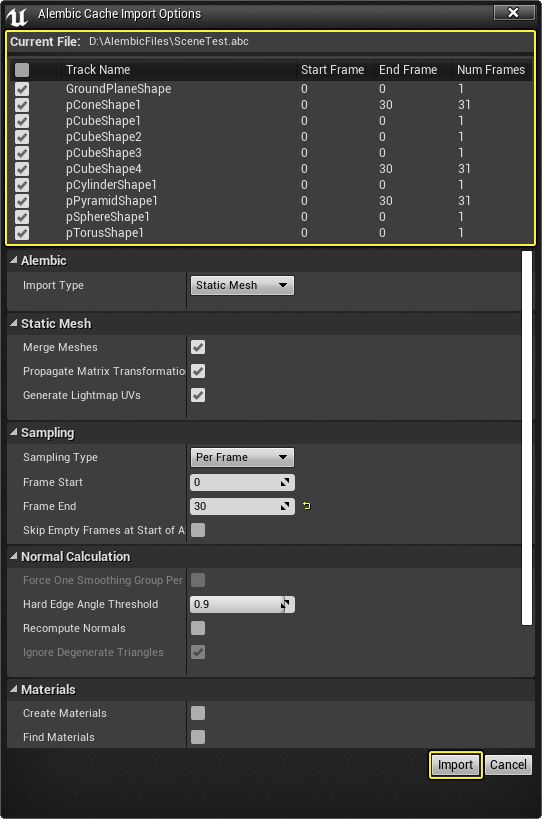
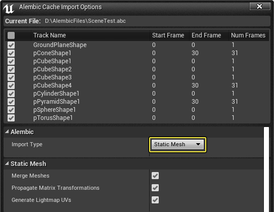
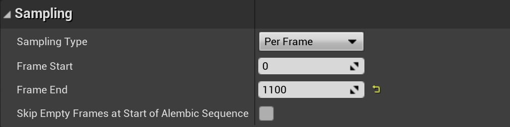
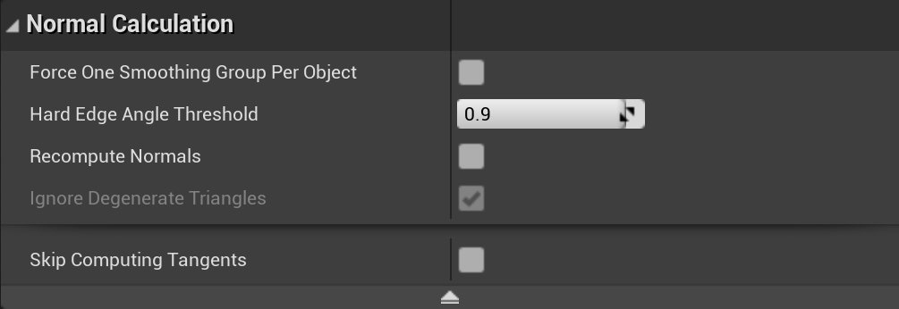
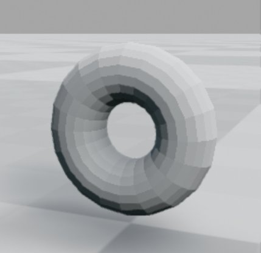
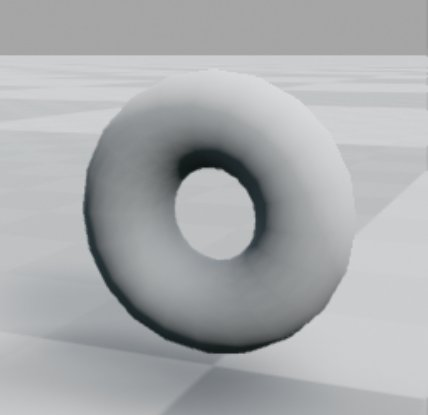
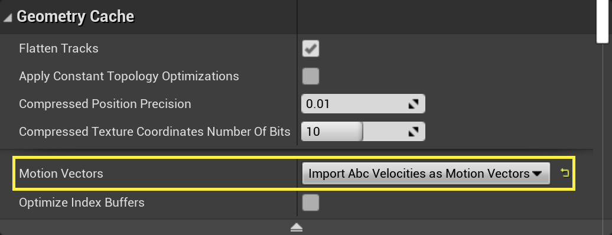

# Alembic文件导入器

> 路径：虚幻引擎5.7文档 / 管理内容 / Alembic文件导入器

> 原始页面：https://dev.epicgames.com/documentation/unreal-engine/alembic-file-importer-in-unreal-engine

Alembic文件格式(.abc)是一个开放的计算机图形交换框架，它将复杂的动画化场景浓缩成一组非过程式的、与应用程序无关的烘焙几何结果。虚幻引擎4(UE4)允许你通过 **Alembic导入器** 导入你的Alembic文件，这让你可以在外部自由地创建复杂的动画，然后把它们导入UE4并实时渲染它们。

导入Alembic文件的方式类似于其他几种[导入内容](../index.md)到UE4的形式。

你还可以观看动画主题的虚幻引擎实时流送，其中包括Alembic文件导入器：

## 导出Alembic缓存

如需从Autodesk Maya导出Alembic缓存：

1. 在 **文件菜单（File Menu）** 中，在 **缓存（Cache）** 和 **Alembic缓存（Alembic Cache）** 下，根据需要选择 **全部导出到Alembic...（Export All to Alembic...）**（或 **选择（Selection）**）。
2. 在 **导出（Export）** 窗口中，在 **高级选项（Advanced Options）** 下，启用 **UV写入（UV Write）** 和 **写入面集（Write Face Sets）** 选项，然后单击 **导出（Export）**。

   如果打算在导入虚幻引擎4的过程中创建材质，你需要启用 **写入面集（Write Face Sets）**，因为材质是基于找到的面集名称创建的。

## 导入Alembic文件

要将Alembic文件导入到虚幻引擎4，请执行以下操作：

1. 在 **内容浏览器（Content Browser）** 内，单击 **导入（Import）** 按钮并指向你的 **.abc** 文件。 AlembicImport_00.png
2. 在 **Alembic缓存导入选项（Alembic Cache Import Options）** 窗口中，你可以定义用于导入的方法/设置。此处还会显示导入文件的名称和位置，并列出文件中的资产。你可以通过资产旁的复选框来选择是否导入它们（顶部的复选框能让你批量选择要导入的资产）。

   

> [!WARNING]
> 当前，虚幻引擎只支持包含三边和四边的网格体。如果几何体中的多边形边数超过四，或者几何体由NURBS或SubDiv面构成，则Alembic数据会无法导入。

## 导入为静态网格体

在导入过程中，可以定义如何导入内容。默认情况下，**Alembic导入类型（Alembic Import Type）** 设置为 **静态网格体（Static Mesh）**。

将Alembic缓存作为 **静态网格体（Static Mesh）** 导入时，只会将第一帧（由 **采样** 分段中的 **开始帧（Frame Start）** 表示）导入为一个或多个静态网格体。取自该帧的Alembic动画将作为静态网格体资产导入（不包含动画）。以下设置也可用：

### 静态网格体选项

| 设置 | 说明 |
| --- | --- |
| **合并网格体（Merge Meshes）** | 是否在导入时合并静态网格体（这可能会导致重叠UV集出现问题）。 |
| **传播矩阵变换（Propagate Matrix Transformations）** | 在合并网格体之前是否对它们应用矩阵变换（参见"沿用矩阵变换"一文）。 |
| **生成光照贴图UV（Generate Lightmap UVs）** | 启用它来生成[光照贴图UV](../static-meshes/understanding-lightmapping/index.md)。 |

将Alembic文件作为静态网格体导入时，如果你的数据包含多个网格体，你可以选择 **合并网格体（Merge Meshes）** 以将网格体合并到虚幻引擎中的单个静态网格体中。如果禁用此选项，Alembic文件中的每个网格体将作为单独的静态网格体导入UE4，而不是连接在一起。

### 沿用矩阵变换

启用 **合并网格体（Merge Meshes）** 时要考虑的另一件事是，在合并网格体之前是否 **传播矩阵变换（Propagate Matrix Transformations）**。这将获取包含在Alembic文件中的变换数据，并在合并时将其传播到网格体，使它们保留其变换数据。

考虑下面创建的示例场景，我们将其作为Alembic缓存导出。

当我们用 **合并网格体（Merge Meshes）** 和 **传播矩阵变换（Propagate Matrix Transformations）** 将文件作为静态网格体导入UE4时，我们得到以下结果：

如果我们 **合并网格体（Merge Meshes）**，但不选中 **传播矩阵变换（Propagate Matrix Transformations）**，我们得到以下结果：

每个网格体在原点0,0,0处合并。

### 采样选项

| 设置 | 说明 |
| --- | --- |
| **采样类型（Sampling Type）** | 导入动画时执行的采样类型。 **逐帧（Per Frame，默认）**：根据导入的数据（默认选项）对动画进行采样。 **每X帧（Per X Frames）**：按帧步长确定的给定间隔对动画进行采样。 **逐渐时间步长（Per Time Step）**：按时间步长决定的给定间隔对动画进行采样。\| |
| **帧起始（Frame Start）** | 开始对动画进行采样的开始索引。 |
| **帧结束（Frame End）** | 停止对动画进行采样的结束索引。 |
| **在Alembic序列开始时跳过空帧（Skip Empty Frames at Start of Alembic Sequence）** | 跳过空白帧（不包含几何数据的预热帧），从实际包含数据的帧开始导入 |

### 法线计算选项

| 设置 | 说明 |
| --- | --- |
| **每个对象强制一个平滑组（Force One Smoothing Group Per Object）** | 是否强行平滑每个单独对象的法线，而不计算平滑组。 |
| **硬边角度阈值（Hard Edge Angle Threshold）** | 确定两条法线之间的角度是否应该被视为硬角的阈值（越接近于0意味着越平滑）。 |
| **重新计算法线（Recompute Normals）** | 确定是否应该强制重新计算法线。 |
| **无视退化三角形（Ignore Degenerate Triangles）** | 确定计算切线/法线时是否应无视退化三角形。 |

##### 如何计算法线

下面简要介绍如何基于 **导入类型（Import type）** 计算法线，以及如何在要导入的文件中使用法线。

- 当导入一个包含所有帧法线的文件时（When importing a file that contains normals for all frames）：

  - **对于静态网格体/几何体缓存（For Static Meshes / Geometry Cache）**：引擎使用现有法线。
  - **对于骨架网格体（For Skeletal Meshes）** - 第一帧的法线用于确定平滑组，它将用于计算平均帧和所有基础和变换目标的法线（我们在所有情况下都这样做）。
- 当导入只包含第一帧法线的文件时（When importing a file that contains normals for only the first frames）：

  - **对于静态网格体（For Static Meshes）**：如果使用帧0，则我们使用现有的法线。否则，我们为请求的帧计算平滑组和法线。
  - **对于几何体缓存（For Geometry Cache）**：我们计算所有帧的平滑组和产生的法线。
- 当导入一个不包含法线的文件时（When importing a file that contains no normals）：

  - 引擎会计算非平滑法线，根据计算法线生成平滑组，并用平滑组重新计算法线。

启用 **重新计算法线（Recompute Normals）** 时，使用上述指定路径（对于无法线的情况）。

> [!WARNING]
> 当导入为 **骨架网格体（Skeletal Mesh）** 时，如果你的动画有较大的法线增量，你可能会在获得正确外观法线上遇到问题。这是一个因变换目标改变面/顶点法线的方式而导致的已知问题。作为一种变通方法，你可以使用（实验性的）皮肤缓存功能来绕过这个问题。
>
> 你可以使用 **支持计算皮肤缓存（Support Compute Skincache）** 和 **强制所有蒙皮网格体重新计算切线（Force all skinned meshes to recompute tangents）** 在 **项目设置（Project Settings）** 中启用此功能。
>
> 这将在你下次启动编辑器时重新编译着色器。当你打开骨架网格体资源，你应该能够为每个材质/分段勾选 **重新计算切线（Recompute Tangent）** 选项。

##### 如何计算平滑组

如果你正在导入的网格体上获得硬边，你可能想要查看 **硬边角度阈值（Hard Edge Angle Threshold）** 以及如何执行平滑组计算。

1.0 Hard Edge Angle

0.0 Hard Edge Angle

要计算平滑组，首先计算顶点/面法线，然后使用这些法线来查看所有与特定面连接的面。通过计算法线之间的角度，我们可以确定边缘是硬边还是软边（类似于Maya中的软/硬边工具）。下面左边的图像我们认为是软边，而右边的图像是硬边。这是因为左边图像中两条法线的夹角小于右边图像中两条法线的夹角。

知道了这一点，我们使用点乘积来生成0到1之间的范围作为阈值来定义何时应该是硬边，何时应该是软边。例如，越接近1的值表示角度越大，导致硬边，而越接近0则意味着是软边。然后使用这些信息生成共享软边的法线组。对于这些组，我们平滑这些面上的法线，创建平滑的面。

> [!NOTE]
> 强制每个对象一个平滑组将使每个单独的对象完全平滑（所有都是软边）。

## 导入为几何体缓存

当导入为 **几何体缓存（Geometry Cache）** 时，会创建一种新类型的动画资源，允许回放顶点不同的序列。

导入的Alembic动画将作为Flipbook序列帧播放，其性能表现会随网格体的复杂性而变化。

几何体缓存和 **静态网格体（Static Mesh）** 导入时的选项一样，都包含 **采样（Sampling）** 和 **法线计算（Normal Calculation）** 选项，但额外增加了争对材质和运动向量的支持。此种导入方法能够根据找到的 **面集（Face Set）** 名称来创建 **材质（Materials）** （如果没有在外部应用程序中定义，并随Alembic缓存一同导出的面集（Face Set），此方法无效）。你可以在导入器的"几何体缓存"分类中更改 **运动向量（Motion Vectors）** 选项，以此启用运动向量。

*点击"几何体缓存"底部的向下箭头来查看这些选项。*

| 设置 | 说明 |
| --- | --- |
| **无运动向量（No Motion Vectors）** | 几何体缓存中无运动向量。默认为该选项。 选择此选项会导致缺失运动模糊。 |
| **将Abc速度导入为运动向量（Import Abc Velocities as Motion Vectors）** | 从Alembic文件中导入速度信息并将其转换为运动向量。将运动向量保存在磁盘上会增加文件尺寸。 如果几何体缓存包含的拓扑结构会发生变化（顶点数量在动画期间发生变化），请确保从你的3D应用中导出顶点速度并使用此选项。 |
| **导入期间计算运动向量（Calculate Motion Vectors During Import）** | 强制导入期间计算运动向量。将运动向量保存在磁盘上会增加文件尺寸。 如果几何体缓存包含的拓扑结构不会发生变化（顶点数量在动画期间发生变化），请使用此选项。 |

包含运动向量，以便计算模型的顶点速度并使用它们来计算运动模糊。

> [!NOTE]
> 目前，几何体缓存资源不支持曲面细分设置所需的邻接缓冲区。作为一种变通方法，你可以使用变换目标将动画导入为 **骨架网格体（Skeletal Mesh）**（这是一种压缩程度更高的导入方式），因为这将支持曲面细分。

## 导入为骨架

该方法将Alembic文件导入为 **骨架网格体（Skeletal Mesh）**，其中包含基础姿势作为变换目标，并混合它们以实现正确的动画帧。只要顶点数不变，导入为骨架网格体是播放Alembic动画的最有效方法。

在导入过程中，将使用主成分分析(PCA)方案对你的动画序列进行压缩，在该方案中，提取常见姿势（基础）并对其进行加权，以便在播放期间组成原始动画。当导入为骨架网格体时，除了 **采样（Sampling）**、**法线计算（Normal Calculation）** 和 **创建材质（Create Materials）** 选项，你还可以定义百分比（或使用的固定基数）来调整压缩级别。

### 压缩选项

| 选项 | 说明 |
| --- | --- |
| **合并网格体（Merge Meshes）** | 启用此选项以便合并网格体，从而压缩数据。 |
| **烘焙矩阵动画（Bake Matrix Animation）** | 启用此选项以便将纯矩阵动画（Matrix-only animation）烘焙成顶点动画。 |
| **基础计算类型（Base Calculation Type）** | 确定如何计算存储为变换目标的最终基数。 **基于百分比（Percentage Based，默认选项）**：确定应与给定百分比（默认选项）一起使用的基数数量。 **固定数量（Fixed Number）**：设置要导入的固定基数数量。 |
| **总基数的百分比（最大数量）（Percentage (Max Number) of Total Bases）** | 生成给定（百分比或固定数量）的基数作为变换目标。 这对压缩级别来说是一个比较重要的方面。输入较小的基数将使动画压缩程度更高，但精细的动画细节可能会丢失。相反，输入较大的基数会降低压缩程度，但会保留更多的动画细节。 |
| **顶点影响最小百分比数（Minimum Number Of Vertex Influence Percentage）** | 设置使变换目标生效所需的受影响顶点的最小百分比。 此设置允许你确定何时导入基础/变换目标（根据定义的影响百分比）。例如，如果我们有一个有1000个顶点的模型，其中一个基础目标只影响10个顶点。如果我们将该值设置为10，前面提到的基础/变换目标将不会被导入。 |

> [!WARNING]
> 假如动画的大量顶点会从原点位移，可能会导致骨架网格体发生变形。你可以将"基础计算类型（Base Calculation Type）"设置为"无压缩（No Compression）"并启用"合并网格体（Merge Meshes）"来缓解这一问题。
