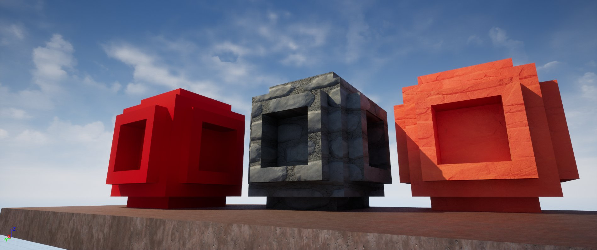
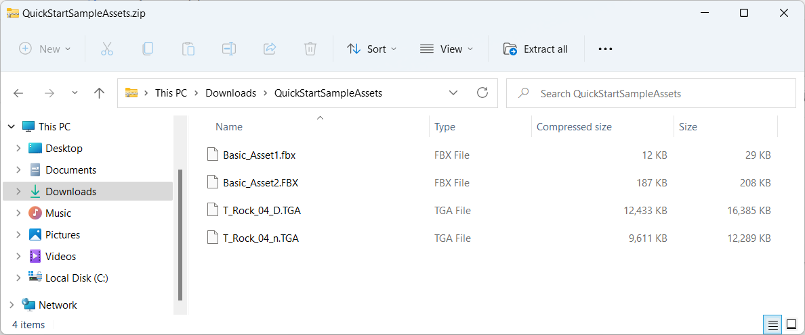
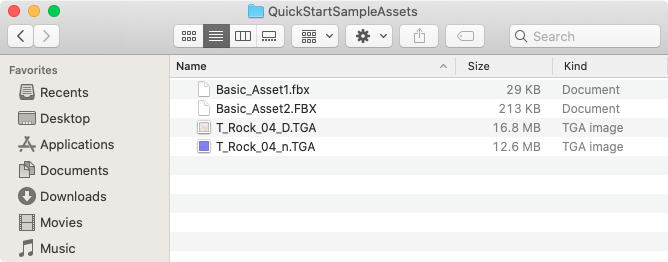
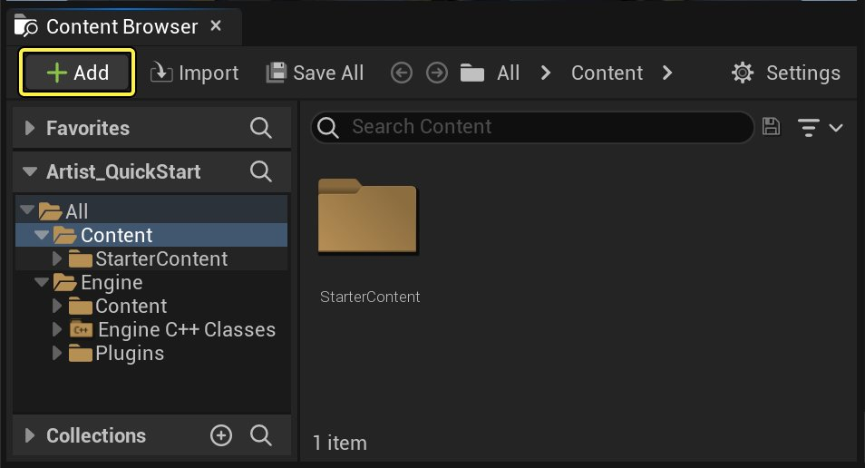
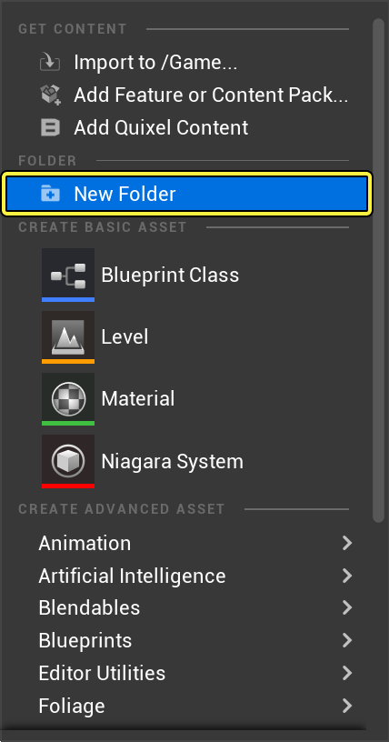
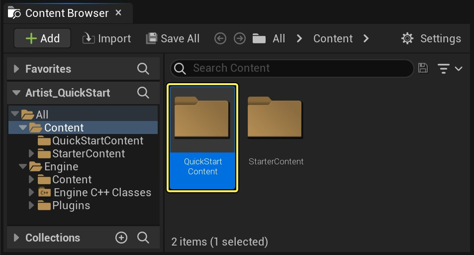
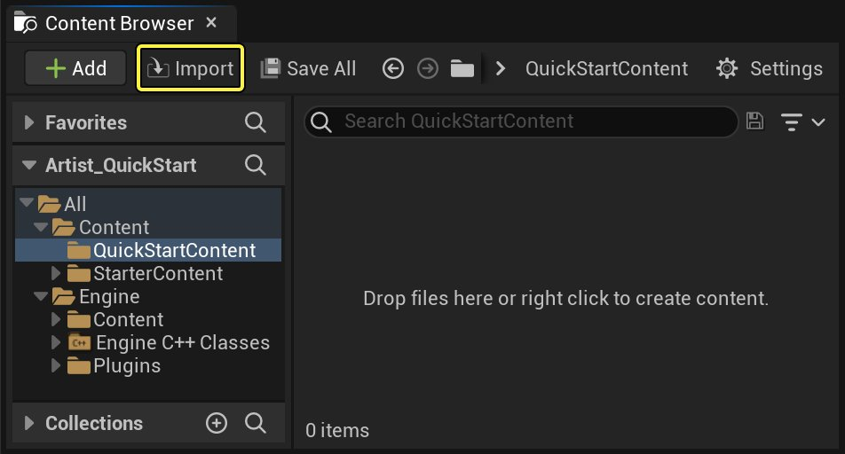
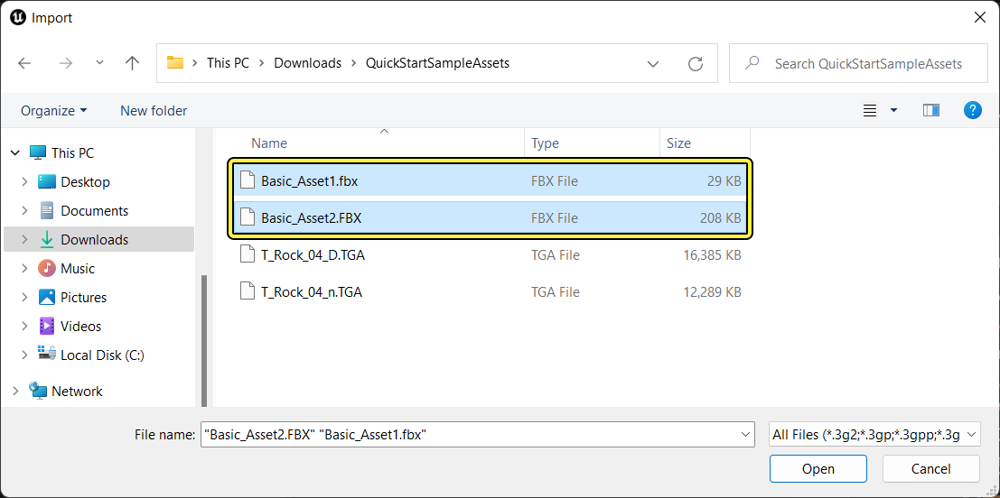

# 美术师快速入门

> 路径：虚幻引擎5.7文档 / 管理内容 / 美术师快速入门

> 原始页面：https://dev.epicgames.com/documentation/unreal-engine/artist-quick-start-in-unreal-engine

选择操作系统：

Windows

macOS

Linux

点击查看大图。

本快速入门指南展示如何将资产添加到 **虚幻引擎（UE5）** 游戏中。在学习完本指南后，你将会了解如何使用 **项目浏览器（Project Browser）** 创建新项目，以及如何通过浏览 **内容浏览器（Content Browser）** 查找和添加内容。你还会学习如何查找 **FBX内容通道（FBX Content Pipeline）** 相关信息，以及如何在将 **材质（Materials）** 应用到 **静态网格物体Actor（Static Mesh Actor）** 之前，使用 **材质编辑器（Material Editor）** 修改 **材质（Materials）**。

## 1. 必要的项目设置

1. 从启动器打开 **虚幻引擎（Unreal Engine）**。
2. 点击

   游戏（Game）

   >

   空白（Blank）

   模板并使用以下设置新建项目：

   - 选择

     C++
   - 选择

     含初学者内容包（With Starter Content）
3. 我们需要输入一个项目名称，这里我们输入"Artist_QuickStart"。
4. 现在点击

   创建项目（Create Project）

   ，项目此时会开始创建。

**虚幻编辑器（Unreal Editor）** 现在会打开我们的新项目。**Visual Studio** 会同时打开并加载项目创建的解决方案文件。

## 2. 创建文件夹

保持项目内容有条不紊始终是一种良好的做法。你首先要学习的是如何创建一个文件夹来存储导入的内容。

> [!NOTE]
> 在开始之前：请从以下链接下载快速入门资产（Quick Start Assets）。
>
> - 示例资产

1. 将下载的资产解压缩到计算机上的某个位置。

   

   点击查看大图。

   

   点击查看大图。
2. 从编辑器内的 **内容浏览器（Content Browser）** 中，单击 **新增（Add New）** 按钮。

   

   点击查看大图。
3. 选择 **新建文件夹（New Folder）**，创建一个新文件夹。

   

   点击查看大图。
4. 将该文件夹命名为 **QuickStartContent**。

   

   点击查看大图。
5. 双击该 **QuickStartContent** 文件夹。

> [!TIP]
> *命名规范很重要！命名文件夹和文件时请遵循这些规范。*

## 3. 导入网格体

将内容添加到UE5项目的方法有几种；但我们将着重介绍内容浏览器的 **导入（Import）** 功能。

1. 在 **QuickStartContent** 文件夹中单击内容浏览器的 **导入（Import）** 按钮打开文件对话框。

   

   点击查看大图。
2. 找到并选择 **Basic_Asset1** 和 **Basic_Asset2** FBX网格体文件。

   

   点击查看大图。

   > 图片已省略：Import Mesh Dialog Box Mac

   点击查看大图。
3. 单击 **打开（Open）** 开始将FBX网格体文件导入到你的项目中。
4. 编辑器中将显示 **FBX导入选项（FBX Import Options）** 对话框。单击 **导入（Import）** 或 **全部导入（Import All）** 会将你的网格体添加到项目。

   > 图片已省略：FBX Import Options Dialog Box

   点击查看大图。
5. 单击 **全部保存（Save All）** 按钮保存已导入的网格体。

   > 图片已省略：Save All Meshes Button

   点击查看大图。
6. 将显示 **保存内容（Save Content）** 对话框。单击 **保存选中项（Save Selected）** 保存导入的资产。

   > 图片已省略：Save Selected Dialog Box

   点击查看大图。
7. 导航到 **QuickStartContent** 文件夹，验证UE5创建了对应的 **.uasset文件（.uasset files）**。

   > 图片已省略：Quick Start Content Folder

   点击查看大图。

   > 图片已省略：Quick Start Content Folder Mac

   点击查看大图。

> [!TIP]
> *整理你的资产，以便轻松找到它们。*

## 4. 导入纹理

1. 在编辑器中导航到 **QuickStartContent** 文件夹，单击内容浏览器的 **导入（Import）** 按钮打开文件对话框。

   > 图片已省略：Content Browser Import Button

   点击查看大图。
2. 找到并选择 **T_Rock_04_D** 和 **T_Rock_04_n** Targa (TGA)图像文件。

   > 图片已省略：Import Texture Dialog Box

   点击查看大图。

   > 图片已省略：Import Texture Dialog Box Mac

   点击查看大图。
3. 单击 **打开（Open）** 开始将TGA图像文件导入项目。
4. 虚幻编辑器的右下角将出现一个确认框。

   > 图片已省略：Texture Normal Confirmation

   点击查看大图。
5. 单击 **确定（OK）** 接受 **T_Rock_04_n.TGA** 法线贴图的设置。
6. 单击 **全部保存（Save All）** 按钮保存导入的图像。

   > 图片已省略：Save All Textures

   点击查看大图。
7. 将显示 **保存内容（Save Content）** 对话框。
8. 单击 **保存选中项（Save Selected）** 保存导入的资产。
9. 导航到 **QuickStartContent** 文件夹，验证UE5创建了对应的 **.uasset文件（.uasset files）**。

   > 图片已省略：Quick Start Content Folder 2

   点击查看大图。

   > 图片已省略：Quick Start Content Folder 2 Mac

   点击查看大图。

> [!TIP]
> *虚幻商城（可从 **Epic启动器（Epic Launcher）** 访问）是搜索和分享内容的好去处。*

## 5. 准备网格体以供导入

> [!NOTE]
> 如果你有自己的网格体需要导入，请参阅此部分。

> [!WARNING]
> UE5 FBX导入通道使用 **FBX 2018**。在导出过程中使用不同的版本可能会导致不兼容。

选择3D美术工具

Autodesk Maya

Autodesk 3ds Max

1. 在视口中选择要导出的网格体。

   > 图片已省略：Maya Export

   点击查看大图。
2. 在 **文件（File）** 菜单中，选择 **导出当前选择（Export Selection）**（如果需要无视选择导出场景中的所有内容，则选择 **全部导出（Export All）**）。

   > 图片已省略：Maya Export

   点击查看大图。
3. 在

   导出（Export）

   对话框中：

   - 选择UE5项目中的

     内容（Content）

     文件夹（1）
   - 为文件输入一个名称并将其设为FBX导出（2）
   - 设置导出选项（3）
   - 单击

     全部导出（Export All）

     （4）

   > 图片已省略：Maya Export

   点击查看大图。

   *上述几何体类型中的设置是将 **静态网格体（Static Meshes）** 导出到虚幻引擎5的最基础要求。*

   *你可以使用默认的导入选项。请参阅[FBX导入选项参考](../fbx-content-pipeline/fbx-import-options-reference/index.md)，了解各个选项的详情。*
4. 你的资产现在已经导入，你可以将其从 **内容浏览器（Content Browser）** 拖放到你的关卡中。

   > 图片已省略：Asset into your Level

   点击查看大图。

   *上例中（作为导入选项的一部分）导入了 **材质（Materials）** 和 **纹理（Textures）**。*

1. 在视口中选择要导出的网格体。

   > 图片已省略：Export

   点击查看大图。
2. 在 **文件（File）** 菜单中，选择 **导出选定项（Export Selected）**（如果需要无视选择导出场景中的所有内容，则选择 **导出（Export）**）。

   > 图片已省略：Export Selected

   点击查看大图。
3. 选择UE5项目中的 **内容（Content）** 文件夹（1）和FBX文件的名称（2），然后单击Save Button按钮。

   > 图片已省略：Export Selected

   点击查看大图。
4. 在 **FBX导出（FBX Export）** 对话框中设置选项，然后单击按钮创建包含网格体的FBX文件。

   > 图片已省略：FBX Export dialog

   点击查看大图。

   *上述几何体类型中的设置是将 **静态网格体（Static Meshes）** 导出到虚幻引擎4的最基础要求。*
5. *你可以保留默认的导入选项。请参阅[FBX导入选项参考](../fbx-content-pipeline/fbx-import-options-reference/index.md)，了解各个选项的详情。*
6. 你的资产现在已经导入，你可以将其从 **内容浏览器（Content Browser）** 拖放到你的关卡中。

   > 图片已省略：Asset into your Level

   点击查看大图。

   *上例中（作为导入选项的一部分）导入了 **材质（Materials）** 和 **纹理（Textures）**。*

非常好！你已学会如何准备网格体以供导入UE4。

✓ [*如要了解有关FBX内容通道的更多信息，请单击此处。*](../fbx-content-pipeline/index.md)

> [!TIP]
> *简洁的建模能提高游戏性能。*

## 6. 创建材质

**材质（Materials）** 是应用于网格体的资产，有助于场景的视觉美感。 有数种方法可以为你的UE5项目创建和编辑材质；不过我们将重点介绍如何使用 **材质编辑器（Material Editor）**。

1. 导航至你的 **内容浏览器（Content Browser）**，单击 **新增（Add New）** 并选择 **材质（Material）**。

   > 图片已省略：New Create Material

   点击查看大图。
2. 将你的材质命名为 **Rock**。

   > 图片已省略：Material Naming

   点击查看大图。
3. 你的 **Rock材质** 现在即可使用。

   > 图片已省略：New Rock Material

   点击查看大图。
4. 双击 **"岩石"材质** 将打开[材质编辑器](../../designing-visuals-rendering-and-graphics/unreal-engine-materials/unreal-engine-material-editor-user-guide/index.md)。

   > 图片已省略：Material Editor

   点击查看大图。

   如果想要了解有关处理材质节点的更多信息，请阅读我们的[材质-教程](../../designing-visuals-rendering-and-graphics/unreal-engine-materials/unreal-engine-materials-tutorials/index.md)文档。

> [!TIP]
> *请使用2的幂调整纹理大小。*

## 7. 编辑材质

现在，你应该已经创建了一个新材质并打开了 **材质编辑器（Material Editor）**。

> 图片已省略：Material Editor

点击查看大图。

你可以在[材质编辑器](../../designing-visuals-rendering-and-graphics/unreal-engine-materials/unreal-engine-material-editor-user-guide/index.md)中定义材质的颜色、光泽、透明度等。现在你即可编辑你创建的 **Rock材质**。

1. 在 **材质图表（Material Graph）** 的中心选择 **主材质节点（Main Material Node）**。**材质编辑器（Material Editor）** 将在你选择节点时为你突出显示该节点。

   > 图片已省略：Main Material Node

   点击查看大图。

   *它是图表中唯一的节点（以你的材料命名）。*
2. 在 **详细信息（Details）** 面板中，将 **着色模型（Shading Model）** 从 **默认光照（Default Lit）** 更改为 **次表面（Subsurface）**。

   > 图片已省略：Select Subsurface

   点击查看大图。
3. **次表面着色模型（Subsurface Shading Model）** 在 **主材质节点（Main Material Node）** 中启用两个引脚：**不透明度（Opacity）** 和 **次表面颜色（Subsurface Color）**。

   > 图片已省略：New More Pins

   点击查看大图。
4. 把你的纹理放到图表中了。按住 **T** 键并在编辑器的图表区域内单击鼠标左键。**纹理样本节点（Texture Sample Node）** 应显示在图表中。

   > 图片已省略：Texture Sample

   点击查看大图。
5. 你至少需要2个纹理。重复步骤4，直至你的图表如下图所示。

   > 图片已省略：New Texture Sample Nodes

   点击查看大图。
6. 选择其中一个 **纹理样本节点（Texture Sample Nodes）** 并在 **详细信息面板（Details Panel）** 下找到 **材质表达式纹理基础（Material Expression Texture Base）** 类别。

   > 图片已省略：Material Expression Texture Base

   点击查看大图。

   在纹理属性下，单击标签为 **无** 的下拉菜单，并选择名为 **T_Rock_04_D** 的颜色纹理。

   > [!NOTE]
   > *你还可以通过在搜索字段中输入 **T_Rock_04_D** 来使用搜索字段查找纹理资产。*
7. 对其他 **纹理样本节点（Texture Sample Node）** 重复步骤6，确保选择名为 **T_Rock_04_n** 的法线图纹理。

   > 图片已省略：New Both Textures Selected

   点击查看大图。

   *材质图表应该类似于上图。*
8. 将 **T_Rock_04_D** 纹理样本的 **颜色引脚（白色）** 连接到岩石材料的 **基础颜色引脚**。

   > 图片已省略：New Connect Color Pin

   点击查看大图。

   *新连接的 **白色引脚** 包含纹理的颜色通道。*
9. 将 **T_Rock_04_n** 纹理样本的 **法线引脚（白色）** 连接到岩石材质的 **法线引脚**。

   > 图片已省略：New Connect Normal Pin

   点击查看大图。

   *新连接的 **白色引脚** 包含纹理的法线贴图的信息。*
10. **预览（Preview）** 应类似于下图。

    > 图片已省略：New Preview DN

    点击查看大图。
11. 按住 **1** 键并在 **图表面板（Graph Panel）** 中左键单击以创建三个（**3**）**常量（Constant）** 节点。

    > 图片已省略：Constants

    点击查看大图。

    ***常量节点** 是可修改的标量浮点变量。*
12. 按住 **3** 键，在图表面板中左键单击以创建一个（**1**）**Constant3Vector**。

    > 图片已省略：Constant 3

    点击查看大图。

    ***Constant3Vector** 节点是与颜色对应的可修改向量，没有alpha通道。*

    > [!NOTE]
    > 如果想要了解有关处理常量表达式的更多信息，请阅读我们的[常量表达式](../../designing-visuals-rendering-and-graphics/unreal-engine-materials/unreal-engine-material-expressions-reference/constant-material-expressions/index.md)文档。
13. 你的节点应该进行安排，以便轻松进行连接，避免导线交叉或相互滑动。

    > 图片已省略：New Mat Constants Added

    点击查看大图。
14. 将所有 **常量（Constant）** 和 **Constant3Vector** 节点连接到 **Rock材质主节点** 中的对应引脚。

    > 图片已省略：New All Nodes Connected NoVal

    点击查看大图。
15. 通过更新 **详细信息（Details）** 面板中的 **值（Value）** 参数，更改每个 **常量（Constant）** 和 **Constant3Vector** 的值。

    - 高光值（Specular Value）

      = 0.0
    - 粗糙度值（Roughness Value）

      = 0.8
    - 不透明度值（Opacity Value）

      = 0.95
    - 次表面颜色（Subsurface Color）

      = 红色（1,0,0）

    > 图片已省略：New All Connected All Adjusted

    点击查看大图。
16. **预览（Preview）** 应类似于下图。

    > 图片已省略：New Preview All

    点击查看大图。

    > [!WARNING]
    > 请确保在退出 **材质编辑器（Material Editor）** 之前保存你的材质。

你就快大功告成了！你刚刚使用 **材质编辑器（Material Editor）** 编辑了 **Rock材质**。

> [!TIP]
> *要找到所有材质编辑器键盘快捷键的列表，转到 **编辑菜单（Edit Menu）> 编辑器首选项（Editor Preferences）> 键盘快捷键（Keyboard Shortcuts）>"材质编辑器"和"材质编辑器生成的节点）"** 类别。*

## 8. 将材质应用于静态网格体Actor

现在，你已经准备好将一切组合在一起！

这一步的目标是将我们的 **材质（Material）** 应用到我们导入的静态网格体中。具体来说，你将学习如何：

- 设置Actor的默认材质
- 更改Actor使用的材质

### 设置Actor的默认材质

本节将向你展示如何设置 **静态网格体Actor的** 默认材质。每当你在关卡中放置一个 **Actor** 时，都将使用默认材质。

1. 在 **内容浏览器（Content Browser）** 中，双击你在本指南中早先导入的资产。

   > 图片已省略：undefined

   点击查看大图。

   [静态网格体编辑器](../static-meshes/static-mesh-editor-ui/index.md)将加载你的资产以供编辑。

   > 图片已省略：Static Mesh Editor

   点击查看大图。
2. 在 **详细信息（Details）** 面板的 **LOD0** 下，单击材质的下拉菜单。

   > 图片已省略：LOD 0

   点击查看大图。
3. 选择你早先创建的 **Rock材质**。该材质将出现在选择窗口中。

   > 图片已省略：Select Rock Material

   点击查看大图。

   你的 **预览窗格（Preview Pane）** 将更新以反映新应用的材质。

   > 图片已省略：New Default Material

   点击查看大图。
4. 先单击 **保存（Save）** 按钮，然后关闭 **材质编辑器（Material Editor）**。
5. 在 **内容浏览器（Content Browser）** 中，将新制作的 **静态网格体Actor（Static Mesh Actor）** 拖动到关卡中。

   > 图片已省略：New Material In Level

   点击查看大图。

   *当你将该资产放到关卡中时，将使用指定的 **材质**。*

### 更改Actor使用的材质

当我们将 **静态网格体** 对象放入关卡时，便创建了一个对象实例（[Actor](../../understanding-the-basics/actors-and-geometry/index.md)）。对于该 **Actor** 的每个实例，我们都可指定其 **材质（Material）**。

以下介绍如何更改静态网格体Actor的材质。

1. 选择你的 **静态网格体Actor（Static Mesh Actor）**。

   > 图片已省略：New Statis Mesh Selected

   点击查看大图。
2. 在 **详细信息（Details）** 面板中，找到 **材质（Materials）** 部分，并单击 **材质（Materials）** 下拉菜单。

   > 图片已省略：Material DropDown

   点击查看大图。
3. 在弹出菜单中，选择不同的材质。

   > 图片已省略：Select Tutorial Asset Material

   点击查看大图。
4. 或者，将新材质拖放到 **静态网格体Actor（Static Mesh Actor）** 上。

   > 图片已省略：New Material Drop

   点击查看大图。

你刚刚通过以下方式将材质应用到你的静态网格体Actor：

- 设置Actor的默认材质
- 更改Actor使用的材质

现在，我们即将学完《美术师快速入门指南》。到目前为止，你应该掌握了以下操作所需的技能：

✓ 设置项目 ✓ 创建材质 ✓ 编辑材质 ✓ 将材质应用于静态网格体Actor

你准备好独立地做一些练习了吗？

## 9. 看你的了！

利用所学知识，创建一个与以下图表类似的新 **材质**：

> 图片已省略：Plastic Material Network

点击查看大图。

Main Material节点设置模拟塑料材质。

将 **Basic_Asset1** 添加到关卡，对其应用材质，并应用"砖块"法线贴图纹理更新材质。

> 图片已省略：Normal Map Added

点击查看大图。

有关导入不同类型内容的更多信息，请参阅：

- 有关FBX通道（常规）的信息：

  FBX内容通道

  。
- 有关FBX骨架网格体通道的信息：

  FBX骨架网格体通道

  。
- 有关FBX动画通道的信息：

  FBX动画通道

  。
- 有关FBX变换目标通道的信息：

  FBX变换目标通道

  。
- 有关FBX材质通道的信息：

  FBX材质通道

  。
- 有关导入音频的信息：

  音频文件

  。

有关本快速入门指南包含的详细内容，请参阅：

- 有关支持的图像类型的信息：

  纹理导入指南

  。
- 有关材质的信息：

  材质

  。
- 有关内容浏览器的信息：

  内容浏览器

  。
- 有关静态网格体编辑器的信息：

  静态网格体编辑器UI

  。
