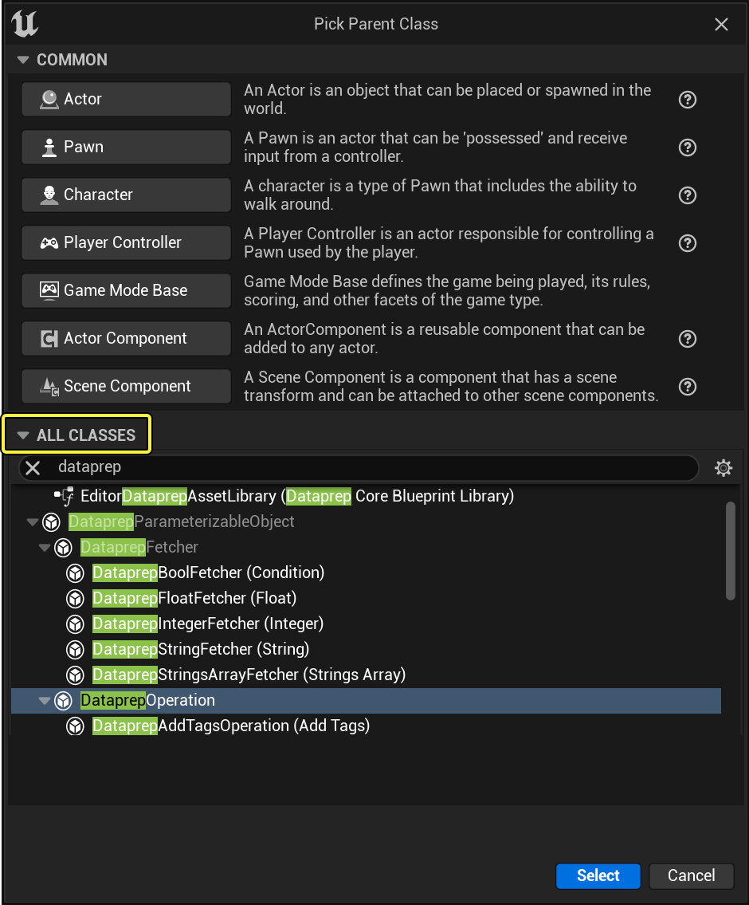
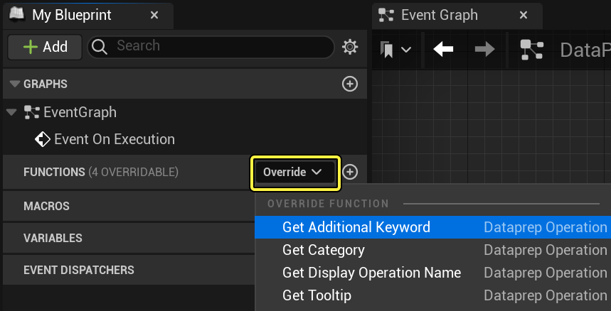
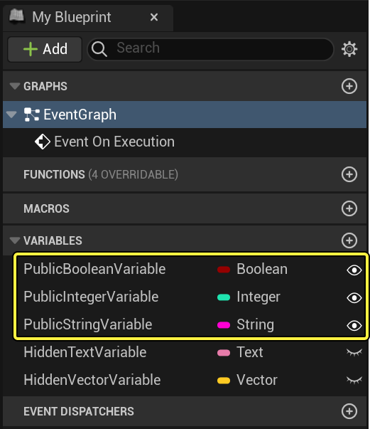
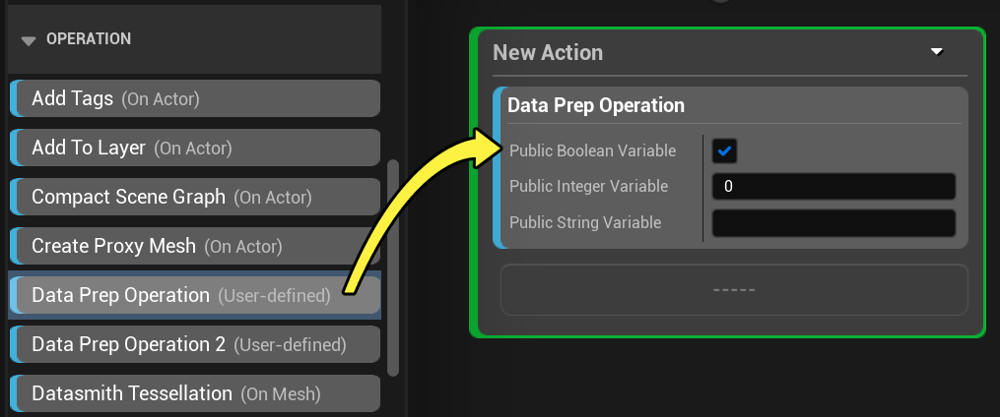
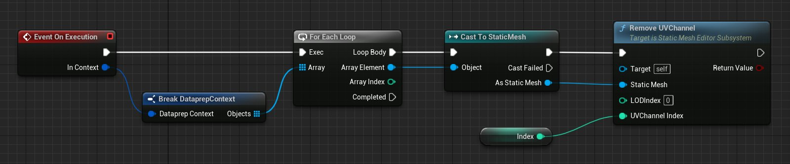
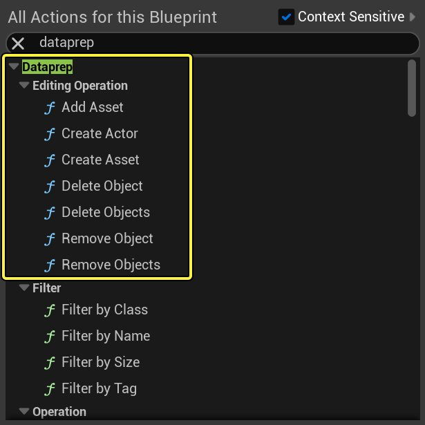
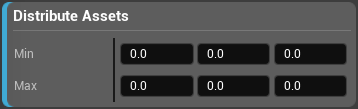
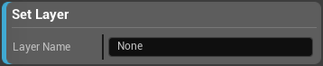

# 创建自定义Dataprep块

> 路径：虚幻引擎5.7文档 / 管理内容 / Datasmith / Dataprep导入自定义 / 创建自定义Dataprep块

> 原始页面：https://dev.epicgames.com/documentation/unreal-engine/creating-custom-dataprep-blocks-in-unreal-engine

[Visual Dataprep](../dataprep-overview/index.md)系统随附几十个预制筛选器和操作，可满足许多最常见的3D数据准备需求，以供实时可视化。但是，没有哪个预设的筛选器和操作列表会提供万全的功能来满足你需要执行的每个操作。如果你需要Dataprep图表执行虚幻编辑器的脚本系统中可用的操作，但所有预制Dataprep块都行不通，你可以创建自己的自定义筛选器或操作程序，执行你需要的确切事项。

本页面介绍了如何为你的Dataprep图表创建新筛选器和操作程序。

要在蓝图中使用Dataprep操作，请启用 **Dataprep编辑器（Dataprep Editor）** 插件。如需详细了解插件，请参阅[使用插件](../../../../understanding-the-basics/foundational-knowledge-in/working-with-plugins/index.md)。

## 如何创建自定义Dataprep块

总体过程对于所有不同类型的Dataprep块都相同。

1. 创建新蓝图类，方法是右键点击 **内容浏览器（Content Browser）** 并选择 **蓝图类（Blueprint Class）** 。详情请参阅[创建蓝图类](../../../../blueprints-visual-scripting/specialized-blueprint-visual-scripting-node-groups/types-of-blueprints/blueprint-class-assets/creating-blueprint-classes/index.md)。
2. 在 **选择父类（Pick Parent Class）** 对话框中，展开底部的 **所有类（All Classes）** 列表。选择对应于你想创建的块类型的基类，并点击 **选择（Select）** 。请参阅下面的[基类](#%E5%9F%BA%E7%B1%BB)表，了解你可以从中选择的Dataprep父类的列表。

   

   点击查看大图。
3. 根据需要在 **内容浏览器（Content Browser）** 中重命名你的新类。
4. 在蓝图编辑器中，双击打开你的新类。
5. 覆盖你的类从其父类继承的函数。通过覆盖函数，你可以自定义在执行图表时Dataprep块的行为。要覆盖函数，请将鼠标悬停在 **我的蓝图（My Blueprint）** 面板中的 **函数（Functions）** 类别上。点击显示的 **覆盖（Override）** 下拉菜单，然后选择你想覆盖的函数。

   
6. **编译（Compile）** 并 **保存（Save）** 蓝图类。

下次打开Dataprep资产时，你将看到新节点已添加到图形编辑器左侧的控制板中。

## 基础类

请将下述基类中的一种用作自定义Dataprep块的父类：

| 类 | 说明 |
| --- | --- |
| `DataprepBoolFetcher` | 若你要实现的过滤器只有在特定条件为真时才会选择对象，请使用此类。 |
| `DataprepFloatFetcher` | 若你实现的过滤器会基于浮点数字（即具有小数部分的数字）选择对象，请使用此类。 |
| `DataprepIntegerFetcher` | 若你要实现的过滤器会基于整数（即没有小数部分的整数）选择对象，请使用此类。 |
| `DataprepStringFetcher` | 若你要实现的过滤器会基于字符串属性选择对象，请使用此类。 |
| `DataprepOperation` | 若你要实现一个用于修改Actor或资产的操作，请使用此类。 |
| `DataprepEditingOperation` | 若你要实现的操作不仅会修改Actor或资产，还有可能添加或删除Actor和资产，请使用此类。 |

## 变量和设置

你在蓝图类中设置为公开可见的变量都会在Dataprep编辑器中作为可自定义的设置进行公开，并出现在所有属于该类型的块中。此机制能够让Dataprep图表的设计人员对函数运算的方式进行自定义。

举例而言，下图中的操作类就包含一些公开可见的变量，全部以睁眼图标表示：

在Dataprep图表中使用这种类型的块时，所有公开可见的变量都会转换为可自定义的设置：

请注意，在上面的示例中， **HiddenTextVariable** 和 **HiddenVectorVariable** 未公开为Dataprep块上的设置，因为它们在蓝图类中未标记为公共。另请注意，块中的设置遵循你为蓝图类中的变量设置的默认设置。

## 创建自定义过滤器

创建自定义过滤器时，你可覆盖以下任一或所有函数：

| 函数 | 说明 |
| --- | --- |
| `Fetch` | 当你执行Dataprep图表并处理这类过滤块时，图表会为当前情境中的每个对象调用此函数。 该函数会对传递给Fetch函数的对象进行评估，然后生成一条特定类型的信息，比如布尔值、整数、浮点数或字符串。过滤器节点负责执行逻辑，以判断返回信息是否满足图表设置中表达的逻辑条件：例如返回的整数大于还是小于用户在块中设置的值，返回的字符串是否匹配或包含在用户在块中设置的字符串中等等。 此函数还将返回一个布尔值，说明它是否成功为当前对象计算出输出值。若此布尔值中返回 `false` 值，则过滤器将排除当前对象。 |
| `Get Additional Keyword` | Dataprep编辑器调用此函数来获取此块的关键字列表。若用户在控制板顶部的搜索栏中输入的关键字属于函数返回的其中一个关键字，那么即便该块的名称中未出现用户输入的关键字，该块也会出现在编辑器的搜索匹配结果中。 |
| `Get Display Fetcher Name` | Dataprep编辑器调用此函数以获取此块在控制板中应该显示的名称。 |
| `Get Display Fetcher Name` | Dataprep编辑器调用此函数以获取所有此类块在实际Dataprep图表中应该显示的名称。 |
| `Get Tooltip Text` | Dataprep编辑器调用此函数，以获取用户将鼠标移到控制板中此块名称上或Dataprep图表中此类块上时，提示文本中应该显示的文本内容。 |

> [!NOTE]
> 必须覆盖 `Fetch` 函数才能使过滤器生效。其他函数为可选，但强烈建议你控制块在Dataprep编辑器控制板中的显示方式。

## 创建自定义操作

当你创建自定义操作时，可覆盖以下任一或所有函数：

| 函数 | 说明 |
| --- | --- |
| `Get Additional Keyword` | Dataprep编辑器调用此函数来获取此块的关键字列表。若用户在控制板顶部的搜索栏中输入的关键字属于函数返回的其中一个关键字，那么即便该块的名称中未出现用户输入的关键字，该块也会出现在编辑器的搜索匹配结果中。 |
| `Get Category` | Dataprep编辑器会调用此函数来决定此块位于控制板中的 **操作（Operations）** 列表的哪个分类下。 如果你不重写此函数，你的操作块会列在 **用户定义（User-defined）** 分类下。 |
| `Get Display Operation Name` | Dataprep编辑器调用此函数以获取此块在控制板中应该显示的名称，以及所有此类型块在实际Dataprep图表中应该显示的名称。 |
| `Get Tooltip` | Dataprep编辑器将调用此函数，以获取用户将鼠标移到控制板中此块名称上或Dataprep图表中此类块上时，提示文本中应该显示的内容。 |
| `On Execution` | 当你执行Dataprep图表并处理这类操作块时，图表会调用此函数以便修改导入的资产和Actor。通过在这个蓝图后添加更多节点，你可以针对操作中上个块传递给你的资产和Actor，对它们执行更多操作。 欲知图表的详细实现方式，请参见以下章节。 |

> [!NOTE]
> 你必须重写 `Event On Execution` 事件才能使操作生效。函数都是可选的，但强烈建议你控制块在Dataprep编辑器控制板中的显示方式。

### Dataprep情境

如果Dataprep系统在执行Dataprep图表时触发了操作块的 **执行时（On Execution）** 事件，它就会传入一个 *情境* 对象供你在蓝图图表中使用。这实际上是一张列表，包含了操作可修改的所有Actor和资产。若在Dataprep操作中，操作块位于过滤器块的上方，则此情境对象将包含导入到Dataprep世界中的所有资产和Actor。否则，情境对象所包含的Actor和资产，都是当前Dataprep操作中操作块上方的过滤器筛选后的结果。

你可以使用 **Break DataprepContext** 节点从情境中获取对象数组。然后，你可以修改情境中的所有对象，或者你可以缩小对象范围，让它们匹配特定类型的对象。

点击查看大图。

例如，上图中的操作只会修改静态网格体中的设置，而不会修改Dataprep情境中可能包含的其它对象（例如Actor、纹理资产或材质资产）。所以，它会遍历情境中的对象数组，然后尝试将每个对象都转换为静态网格体。然后只有当转换成功时才会进行修改。

### 操作和编辑操作

操作块有两个父类：`DataprepOperation` 和 `DataprepEditingOperation`。使用哪一个取决于你需要执行的编辑操作。若只需修改Dataprep情境中已包含的对象，则可将 `DataprepOperation` 用作父类。若需创建新对象（例如在内容浏览器中创建资产，在关卡中生成新的Actor或修改Dataprep情境中的对象列表），则必须将 `DataprepEditingOperation` 用作父类。

当你从 `DataprepEditingOperation` 派生出类时，可以在 **Dataprep>编辑操作（Editing Operations）** 类别下访问蓝图编辑器（Blueprint Editor）中的其他专用函数：

举例而言，可以使用 **添加资产（Add Asset）** 将资产添加到Dataprep情境中，以便将其包含在Dataprep情境中，进而传递给同一Dataprep操作中的其他块。

> [!WARNING]
> 正常情况下，应尽可能使用 **Dataprep>编辑操作（Editing Operations）** 类别中的函数执行操作，而不是使用其他拥有类似作用的节点。Dataprep系统中用于保管所有导入数据的临时场景十分独特；你只能通过这些函数来修改它。
>
> 举例而言，应始终使用 **Dataprep > Editing Operations > Create Actor** 节点生成新Actor，不要使用常规的 **Editor Scripting > Level Utility > Spawn Actor from Class** 或 **Spawn Actor from Object** 。

### 操作范例

#### 分配静态网格体Actor

在下图中， `On Execution` 事件会找到情境中的所有静态网格体Actor，然后以网格形式将它们重新分配到空间中。网格的最小值和最大值源自名为 **最小值（Min）** 和 **最大值（Max）** 的变量。它们都被标记为可公开编辑，因此会作为设置出现在Dataprep图表中的块中。但是， **Actor** 变量（用于在场景中存储静态网格体Actor数组）未标记为可编辑。因此，它不会出现在Dataprep图表中的块中。

#### 将对象添加到层

下图中的 `On Execution` 事件会在情境中寻找Actor，然后将其添加到编辑器中的指定层。

