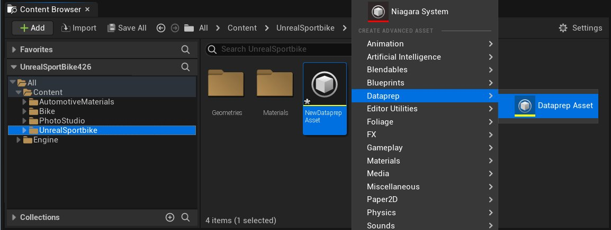
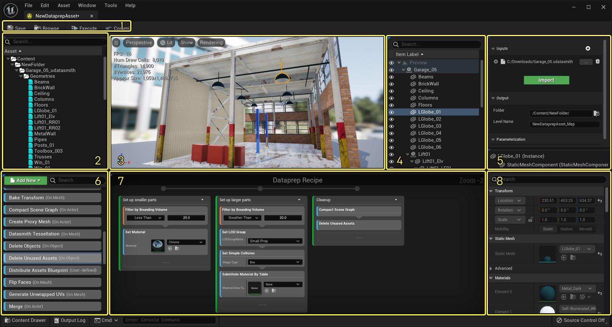
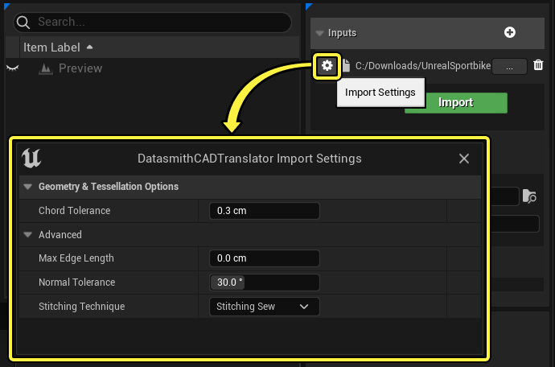
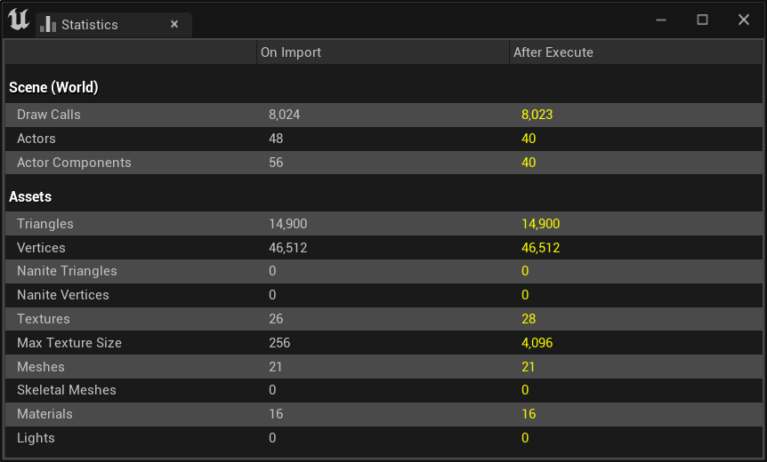
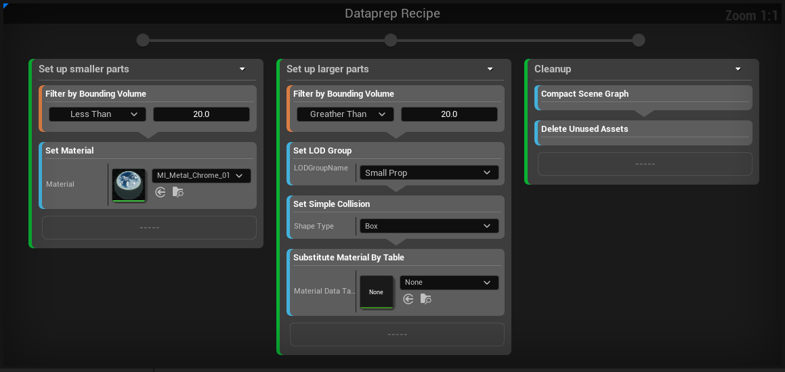
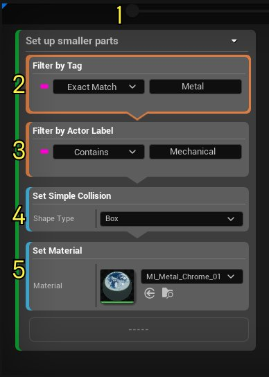
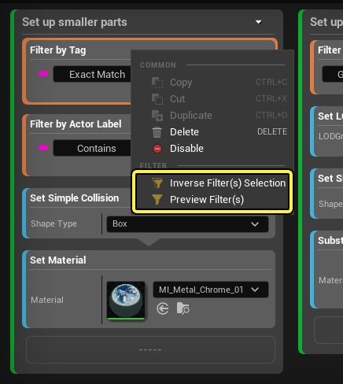
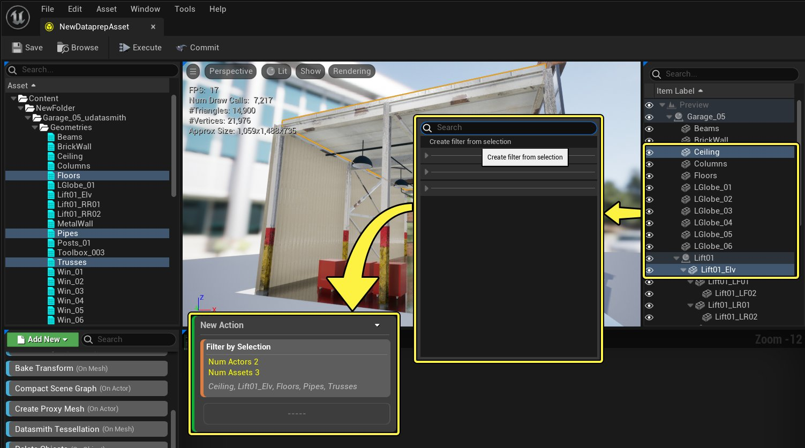

# Dataprep概述

> 路径：虚幻引擎5.7文档 / 管理内容 / Datasmith / Dataprep导入自定义 / Dataprep概述

> 原始页面：https://dev.epicgames.com/documentation/unreal-engine/dataprep-overview-in-unreal-engine

本页将对Visual Dataprep系统作简要介绍，带领你了解如何创建自定义导入方式，以便你为实时可视化项目筹备3D数据。

## 启用Visual Dataprep

请在项目中启用以下插件：

- DataPrep编辑器
- Datasmith导入器
- Dataprep几何体操作

  - 某些过滤器以及运算需要用到该插件。
- 若要从Datasmith支持的其他类型的源文件导入，可能需要启用其他导入器插件来支持这些文件类型。详见

  将Datasmith内容导入虚幻引擎

  。

参阅[使用插件](../../../../understanding-the-basics/foundational-knowledge-in/working-with-plugins/index.md)了解如何启用插件。

> [!TIP]
> 若从 **建筑、工程和施工（Architecture, Engineering, and Construction）** 或 **汽车、产品设计和制造（Automotive, Product Design, and Manufacturing）** 类别中的模板启动了项目，可能这些插件已启用。

## Visual Dataprep资产

Visual Dataprep系统基于一种名为 **Dataprep** 的新资产。此资产类似于蓝图，因为它能以可视化表现形式列出一系列步骤。但此Dataprep图表旨在转换从指定的一个或多个输入文件中读取的场景数据。

要创建新Dataprep资产，在内容浏览器中右键单击，从上下文菜单中选择 **Dataprep > Dataprep资产（Dataprep Asset）**。

点击查看大图

## Dataprep编辑器UI

类似于蓝图类，Dataprep资产有自己的专用编辑器窗口。在 **内容浏览器** 中双击任意Dataprep资产即可打开此窗口。

Dataprep编辑器UI分为数个面板，适用于[Dataprep工作流程](#dataprep%E5%B7%A5%E4%BD%9C%E6%B5%81%E7%A8%8B)的不同阶段。

点击查看大图

| 编号 | 名称 | 说明 |
| --- | --- | --- |
| 1 | **工具栏（Toolbar）** | Dataprep工作流中最重要用户操作的快捷方式，包括 **导入（Import）**、**执行（Execute）** 和 **提交（Commit）** 操作。 |
| 2 | **内容浏览器预览（Content Browser Preview）** | 列示已从输入文件中导入的所有资产。这是 **提交** 图表时，Visual Dataprep系统将在 **内容浏览器** 中创建的资产的预览。 |
| 3 | **视口预览（Viewport Preview）** | 显示已从输入文件中导入的3D场景的视觉预览。 |
| 4 | **大纲视图预览（Outliner Preview）** | 列示已从输入文件中导入的3D场景中的所有Actor。这是Visual Dataprep系统将在关卡中创建的Actor以及将在关卡的 **大纲视图（Outliner）** 中创建的场景层级的预览。 |
| 5 | **设置面板（Settings Panel）** | 使用此面板指定要从中导入3D场景的输入文件，以及在项目的 **内容浏览器** 中将资产创建在何处。 若你在Dataprep图表中公开了参数，以便在Dataprep的资产 *实例* 中重载，则你还将在 **参数化（Parameterization）** 分段中看到此处列出的参数。欲知细节，请参见[使用Dataprep实例](../working-with-dataprep-instances/index.md)。 |
| 6 | **控制板（Palette）** | 提供可拖动到Dataprep图表编辑器中的构建模块，用于构建导入方式。 |
| 7 | **Dataprep图表编辑器（Dataprep Graph Editor）** | 可在其中制备Dataprep方法，并让Dataprep系统从左到右执行方法的步骤，以制作输入内容，在虚幻引擎中实现实时可视化。 |
| 8 | **细节面板（Details Panel）** | 类似于主关卡编辑器的 **细节（Details）** 面板，显示 **大纲视图预览（Outliner Preview）** 中已选定的任何Actor的相关信息。请注意，这些设置只读。这些设置仅供参考，便于评估Dataprep图表对Actor的效果。 |

## Dataprep工作流程

设置Visual Dataprep资产的典型工作流包括以下步骤：

1. **指定输入文件**：在右上角的 **设置面板（Settings Panel）** 中，为要导入的每个文件或每个输入文件文件夹创建一个新的输入内容制作者。点击齿轮图标来配置其他几何体以及曲面细分选项，例如 Click the gear icon to configure additional geometry and tessellation options, such as **弧弦差（Chord Tolerance）** 和 **拼接技术（Stitching Technique）**。

   

   点击查看大图

   你还可以自定义以下 **输出** 设置：

   - 文件夹（Folder）

     可确定文件夹的名称，此文件夹将在项目的

     内容浏览器（Content Browser）

     中创建，用于保存导入的资产。默认情况下，Datasmith会根据类型将资产分配到该文件夹的子文件夹中：一个用于静态网格体资产，一个用于材质，一个用于纹理，等等。（在构建Dataprep图表时，可使用

     输出到文件夹（Output to Folder）

     操作重载此默认分布。）
   - 关卡名称（Level Name）

     用于设置新建的关卡资产的名称，该关卡将用于保存你的场景。提交Dataprep图表的结果后，可添加子关卡将导入的场景添加到项目关卡中。
2. **初步导入**：按工具栏中的 **导入（Import）** 按钮将源文件导入临时世界。

   你会看到，3D视口和其他预览面板在读取你的文件内容后，其显示内容会发生更新。这些读取内容尚未添加到项目中，只存在于Dataprep编辑器中的临时世界内。因此，在将最终结果保存到项目之前，你仍可以修改从输入文件中读取的资产和场景层级。

   > [!NOTE]
   > 此步骤在技术层面上是可选的，它的作用是让你在构建Dataprep图表时能更轻松地评估图表效果。
3. **构建Dataprep图表**：从控制板中将 **Select By** 和 **Operations** 节点拖动到Dataprep图表编辑器中，并按执行顺序连接Action节点。见下文的[Dataprep图表](#dataprep%E5%9B%BE%E8%A1%A8)。
4. **测试图表**：按工具栏中的 **执行（Execute）** 按钮，通过已构建的Dataprep图表运行从源文件中导入的数据。将看到预览面板更新并显示结果。

   > [!TIP]
   > 你可以右键点击名称，并选择 **禁用（Disable）** 选项，从而禁用单个区块（block）或Action节点，以便进行调试。禁用的区块或动作会在图表中呈灰色状态。你可以通过再次打开菜单并点击 **启用（Enable）** 选项来启用它们。
5. **提交**：根据从输入文件导入的3D数据制作图表，若效果令人满意，按工具栏中的 **提交（Commit）** 按钮完成导入流程。

   提交结果时，Visual Dataprep系统将 **内容浏览器预览（Content Browser Preview）** 中的资产保存到项目中的资产中。系统还将修改当前打开的关卡，添加 **大纲视图预览（Outliner Preview）** 中显示的Actor的层级。

   > [!TIP]
   > 若选择将Actor层级导入新关卡，在 **设置（Settings）** 面板中的 **子关卡（Sub-Level）** 设置中设置该关卡的名称。Visual Dataprep系统将用此名称新建一个关卡（若尚未存在），将Actor添加到该关卡，然后将该关卡添加为虚幻编辑器主窗口中当前已打开关卡的子关卡。

## 统计数据面板

在Visual Dataprep资产编辑器的主菜单中打开 **统计数据（Statistics）** 面板：**窗口（Window） > 统计数据（Statistics）**。该面板会用一些基本指标来展示执行Dataprep Graph前后的变化，比如绘制调用、Actor数量、顶点数量总和。

点击查看大图

## Dataprep图表

每个Dataprep资产的核心都是Dataprep图表：系统将对指定的任意一组输入文件执行的操作集合。

点击查看大图。

每个Dataprep图表都由名为 **Action** 节点的构建块（块的垂直堆栈）组成。例如，上面的图表包含三个Action节点。执行该Dataprep图表时，从左侧 **Start** 节点开始，然后从左到右依次执行各个Action节点。

你可以水平拖动Action的边框，调整其大小，以便阅读完整信息。

> [!NOTE]
> 与蓝图图表不同的是，蓝图图表允许条件分支，而Dataprep图表始终按照从左到右的单一线性方式执行逻辑。此外，彼此相连的Action节点并不会传递数据流。所有Action节点都使用相同的上下文：从指定输入文件导入的一组资产和Actor。

每个Action节点都由包含一个或多个块的堆栈构成。Dataprep图表执行Action节点时，从上到下处理Action节点中的各个块。

创建Action时，只需将左侧控制板的方块拖入图表编辑器，或者右键点击编辑器，然后在上下文菜单中选择。

你可以将多个Action组合在一起。方法：

1. 框选要组合的Action。点击并选择你要组合的Action。
2. 右键点击该组合。
3. 在上下文菜单中选择

   组合Action（Group Actions）

   。

你可以右键点击组合，在上下文菜单中选择 **禁用Action组（Disable Action Group）** 来禁用该组中的所有Action。

如需取消分组，请右键点击组合，选择 **取消组合Action（Ungroup Actions）**。

### 操作、过滤器和变换

在Dataprep中，Action节点有三种基本类型的块。

- **操作（Operations）** 会按照某种预先定义的方式对资产或Actor执行修改。例如，上面所示的 **Set Material**、**Compact Scene Graph** 和 **Set Simple Collision** 块都是不同的操作类型。

  欲了解可在Dataprep图表中使用的所有不同操作，参见[Dataprep操作参考](../dataprep-operation-reference/index.md)。
- **过滤器（Filters）**，也称 **Select By** 块，用于确定当前Action块中的操作应修改其下的哪些资产和Actor。任何Action步骤默认应用于根据输入文件构建的临时世界中包含的所有资产和Actor。可使用这些 **Filter** 块定义这些资产和Actor的子集，从而控制Actor节点将修改的对象。

  欲了解可在Dataprep图表中使用的所有不同选择过滤器，参见[Dataprep选项参考](../dataprep-selection-reference/index.md)。
- **变换（Transforms）** 的作用是调整当前资产和Actor的选中范围，而且其调整方式可能会很复杂。它们与过滤器非常类似。但是，过滤器块只能缩小传递给它的对象列表的范围。相反，变换块可将对象添加到当前的选择中。

  举例而言，你可能希望从场景层级中选择特定的对象树。为此，可使用过滤器块将整套场景元素缩减到少数特定父元素，然后使用变换块重新扩展选择范围，纳入所选元素的子项。

  欲知可用于扩展或修改操作中选定对象集的所有不同变换的细节，请参阅[Dataprep选项变换参考](../dataprep-selection-transform-reference/index.md)。

### Action示例

下图中的Action在CAD程序集部件上设置新材质。此节点执行一系列步骤，通过过滤器和操作的堆栈从上到下处理数据。

点击查看大图

| 步骤编号 | 名称 | 块类型 | 说明 |
| --- | --- | --- | --- |
| 1 | **输入引脚** | N/A | 所有Action的所有数据都是从临时世界获取的，包括在导入文件中找到的所有资产和Actor，然后Action会将这些对象传递给位于堆栈顶部的块。 |
| 2 | **按标签过滤** | 过滤器 | 此过滤器仅保留拥有"Metal"标签的Actor，并将此Actor列表传递给下一个块。 |
| 3 | **按Actor标签过滤** | 过滤器 | 此过滤器仅保留名称包含"Mechanical"的Actor，并传递给下一个块。 |
| 4 | **设置简单碰撞** | 运算 | 此运算会找到上方过滤器传递的所有Actor，然后找到这些Actor引用的所有静态网格体资产并为其设置立方体碰撞。然后将Actor列表传递给下一个块。 |
| 5 | **设置材质** | 运算 | 最后一个运算，它会找到上方过滤器传递的所有Actor，然后找到这些Actor的所有静态网格体组件的所有材质，并将这些材质替换成块的 **材质（Material）** 设置中指定的材质。 |

该操作中的所有块都执行完毕后，图表会执行下一个操作。等下个操作开始后，它会再次从临时世界中收集所有数据。所以之前放置的过滤器块都不会再被纳入考虑。但先前操作所做的场景更改会保留到下个操作中，例如更改材质、删除Actor等。

## 使用过滤器

所有过滤器块都提供一些额外选项，能让你在使用块操作资产和Actor时，更加轻松、精确地筛选出你所要的资产和资产列表，并验证过滤器是否符合预期效果。

要访问此类选项，请右键点击过滤器块，然后在情境菜单中查找 **过滤器（Filter）** 部分。

点击查看大图

若要改变多个过滤器块，请按住 **控制（Control）** 键并左键点击所有块来完成选择。当所有要处理的块高亮显示后，右键点击任意高亮显示的块。

### 基于选中资产创建过滤器

当你在视口、大纲视图或资产面板中选中一个或多个Actor或组件后，你可以右键点击Dataprep图表编辑器的空白处，然后在上下文菜单中选择 **基于选中资产创建过滤器（Create Filter From Selection）**。

点击查看大图

这个新过滤器会显示将被选中的Actor和资产的数量，以及列表中的第一个Actor或资产。

你不能直接编辑这个列表，但你可以通过以下方式创建一个新的过滤器（包括这个过滤器）：

1. 右键单击Dataprep Recipe中的

   按选择过滤（Filter by Selection）

   过滤器。
2. 在上下文菜单中，选择

   预览过滤器

   。世界大纲视图的预览面板中会高亮显示所有符合该条件的Actor和资产。
3. 要向过滤器添加新的Actor和资产，请按住

   Ctrl

   键，在世界大纲视图的预览面板中点击它们。
4. 在Dataprep图表编辑器中点击右键，在上下文菜单中选择

   基于选项创建过滤器（Create Filter from Selection）

   。

### 反转过滤器逻辑

选择 **过滤器（Filter） > 反转过滤器选项** 来反转任何 **Select By** 的选择逻辑，把它变成一个 **Exclude By**。这样做后，同一Action中的操作只适用于所有 *不* 符合你所设定的标准的场景元素集合。

### 预览过滤器结果

选择 **过滤器（Filter）> 预览过滤器（Preview Filter(s)）**，使 **内容浏览器预览（Content Browser Preview）** 和 **世界大纲视图预览（World Outliner Preview）** 面板在过滤器选择的所有资产和Actor旁边显示一个勾选标记。

> 图片已省略：Preview of objects matched by the selected filters

点击查看大图

> [!NOTE]
> 一次只能预览一个过滤器或一组选定的过滤器。若你开始预览其它过滤器或其它一组过滤器，则当前过滤器会停止预览。
