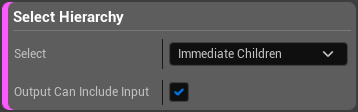

# Dataprep选项变换参考

> 路径：虚幻引擎5.7文档 / 管理内容 / Datasmith / Dataprep导入自定义 / Dataprep选项变换参考

> 原始页面：https://dev.epicgames.com/documentation/unreal-engine/dataprep-selection-transform-reference-in-unreal-engine

本文介绍了Visual Dataprep系统的各种 **变换（Transform）** 块，你可以用它们来调整某个Action的对象。

每种类型的 **变换（Transform）** 块都封装了特定类型的修改，虚幻编辑器可对选定的资产和传入的Actor执行该修改。然后，该块将修改后的选定内容传递给位于同一Dataprep操作中且位于其下方的块。

变换块与过滤器很相似，它们都旨在确定哪些Actor和资产可供同一操作中的其他Dataprep块操作。但是，过滤器块只能缩小传递的对象列表的范围。而 **变换（Transform）** 块则与之不同，它可以将对象 *添加* 到当前选定项中。

## 常用控制

所有 **变换（Transform）** 块均提供 **输出可包含输入（Output Can Include Input）** 设置。

- 启用此设置后，**变换（Transform）** 块始终会把传递给它的Actor和资产添加到输出选择中，然后传递给Dataprep操作中的下一个块。
- 禁用此设置后，*只有* 在Actor和资产也传递内置在块中的其他选择标准时，**变换** 块才会将传入给块的Actor和资产添加到输出选择中。

## Reference Selection Transform

此操作将检查输入列表中的每个Actor和资产，查找对临时场景中其他资产的引用。然后它会把找到的所有被引用的静态网格体、材质和纹理资产添加到输出选择中，再传递给下个块。

## Select Hierarchy

对于传入此块的每个Actor，此变换将查找该输入Actor的子Actor。然后将所有此类子Actor添加到输出选择中并传递给下个块。

| 设置 | 说明 |
| --- | --- |
| **选择（Select）** | 确定选择扩展到每个输入Actor后代的深度。 使用 **直接子项（Immediate Children）** 时，输出选择仅包含传入该变换块Actor的直接子项Actor。 使用 **全部后代（All Descendants）** 时，输出选择会递归包括传入该变换块的Actor的下的完整层级。 |

## Select Actor Components

对于所有传入的Actor，"变换"会查看之前选中的Actor的所有组件，然后将这些组件添加到输出选项中，传递给下一块内容。

## Select Owning Actor

这个转换寻找传递到这个块中的每个组件的父角色。然后，它将父角色添加到输出选择中，并将其传递给下一个块。

