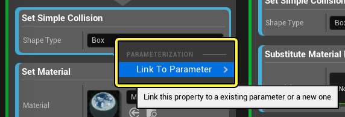
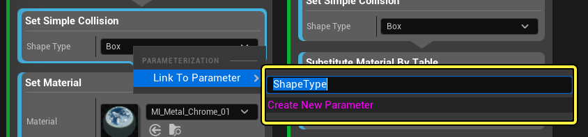
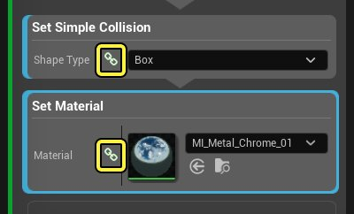
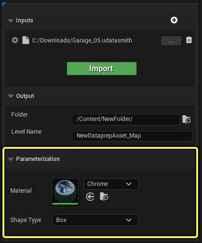
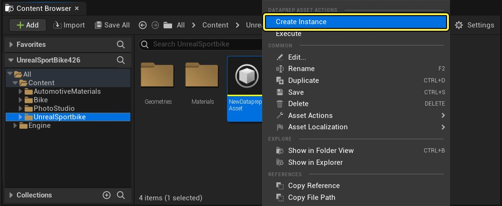
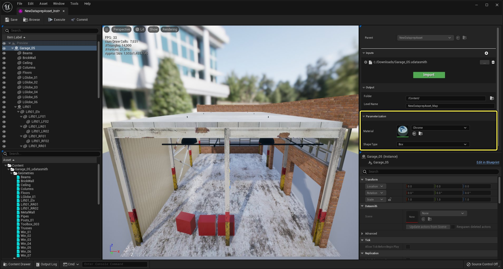

# 使用Dataprep实例

> 路径：虚幻引擎5.7文档 / 管理内容 / Datasmith / Dataprep导入自定义 / 使用Dataprep实例

> 原始页面：https://dev.epicgames.com/documentation/unreal-engine/working-with-dataprep-instances-in-unreal-engine

在Visual Dataprep系统中，你的Dataprep资产能提供可重复使用的方式，以便让3D数据在导入和修改时保持一致。Dataprep图表提供了极大的灵活性和丰富的功能；有了它，你就可以对数据进行任意操作，从而让导入的场景在虚幻引擎中运行时能够顺利发挥作用。

有时，Dataprep图表在执行某些任务时，可能需要调整才能使用不同的输入场景或资产。举例而言，一组新的输入数据可能使用不同的对象或表面命名规范，可能需要更改图表中的设置才能匹配。可随时修改Dataprep资产图表来处理这类新情况。但Dataprep图表可能很大且很复杂，在大型组织中，导入内容的和创建图表的可能并非同一人。在这种情况下，有时可能并不清楚需要更改哪些设置。

为轻松处理这类情况，可以在Dataprep图表中选择重要设置，并使用所选的描述性名称将其公开为 *参数*。每当有人编辑Dataprep资产，这类公开参数都会显示在Dataprep编辑器右上角 **设置（Settings）** 面板中的一个叫做 **参数化（Parameterization）** 的特殊区域中。这样可以有效地高亮显示其他用户可能最常需要自定义的选择设置。

此外，还可以创建一个Dataprep *实例*，让用户 *仅* 修改选择要公开的参数，同时防止用户接触Dataprep图表的其余内容。通过合理公开Dataprep资产中的正确设置并用其创建Dataprep实例，组织中的其它用户能够自由修改预先选择的设置，而无需修改（甚至无需看到）Dataprep图表自身的具体逻辑。

> [!TIP]
> 如果你熟悉虚幻引擎中材质和材质实例的用法，你就会知道Dataprep资产和Dataprep实例其实是一个概念。

## 公开主Dataprep资产中的参数

公开Dataprep资产中的设置，以便将其作为参数自定义并在Dataprep实例中重载：

1. 按照你需要的方式设置Dataprep图表。
2. 右键点击要公开的设置。在快捷菜单的 **参数化（Parameterization）** 分段中，点击 **链接到参数（Link to Parameter）**。

   

   点击查看大图

   > [!TIP]
   > 你可以公开所有类型的Dataprep块中的所有设置：过滤器块、操作块和变换块。
3. 在提供的文本框中，输入在指代该参数时使用的描述性名称。确定好名称后，请在文本框中点击 **创建新参数（Create New Parameter）**。

   

   点击查看大图
4. 选择的设置会在Dataprep图表中以链接图标标记，表示其已针对自定义操作进行公开。将鼠标悬停在此图标上可查看与该设置对应的参数的名称。

   

   点击查看大图

   创建的新参数还会显示在Dataprep编辑器右上方 **设置面板（Settings panel）** 的 **参数化（Parameterization）** 分段。

   

   点击查看大图

   > [!TIP]
   > 若在块或 **设置（Settings）** 面板中修改设置值，则两处的值都将修改。

现在，在任何基于此Dataprep资产创建的Dataprep实例中，你的设置都可以编辑，并且使用的是你设置的参数名称。详情请参阅以下各个部分。

若要删除某项设置的参数化效果，使其无法再在此Dataprep资产的任何实例中被修改，请再次右键点击设置，然后选择 **移除参数链接（Remove Link to Parameter）**。

> [!TIP]
> 可将不同Dataprep块上的多个设置链接到单个命名参数。若Dataprep图表的不同部分依赖相同的阈值或字符串名称，重复使用参数来驱动多个不同块的设置有助于减少公开到Dataprep实例的参数数量。

## 创建Dataprep实例资产

你可以基于任何Dataprep资产创建Dataprep实例资产。在 **内容浏览器（Content Browser）** 中右键点击Dataprep资产，然后在快捷菜单中点击 **创建实例（Create Instance）**。

点击查看大图

新建的Dataprep实例资产会出现在于其父类相同的文件夹中。你可以为实例指定名称，然后双击它打开Dataprep实例编辑器并配置公开参数的值。

## 设置Dataprep实例资产

在编辑Dataprep实例资产时，编辑器界面包含你在主Dataprep编辑器中看到的多数面板。

点击查看大图。

主要区别在于图表编辑器完全没有了。在Dataprep实例中，用户无法修改、甚至看不到Dataprep实例针对导入场景的修改方式。相反，你只能在编辑器右上角 **设置（Settings）** 面板中的 **参数化（Parameterization）** 部分中，访问父Dataprep资产中公开的设置。

除此以外，Dataprep实例编辑器的用法与Dataprep编辑器的用法非常相似：

- 使用

  设置（Settings）

  面板自定义输入文件和输出位置。
- 使用工具栏中的按钮

  导入（Import）

  输入文件、

  执行（Execute）

  Dataprep图表，并将结果

  提交（Commit）

  到虚幻引擎项目中。
- 使用预览面板与导入的数据交互，并在提交结果之前确认其外观符合预期。
