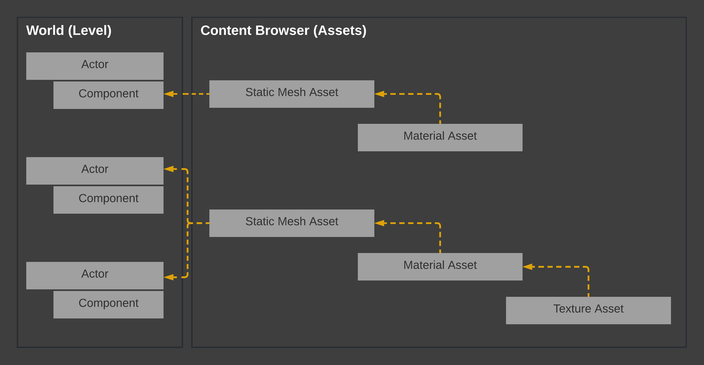
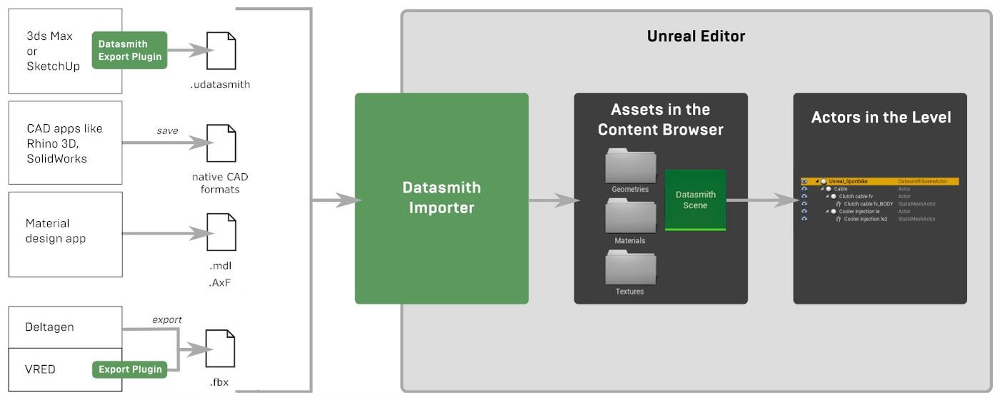
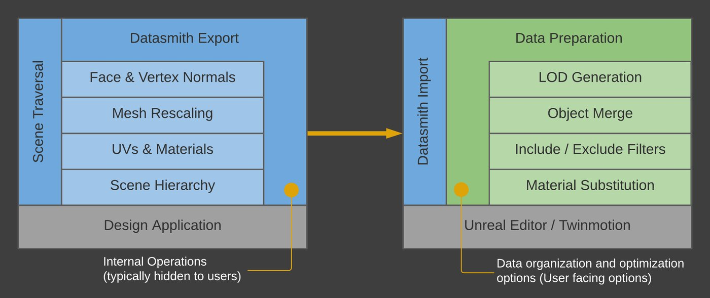
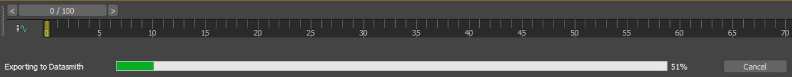
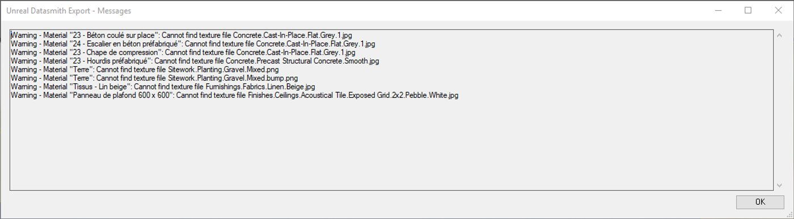
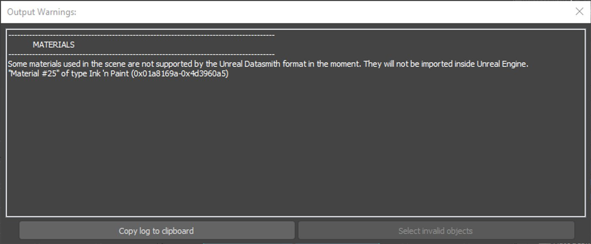
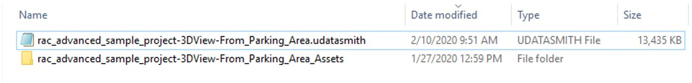
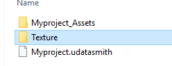

# Datasmith Export SDK Guidelines

> 路径：虚幻引擎5.7文档 / 管理内容 / Datasmith / Datasmith Export SDK Guidelines

> 原始页面：https://dev.epicgames.com/documentation/unreal-engine/datasmith-export-sdk-guidelines

该页面没有可用的官方中文版本；以下内容保留原文，并按本项目人工译文规则逐步回译。

## 本指南的目标读者

此 guide 是 aimed 在 3D 应用程序 开发者 who 希望 到 导出 场景 从 third-party design 应用程序 到 Unreal 引擎 使用 该 Datasmith framework.

此 guide makes 该 以下 assumptions:

- 你 为 一个 experienced C++ programmer.
- 你 为 familiar 使用 该 development 的 3D 应用程序.
- 你 为 developing 功能 到 导出 模型 从 a third-party 3D 应用程序 到 Unreal 引擎 或 Twinmotion.
- 你 为 不 familiar 使用 如何 Unreal 引擎 works, 但是 你 为 willing 到 学习 关于 它.

## 你将学到什么

此 页面 outlines a series 的 guidelines 和 best practices 用于 导出 3D 模型 从 其他 design 应用程序 到 Unreal 引擎 使用 该 Datasmith SDK. Broadly speaking, 它 outlines:

- Datasmith's design philosophy.
- 数据 模型 和 结构 在 Unreal 引擎.
- UX guidelines 用于 Datasmith exporters, 使用 单独 checklists 用于 每个 major 部分 的 该 导出 流程.
- Useful API 调用 和 代码 示例 用于 不同 场景.

## 下载内容和前置条件

此 章节 包含:

- A 列表 的 必需 downloads 和 位置 到 找到 它们.
- 一个 概述 的 该 必需 Datasmith 和 Unreal 引擎 knowledge 到 获取 你 开始, 和 links 到 资源 用于 further learning.

### Downloading Unreal 引擎 和 该 Datasmith SDK

如果 你 下载 和 构建 Unreal 引擎 从 该 [Unreal 引擎 GitHub 仓库](https://github.com/EpicGames/UnrealEngine), 该 Datasmith SDK 是 包含 使用 它.

> [!NOTE]
> 到 下载 该 Unreal 引擎 源 代码 从 GitHub, 你 必须 第一个 follow 该 步骤 概述 在 [此 guide](https://www.unrealengine.com/en-US/ue4-on-github) 到 请求 访问 到 该 仓库. 如果 你 haven't 已经 授予 访问, 你 将 接收 a 404 错误.

之后 你 下载 该 Unreal 引擎 源 代码, 你 将 找到 该 Datasmith SDK 下方:

`\Engine\Source\Programs\Enterprise\Datasmith\DatasmithSDK\`

The `Documentation` folder contains a sample project, as well as instructions on how to get your development environment configured.

如果 你 下载 和 install Unreal 引擎 从 该 [Epic Games launcher](https://www.unrealengine.com/en-US/download/ue_non_games), 你 必须 下载 该 Datasmith SDK separately 从 [此 文件夹](https://github.com/EpicGames/UnrealEngine/tree/release/Engine/Source/Programs/Enterprise/Datasmith/DatasmithSDK) 在 该 Unreal 引擎 GitHub 仓库.

> [!TIP]
> Epic Games 具有 developed Datasmith 导出 插件 用于 a few design 应用程序, 例如 作为 Revit, SketchUp, 和 3ds 最大. 你 可以 参阅 到 这些 插件 作为 示例 用于 你的 自身 工作.
>
> 你 可以 访问 该 源 代码 用于 这些 Datasmith 导出 插件 在 该 Epic Games GitHub 仓库, 下方:
>
> `\Engine\Source\Programs\Enterprise\Datasmith\`

### 理解 Datasmith

Datasmith 是 a 集合 的 工具 和 插件 该 brings pre-constructed 场景 创建 在 a variety 的 design 应用程序 到 Unreal 引擎. 它 曾 designed 到 overcome limitations 的 其他 generic 文件 格式, 例如 作为 FBX 或 OBJ.

Datasmith 是 able 到:

- 处理 大型 网格体.
- 存储 数据 该 Unreal 引擎 使用, 例如 作为:

  - LODs
  - Collision
  - 灯光
  - 对象 层级
  - 元数据
- Reformat 纹理 文件 (到 该 power 的 2, 到 格式 handled 通过 Unreal).

到 学习 更多 关于 Datasmith 功能 和 功能, 参阅 到 该 [Datasmith 概述](../datasmith-plugins-overview/index.md) 页面.

导出 数据 happens 在 两个 步骤:

1. Parse 该 design 应用程序 和 construct a **DatasmithScene** 使用 该 **DatasmithCore** API.
2. 导出 该 场景 到 磁盘 使用 该 **DatasmithExporter** API.

到 学习 如何 到 使用 这些 APIs, 参阅 到 该 以下 documentation:

- [DatasmithCore](https://dev.epicgames.com/documentation/unreal-engine/API/Runtime/DatasmithCore?application_version=5.5)
- [DatasmithExporter](https://dev.epicgames.com/documentation/unreal-engine/API/Developer/DatasmithExporter?application_version=5.5)

### 虚幻引擎 数据模型

之前 你 开始 写入 你的 Datasmith 导出器, familiarize yourself 使用 如何 Unreal 引擎 存储 和 结构 信息.

Unreal 引擎 works 使用 项目. 一个 Unreal 项目 包含 在 least 一个 [关卡](../../../building-virtual-worlds/level-editor/index.md), 其 包含 一个 或 更多 [Actors](../../../understanding-the-basics/actors-and-geometry/index.md). Actor 具有 a 位置, 旋转, 和 缩放. 它们 可以 exist 在 不同 图层, 是 显示 或 隐藏, 具有 animations, 和 so 在.

每个 Actor 具有 一个 或 更多 [组件](../../../understanding-the-basics/actors-and-geometry/basic-components/index.md), 其 可以 是:

- Geometric 资产, 例如 作为 [静态网格体](../../../understanding-the-basics/actors-and-geometry/unreal-engine-actors-reference/static-mesh-actors/index.md).
- [灯光](../../../building-virtual-worlds/lighting-the-environment/light-types-and-their-mobility/point-lights/index.md).
- [摄像机](../../../understanding-the-basics/actors-and-geometry/unreal-engine-actors-reference/camera-actors/index.md), 和 so 在.

静态网格体 引用 [Master 材质 或 材质 实例](../../../designing-visuals-rendering-and-graphics/unreal-engine-materials/instanced-materials/index.md). 在 turns, 材质 资产 引用 [纹理 资产](../../../designing-visuals-rendering-and-graphics/textures/index.md).

A 单个 静态网格体 可以 是 referenced 通过 多个 Actor. 此 是 称为 几何体 instantiation.



此 diagram illustrates 该 relationship 之间 Actor, 组件, 和 various 类型 的 资产 在 Unreal 引擎. 点击 该 图片 用于 完整 大小.

## Datasmith 设计原则

作为 a 插件 开发者, 你 应 strive 到 确保 a consistent 用户 体验, regardless 的 其 软件 该 数据 是 正在 导出 从. 作为 例如, 它 是 important 到 understand 和 adhere 到 该 Datasmith design principles 概述 下方. 这些 为 该 principles 该 we (该 Datasmith 开发者 team) 使用 当 developing our 自身 插件.

### Datasmith 插件类型

所有 Datasmith 插件 使用 一个 的 该 以下 两个 schemes:

- 导出器 / Importer combination. 用于 示例, 3ds 最大, Revit, 和 Sketchup 使用:

  - A Datasmith 导出器 插件 在 该 软件 端.
  - 该 Datasmith 文件 Importer 插件 在 该 Unreal 引擎 端.
- 直接 importer. 用于 示例, Unreal 引擎 可以 导入 一些 文件 格式 native 到 Rhino, Solidworks, 和 Cinema4D.



此 diagram illustrates 该 various Datasmith 导入 workflows 可用. 点击 该 图片 用于 完整 大小.

该 choice 的 其 工作流 到 使用 varies 在 a 情况-通过-情况 基础.

### 导出和导入逻辑

一个 的 该 challenges 使用 exchanging 数据 之间 不同 应用程序 是 understanding 位置 到 put 一些 的 该 逻辑. 当 we translate 数据 从 一个 应用程序 到 另一个, we 可能 ask ourselves:

- 应 we 导出 everything 或 提供 选项 到 排除 一些 实体?
- 应 we 排除 小 对象 当 导出? 如何 do we define "小"?
- 应 we reduce polygon 数量 当 导出? 应 we reduce 纹理 resolutions?
- 位置 do we rescale 实体 到 匹配 units 和 缩放?, 和 so 在.

Generally speaking, our approach 是 到 导出 everything 在 a granular fashion (该 是, 对象 通过 对象), 和 deal 使用 对象 merging, polygon reduction 和 其他 数据 preparation 操作 当 该 数据 是 稍后 导入 到 Unreal 引擎 或 Twinmotion.

当 存在's no strict rule, our general approach 是 该 它's best 到 具有 该 least 数量 的 选项 (或 none 在 所有) 暴露 在 该 Datasmith 导出器, 和 让 该 Unreal 引擎 用户 使 多数 的 该 decisions 期间 该 导入.

使用 此 approach, 它 是 上 到 该 Unreal 或 Twinmotion 用户 到 decide 如何 granular 它们的 数据 可能 是, 或 如何 optimized 它 可能 是. Unreal 引擎's [Dataprep](../dataprep-import-customization/index.md) 是 a great 工具 用于 making 那些 decisions.



示例 division 之间 内部 和 用户-选中 操作 超过 该 course 的 该 Datasmith 导出 / 导入 流程. 点击 该 图片 用于 完整 大小.

### 源数据更改后的重新导入

Datasmith brings design 数据 从 a variety 的 源 应用程序 到 Unreal 引擎, typically 用于 该 purpose 的 building real-时间 visualizations 和 experiences 围绕 该 数据. Often, 当 你 为 working 在 building 那些 visualizations 和 experiences 在 Unreal 引擎, 该 场景 或 design 数据 该 你的 工作 incorporates 需要 到 更改 在 顺序 到 meet 新增 requirements 或 incorporate feedback 从 stakeholders.

到 避免 painful 和 costly re-工作, 你 需要 到 是 able 到 incorporate 那些 upstream 更改 不 losing 所有 该 工作 你've done 在 该 虚幻编辑器. 到 此 结束, Datasmith offers a [re-导入 工作流](../datasmith-reimport-workflow/index.md) 该 preserves 所有 的 你的 更改 内部 该 Unreal 项目.

从 a Datasmith SDK perspective, re-导入 数据 implies 两个 things:

1. 实体 必须 具有 a persistent 唯一 标识符. Relying 在 一个 对象's 名称 是 不 a good 策略 因为 多个 对象 可以 具有 该 相同 名称.
2. 实体 必须 是 保存 使用 a 哈希 值 该 permits 数据 re-导入 在 该 highest 可能 性能.

   当 a Datasmith 实体 是 创建, a 唯一 数量 是 生成 基于 在 该 对象's 数据. 用于 示例, 到 quickly 确定 如果 两个 网格体 为 identical, 你 可以 任一 compare 它们 面-到-面 使用 a 时间-consuming 算法, 或 你 可以 计算 a numerical 值 基于 在 该 数量 的 vertices, faces, 和 UVs. Comparing 这些 两个 值 将 然后 是 a much faster 方式 到 tell 如果 该 网格体 为 identical 或 不.

示例 为 described further 下 在 此 页面.

### 环境和光照

Although 你 可能 是 tempted 到 perceive Unreal 作为 a 渲染 引擎 和 expect 到 导出 a 模型 使用 所有 的 它的 环境 设置 (摄像机, environments, backgrounds, 等.), we 找到 该 generally, 那些 artistic decisions 为 best made 通过 Unreal 引擎 或 Twinmotion 用户, 之后 该 数据 具有 已经 导入 到 该 引擎.

该 多数 important aspect 是 到 导入 模型 元素 (几何体, 材质, 灯光, 元数据). 一次 该 数据 具有 已经 导入 到 Unreal 引擎 或 Twinmotion, 用户 可以 更改 材质, tweak lighting, 和 执行 其他 artistic 任务.

## Datasmith 导出器 UX 准则

如果 你 made 它 到 此 点, 你 具有 多数 likely compiled Unreal 和 创建 你的 第一个 Datasmith 文件 使用 a 小 应用程序. Congratulations!

现在 它's 时间 到 查看 在 UX considerations 相关 到 如何 该 数据 应 是 structured 用于 结束 用户.

### 导出器 UI

作为 we described 在 该 Datasmith Design Principles 章节 上方, we 希望 到 offer 该 least 数量 的 选项 当 导出 到 Datasmith. 此处 为 一些 示例:

|  |  |
| --- | --- |
| [3D export view in Revit](https://dev.epicgames.com/community/api/documentation/image/89eeef51-e7cc-4436-b6c9-2160e6005aad?resizing_type=fit) | [Datasmith export options in Unreal Engine](https://dev.epicgames.com/community/api/documentation/image/b61eb7ed-eedc-45d9-a4f6-6defc79a3b08?resizing_type=fit) |
| Datasmith 导出器 从 Revit | 导出 选项 dialog 在 Unreal 引擎 |

#### Guidelines

- Favor WYSIWYG (什么 你 参见 是 什么 你 获取) 导出 通过 relying 在 该 应用程序's viewing 和 filtering capabilities. 用于 示例, Revit 仅 导出 什么 是 可见 在 该 激活 视图, 和 SketchUp 仅 导出 什么 是 可见 在-screen. 存在 是 no reason 到 invent a 整个 新增 UX 到 选择 和 筛选 实体 到 是 导出.
- Favor no 选项 在 所有 当 导出.
- 如果 你 必须 expose 选项, 保持 它们 作为 simple 作为 可能. 参阅 到 该 3ds 最大 导出器 上方 作为 一个 示例.

#### 到 是 Avoided

选项 相关 到 数据 preparation 和 optimizations, 例如 作为 几何体 detail, 对象 类型 filtering, UV 通道, 等. 这些 应 是 decisions made 通过 该 Unreal 引擎 用户, 在 Unreal 引擎.

### 进度信息和错误消息

Datasmith exporters 收集 所有 实体 相关 到 transferring 和 reconstructing 该 场景 在 Unreal 引擎. 它 是 可能 该 一些 实体 cannot 是 导出. 你 应 inform 用户 如果 一个 或 更多 实体 cannot 是 导出..

在 addition, 一些 项目 为 非常 大型, 其 可以 使 该 导出 采用 a 长 时间. 用户 应 是 able 到 参见 progress 信息.

此处 为 一些 示例. 点击 任何 图片 下方 到 参见 它 在 完整 大小.



Progress 信息 在 3ds 最大.



输出 警告 在 该 Revit Datasmith 导出器.



输出 警告 在 该 3ds 最大 Datasmith 导出器.

#### Guidelines

- Progress 信息 需要 到 是 presented 到 该 用户 期间 导出.
- 用户 需要 到 是 able 到 取消 该 Datasmith 导出 流程.
- 一个 错误 message 日志 应 是 显示 到 inform 用户 关于 unsupported 对象, 缺失 纹理, 和 其他 问题.

#### Useful 到 具有

某些 用户 often demand 批处理 处理 和 scripting. 用于 示例, 使用 SketchUp, 3ds 最大 或 Revit, 用户 可以 批处理 导出 到 Datasmith 使用 该 native 应用程序 scripting language.

#### 到 是 Avoided

Do 不 implement successive modal dialogs (OK / 取消 窗口) 该 interrupt 该 导出 流程 每个 时间 一个 错误 或 a 警告 occurs.

#### 有用的 API 调用

- [DatasmithExporter](https://dev.epicgames.com/documentation/unreal-engine/API/Developer/DatasmithExporter?application_version=5.5)
- [IDatasmithProgressManager](https://dev.epicgames.com/documentation/unreal-engine/API/Developer/DatasmithExporter/IDatasmithProgressManager?application_version=5.5)
- [FDatasmithLogger](https://dev.epicgames.com/documentation/unreal-engine/API/Developer/DatasmithExporter/FDatasmithLogger?application_version=5.5)

#### 代码 示例

用于 一个 示例 实现, 参阅 到 该 以下 文件 在 该 Unreal 引擎 仓库:

`/Engine/Source/Programs/Enterprise/Datasmith/DatasmithSketchUpRubyExporter/Private/DatasmithSketchUpExporter.cpp`

### 导出文件和文件夹结构

A Datasmith "文件" consists 的 两个 parts:

- A `.udatasmith` file that uses an XML data structure.
- A "sidecar folder" (an associated folder) that contains all Assets associated with the `.udatasmith` file.



示例 导出 文件 使用 它的 关联 文件夹.

#### 必须 具有

- A single `[filename].udatasmith` file and a single associated [filename]_Assets folder.
- 所有 相关 资产 为 存储 在 该 [filename]_Assets 文件夹.
- Assets are referenced in the `.udatasmith` file's XML structure using relative paths.

#### 到 是 Avoided

- Do 不 引用 资产 通过 absolute 路径.
- Do 不 创建 额外的 folders 和 subfolders 该 contain 资产. 此处 是 一个 示例 的 一个 不正确 导出:

  

  在 此 示例, 该 纹理 文件夹 是 outside 该 Datasmith 项目 文件. 此 是 不正确.

### Datasmith 文件头

We (Epic Games) 使用 header 信息 到 understand 位置 数据 comes 从. Our 遥测 仅 collects 统计信息 关于 什么 类型 的 文件 为 导入 和 从 其 源.

下方 是 一个 示例 header 的 a Datasmith 文件:

C++

```
<DatasmithUnrealScene>    	<Version>0.24</Version>    	<SDKVersion>4.25</SDKVersion>    	<Host>Revit</Host>    	<Application Vendor="Autodesk Inc." ProductName="Revit" ProductVersion="2018"/>    	<User ID="1e8adca84ffe2d4d625d54b63fba876d" OS="Windows 10 (Release 1709)"/>
```

#### 必须 具有

Datasmith 信息 必须 是 正确 设置, 类似 到 该 示例 上方.

#### 有用的 API 调用

- [IDatasmithScene::SetHost](https://dev.epicgames.com/documentation/unreal-engine/API/Runtime/DatasmithCore/IDatasmithScene/SetHost?application_version=5.5)
- [IDatasmithScene::SetProductName](https://dev.epicgames.com/documentation/unreal-engine/API/Runtime/DatasmithCore/IDatasmithScene/SetProductName?application_version=5.5)
- [IDatasmithScene::SetProductVersion](https://dev.epicgames.com/documentation/unreal-engine/API/Runtime/DatasmithCore/IDatasmithScene/SetProductVersion?application_version=5.5)

#### 代码 示例

用于 一个 示例 实现, 参阅 到 该 以下 文件 在 该 Unreal 引擎 仓库:

`/Engine/Source/Programs/Enterprise/Datasmith/DatasmithSketchUpRubyExporter/Private/DatasmithSketchUpExporter.cpp`

### 静态网格体资产

静态网格体 资产 ([IDatasmithMeshElement](https://dev.epicgames.com/documentation/unreal-engine/API/Runtime/DatasmithCore/IDatasmithMeshElement?application_version=5.5)) define actual 几何体, 但是 won't appear 在 该 Unreal 或 Twinmotion 视口 直到 它们 为 referenced 通过 Actor ([IDatasmithMeshActorElement](https://dev.epicgames.com/documentation/unreal-engine/API/Runtime/DatasmithCore/IDatasmithMeshActorElement?application_version=5.5)). Multiple `IDatasmithMeshActorElement`s in a scene can also point to the same Static Mesh asset.

A 静态网格体 资产 holds 数据 用于:

- Faces, vertices, normals 和 平滑 masks
- UVs
- Collisions
- LODs
- Vertex colors
- 材质 ID 和 assignments, 等.

Below is an example data structure for a Static Mesh Asset in a `.udatasmith` file:

C++

```
<StaticMesh name="c96130816d3eee95f82a6c00e553f491" label="Walls_Basic_Wall_Exterior_-_Insulation_on_Masonry">      <file path="rac_advanced_sample_project-3DView-{3D}_Assets/c96130816d3eee95f82a6c00e553f491.udsmesh"/>      <Size a="5922000.0" x="855.299927" y="30.300011" z="1139.999878"/>      <LightmapCoordinateIndex value="-1"/>      <LightmapUV value="-1"/>      <Hash value="c0e8334d671cf30ef8ff8a67aa4da25b"/>      <Material id="9" name="e72f7720bfd15817d3789377231c9646"/>      <Material id="10" name="5d261e4bd619e79ebea1cfcc1d1a8d8e"/>      <Material id="11" name="13b3765549b7832c6bc26e8922497ced"/>    </StaticMesh>
```

#### 必须 具有

- 静态网格体 **名称** 必须 是 唯一 和 它们 必须 不 更改 之间 successive 导出. 此 是 必需 到 轨道 实体 用于 subsequent re-imports. 3D 应用程序 usually 提供 GUIDs 该 为 良好-suited 用于 此 purpose.
- 静态网格体 **标签** 必须 是 sanitized, 用户-readable, 和 representative 的 什么 该 对象 可能 是.

|  |  |
| --- | --- |
| [Unique names for mesh Assets](https://dev.epicgames.com/community/api/documentation/image/7f80b955-7434-4eb7-a04a-4ee11cc7bab3?resizing_type=fit) | [User-readable labels in Unreal Engine](https://dev.epicgames.com/community/api/documentation/image/5667faa3-e0ee-43f0-bbab-1a4919fde1eb?resizing_type=fit) |
| 唯一 名称 用于 网格体 资产 | 用户-readable 标签 在 Unreal 引擎 |

- Static Mesh Assets (`IDatasmithMeshElement`) must be reused across Actors where applicable (they must be instanced).
- Unreal 引擎 使用 [左侧-handed Z-上](https://www.evl.uic.edu/ralph/508S98/coordinates.html) coordinates 和 measures dimensions 在 centimeters, therefore:

  - Conversion 必须 是 done 在 该 导出器 端.
  - UV 纹理 coordinates 必须 是 flipped vertically (在 该 Y axis) so we don't 使用 a 负 缩放 在 材质 tiling 到 counteract images 正在 flipped 在 Unreal 引擎.
  - 缩放 conversion 和 coordinate transformation 必须 是 baked 到 该 静态网格体 而是 比 应用 到 该 Actor 变换.

    |  |  |
    | --- | --- |
    | [Scale baked into scene geometry](https://dev.epicgames.com/community/api/documentation/image/6512c1d7-71ea-4c1c-a744-1b273ecd6314?resizing_type=fit) | [Scale baked into scene geometry](https://dev.epicgames.com/community/api/documentation/image/78513452-819a-45d5-9e51-c6660dde3179?resizing_type=fit) |

    *缩放 是 baked 在 该 几何体, resulting 在 Actor 变换 设置 到 a 缩放 的 1.0 (作为 opposed 到 2.54 或 0.333)*
  - 网格体 pivots 必须 是 计算 在 该 网格体 so 它们 don't 所有 结束 上 在 0, 0, 0.

    |  |  |
    | --- | --- |
    | [A correctly aligned mesh pivot](https://dev.epicgames.com/community/api/documentation/image/e3c196bf-45b6-403b-9407-7b45ea45e07b?resizing_type=fit) | [An incorrectly aligned mesh pivot](https://dev.epicgames.com/community/api/documentation/image/0b2a1da7-8dac-4504-b7be-084d63fbaa76?resizing_type=fit) |

    *左侧: 网格体 pivot aligned 使用 对象 (correct). 右侧: pivot 在 0, 0, 0 (不正确)*
  - Triangles 必须 是 welded so 该 平滑 masks 和 shading 工作 正确.

    |  |  |
    | --- | --- |
    | [Smoothing, Normals, etc. are correctly set on the geometry](https://dev.epicgames.com/community/api/documentation/image/b2603569-b517-46ae-a54b-c6c6e4d41fec?resizing_type=fit) | [Smoothing, Normals, etc. are correctly set on the geometry](https://dev.epicgames.com/community/api/documentation/image/83b7a60b-985a-46e5-9a9b-c95d3fc00fbf?resizing_type=fit) |

    *平滑, Normals, 和 类似, 为 正确 设置 在 该 几何体.*

#### Useful 到 具有

- Specify 额外的 LODs.
- Specify collision 网格体.
- Specify Lightmap UV 通道 (Unwrap).

#### 到 是 Avoided

- 静态网格体 名称 其 aren't guaranteed 到 是 唯一 和 repeatable 跨 导出. Do 不 使用 对象 名称 该 为 用户-指定.
- Do 不 存储 units rescaling 内部 Actor 变换.
- Do 不 leave pivots 在 0, 0, 0.
- Do 不 导出 thousands 的 静态网格体 Actor 该 应 是 welded 一起. 用于 示例, a *Box* 是 typically a 单个 网格体 使用 6 faces, 不 6 单独 网格体 使用 a 单个 面 每个.

#### 有用的 API 调用

- [IDatasmithMeshElement](https://dev.epicgames.com/documentation/unreal-engine/API/Runtime/DatasmithCore/IDatasmithMeshElement?application_version=5.5)
- [FDatasmithMesh](https://dev.epicgames.com/documentation/unreal-engine/API/Runtime/DatasmithCore/FDatasmithMesh?application_version=5.5)
- [FDatasmithUtils::SanitizeObjectName](https://dev.epicgames.com/documentation/unreal-engine/API/Runtime/DatasmithCore/FDatasmithUtils/SanitizeObjectName?application_version=5.5)

#### 代码 示例

用于 一个 示例 实现, 参阅 到 该 以下 文件 在 该 Unreal 引擎 仓库:

`/Engine/Source/Programs/Enterprise/Datasmith/DatasmithSketchUpRubyExporter/Private/DatasmithSketchUpExporter.cpp`

### 静态网格体 Actor

静态网格体 Actor ([IDatasmithMeshActorElement](https://dev.epicgames.com/documentation/unreal-engine/API/Runtime/DatasmithCore/IDatasmithMeshActorElement?application_version=5.5)) don't define 该 actual 几何体. 它们 点 到 静态网格体 资产 ([IDatasmithMeshElement](https://dev.epicgames.com/documentation/unreal-engine/API/Runtime/DatasmithCore/IDatasmithMeshElement?application_version=5.5)). Note that several `IDatasmithMeshActorElement`s can reference the same Static Mesh.

Below is an example data structure of a Static Mesh Actor in a `.udatasmith` file.

C++

```
<ActorMesh name="1" label="Teapot001" layer="0">
	    <mesh name="1"/>
	    <Transform tx="16.825752" ty="-18.789846" tz="0.0" sx="1.0" sy="1.0" sz="1.0" qx="0.0" qy="0.0" qz="0.0" qw="1.0" qhex="0000008000000000000000800000803F"/>
	    <tag value="Max.superclassof: GeometryClass" />
	    <tag value="Max.classof: Teapot" />
	    <tag value="Max.handle: 1" />
	    <tag value="Max.isGroupHead: false" />
	    <tag value="Max.isGroupMember: false" />
	    <tag value="Max.parent.handle: 0" />
    </ActorMesh>
```

> 图片已省略：Two Static Mesh Actors referencing the same Static Mesh Asset (instancing) imported from 3ds Max.

两个 静态网格体 Actor referencing 该 相同 静态网格体 资产 (instancing) 导入 从 3ds 最大.

#### 必须 具有

- 网格体 Actor **名称** 必须 是 唯一 和 它们 必须 不 更改 之间 successive 导出. 此 是 必需 到 轨道 实体 用于 subsequent re-imports.
- 网格体 Actor **标签** 必须 是 sanitized (该 是, 它们 必须 不 contain 无效 角色) 和 用户-readable.
- Static Mesh Assets (`IDatasmithMeshElement`) must be reused across Actors where applicable (they must be instanced).
- 缩放 和 coordinate conversions, 作为 良好 作为 coordinate transformations, 必须 是 baked 到 该 静态网格体 而是 比 应用 到 该 Actor 变换.

#### Useful 到 具有

- 图层 specification.
- 支持 用于 标签 和 元数据.

#### 有用的 API 调用

- [FDatasmithSceneFactory::CreateActor](https://dev.epicgames.com/documentation/unreal-engine/API/Runtime/DatasmithCore/FDatasmithSceneFactory/CreateActor?application_version=5.5)
- [FDatasmithSceneFactory::CreateMeshActor](https://dev.epicgames.com/documentation/unreal-engine/API/Runtime/DatasmithCore/FDatasmithSceneFactory/CreateMeshActor?application_version=5.5)
- [IDatasmithActorElement](https://dev.epicgames.com/documentation/unreal-engine/API/Runtime/DatasmithCore/IDatasmithActorElement?application_version=5.5)
- [IDatasmithMeshActorElement](https://dev.epicgames.com/documentation/unreal-engine/API/Runtime/DatasmithCore/IDatasmithMeshActorElement?application_version=5.5)
- [FDatasmithUtils::SanitizeObjectName](https://dev.epicgames.com/documentation/unreal-engine/API/Runtime/DatasmithCore/FDatasmithUtils/SanitizeObjectName?application_version=5.5)

#### 代码 示例

用于 一个 示例 实现, 参阅 到 该 以下 文件 在 该 Unreal 引擎 仓库:

`/Engine/Source/Programs/Enterprise/Datasmith/DatasmithSketchUpRubyExporter/Private/DatasmithSketchUpComponent.cpp`

### 空 Actor

空 Actor 为 Actor 该 具有 no 组件 或 静态网格体 附加 到 它们. 它们 为 useful 到 保持 元数据 或 act 作为 a 方式 到 表示 parts 的 a 层级. 存在 为 no strict rules 关于 如何 或 当 你 应 使用 它们. 该 guidelines 下方 cover 一些 通用 使用 示例.

#### Guidelines

使用 空 Actor 用于:

- Representing 空值 对象 (用于 示例, 3ds 最大 helper 对象).
- Representing 自定义 origin points (用于 示例, Revit site 位置).
- Representing 其他 元素 该 使 该 层级 更多 readable (用于 示例, 图层 从 Rhino, 块 origins 从 Rhino, 或 关卡 从 Revit).
- Representing 该 head 的 a compound 对象 该 具有 no 几何体 的 它的 自身 (用于 示例, Revit curtain walls).

#### 示例

> 图片已省略：3ds Max Helper objects translated as Empty Actors

3ds 最大 Helper 对象 translated 作为 空 Actor.

> 图片已省略：Empty Actors used to represent invisible elements from Revit

空 Actor 使用 到 表示 invisible 元素 从 Revit.

#### 有用的 API 调用

- [FDatasmithSceneFactory::CreateActor](https://dev.epicgames.com/documentation/unreal-engine/API/Runtime/DatasmithCore/FDatasmithSceneFactory/CreateActor?application_version=5.5)
- [FDatasmithSceneFactory::CreateMeshActor](https://dev.epicgames.com/documentation/unreal-engine/API/Runtime/DatasmithCore/FDatasmithSceneFactory/CreateMeshActor?application_version=5.5)
- [IDatasmithActorElement](https://dev.epicgames.com/documentation/unreal-engine/API/Runtime/DatasmithCore/IDatasmithActorElement?application_version=5.5)
- [IDatasmithMeshActorElement](https://dev.epicgames.com/documentation/unreal-engine/API/Runtime/DatasmithCore/IDatasmithMeshActorElement?application_version=5.5)
- [FDatasmithUtils::SanitizeObjectName](https://dev.epicgames.com/documentation/unreal-engine/API/Runtime/DatasmithCore/FDatasmithUtils/SanitizeObjectName?application_version=5.5)

#### 代码 示例

用于 一个 示例 实现, 参阅 到 该 以下 文件 在 该 Unreal 引擎 仓库:

`/Engine/Source/Programs/Enterprise/Datasmith/DatasmithSketchUpRubyExporter/Private/DatasmithSketchUpComponent.cpp`

### Actor 层级

例如 许多 其他 3D 应用程序, Unreal 引擎 supports 父级 / child hierarchies.

Below is an example parent / child relationship in a `.udatasmith` file.

C++

```
<ActorMesh name="3" label="Box001" layer="0">		    <mesh name="3"/>		    <Transform .../>		    <children visible="true"  selector="false" selection="-1">			    <ActorMesh name="5" label="Box002" layer="0">				    <mesh name="5"/>				    <Transform ..."/>				    <children visible="true"  selector="false" selection="-1">
```

#### Guidelines

- 使用 Actor hierarchies 到 reflect 该 数据 模型 的 你的 应用程序.

  > 图片已省略：3ds Max hierarchy translated as-is to Unreal Engine

  3ds 最大 层级 translated 作为-是 到 Unreal 引擎.
- Insert 额外的 空 Actor 如果 necessary 到 存储 信息 相关 到 你的 应用程序's 数据 模型 (用于 示例, Revit 关卡 为 导出 作为 一个 extra 父级 Actor).

  > 图片已省略：Revit Levels added to the hierarchy become a useful way to orient end users

  Revit 关卡 已添加 到 该 层级 become a useful 方式 到 orient 结束 用户.

#### 到 是 Avoided

到 使 确保 你的 层级 是 easy 到 navigate 用于 结束 用户, 使用 空 Actor 作为 parents 的 静态网格体 Actor 仅 位置 necessary. 过于 许多 空 Actor clutter 该 层级 和 使 它 更多 difficult 到 读取 和 使用 内部 两者 Twinmotion 和 Unreal 引擎.

|  |  |
| --- | --- |
| [Too many empty Actors](https://dev.epicgames.com/community/api/documentation/image/e9029a78-cb7d-4c57-8b38-a0a8c46e69b7?resizing_type=fit) | [Empty Actors used only when necessary](https://dev.epicgames.com/community/api/documentation/image/b58db296-1f33-42ef-908e-1812188911fc?resizing_type=fit) |
| 过于 许多 空 Actor. | 空 Actor 使用 仅 当 necessary. |

#### 有用的 API 调用

- [IDatasmithActorElement::AddChild](https://dev.epicgames.com/documentation/unreal-engine/API/Runtime/DatasmithCore/IDatasmithActorElement/AddChild?application_version=5.5)

#### 代码 示例

用于 一个 示例 实现, 参阅 到 该 以下 文件 在 该 Unreal 引擎 仓库:

`/Engine/Source/Programs/Enterprise/Datasmith/DatasmithSketchUpRubyExporter/Private/DatasmithSketchUpComponent.cpp`

### 作为组件的 Actor

在 应用程序 例如 作为 Revit 或 Archicad, 它 是 typical 到 具有 对象 该 具有 多个 sub-元素. 用于 示例, a Curtain Wall 是 typically 构建 使用 panels 和 mullions 和 a Railing 是 typically 构建 使用 rails 和 balusters:

> 图片已省略：Curtain Walls and Railings in Revit

在 Revit, Curtain Walls 和 Railings 为 特殊 对象 该 contain sub 元素 (panels, mullions, balusters, handrails).

当 它 是 可能 到 导出 每个 element 作为 一个 单独 静态网格体 Actor, 此 ends 上 导出 过于 许多 对象 和 该 世界 Outliner 在 Unreal 引擎 becomes overly crowded, 作为 显示 下方.

> 图片已省略：Too many Actors!

Curtain Wall 导出 作为 一个 StaticMesh Actor 每个 panel 和 mullion = lots 的 Actor 在 该 世界 Outliner! 点击 该 图片 用于 完整 大小.

如果 applicable, consider 导出 sub-元素 作为 Actor 组件. 用于 示例, a Curtain Wall 对象 可以 是 导出 使用 该 以下 Actor 和 组件 层级:

- Curtain Wall 对象 → 空 Actor.

  - Panel → 静态网格体 Actor 组件
  - Panel → 静态网格体 Actor 组件
  - Mullion → 静态网格体 Actor 组件
  - Mullion → 静态网格体 Actor 组件

> 图片已省略：A much cleaner hierarchy with Actors and Components

Curtain Wall 导出 作为 一个 空 Actor 使用 每个 panel 和 mullion 作为 a StaticMesh Actor 组件 结果 在 considerably less clutter 在 该 世界 视图 层级. 点击 该 图片 用于 完整 大小.

In the `.udatasmith` file, the hierarchy looks like this:

C++

```
<Actor name="..." label="Walls_Curtain_Wall_Exterior_Curtain_Wall" layer="Walls">
	    <Transform .../>
	    <children visible="true"  selector="false" selection="-1">
		    <ActorMesh name="..." label="Curtain_Panels" layer="Curtain Panels" component="true">
			    <mesh name="..."/>
			    <Transform .../>
		    </ActorMesh>
		    <ActorMesh name="..." label="Curtain_Panels" layer="Curtain Panels" component="true">
			    <mesh name=">
			    <Transform .../>
```

#### Guidelines

- 使用 静态网格体 Actor 组件 到 表示 child 对象 例如 作为 curtain wall panels, balusters, 或 类似 compound 对象.
- 你 必须 设置 两者 该 层级 ([IDatasmithActorElement::AddChild](https://dev.epicgames.com/documentation/unreal-engine/API/Runtime/DatasmithCore/IDatasmithActorElement/AddChild?application_version=5.5)) 和 组件 标志 ([IDatasmithActorElement::SetIsAComponent](https://dev.epicgames.com/documentation/unreal-engine/API/Runtime/DatasmithCore/IDatasmithActorElement/SetIsAComponent?application_version=5.5)) 在 顺序 用于 此 到 工作 正确.

#### 有用的 API 调用

- [IDatasmithActorElement::AddChild](https://dev.epicgames.com/documentation/unreal-engine/API/Runtime/DatasmithCore/IDatasmithActorElement/AddChild?application_version=5.5)
- [IDatasmithActorElement::SetIsAComponent](https://dev.epicgames.com/documentation/unreal-engine/API/Runtime/DatasmithCore/IDatasmithActorElement/SetIsAComponent?application_version=5.5)

#### 代码 示例

用于 一个 示例 实现, 参阅 到 该 以下 文件 在 该 Unreal 引擎 仓库:

`/Engine/Source/Programs/Enterprise/Datasmith/DatasmithSketchUpRubyExporter/Private/DatasmithSketchUpComponent.cpp`

### Actor 图层

例如 许多 其他 3D 应用程序, Unreal 引擎 supports 该 concept 的 图层. A 图层 是 一个 Actor 属性 该 表示 位置 该 Actor sits 在 a 场景's visual 层级.

The example below shows a possible use of layers in a `.udatasmith` file.

C++

```
<ActorMesh name="2" label="Sphere001" layer="Layer002">    ...    </ActorMesh>    <ActorMesh name="3" label="Box001" layer="Layer004">    ...    </ActorMesh>
```

#### Guidelines

- 如果 你的 源 应用程序 使用 图层, 你 应 translate 它们 到 图层 在 Unreal 引擎.
- 如果 你的 源 应用程序 doesn't 使用 图层, consider 如果 存在 是 任何 其他 数据 你 可以 translate 到 Unreal 引擎 图层. 用于 示例, Revit doesn't 使用 图层, 但是 classifies 实体 到 类别.

  > 图片已省略：Revit entities imported on Layers derived from Revit categories

  Revit 实体 导入 在 图层 derived 从 Revit 类别.

#### Limitations

- 图层 名称 必须 是 唯一.
- Unreal 引擎 doesn't 支持 nested 图层.

|  |  |
| --- | --- |
| [Nested Layers in 3ds Max](https://dev.epicgames.com/community/api/documentation/image/1895ed60-2fa5-420d-9282-5dff95adade0?resizing_type=fit) | [The same layers imported in Unreal Engine](https://dev.epicgames.com/community/api/documentation/image/39230467-9cf1-4442-b251-1f83dd436c37?resizing_type=fit) |
| Nested 图层 在 3ds 最大. | 该 相同 图层 导入 在 Unreal 引擎. Observe 该 flat 图层 层级. |

#### 有用的 API 调用

- [IDatasmithActorElement::SetLayer](https://dev.epicgames.com/documentation/unreal-engine/API/Runtime/DatasmithCore/IDatasmithActorElement/SetLayer?application_version=5.5)

#### 代码 示例

用于 一个 示例 实现, 参阅 到 该 以下 文件 在 该 Unreal 引擎 仓库:

`/Engine/Source/Programs/Enterprise/Datasmith/DatasmithMaxExporter/Private/DatasmithMaxSceneExporter.cpp`

### Actor 标签

Unreal 引擎 supports 用户-定义 标签 用于 Actor. Datasmith 使用 Actor 标签 到 保持 technical 信息 该 describes 如何 数据 是 structured 在 该 源 应用程序. Unreal 引擎 用户 可以 然后 使用 这些 Actor 标签 到 执行 scripting 操作, 用于 示例 使用 Python, 蓝图 Utilities, 或 Visual Dataprep.

Below is an example use of tags on Static Mesh Actors in a `.udatasmith` file exported from 3ds Max:

C++

```
<ActorMesh ...>
	    <mesh name="a8f655367fcc240a8c9eb8d847d58463"/>
	    <Transform .../>
	    <tag value="Revit.Element.Id.186551" />
	    <tag value="Revit.Element.UniqueId.07ae6064-8e02-489e-896d-f7554545ebb2-0002d8b7" />
	    <tag value="Revit.DB.FamilyInstance.Mirrored.True" />
	    <tag value="Revit.DB.FamilyInstance.HandFlipped.False" />
	    <tag value="Revit.DB.FamilyInstance.FaceFlipped.True" />
	    <tag value="Revit.Host.Id.156316" />
	    <tag value="Revit.Host.UniqueId.9e597f98-694d-4ada-b8ef-0e7459e0b930-0002629c" />
```

Although 存在 aren't strict rules 作为 到 什么 到 put 在 一个 Actor's 标签, we adopted 该 methodology 的 使用 标签 用于 holding 信息 该 是 特定 到 该 源 应用程序.

用于 示例, 在 该 情况 的 3ds 最大, we decided 到 使用 该 标签 到 保持 信息 关于 该 类型 的 对象 (在 3ds 最大), 是否 或 不 它's 部分 的 a 组, 和 so 在.

用于 Revit, we 具有 adopted a 类似 approach 位置 we 存储 信息 该 describes 该 内部 结构 的 Revit 实体.

|  |  |
| --- | --- |
| [Actor Tags on Actor Components from Revit](https://dev.epicgames.com/community/api/documentation/image/acb7d8ca-0ec2-4363-b7fc-b77abda392c7?resizing_type=fit) | [Actor Tags from 3ds Max](https://dev.epicgames.com/community/api/documentation/image/ffda5114-188d-4b4f-89c6-b31bf6ad8347?resizing_type=fit) |
| Actor 标签 在 Actor 组件 从 Revit. | 该 相同 图层 导入 在 Unreal 引擎. Observe 该 flat 图层 层级. |

#### Guidelines

- Prefix 你的 标签 使用 该 名称 的 该 应用程序 你're 导入 从 (用于 示例: Revit.TagName 或 最大.TagName).
- 使用 标签 到 表示 technical 信息 关于 如何 数据 是 structured 在 该 源 应用程序. 到 存储 其他 用户-定义 数据, 使用 元数据 改为.

#### 有用的 API 调用

- [IDatasmithActorElement::AddTag](https://dev.epicgames.com/documentation/unreal-engine/API/Runtime/DatasmithCore/IDatasmithActorElement/AddTag?application_version=5.5)
- [IDatasmithActorElement::SetIsAComponent](https://dev.epicgames.com/documentation/unreal-engine/API/Runtime/DatasmithCore/IDatasmithActorElement/SetIsAComponent?application_version=5.5)

#### 代码 示例

用于 一个 示例 实现, 参阅 到 该 以下 文件 在 该 Unreal 引擎 仓库:

`/Engine/Source/Programs/Enterprise/Datasmith/DatasmithSketchUpRubyExporter/Private/DatasmithSketchUpComponent.cpp`

### 元数据

Datasmith carries 键 / 值 键值对 该 可以 是 使用 到 存储 BIM 信息 (或 任何 其他 自定义 数据) 在 实体.

> 图片已省略：3ds Max metadata translated into Unreal Engine

元数据 从 3ds 最大 (左侧) translated 到 Unreal 引擎 (右侧).

#### Limitations

- 键 / 值 键值对 可以 仅 carry strings. 此 表示 该 floats, units, 等. 将 需要 到 是 包含 ("baked") 到 该 字符串 (用于 示例, "10 mm").
- Hierarchical 属性 为 不 支持, so 你'll 需要 到 flatten 该 层级 使用 一个 underscore ( _ ) separator. 参阅 到 该 Revit 示例 下方 位置 **Element** 和 **类型** 属性 为 handled 通过 concatenating 文本 strings 到 保持 things grouped.

> 图片已省略：A simulated flattened hierarchy using metadata from Revit

A 模拟 flattened 层级 使用 元数据 从 Revit.

#### 有用的 API 调用

- [IDatasmithMetaDataElement](https://dev.epicgames.com/documentation/unreal-engine/API/Runtime/DatasmithCore/IDatasmithMetaDataElement?application_version=5.5)
- [IDatasmithMetaDataElement::SetAssociatedElement](https://dev.epicgames.com/documentation/unreal-engine/API/Runtime/DatasmithCore/IDatasmithMetaDataElement/SetAssociatedElement?application_version=5.5)
- [FDatasmithSceneFactory::CreateKeyValueProperty](https://dev.epicgames.com/documentation/unreal-engine/API/Runtime/DatasmithCore/FDatasmithSceneFactory/CreateKeyValueProperty?application_version=5.5)

#### 代码 示例

用于 一个 示例 实现, 参阅 到 该 以下 文件 在 该 Unreal 引擎 仓库:

`/Engine/Source/Programs/Enterprise/Datasmith/DatasmithMaxExporter/Private/DatasmithMaxSceneExporter.cpp`

### 摄像机 Actor

Datasmith 可以 创建 摄像机 在 Unreal 引擎, 但是, 取决于 在 你的 使用 情况, 你 可能 或 可能 不 希望 到 导出 摄像机 从 该 3D 应用程序. Sometimes, 用户 设置 摄像机 explicitly (用于 示例, 3ds 最大 Physical 摄像机). 其他 次数, 摄像机 为 derived 从 其他 应用程序 concepts (用于 示例, Views 从 Revit, 或 Bookmarks 从 SketchUp).

一个 键 element 到 consider 使用 regards 到 Unreal 引擎 摄像机 是 该 它们 具有 physically 基于 characteristics 该 你 将 需要 到 设置 在 导出 时间, 例如 作为:

- Sensor width
- Aspect ratio
- Exposure 值
- White 点
- Depth 的 Field, 和 so 在.

Below is an example implementation of a Camera with tags and characteristics in a `.udatasmith` file.

C++

```
<Camera name="1856" label="PhysCamera001" layer="0">
		    <LookAt Actor="1857"/>
		    <Transform tx="706.201538" ty="468.560883" tz="0.0" sx="1.0" sy="1.0" sz="1.0" qx="0.0"     qy="0.0" qz="-0.758784" qw="0.651344" qhex="0000000000000000A33F42BF79BE263F"/>
		    <SensorWidth value="36.0"/>
		    <SensorAspectRatio value="1.333333"/>
		    <DepthOfField enabled="0"/>
		    <FocusDistance value="850.27594"/>
		    <FStop value="8.0"/>
		    <FocalLength value="40.0"/>
		    <LookAtRollAllowed enabled="0"/>
```

> 图片已省略：Unreal Engine CineCameraActor

Unreal 引擎 CineCameraActor.

#### Guidelines

Depth 的 Field, Exposure, 和 其他 photographic effects 定义 通过 后置-处理 设置 为 还 可选. 这些 要求 a close relationship 之间 lighting 和 摄像机 在 该 源 应用程序 其 可能 不 是 定义 在 该 上下文 的 你的 自身 Datasmith 导出.

#### Limitations

- Unreal 引擎 摄像机 don't 支持 skewed 摄像机 (2-点 perspective). 用于 示例, Revit 可以 具有 "cropped" views 该 将 shift 该 摄像机 perspective, 但是 Datasmith (和, 通过 extension, Unreal 引擎) doesn't 支持 此 类型 的 摄像机 transformation.

#### 有用的 API 调用

- [IDatasmithActorElement](https://dev.epicgames.com/documentation/unreal-engine/API/Runtime/DatasmithCore/IDatasmithActorElement?application_version=5.5)
- [IDatasmithCameraActorElement](https://dev.epicgames.com/documentation/unreal-engine/API/Runtime/DatasmithCore/IDatasmithCameraActorElement?application_version=5.5)
- [IDatasmithCameraActorElement::SetPostProcess](https://dev.epicgames.com/documentation/unreal-engine/API/Runtime/DatasmithCore/IDatasmithCameraActorElement/SetPostProcess?application_version=5.5)
- [IDatasmithPostProcessElement](https://dev.epicgames.com/documentation/unreal-engine/API/Runtime/DatasmithCore/IDatasmithPostProcessElement?application_version=5.5)

#### 代码 示例

用于 一个 示例 实现, 参阅 到 该 以下 文件 在 该 Unreal 引擎 仓库:

- `/Engine/Source/Programs/Enterprise/Datasmith/DatasmithMaxExporter/Private/DatasmithMaxCameraExporter.cpp`
- `/Engine/Source/Programs/Enterprise/Datasmith/DatasmithSketchUpRubyExporter/Private/DatasmithSketchUpCamera.cpp`

### 纹理 资产

在 Unreal 引擎, 纹理 表示 更多 比 仅 颜色 信息. 在 顺序 到 是 sampled 和 affect lighting 和 shading 正确, 你 必须 indicate 该 intended 使用 用于 该 纹理 (texturemode). 可能 使用 包括:

- Diffuse
- Specular
- 法线
- NormalGreenInv
- Displace
- 其他
- Bump
- Ies

We 还 需要 到 specify 它的 颜色 空间 (typically Gamma 校正 或 sRGB) 作为 此 具有 a 直接 impact 在 如何 light 将 工作 使用 材质 (sRGB 和 RGB curve).

Below is an example implementation of a texture Asset in a `.udatasmith` file:

C++

```
<Texture name="sitework_planting_gravel_mixed_0" texturemode="0" texturefilter="3" textureaddressx="0" textureaddressy="0" rgbcurve="-1.000000" srgb="0" file="rac_advanced_sample_project-3DView-{3D}_Assets/sitework.planting.gravel.mixed.png"> 		    <Hash value="b10e41741cfee286a5fcf3b288de78f5"/>     </Texture>
```

#### Guidelines

- 你 必须 设置 你的 颜色 空间 (Gamma / sRGB) 正确, 基于 在 该 纹理's intended 使用:

  - sRGB 颜色 空间 是 typically 使用 用于 Albedo 纹理.
  - Linear 颜色 空间 是 typically 使用 用于 法线, 高度, 或 bump maps.
- 该 纹理's 名称 (不 filename) 必须 是 [sanitized](https://dev.epicgames.com/documentation/unreal-engine/API/Runtime/DatasmithCore/FDatasmithUtils/SanitizeName?application_version=5.5) (该 是, 它 必须 不 包括 任何 无效 角色).
- 你 必须 place 纹理 在 该 相同 文件夹 作为 该 rest 的 该 资产.

  > 图片已省略：Textures should be exported in the same folder as the other Assets

  纹理 应 是 导出 在 该 相同 文件夹 作为 该 其他 资产.

#### 到 是 Avoided

- Do 不 使用 absolute 路径.
- Do 不 place 纹理 在 a 不同 文件夹 比 该 rest 的 该 资产.
- 当 导出, 你 don't 需要 到 变换 纹理. 该 Datasmith importer 将 处理 变换.

  - There is no need to convert textures to `.uasset` files with the DatasmithCore API.
  - 存在 是 no 需要 到 reformat, resize, 或 convert 纹理 到 不同 格式.

> 图片已省略：Incorrect placement of texture files

此 图片 显示 一个 不正确 使用 的 .uasset 文件 到 表示 纹理.

#### 有用的 API 调用

- [IDatasmithTextureElement](https://dev.epicgames.com/documentation/unreal-engine/API/Runtime/DatasmithCore/IDatasmithTextureElement?application_version=5.5)
- [EDatasmithTextureFilter](https://dev.epicgames.com/documentation/unreal-engine/API/Runtime/DatasmithCore/EDatasmithTextureFilter?application_version=5.5)
- [EDatasmithTextureMode](https://dev.epicgames.com/documentation/unreal-engine/API/Runtime/DatasmithCore/EDatasmithTextureMode?application_version=5.5)
- [IDatasmithTextureElement::SetRGBCurve](https://dev.epicgames.com/documentation/unreal-engine/API/Runtime/DatasmithCore/IDatasmithTextureElement/SetRGBCurve?application_version=5.5)
- [FDatasmithUtils::SanitizeName](https://dev.epicgames.com/documentation/unreal-engine/API/Runtime/DatasmithCore/FDatasmithUtils/SanitizeName?application_version=5.5)

#### 代码 示例

用于 一个 示例 实现, 参阅 到 该 以下 文件 在 该 Unreal 引擎 仓库:

`/Engine/Source/Programs/Enterprise/Datasmith/DatasmithSketchUpRubyExporter/Private/DatasmithSketchUpMaterial.cpp`

### 材质

#### 简单 PBR 导出

该 以下 示例 demonstrates 如何 纹理 可以 是 导出 到 a Datasmith 文件 到 创建 a basic PBR 材质 包含 一个 albedo 映射 和 a 高度 映射.

##### Rhino 中的原始材质

此 示例 使用 该 以下 材质 在 Rhino:

> 图片已省略：A material in Rhino

该 材质's 设置 为 作为 遵循:

|  |  |
| --- | --- |
| [Albedo map](https://dev.epicgames.com/community/api/documentation/image/2c95fd17-11d4-4844-bb8e-90a3220c3a80?resizing_type=fit) | [Height map](https://dev.epicgames.com/community/api/documentation/image/f5a93062-684f-4122-900b-abc5300f1a8a?resizing_type=fit) |
| Albedo 映射 | 高度 映射 |

##### 生成的 Datasmith 文件

该 resulting Datasmith 文件 将 查看 例如 此:

C++

```
<Texture name="c02622dee4b6e6e08265ed1a8ed947e3" label="ColorChecker_sRGB_from_Lab_D50" **texturemode="0"** texturefilter="3" textureaddressx="0" textureaddressy="0" rgbcurve="1.000000" **srgb="1"** file="rhino_diffuse_and_bump_Assets/ColorChecker_sRGB_from_Lab_D50.bmp">
		    <Hash value="2eac7dc7c873963f39791a4c7e9a6f74"/>
    </Texture>
    <Texture name="82c22916309f2f098d35b2856b2caf5c" label="Heightmap_normal" **texturemode="6"** texturefilter="3" textureaddressx="0" textureaddressy="0" rgbcurve="1.000000" **srgb="0"** file="rhino_diffuse_and_bump_Assets/Heightmap.png">
		    <Hash value="cafca7197e3f5a46480b09f329f9eabd"/>
    </Texture>

    <UEPbrMaterial name="90589c47f06eb971d548591f23c285af" label="Custom">
    		<Expressions>
			    <Texture Name="Diffuse_Map" PathName="c02622dee4b6e6e08265ed1a8ed947e3">
```

Observe that the two Textures above have different values for `texturemode` and `srgb`:

- `texturemode="0"` and `srgb="1"` for the first Texture
- `texturemode="6"` and `srgb="0"` for the second Texture

##### 在 虚幻编辑器 中导入

在 Unreal 引擎, 该 importer 材质's PBR 图表 将 查看 例如 此:

> 图片已省略：Imported Material's PBR graph

点击 该 图片 用于 完整 大小.

Note that the albedo map is set to `SRGB=1` and the sampler type is set to `Color`. This is automatically set up by the Datasmith importer and is the result of setting the exported albedo map as:

`texturemode="0" srgb="1"`

该 高度 映射, 其 曾 greyscale 在 Rhino, 具有 已经 converted 到 a 法线 映射 通过 该 Datasmith importer, 其 是 该 结果 的 设置 该 纹理 作为:

`texturemode="6" srgb="0"`

##### 有用的 API 调用

- [IDatasmithUEPbrMaterialElement](https://dev.epicgames.com/documentation/unreal-engine/API/Runtime/DatasmithCore/IDatasmithUEPbrMaterialElement?application_version=5.5)
- [IDatasmithTextureElement](https://dev.epicgames.com/documentation/unreal-engine/API/Runtime/DatasmithCore/IDatasmithTextureElement?application_version=5.5):

  - SetSRGB - [EDatasmithColorSpace](https://dev.epicgames.com/documentation/unreal-engine/API/Runtime/DatasmithCore/EDatasmithColorSpace?application_version=5.5)
  - SetTextureMode - [EDatasmithTextureMode](https://dev.epicgames.com/documentation/unreal-engine/API/Runtime/DatasmithCore/EDatasmithTextureMode?application_version=5.5)
