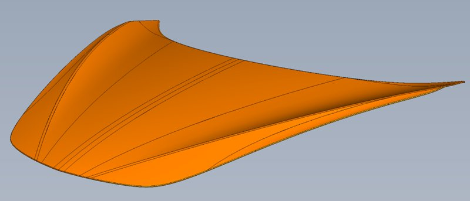
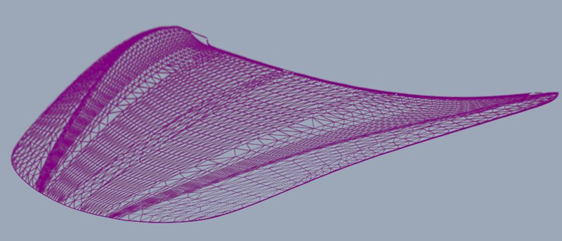
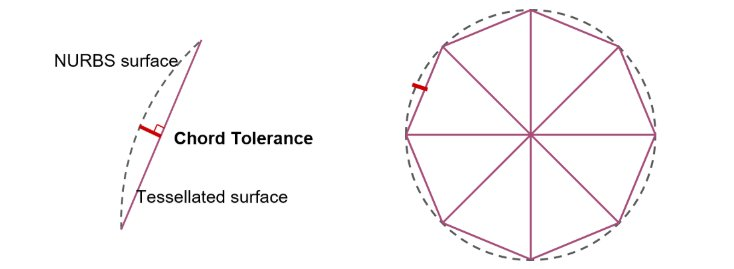
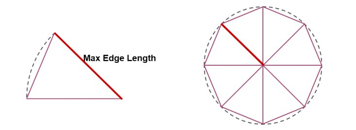
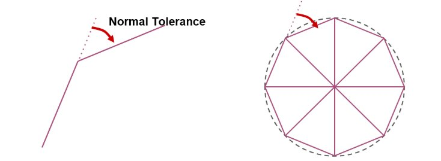

# CAD文件格式

> 路径：虚幻引擎5.7文档 / 管理内容 / Datasmith / Datasmith文件格式互操作指南 / CAD文件格式

> 原始页面：https://dev.epicgames.com/documentation/unreal-engine/importing-cad-files-into-unreal-engine-using-datasmith

本页面介绍了Datasmith是如何将场景从大多数支持的CAD文件格式导入虚幻编辑器的。它基本沿袭了[Datasmith概述](../../datasmith-plugins-overview/index.md)和[Datasmith导入流程](../../datasmith-import-process/index.md)中介绍的基础知识，但额外增加了一些CAD文件各有的转换动作。如果你打算使用Datasmith将场景从CAD文件导入虚幻编辑器，阅读此页面可帮助你理解场景是如何转换的，以及如何在虚幻编辑器中使用场景。

## CAD工作流

针对大多数CAD文件类型，Datasmith使用 **直接** 工作流。这就是说要使用Datasmith将内容导入虚幻，需要：

1. 将CAD场景保存为[受支持的文件类型](https://dev.epicgames.com/documentation/404)之一。
2. 如尚未安装，则需为项目启用 **导入器（Importers） > Datasmith CAD导入器（Datasmith CAD Importer）** 插件。
3. 虚幻编辑工具栏上的 **Datasmith** 导入程序将该文件导入。请参阅[将Datasmith内容导入到虚幻引擎中](../../datasmith-tutorials/importing-datasmith-content-into/index.md)。

> [!TIP]
> 关于其他类型的Datasmith工作流程，请参阅。

## 曲面细分

在CAD格式中，通常使用曲线和数学函数来定义曲面和实体。这些曲面的精确度和光滑度非常适用于制造过程。但是，现代GPU芯片针对由三角形网格体组成的曲面的渲染计算进行了高度优化。通常，实时渲染器和虚幻之类的游戏引擎只能处理由三角形网格体组成的几何体，必须突破这些GPU的极限，才能每秒产生数十帧令人惊叹的照片级质量图像。

Datasmith填补了这项不足，它可以自动计算三角形网格体，非常近似地估算出CAD文件中尚无网格体表达的所有曲面。此过程被称为 *曲面细分（tessellation）*，是准备可实时使用的CAD数据的重要步骤。

例如，左侧的图像显示了在本机CAD查看器中渲染的曲面。右侧的图像显示了为该曲面生成的三角形网格体的线框。

参数曲面

三角剖分网格体

为了进行实时渲染，对曲面执行曲面细分时，需要权衡曲面精度与可渲染速度。

三角形网格体本身永远不会与生成它的精确曲面完全匹配。曲面细分往往意味着要在某种细节层级对原始曲面进行采样，以创建使GPU能更快渲染几何体的近似值。通常，越接近原始曲面，网格体就越复杂；也就是说，它将包含更多三角形，而这些三角形会更小。这样渲染时可能外观更真实，但对GPU提出了更高的要求。如果降低曲面细分网格体的精度，使其包含的三角形变少、变大，GPU对其进行渲染时的速度会更快，但这种渲染所产生的效果可能看起来呈斑驳或锯齿状，无法达到令人满意的视觉保真度。

因此，在曲面细分过程中必须尽可能减少网格体中三角形的数量，同时最大程度地保持与源曲面的视觉保真度。这通常意味着，针对较为平滑和扁平的曲面需减少三角形数量、增大三角形尺寸，针对较为复杂和不平的表面需增加三角形数量、缩小三角形尺寸。

以下部分将介绍导入CAD场景时Datasmith中可调整的3个参数。通过调整这些值，可控制Datasmith为曲面创建的静态网格体几何体的复杂性和保真度。

> [!TIP]
> 你也可以为单个静态网格体资源覆盖这些相同的选项。这样你可以设置场景的整体曲面细分值，然后针对需要更高或更低细节级别的单个对象覆盖这些设置。详情请参阅[二次曲面细分CAD几何体](retessellating-cad-geometry/index.md)。

### 弦容差

弦容差（有时称为弦误差或垂度误差）定义了细分曲面上任何点距原始曲面上对应点的最大距离。

降低该参数的值会使细分曲面更接近原始曲面，进而生成更多小三角形。

在曲率较大的区域中，这种设置的效果最明显：随着容差值增加，生成的三角形会变大，曲面平滑度会降低。

|  |  |  |
| --- | --- | --- |
| [undefined](https://d1iv7db44yhgxn.cloudfront.net/documentation/images/9cce594e-1bde-4487-8627-5f9ead3c1a65/chordtolerance-1-1.png) | [undefined](https://d1iv7db44yhgxn.cloudfront.net/documentation/images/9f9df72d-e292-44e2-b051-de68797fe536/chordtolerance-2-1.png) | [undefined](https://d1iv7db44yhgxn.cloudfront.net/documentation/images/b146bbb8-8c68-4cc4-acf8-d40845414208/chordtolerance-3-1.png) |
| 0.5mm: 37 500个三角形 | 0.5mm: 37 500个三角形 | 10mm: 13 500个三角形 |

### 最大边长

此设置可以限制曲面细分网格体内任何三角形的任何一条边的最大长度。

在模型的较扁平区域，此设置的效果最明显。如果该值设置得过低，你可能会发现这些扁平区域的三角形超出了实际需要的数量。相反，如果该值设置得过高或没有设置限制，产生的三角形有时会极长极窄，形状非常奇特，最好也应避免。

如果该值设置为0，Datasmith不会限制其生成的三角形的边长。

|  |  |  |
| --- | --- | --- |
| [undefined](https://d1iv7db44yhgxn.cloudfront.net/documentation/images/a04ac644-7c94-4906-986a-49e0f1a45292/maxedgelength-1.png) | [undefined](https://d1iv7db44yhgxn.cloudfront.net/documentation/images/e094a3a8-e71b-4f70-b94b-d6cf3c911511/maxedgelength-2.png) | [undefined](https://d1iv7db44yhgxn.cloudfront.net/documentation/images/afe76b67-0b3b-45f5-ade7-7a4d32c43c9d/maxedgelength-3.png) |
| 10mm: 128 000个三角形 | 20mm: 43 700个三角形 | 40mm: 21 000个三角形 |

### 法线容差

此设置定义曲面细分网格体中任意两个相邻三角形之间的最大角度（以度为单位）。

与弦容差一样，法线容差也会影响曲面细分网格体与原始曲面的接近程度。但是，保持高曲率区域的细节层级非常有用，对曲面的较扁平区域生成的三角形几乎没有影响。

|  |  |  |
| --- | --- | --- |
| [undefined](https://d1iv7db44yhgxn.cloudfront.net/documentation/images/35c6f5ee-3f64-4a64-9811-598e96512778/normaltolerance-1.png) | [undefined](https://d1iv7db44yhgxn.cloudfront.net/documentation/images/74c72e72-c340-4464-8fef-acf4704798d2/normaltolerance-2.png) | [undefined](https://d1iv7db44yhgxn.cloudfront.net/documentation/images/f7270318-3c72-4f23-9c21-0e1fd6fc7e16/normaltolerance-3.png) |
| 5°: 295 000个三角形 | 10°: 100 000个三角形 | 40°: 21 500个三角形 |

### 拼接技术（Stitching Technique）

**拼接技术** 设置控制着在曲面细分过程中如何处理看似相连、但其实作为单独刚体或刚体中一个独立表面建模的参数曲面。

- **Stitching Sew** 会寻找应该相连的表面，并将其刚体合并到同一个静态网格体资源中。 此选项可以减少Datasmith在你的项目中创建的独立静态网格体资源的数量，但处理时间较长。

  > [!TIP]
  > Datasmith可能会使用不同策略来测试应该拼接在一起的表面。对大部分类型的源文件来说，它会测试表面和附近刚体的连通性，并合并所有其表面相连的刚体。对于其他类型的文件来说，它会使用场景层级作为决定相连表面的提示信息。
- **Stitching Heal** 的作用相同，但只会重新连接在源场景中属于同一个刚体的表面。如果Datasmith检测到同一个刚体中的独立曲面的几何体应该被连接起来，它会将这些曲面合并到其所创建的静态网格体资源内的同一个网格体元素中。 但是，开启此设置后，Datasmith永远不会将源场景的多个独立对象合并成单个静态网格体资源。
- **Stitching None** 将完全跳过拼接流程。Datasmith将始终为源场景中的每个独立刚体创建单独的静态网格体资源，并在静态网格体资源中为每个刚体包含的每一个曲面创建单独的网格体元素。
