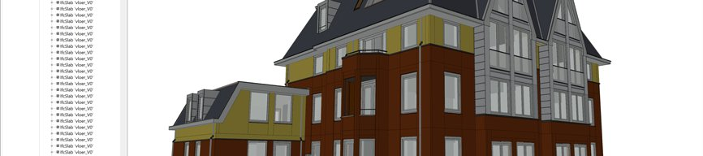
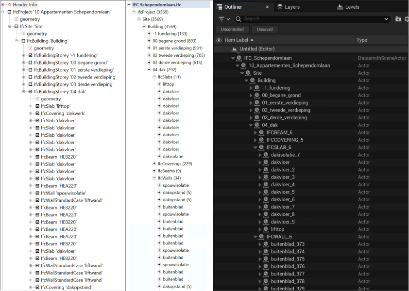
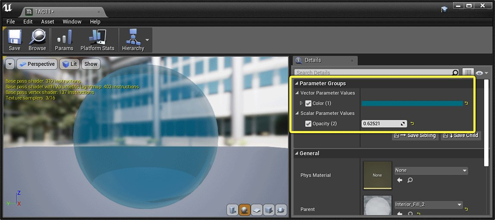
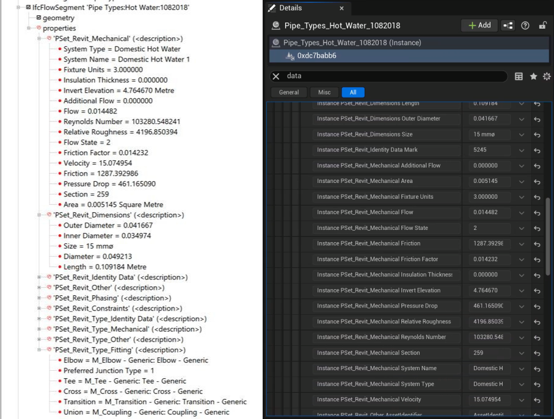
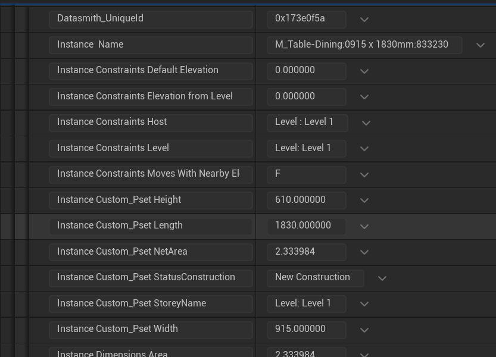

# IFC文件

> 路径：虚幻引擎5.7文档 / 管理内容 / Datasmith / Datasmith文件格式互操作指南 / IFC文件

> 原始页面：https://dev.epicgames.com/documentation/unreal-engine/importing-ifc-files-into-unreal-engine-using-datasmith

本页详述Datasmith如何将工业基础类(IFC)文件中的场景导入虚幻编辑器。其将遵循[Datasmith概述](../../datasmith-plugins-overview/index.md)和[Datasmith导入流程](../../datasmith-import-process/index.md)所述的基本流程，但添加了IFC专属的一些转换行为。若计划使用Datasmith将IFC场景导入虚幻编辑器，阅读本页将有助于了解场景转换方式、以及如何在虚幻编辑器中处理结果。

IFC查看器

虚幻引擎

## IFC工作流程

Datasmith为IFC使用直接工作流程。这意味着要利用Datasmith将IFC文件的内容导入虚幻编辑器，你需要：

1. 保存 `.ifc` 文件。
2. 为项目激活 **导入器（Importers） > Datasmith CAD导入器（Datasmith CAD Importer）** 插件。
3. 使用虚幻编辑器的工具栏上的Datasmith **IFC** 导入器将 `.ifc` 文件导入。详情请参阅[将Datasmith内容导入虚幻引擎中](../../datasmith-tutorials/importing-datasmith-content-into/index.md)。

> [!TIP]
> 关于其他类型的Datasmith工作流程，请参阅[Datasmith支持的软件和文件类型](https://dev.epicgames.com/documentation/404)。

### 支持的IFC版本

Datasmith目前支持 **IFC2x Editions 2、3和4** 格式。

欲详细了解IFC格式和规范，请参阅[buildingSMART国际技术网站](https://technical.buildingsmart.org/standards/ifc)。

## 场景层级

Datasmith为IFC场景中的各个对象创建Actor，并为各个Actor命名。该名称匹配相对应对象，并以该对象的IFC类型为前缀。Datasmith场景按父子关系排列这些Actor，此层级关系与IFC对象的组织方式密切匹配：场地包含建筑，建筑包含楼层，楼层包含墙、门、空间等。

左：IFC文件中的属性。右：从这些属性编译的Datasmith元数据。点击查看大图。

注意一些区别：

- 在上图右侧所示的虚幻编辑器 **大纲视图** 中，各层级的Actor始终按字母顺序排列。这可能会导致排列虚幻引擎与其他IFC查看和编辑应用程序之间的同级项目时出现明显差异，但父子关系保持不变。
- IFC文件中可有多个对象使用相同名称，但虚幻引擎关卡中各个Actor的名称必须唯一。Datasmith用不同的数字后缀来区分命名相同的对象。
- Datasmith仅允许Actor名称使用字母数字字符、下划线和连字符。所有其他字符都会更改为下划线。

> [!NOTE]
> 这些细微的可见差异不影响指定给IFC对象的唯一ID或其他数据。这些值由Datasmith保存在分配给各个Actor的[元数据](#%E5%85%83%E6%95%B0%E6%8D%AE)中。可利用这些元数据值在虚幻引擎中创建IFC最佳工作流程。

## 光源和摄像机

IFC规格对光发射器或摄像机的定义不同于虚幻引擎或其他3D设计/可视化工具。

- IFC中的光源被视为建筑元素。这些对象没有实时渲染所需属性的测量值，如照明半径、强度、颜色等。Datasmith导入各个ifcLamp元素并将其作为Datasmith场景中的Actor，方式与从IFC文件导入所有其他类型的对象一致。但Datasmith并不为这些Actor创建光源，如

  点光源

  、

  聚光源

  、

  矩形光源

  等。
- 摄像机不属于IFC规范，IFC文件也不能在场景上保存视点。因此，Datasmith不会在Datasmith场景中创建任何摄像机。

## 材质

Datasmith在IFC场景中每找到一个表面材质，就会在虚幻引擎中为它创建一个同名的[材质资源](../../../../designing-visuals-rendering-and-graphics/unreal-engine-materials/index.md)，并将该材质放在Datasmith场景资产旁的 **Materials** 文件夹中。Datasmith会将这些材质资源分配给它创建的静态网格体资源，以便为表面着色。

- **材质** 文件夹中的每个材质都是一个[材质实例](../../../../designing-visuals-rendering-and-graphics/unreal-engine-materials/instanced-materials/index.md)，它会公开IFC文件中设置的属性：颜色值、透明度值、高光颜色等。双击其中一个材质资源，将其在材质实例编辑器中打开。

  

  点击查看大图。

  可在 **细节（Details）** 面板中更改公开属性，修改该材质应用于表面时的效果。例如，上图所示材质公开了底色和透明度属性。

  > [!NOTE]
  > IFC与Datasmith使用的其他一些文件格式和设计应用程序不同，它不能深度控制表面属性的物理特性。Datasmith从IFC文件转换材质时，会尽可能保留原始属性。但结果通常并不逼真，也不适合虚幻引擎的物理渲染。用户通常需要替换Datasmith创建的默认材质并将其指定到静态网格体资源。可基于虚幻引擎中的材质创建自己的物理材质，或从其他源导入物理材质，例如从Epic Games Launcher的市场（Marketplace）选项卡导入。
- Datasmith还会在 **Materials/Master** 文件夹中创建一组父材质。其中每个材质都是 **Materials** 文件夹中至少一个材质资源的父项。若要更深入地控制材质图表，定义各个表面如何显示，可编辑这些父材质，向子实例公开其他参数，或在渲染期间更改对公开参数的利用。

  > [!NOTE]
  > 更改父材质也会自动更改从此父材质继承的所有材质实例。建议在修改之前复制父材质，对副本进行更改，然后更新特定材质实例，将新副本用作其父项。详情请参阅[修改Datasmith主材质](../../datasmith-tutorials/modifying-a-datasmith-master-material/index.md)。

## 元数据

Datasmith记录从IFC文件导入的各个对象的属性，并将这些属性值作为其创建的Actor上的Datasmith元数据，用于展示此对象。可在虚幻编辑器中或在虚幻引擎运行时访问该元数据。

左：IFC文件中的属性。右：根据这些属性构建的Datasmith元数据。点击查看大图。

### Datasmith如何转换来自IFC文件的属性

IFC属性按组整理。例如，上图显示了几组：**PSet_Revit_Mechanical** 、 **PSet_Revit_Dimensions** 、 **PSet_Revit_Identity Data** 等等。但Datasmith元数据始终是键和数值的扁平列表。如果你的IFC属性包含组（如上所示），Datasmith会将层级扁平化，将所有组中的所有元数据键都放入单一扁平列表中。组名称本身会被丢弃。

虚幻引擎中的IFC属性

## 制作人员

- IFC建筑由[https://github.com/buildingSMART/Sample-Test-Files/tree/master/IFC%202x3/Schependomlaan](https://github.com/buildingSMART/Sample-Test-Files/tree/master/IFC%202x3/Schependomlaan)友情提供。

  © 原始拥有者。

  此作品已获得Creative Commons Attribution 4.0 International License授权。如需更多信息及完整授权文本的链接，请访问[http://creativecommons.org/licenses/by/4.0/](http://creativecommons.org/licenses/by/4.0/)。
- 其他IFC层级图像来自 **项目3：临床** ，可从[国家建筑科学研究所](https://www.nibs.org/?page=bsa_commonbimfiles)获取。
- IFC屏幕截图取自[RDF IFC Viewer](http://rdf.bg/product-list/ifc-engine/)应用程序。
