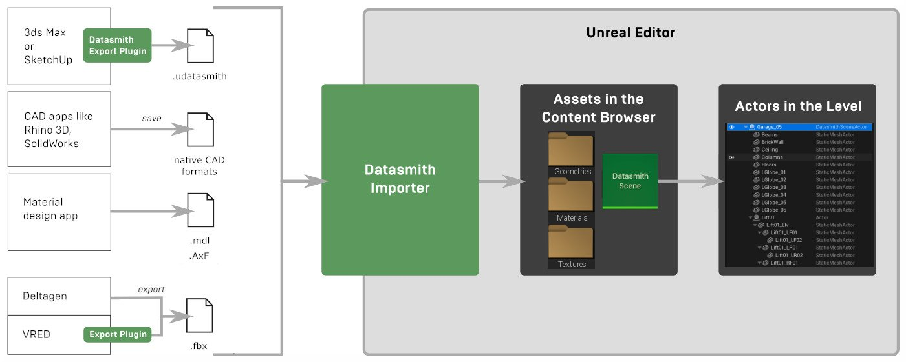
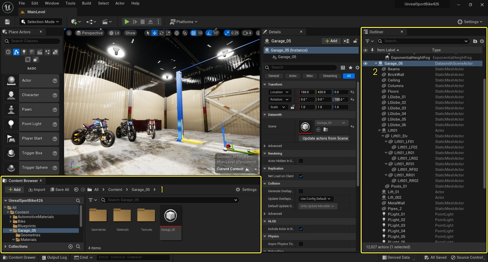
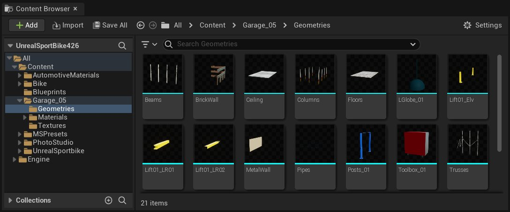
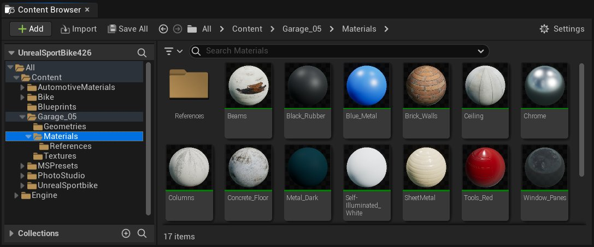
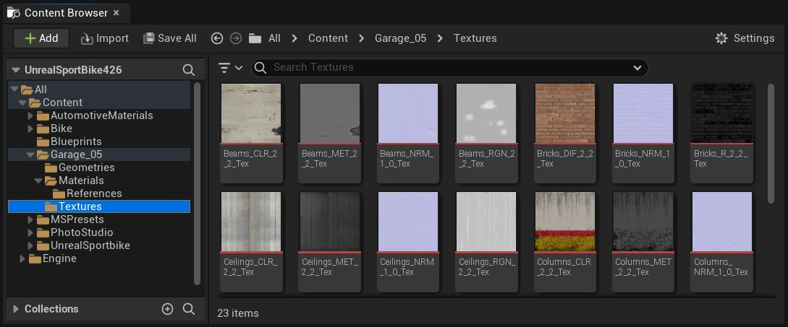
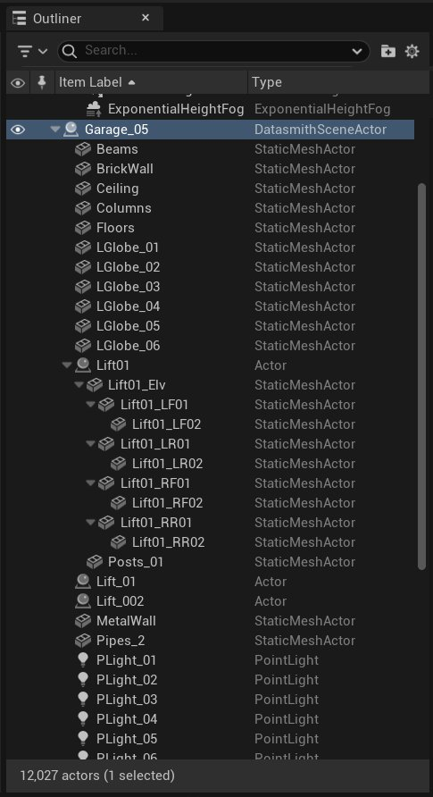
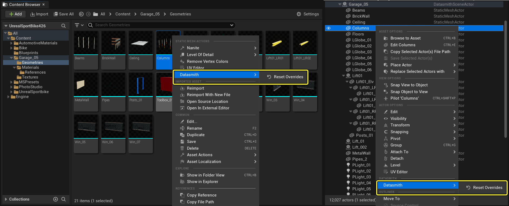

# Datasmith概述

> 路径：虚幻引擎5.7文档 / 管理内容 / Datasmith / Datasmith概述

> 原始页面：https://dev.epicgames.com/documentation/unreal-engine/datasmith-plugins-overview

**Datasmith** 是帮助你将内容导入到虚幻引擎5中的一组工具和插件。

Datasmith设计用于解决非游戏行业人士所面临的独特挑战，例如建筑、工程、建造、制造、实时培训等行业，他们需要使用虚幻引擎进行实时渲染和可视化。但在资产管道方面遇到类似问题的游戏开发者或许也会对Datasmith感兴趣。

## Datasmith有何帮助

Datasmith有很多长远目标：

- 将整个预先构造好的场景和复杂的组合导入到虚幻中，无论这些场景有多大、多密集。按照传统做法，你必须解构场景和组合件，形成独立的数据块，然后将每个数据块通过FBX导入管道单独传递到游戏引擎，然后在虚幻编辑器中重新组合场景，但Datasmith不会这样，它会复用你在其他设计工具中为了其他目的而已经构建好的资产和布局。
- 支持尽可能广泛的3D设计应用程序和文件格式。它已经能够适用于许多不同的来源，包括Autodesk 3ds Max、Trimble Sketchup、Dassault Systèmes SolidWorks以及它们的各种版本。
- 处理在更新已导入源材质中所做更改时遇到的棘手问题，而不必重做在虚幻中已经对这些资产完成的所有工作。（如需了解更多信息，请参阅

  Datasmith重新导入工作流程

  ）
- 目前，Datasmith主要是将设计内容转换为虚幻引擎能够理解并实时渲染的形式。从更长远来说，它的目的是增加更加智能的数据准备功能，调整导入的内容以便在游戏引擎中能够实现最佳运行时性能，并增加更加智能的运行时行为。

## Datasmith工作流程

Datasmith目前使用基于文件的工作流程将设计导入虚幻。

- 你以Datasmith能够处理的格式保存或导出设计数据。Datasmith能够读取许多常见CAD应用程序的原生文件格式。对于某些应用程序，包括3ds Max和SketchUp Pro，你将需要安装特殊插件，然后使用该插件导出具有

  .udatasmith

  扩展名的文件。（请参阅

  Datasmith支持的软件和文件类型

  。）
- 在虚幻编辑器中，使用Datasmith导入工具将保存或导出的文件导入到当前虚幻引擎项目中。目前，你可以控制想要从该文件导入哪些数据，并设置一个新参数来控制转换流程。（请参阅

  Datasmith导入选项

  。）

点击查看大图

## 导入后的结果

在使用Datasmith导入文件后，最先看到的是虚幻编辑器视口中呈现的所有源场景元素。它们或许暂时看起来效果不尽如人意，你稍后可以调整照明和效果，但目前，虚幻关卡应该已经完全按照源应用程序中的方式组合完毕了。

点击查看大图

你还将看到在项目内容浏览器（**1**）中创建了许多新的 *资产*，并在当前关卡（**2**）中放置了新的 *Actor*。

### 静态网格体资产

基于许多原因，Datasmith避免将源场景中的所有内容在虚幻中构建为一个网格体。过大且复杂的网格体通常非常难以流畅地进行照明和渲染，也往往效果不佳，并且你无法在虚幻中单独处理场景的各个部分。

相反，Datasmith会创建一组单独的静态网格体资产，每个代表场景的一个构建块：一个独立的几何结构数据块，可以放置到关卡中并在引擎中渲染。在将场景划分为静态网格体时，Datasmith会尽量保持你已经在源应用程序中设置好的对象组织结构。

Datasmith将所有静态网格体资产放入 **几何结构（Geometries）** 文件夹：

如果你的源场景包含同一个几何结构的多个副本，则Datasmith通常只会为该对象创建一个静态网格体资产。它在关卡中使用该资产的多个 *实例*，每个实例有其自己的位置、旋转和其他属性。这样通常会减少运行时的内存用量，提高性能。例如，在该场景中，有许多吊灯，但只有一个静态网格体资产（`L_Globe_01`）。

要阅读有关虚幻中的静态网格体的更多信息，请参阅[静态网格体](../../static-meshes/index.md)。

### 材质资产

虚幻中的每个静态网格体都需要指定有一个或多个材质资产，用来说明它的表面与入射光线的互动方式。对于Datasmith在你的源场景中识别到的每种不同类型的表面，它会在 **材质（Materials）** 文件夹中创建一个新的材质资产，并将其指定给需要使用它的静态网格体资产。

要进一步了解材质和虚幻的基于物理的渲染系统，请从这里开始：[材质](../../../designing-visuals-rendering-and-graphics/unreal-engine-materials/index.md)。

### 纹理资产

如果源应用程序使用任何纹理来定义场景几何结构的颜色或其他物理属性，Datasmith会将每个纹理导入到 **纹理（Textures）** 文件夹中的纹理资产，并设置相应的材质来引用新的纹理资产。如有必要，Datasmith可能还会将源图像文件转换为虚幻能够识别的格式。

有关在虚幻中处理纹理的信息，请参阅[纹理](../../../designing-visuals-rendering-and-graphics/textures/index.md)。

### 其他资产类型

上文所说的静态网格体、材质和纹理都是使用Datasmith导入的场景中最常见的资产类型。根据源场景中的元素类型，**内容浏览器** 内除了 **几何体**、**材质** 和 **纹理** 文件夹外，可能还会有其他新文件夹。

- **光源（Lights） -** 如果场景包含任何使用IES描述文件表示其在不同距离上强度变化的光源，Datasmith导入器会将其放入Texture Assets文件夹以定义光源强度。关于虚幻引擎中IES光源描述文件的详细系信息，请参阅[IES光源配置文件](../../../building-virtual-worlds/lighting-the-environment/features-and-properties-of-lights/using-ies-light-profiles/index.md)。
- **动画（Animations） -** 如果你的场景包含任何会随时间变换位置、旋转角度或缩放值的对象，Datasmith导入器会将这些动画转换成序列资产。你可以使用这些序列资产在虚幻引擎或虚幻编辑器中播放来自源场景的动画。关于此类转换是如何执行的，请参阅[Datasmith导入流程](../datasmith-import-process/index.md)。

### Datasmith场景资产

最后，Datasmith会创建一个 **Datasmith场景** 资产，并根据你导入的文件命名。这种新类别的自定义资产是Datasmith导入策略的一个关键部分。它的作用是包含在虚幻编辑器中，从一起导入的静态网格体构建块重新组合场景所需的所有内容，以及虚幻引擎提供的内置对象类型。

- 它存储对所有一起导入的静态网格体、材质和纹理资产的引用。
- 它存储你用来创建它所需的导入设置。
- 最重要的是，它包含Datasmith支持的原始场景中所有类型对象的层级或树形结构，包括几何结构对象、照明和摄像机。每个场景元素都存储其在3D空间中，相对于父代的位置、旋转和缩放。此外，每个不同类型的元素都会保留一组信息，这是Datasmith成功从源应用程序转换过来的信息。

你可以将Datasmith场景资产拖放到任意关卡，以在关卡中放置完全组装好的原始场景或CAD组合件。这样会使用虚幻引擎从源文件获取的等效信息，在关卡中自动重现其完整的场景层级。请参阅下一节，了解详细信息。

### 关卡Actor和场景层级

最后，所有新资产准备就绪后，Datasmith会在当前关卡中放置一个Datasmith场景实例，在关卡中复制Datasmith成功从源应用程序或文件格式转换过来的整个场景层级。

场景层级中的每个元素都由一种虚幻引擎Actor表示。

- 几何结构对象通常由静态网格体Actor表示，这些Actor引用内容浏览器中的静态网格体资产。
- 如果你导入的场景包含照明，则照明通常使用虚幻中内置的一种光源Actor类型来表示，如点光源或聚光源。请参阅

  光源类型及其移动性

  。
- 如果导入的场景包含任何摄像机，则这些摄像机通常由虚幻

  摄像机Actor

  或

  过场动画摄像机Actor

  表示。
- 导入的场景层级根是Datasmith场景Actor，它引用用来创建它的Datasmith场景资产。
- 通常，你会在场景层级中看到其他种类的Actor，如该图中的

  Lift_C

  或

  Lift_R

  。每当源场景中的父层级有一个父代，但该父代没有与特定几何结构对象关联时，Datasmith通常会创建其中一种Actor。 这些Actor通常不会分配有任何静态网格体、照明或其他对象。但是，在管理场景时，仍可以随意使用这些Actor。由于子代变换是相对于父代的，因此在场景中四处移动父代Actor时，其所有子代也会自动跟随。

## 跟踪和处理覆盖

如果你在虚幻中对导入的资产和Actor进行了任何特定类别的更改或 *覆盖*，Datasmith场景会跟踪这些更改或覆盖。这样有两大好处：

- 你可以选择性回滚你在虚幻中对资产或Actor所做的更改。这样会将Datasmith跟踪到的有关所选资产或Actor的所有信息还原到最初通过Datasmith导入内容时的状态。 在内容浏览器中右键单击资产，或在视口或世界大纲视图中右键单击Actor，然后选择 **Datasmith>重置覆盖（Reset Overrides）**。

  

  点击查看大图
- 在重新导入Datasmith场景时，你不会失去在虚幻中所做的已经记录下来的任何覆盖。例如，如果你将某个Actor移到场景中的新位置，或者为Actor设置了其他材质，Datasmith会在重新导入场景后保留这些更改。 如需了解更多信息，请参阅[Datasmith重新导入工作流程](../datasmith-reimport-workflow/index.md)。

### 跟踪的属性覆盖值

一般来说，如果在虚幻引擎中对那些通过Datasmith从源应用导入虚幻的信息进行了更改，这些更改被视作覆盖值进行跟踪。你对其他特定于虚幻的属性进行的任何更改都不会作为覆盖进行跟踪。

例如：

- 对于Datasmith在你的关卡中创建的每个Actor，它都会将这个Actor在3D空间中的变换从源应用程序导入到虚幻中。如果你移动或旋转关卡中的Actor，Datasmith会将这个更改作为覆盖跟踪。
- 而另一方面，每个静态网格体Actor都有一个

  投射阴影（Cast Shadow）

  设置，这不是从源应用程序导入的。默认情况下，Datasmith在创建每个新Actor时启用该设置。如果你将该设置更改为关闭阴影投射，则Datasmith不会将此更改作为覆盖跟踪。如果重设该静态网格体Actor的覆盖，此设置将保持关闭状态。

下表列出了Datasmith场景针对它在虚幻中创建的每种资产和Actor，目前能够作为覆盖跟踪的信息类别。

| 对象类型 | 跟踪的属性 |
| --- | --- |
| **静态网格体Actor** | 3D变换 移动性 层 标签 材质分配 修改材质分配也会覆盖静态网格体资产和在关卡内代表这些资产实例的Actor之间的默认关联。如果你修改使用Datasmith导入的静态网格体资产的材质分配，关卡中代表该资产实例的静态网格体Actor就不会像一般情况下那样立即更新。 |
| **光源Actor** | 3D变换 Datasmith设置的强度和颜色值 IES分析 层 标签 |
| **摄像机Actor** | 3D变换 Datasmith设置的FOV和曝光值 层 标签 |
| **静态网格体资产** | 材质分配 光照贴图分辨率和构建设置 曲面细分设置（适用于来自CAD文件的静态网格体） 在虚幻中对静态网格体资产的几何体本身所做的修改，如移除三角形，不会被作为覆盖跟踪。 |
| **材质实例资产** | 可在材质实例编辑器中修改的所有设置都会作为覆盖受到Datasmith的跟踪。这包括父材质公开的所有设置，还包括所有材质实例共享的设置，如 **父（Parent）**、**混合模式（Blend Mode）**、**双面（Two-Sided）** 等。 |
| **父材质和纹理资产** | 无。 |

## 后续步骤

现在，你已经熟悉了Datasmith导入工作流程的基本知识，以及如何处理项目中的Datasmith内容，接下来可以：

- 进一步了解[Datasmith导入流程](../datasmith-import-process/index.md)的详细过程。
- 想要与Datasmith配合使用的3D软件的特殊注意事项，详情参见[Datasmith软件互操作性指南](../datasmith-software-interop-guides/index.md)。
- 自己导入Datasmith文件并开始尝试操作。请参阅[教程页面](../datasmith-tutorials/index.md)。
