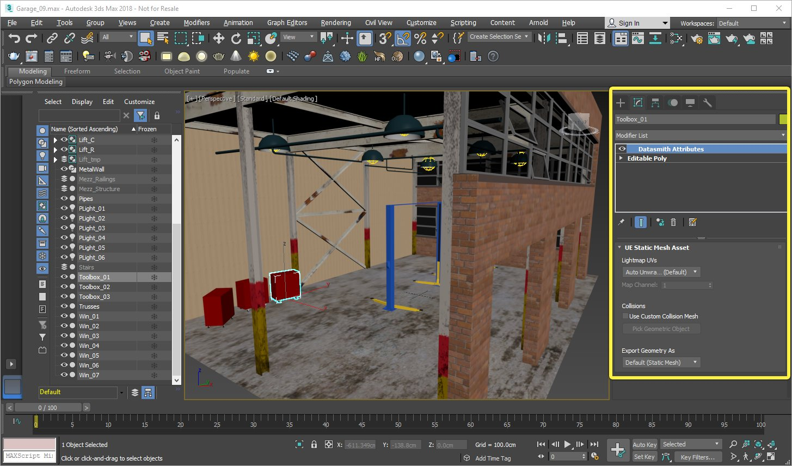
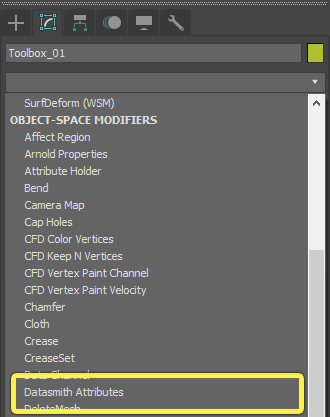
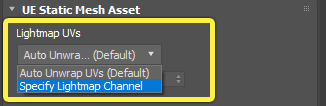
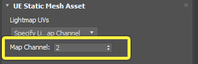
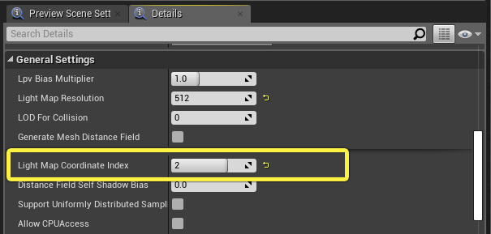
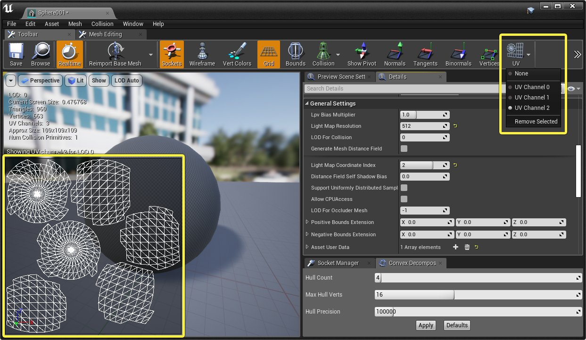
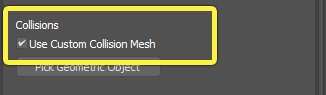
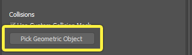

# 逐对象转换设置

> 路径：虚幻引擎5.7文档 / 管理内容 / Datasmith / Datasmith软件交互指南 / 3ds Max / 逐对象转换设置

> 原始页面：https://dev.epicgames.com/documentation/unreal-engine/datasmith-per-object-conversion-settings-for-exporting-to-unreal-engine

当您安装了用于3ds Max的Datasmith导出器插件后，还可以访问 **Datasmith属性修改器（Datasmith Attributes modifier）** 。您可以使用该修改器自定义各个场景对象从3ds Max转换到虚幻引擎的方式。例如：

- 您可以指定要用于在虚幻引擎中创建的光照贴图的UV通道的索引。请参阅

  指定光照贴图UV索引

  。
- 您可以为场景中的对象指定自定义碰撞几何体。请参阅

  设置自定义碰撞体积

  。
- 您只能将对象导出为简化边界框，而不能导出它们的完整几何体。请参阅

  仅导出边界框

  。

下图显示了指定给选定场景对象的 **Datasmith属性** 修改器。

## 应用Datasmith属性修改器

将Datasmith属性修改器应用于3ds Max场景中的对象与应用任何其他类型的修改器完全相同。有关背景信息，请参阅有关[修改器](http://help.autodesk.com/view/3DSMAX/2019/ENU/?guid=GUID-79998C44-22AA-4485-9608-51630079E5A7)的3ds Max帮助主题。

### 步骤

1. 选择要自定义其导出设置的对象。
2. 打开

   修改（Modify）

   面板。
3. 从修改器列表（Modifier List）下拉菜单中，找到 **对象空间修改器（OBJECT-SPACE MODIFIERS）> Datasmith属性（Datasmith Attributes）**。

   

### 最终结果

设置Datasmith属性修改器的默认设置，以免它们更改[使用Datasmith和3ds Max](../index.md)中描述的行为。您需要更改修改器的设置，以便自定义该默认行为。有关如何使用修改器的详细信息，请参阅以下各个部分。

## 指定光照贴图UV索引

默认情况下，Datasmith为场景中的每个几何对象创建两个新的UV通道，如[使用Datasmith和3ds Max](../index.md)中所述。其中一个通道是光照贴图UV，它存储预计算光照。这可以确保在虚幻引擎内导入的场景中的每个对象都与静态光照和固定光照兼容。有关更多信息，另请参阅[使用UV通道](../../../../static-meshes/using-uv-channels-with-static-meshes/index.md)。

不过，3ds Max允许您为您的对象创建自己的光照贴图UV。如果您选择这样做，您可能不想要Datasmith在导入时自动生成额外的UV集。相反，您可能想要将您的对象设置为使用您已经创建的光照贴图UV。

### 步骤

1. 选择Datasmith属性修改器并将它指定给您在3ds Max中创建光照贴图UV的对象。请参阅

   应用Datasmith属性修改器

   。
2. 在Datasmith属性修改器的设置中，将 **光照贴图UV（Lightmap UVs）** 设置更改为 **指定光照贴图通道（Specify Lightmap Channel）**。

   
3. 使用 **贴图通道（Map Channel）** 设置来指定使用该修改器的对象要用于存储预计算光照的UV通道的索引。

   

### 最终结果

下次导出该场景并将其导入虚幻引擎时，Datasmith将不会为应用这些修改器设置的场景对象创建任何新的UV通道。相反，它会将这些对象设置为使用您指定的 **贴图通道（Map Channel）**。

> [!TIP]
> 要验证设置是否正确转载，请在静态网格体编辑器中打开静态网格体资源。在详细信息（Details）面板中，查找 **一般设置（General Settings）> 光照贴图坐标索引（Light Map Coordinate Index）** 设置。
>
> 
>
> 该值应该反映您在3ds Max中确定的UV通道。

> [!NOTE]
> **光照贴图坐标索引（Light Map Coordinate Index）** 设置中显示的实际索引号可能与您在Datasmith属性修改器中设置的数字不匹配，这取决于在导入过程中如何重新索引3ds Max中的UV通道（请参阅[使用Datasmith和3ds Max](../index.md#uv%E9%80%9A%E9%81%93)中的UV通道概述）。 要验证索引引用您期望的UV布局，请单击静态网格体编辑器工具栏中的 **UV（UVs）** 按钮，然后选择 **光照贴图坐标索引（Light Map Coordinate Index）** 设置中显示的索引号。您应该在视口的左下角看到自定义光照贴图。
>
> 

## 设置自定义碰撞体积

您可以使用Datasmith属性修改器，指定一个您想要虚幻引擎将其用作其他场景对象的碰撞网格体的对象。有关背景信息，请参阅[使用Datasmith和3ds Max](../index.md#%E8%87%AA%E5%AE%9A%E4%B9%89%E7%A2%B0%E6%92%9E%E5%BD%A2%E6%80%81)页面上的"自定义碰撞形态"部分。

### 步骤

1. 在场景中选择在虚幻引擎物理模拟中要被替换为不同对象的对象，并应用Datasmith属性修改器。请参阅

   应用Datasmith属性修改器

   。
2. 在Datasmith属性修改器设置的 **碰撞（Collisions）** 部分下，启用 **使用自定义碰撞网格体（Use Custom Collision Mesh）** 复选框。

   
3. 单击 **选择几何对象（Pick Geometric Object）**。

   
4. 在3ds Max视口或大纲视图（Outliner）面板中，选择要用作碰撞网格体的对象。

   > [!NOTE]
   > 确保该对象符合[使用Datasmith和3ds Max](../index.md#%E8%87%AA%E5%AE%9A%E4%B9%89%E7%A2%B0%E6%92%9E%E5%BD%A2%E6%80%81) 页面上所述的要求：它必须是完全凸包的，且它的枢轴位置必须相对于它的体积保持不变。

### 最终结果

下次导出该场景并将其重新导入到虚幻编辑器时，您在上述步骤1中给其指定Datasmith属性修改器的对象将有一个新的碰撞体积，其形状与您在上述步骤4中选择的对象相同。

## 仅导出边界框

在某些情况下，对于某些场景对象，您可能想要在3ds Max中使用不同于在虚幻引擎中使用的几何体。例如，您可能想要将3ds Max中离线渲染过程中使用的高度复杂或非常密集的几何体替换为更轻的版本，后者在实时的执行效率更高。

在这些情况下，您仍然需要将这些对象包含在场景中，以便您可以在虚幻编辑器中在正确的位置替换这些对象。然而，转换复杂对象的完整几何体会使导出和导入过程花费更长的时间。还会在项目内容中留下大量不必要的静态网格体资源。

您可以通过使用Datasmith属性修改器来标记某些对象在导出过程中进行特殊处理，从而充分利用这两个场景。您可以让Datasmith基于对象的3D边界框创建一个新的、轻量级的对象几何表示，而不是导出完整几何体。这些对象仍包括在Datasmith场景中，仍使用它们的原始名称和原始位置，但是它们的几何体被大大简化为一个简单的边界框。

### 步骤

1. 在场景中选择在虚幻引擎物理模拟中要被替换为不同对象的对象，并应用Datasmith属性修改器。请参阅

   应用Datasmith属性修改器

   。
2. 在Datasmith属性修改器设置的 **将几何体导出为（Export Geometry As）** 部分下，选择 **边界几何体（Bounding Geometry）**。

   > 图片已省略：Export Geometry As Bounding Box

### 最终结果

使用Datasmith将场景导入到虚幻编辑器后，您应该会看到，使用Datasmith属性修改器标记的场景对象不会在您的关卡中显示它们的原始几何体。它们的几何体被简单的灰色包围体所取代。

例如，在下图中，3ds Max场景中心的lift对象已被标记为仅导出为边界框。导入后，在虚幻引擎关卡中，它们仅显示为使用默认材质的简化体积。

|  |  |
| --- | --- |
| [undefined](https://d1iv7db44yhgxn.cloudfront.net/documentation/images/4309a376-af77-49b1-8ebd-6510dbce7de4/modifier-export-bb-before.png) | [undefined](https://d1iv7db44yhgxn.cloudfront.net/documentation/images/0420f5f4-e521-4d46-8481-7aa930ac161f/modifier-export-bb-after.png) |
| 3ds Max中的几何体 | UE4中的边界框 |

此时，您可以以许多不同的方式使用这些简化的场景元素。例如，您可能想要将简化对象替换为您自己的自定义静态网格体资源的实例。或者，您可能想要将简化Actor从视图中隐藏，但又要将它们包含的信息（例如它们在3D空间中的位置和它们的边界框的范围）用于其他目的。
