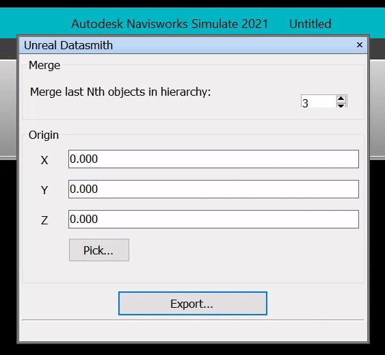
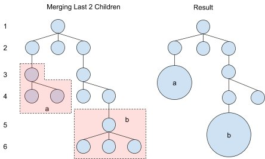
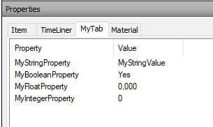

# Navisworks

> 路径：虚幻引擎5.7文档 / 管理内容 / Datasmith / Datasmith软件交互指南 / Navisworks

> 原始页面：https://dev.epicgames.com/documentation/unreal-engine/using-datasmith-with-navisworks-in-unreal-engine

本页面将介绍 **Datasmith** 如何将Autodesk **Navisworks** 中的场景导入 **虚幻引擎（UE）**。导入过程遵循[Datasmith概述](../../datasmith-plugins-overview/index.md)和[关于Datasmith导入流程](../../datasmith-import-process/index.md)文档中所述的基本流程，但增加了与Navisworks相关的一些特殊转换操作。若你计划使用Datasmith将场景从Navisworks导入UE，阅读本页有助于你了解场景转换方式以及你该如何在虚幻编辑器中处理导出结果。

## Navisworks工作流

与Revit或3ds Max Datasmith导出器类似，Navisworks导出器同样采用导出工作流。这意味着，要利用Datasmith将内容导入编辑器，你须执行以下操作：

1. 安装适用于Navisworks的Datasmith导出器。请参阅下文的 **安装说明** 小节。
2. 使用通过插件添加到工具栏的 **Datasmith导出（Datasmith Export）** 按钮，导出Navisworks中的内容。请参阅[从Navisworks中导出Datasmith内容](exporting-datasmith-content-from-navisworks-to/index.md)。
3. 使用虚幻编辑器工具栏中的Datasmith导入器导入 `.udatasmith` 文件。请参阅[将Datasmith内容导入到虚幻引擎中](../../datasmith-tutorials/importing-datasmith-content-into/index.md)。

## 安装说明

在导出Navisworks内容，你必须在[Datasmith导出插件](https://www.unrealengine.com/en-US/datasmith/plugins)页面上下载并安装 **Datasmith Exporter for Navisworks** 插件。

如需查看该插件支持的Navisworks版本，请参阅。

> [!TIP]
> 我们鼓励你与他人（包含你的组织的内部或外部人员）分享Datasmith Exporter插件的下载链接。但请注意，你无权直接分发Datasmith Exporter插件本身。

安装Datasmith Exporter for Navisworks插件，请确保：

- Navisworks未运行。
- 你下载的导出插件的安装程序符合你要用的虚幻引擎版本。
- 你已经将之前安装过的所有Datasmith Exporter for Navisworks插件卸载。

下载完安装程序后，双击打开它，然后按照以下步骤操作。

如果你需要卸载Datasmith Exporter for Navisworks插件，你可以在 **控制面板** 中卸载。

## 将几何体转换为静态网格体

用于Navisworks的Datasmith导出器使用类似于Revit和3ds Max导出器的过程，以保留文件中包含的几何体、材质和元数据：

- 为了保持性能，Datasmith以用户定义关卡合并层级中的对象，以便创建更大的网格体，并使三角形数量保持在一百万以下。
- 合并网格体后，导出器将在

  内容浏览器

  中为剩余的每个网格体创建新的

  静态网格体

  资产。导出器将保留Navisworks

  属性（Properties）

  面板中设置的每个网格体的

  名称

  ，并将它们放在

  几何体（Geometries）

  文件夹中。
- 导出器将使用空白Actor对象在世界大纲视图中保留Navisworks中的层级关系。
- 场景围绕用户定义的原点进行组建。

## 合并层级中的对象

由于Navisworks场景包含来自多个源的大量数据，因此有必要在导出过程中进行合并资产数量操作。Datasmith通过在用户定义的层级深度上合并对象流程来完成此操作：

在下方示例中，我们可以看到，将值设置为2时，Datasmith如何将对象从底部合并2个关卡：

> [!NOTE]
> 如果节点子树中包含的三角形在100万个以上，则Datasmith会将对象合并到生成的网格体三角形不超过100万的关卡。

## 设置原点

Autodesk Navisworks使用双精度坐标系，可支持位置距离原点很远的模型。这点与虚幻引擎不兼容，可能导致不能精确导入。因此，在使用Navisworks中的Datasmith导出器时，用户可以指定场景的原点。指定的点将成为虚幻引擎中的原点（0,0,0）：

> 动图已省略：在Navisworks中选择原点

## Navisworks元数据

Datasmith将存储在Navisworks中对象上的元数据导入为 **选项卡**：

数据以选项卡名称开头，格式如下：

_[TabName]_[PropertyName] = [Value]_

因此，在上图中，生成数据将为：

_MyTab_MyStringProperty = "MyStringValue"

MyTab_MyBooleanProperty = "Yes"

MyTab_MyFloatProperty = "0.000"

MyTab_MyIntegerProperty = "0"_

## Navisworks材质

对于Navisworks场景中的每种表面材质，Datasmith都将在虚幻引擎中使用相同名称创建 **材质** 资产。这类资产放在 **材质（Material）** 文件夹中，位于Datasmith场景资产旁。

- 放在材质文件夹中的每个资产都是公开了Navisworks中所设置属性的材质实例。你可以更改此类公开参数，以便修改材质应用到表面时的外观。Datasmith会将这些材质分配给它在导入过程中创建的静态网格体。
- Datasmith还会创建一组位于

  材质/主（Materials/Master）

  文件夹中的主材质，一个用于半透明材质，另一个用于不透明材质。其中每个主材质都是

  材质（Materials）

  文件夹中至少一个材质实例的父级。材质图定义了各个表面在虚幻引擎中如何显示，如果希望更深入地控制材质图，可以编辑这些材质，向子材质实例公开一些额外参数，或追踪渲染期间这些参数的处理方式。

> [!NOTE]
> 更改主材质也会自动更改继承自此材质的所有材质实例。一个经常使用功能的好办法是：在修改材质前，先复制主材质，然后更改材质副本，最后通过将材质副本设为父材质来更新特定材质实例。相关细节，请参阅[修改Datasmith主材质](../../datasmith-tutorials/modifying-a-datasmith-master-material/index.md)。
