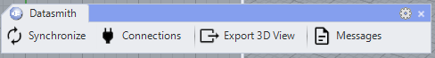
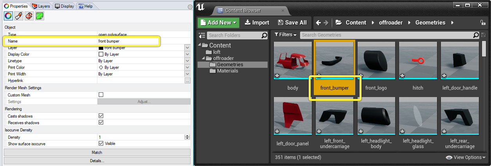
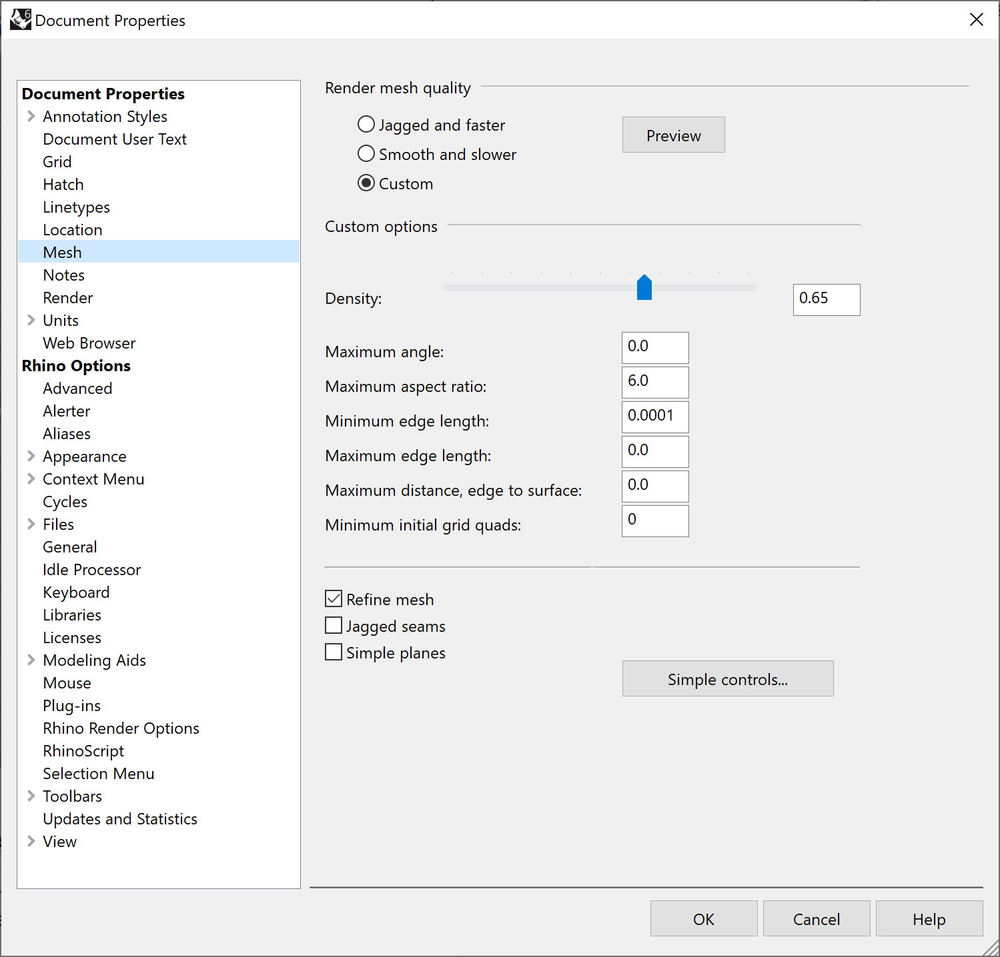
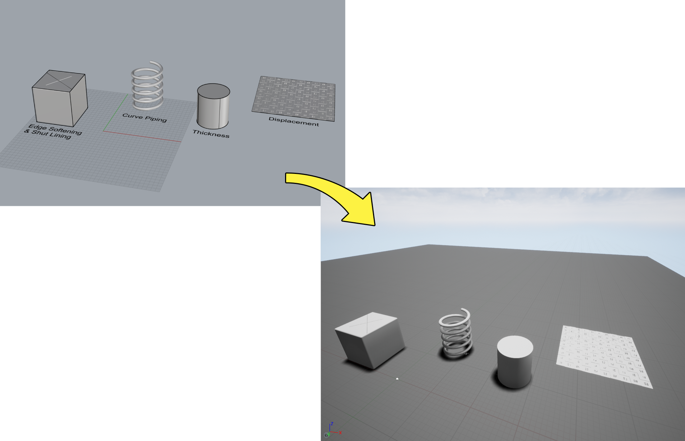
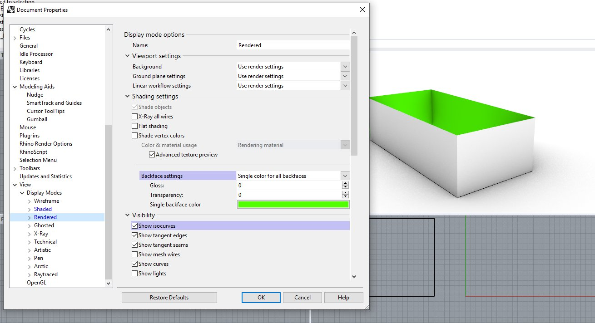
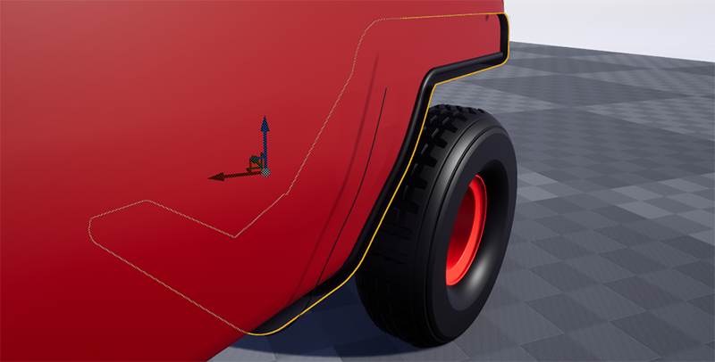
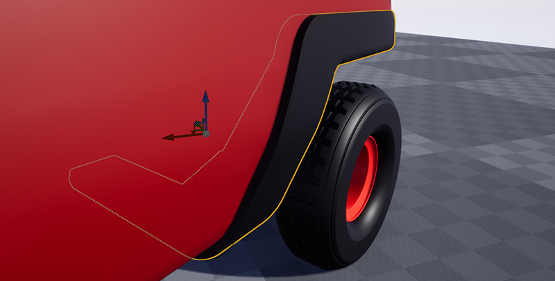
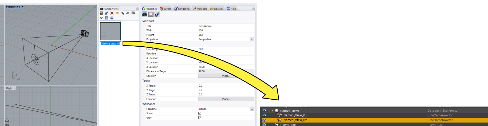

# Rhino

> 路径：虚幻引擎5.7文档 / 管理内容 / Datasmith / Datasmith软件交互指南 / Rhino

> 原始页面：https://dev.epicgames.com/documentation/unreal-engine/using-datasmith-with-rhino-in-unreal-engine

本页介绍 **Datasmith** 如何将场景从 **McNeel Rhinoceros (Rhino)** 导入虚幻引擎。它遵循[Datasmith概述](../../datasmith-plugins-overview/index.md)和[Datasmith导入流程](../../datasmith-import-process/index.md)中介绍的基本流程，但增加了一些专用于Rhino的特殊转换行为。如果你打算使用Datasmith将场景从Rhino导入虚幻编辑器，阅读本页可帮助你了解场景的转换流程以及如何在虚幻编辑器中处理结果。

## Rhino工作流程

### 导出工作流程

Datasmith为Rhino使用导出工作流程。这意味着，要使用Datasmith将Rhino内容导入虚幻引擎，你需要：

1. 为Rhino安装Datasmith Exporter插件。请参阅下文中的 **安装说明** 小节。
2. 使用另存为（Save As）或导出（Export）流程导出你的Rhino内容。请参阅[从Rhino中导出Datasmith内容](exporting-datasmith-content-from-rhino-to/index.md)。
3. 使用虚幻编辑器工具栏中提供的Datasmith导入器来导入 `.udatasmith` 文件。请参阅[将Datasmith内容导入到虚幻引擎中](../../datasmith-tutorials/importing-datasmith-content-into/index.md)。

### Direct Link工作流程

要在虚幻引擎中实时预览Rhino场景的更改，你可以在两者之间设置一个Datasmith Direct Link。这样就可以避免每次进行更改时手动将整个场景重新导入虚幻引擎。有关更多信息，请参阅[使用Datasmith Direct Link](../../datasmith-tutorials/using-datasmith-direct-link/index.md)文档。

## 使用Datasmith工具栏

安装Datasmith插件会在Rhino中添加一个可停靠的工具栏。

Rhino中的Datasmith工具栏

你可以通过在Rhino的命令行中输入相关命令来触发相同的操作。

> [!TIP]
> 要查看Datasmith的所有命令，请在Rhino中打开 **插件管理器（Plugin Manager）** 窗口（在命令行中运行PlugInManager），然后选择 **Datasmith Exporter（Datasmith导出器）** 插件。

| 按钮 | 描述 | 命令行 |
| --- | --- | --- |
| **同步（Synchronize）** | 通过Direct Link连接推送选定的模型。 要快速选择场景中的所有内容，请按 **Ctrl + A**（Windows）或 **Cmd + A**（Mac）。 | ` DatasmithDirectLinkSync` |
| **连接（Connections）** | 启动连接状态（Connection Status）对话框。 | `DatasmithDirectLinkConnections` |
| **导出3D视图（Export 3D View）** | 启动现有的 `.udatasmith` 导出器，将 `.udatasmith` 文件保存到磁盘。 | `DatasmithExport` |
| **消息（Messages）** | 启动消息和日志记录窗口。这对查看报告错误、缺失的纹理和其他信息非常有用。 | `DatasmithMessages` |

> [!WARNING]
> 安装插件后，Rhino会将Datasmith工具栏添加到界面中。如果卸载该插件，此工具栏将自动删除。对于通过从 **选项（Options）** 菜单的 **工具栏（Toolbar）** 部分拖动添加到默认工具栏的Datasmith工具栏，卸载过程不会删除相应副本，需手动进行删除。

## 安装说明

在导出Rhino内容之前，你必须从[Datasmith导出插件](https://www.unrealengine.com/en-US/datasmith/plugins)页面下载并安装 **Datasmith Exporter for Rhino️** 插件。

要查看插件支持的Rhino版本，请参阅。

> [!TIP]
> 我们鼓励你积极与组织内外的人员共享Datasmith Exporter插件的下载链接。但需要注意的是，你不得自行分发Datasmith Exporter插件的安装程序。

在安装Datasmith Exporter for Rhino插件之前，请确保：

- Rhino未运行。
- 你已下载适用于所用虚幻引擎版本的导出器插件安装程序。
- 你已卸载所有以前版本的Datasmith Exporter for Rhino插件。

下载安装程序后，双击将其打开，然后按照屏幕上的说明进行操作。

如果需要卸载Datasmith Exporter for Rhino插件，可以像处理任何其他应用程序一样执行操作：

- Windows：从 **控制面板** 卸载插件。
- macOS：在 **Finder** 中找到插件并将其拖到Dock上的垃圾桶图标，或右键单击并选择 **Move to Trash**。

## 将几何体转换为静态网格体

Datasmith会为Rhino文件中的每个单独的网格、实体或表面创建单独的静态网格体资产。如果对象在Rhino的 **属性（Properties）** 面板中设置了 **名称（Name️）** 属性（如下图左侧所示），Datasmith将为静态网格体资产使用该名称（如下图右侧所示）。Datasmith在关卡中创建的引用该静态网格体资产的任何Actor也使用该名称。

点击图片查看大图。

### 实例化

当Datasmith在Rhino场景中检测到同一块有多个实例时，它只会为该块中的几何体创建一组静态网格体资产。然后，它将这些静态网格体的多个实例放置到场景中。这通常更符合项目的运行时内存要求并能优化性能， 同时还方便更轻松地管理 **内容浏览器（Content Browser）** 中的静态网格体数量。

我们建议尽可能利用这一功能，在Rhino中将场景中的任何重复元素（例如门窗或椅子）制作成块。

有关细节，请参阅[Rhino文档](https://wiki.mcneel.com/rhino/usingblocks)。

### 曲面细分和渲染网格体

虚幻引擎始终使用三角形网格体来渲染对象。如果Rhino文件中含有定义为参数化表面或NURBS的对象，则需要将这些表面变换或曲面细分为三角形网格体。Datasmith将使用位于 **文件（File）> 属性（Properties）> 文档属性（Document Properties） | 网格体（Mesh）** 中的Rhino曲面细分选项：

点击图片查看大图。

| 名称 | 描述 |
| --- | --- |
| **锯齿状且速度较快（Jagged and Faster）** | 以牺牲一些质量为代价创建较低密度的网格体，从而快速为对象着色。 |
| **更流畅但速度较慢（Smoother and Slower）** | 降低速度以创建更高密度的网格体，从而更准确地为对象着色。 |
| **自定义（Custom）** | 允许更好地控制创建的网格体。密度滑块可粗略控制从NURBS表面创建的多边形的密度和数量。单击详细（Detailed）功能按钮可使用其他功能按钮。 |

有关在Rhino中使用自定义渲染选项的更多信息，请参阅Rhino文档中的[多边形网格体详细选项](http://docs.mcneel.com/rhino/6/help/en-us/index.htm#popup_moreinformation/polygon_mesh_detailed_options.htm)。

## 网格体修改器

Rhino支持通过多种方式来更改网格体的外观，无需直接编辑网格体。

使用Datasmith从Rhino导出数据时，会保留以下网格体修改器：

- [装饰线（Shut Lining）](https://docs.mcneel.com/rhino/6/help/en-us/index.htm#properties/shutlining.htm)
- [边缘软化（Edge Softening）](https://docs.mcneel.com/rhino/6/help/en-us/index.htm#properties/edgesoftening.htm)
- [置换（Displacement）](https://docs.mcneel.com/rhino/6/help/en-us/index.htm#properties/displacement.htm)
- [曲线管道（Curve Piping）](https://docs.mcneel.com/rhino/6/help/en-us/index.htm#properties/curvepiping.htm)
- [厚度（Thickness）](https://docs.mcneel.com/rhino/6/help/en-us/index.htm#properties/thickness.htm)

点击图片查看大图。

### 三角形朝向

导出到Datasmith时，表面方向会保持不变。在Rhino中可视化表面方向的一种方法是将背面的颜色设置为亮绿色。为此，请打开 **文档属性（Document Properties）** 并选择 **查看（View）> 显示模式（Display Modes）> 渲染（Rendered）**。在该菜单的 **着色设置（Shading Settings）** 中，会出现 **背面设置（Backface settings）** 的选项。最后，在 **为所有背面采用单一颜色（Single color for all backfaces）** 中，将颜色更改为亮绿色：

点击图片查看大图。

这样就可以在导出到Datasmith之前检查这些面的方向是否正确：

向后

向前

有关完整的讨论和推荐的解决方案，请参阅[Datasmith导入流程](../../datasmith-import-process/index.md)。

## Rhino材质

对于Datasmith在Rhino场景中找到的每种不同的表面材质，它都会在虚幻引擎中创建一个单独的[材质资产](../../../../designing-visuals-rendering-and-graphics/unreal-engine-materials/index.md)并使用相同的名称。然后将每个材质放置在Datasmith场景资产旁边的 `Materials` 文件夹中。

- `Materials` 文件夹中的每个材质都是[材质实例](../../../../designing-visuals-rendering-and-graphics/unreal-engine-materials/instanced-materials/index.md)，它将公开在Rhino文件中设置的属性：颜色值、纹理贴图等。你可以更改这些公开的属性，以修改材质在应用于表面时的外观。Datasmith将这些材质资产分配给它创建的静态网格体资产，以便采用在Rhino渲染中所示的方式对它们的表面进行着色。 Datasmith只会将Rhino对象的材质导入虚幻引擎。它会完全忽略Rhino显示颜色。这样，导入虚幻引擎的视觉效果会与在Rhino中渲染的效果尽可能接近。
- Datasmith还在 `Materials/Master` 文件夹中创建一组父材质。分别是Materials文件夹中至少一个材质资产的父级。通过编辑这些父材质，你可以更好地控制用于定义每个表面显示方式的材质图表，向子实例公开其他参数，或者更改在渲染期间公开参数的方式。 请注意，更改父材质也会自动更改从该父材质继承的所有材质实例。可以考虑在修改父材质之前对其进行复制，然后对副本进行更改，最后才更新特定材质实例，从而将新副本用作其父材质。有关细节，请参阅[修改Datasmith主材质](../../datasmith-tutorials/modifying-a-datasmith-master-material/index.md)。

## 命名视图

Rhino中的 **命名视图** 相当于虚幻引擎中的相机。通过Datasmith导入虚幻引擎时，每个命名视图都会在场景中变成一个单独的 **CineCameraActor️**。

点击图片查看大图。

## Rhino元数据

**属性用户文本（Attribute User Text️）** 菜单中的数据输入将作为Datasmith元数据导出：

> 图片已省略：Datasmith Rhino Metadata

数据以键值对的形式输入到表中。有关使用属性用户文本的更多信息，请参阅Rhino文档中的[属性用户文本](https://docs.mcneel.com/rhino/6/help/en-us/properties/attributeusertext.htm)

## 构建Datasmith场景层级

Datasmith根据Rhino模型构建其场景层级，如下所示：

- 对于Rhino场景中的每一层，Datasmith都会在虚幻引擎中创建一个Actor，作为该层上所有对象的父级。请注意，与它在虚幻编辑器的"图层"（Layers）面板中创建的图层不同，此Actor层级并未展平。Actor的嵌套方式与Rhino场景中的图层完全一样。
- 在代表每一图层的Actor下，对应图层上的每个实例化块都由另一个Actor表示。
- 最后，代表每个图层和每个块的Actor都包含静态网格体Actor，代表构成该图层或块的实际几何体对象。Rhino中的点在虚幻引擎中表示为一个空Actor。这样将保留点
- Rhino中的组不影响虚幻引擎场景层级，因为它们被视为选择助手，而不是场景层级中的重要元素。

例如，在下图中，可以看到Rhino层级中的每一图层在虚幻编辑器中都有一个对应的Actor。像光源（lights）> 转向信号（turn signals）这样的图层，在Rhino中只包含几何体对象，在虚幻编辑器中只包含相应的静态网格体Actor。Rhino中的光源图层还包含两个块实例，名为left_headlight和right_headlight， 分别由虚幻编辑器中的一个嵌套Actor表示，该Actor又包含构成这些块的几何体对象。

> 图片已省略：undefined

点击图片查看大图。

> [!NOTE]
> 本页使用的模型由[Turbosquid](https://www.turbosquid.com/3d-models/3d-3dm-car-offroad-van/1137533)用户[tomashorin.design](https://www.turbosquid.com/Search/Artists/tomashorin.design)提供。
