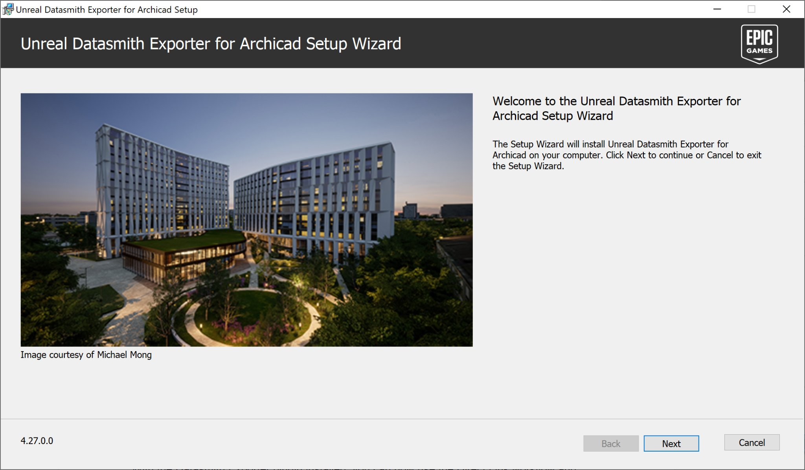
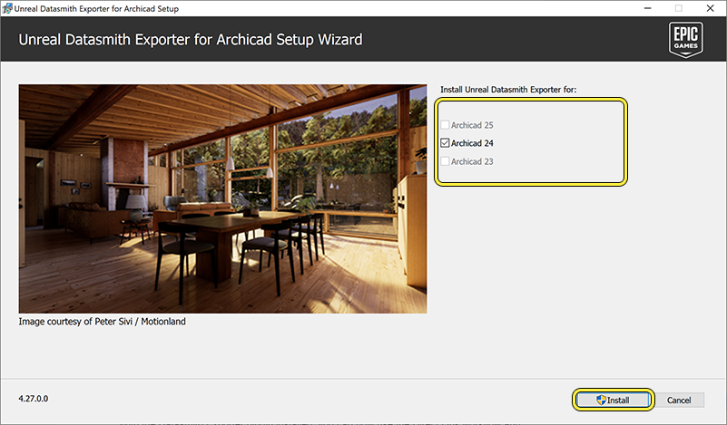
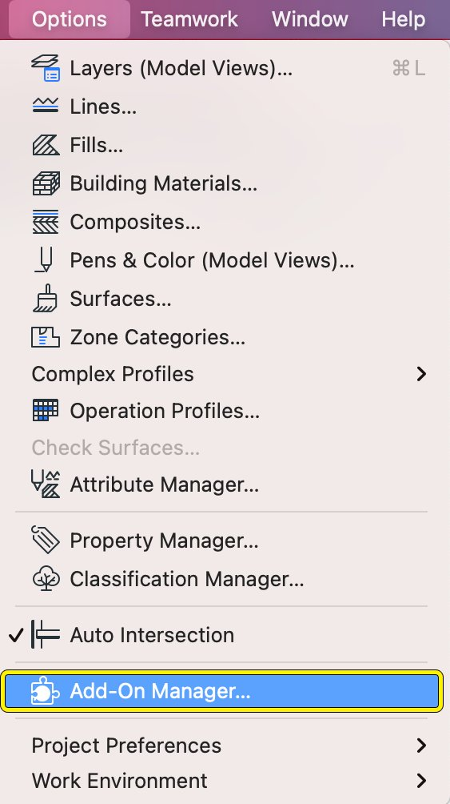
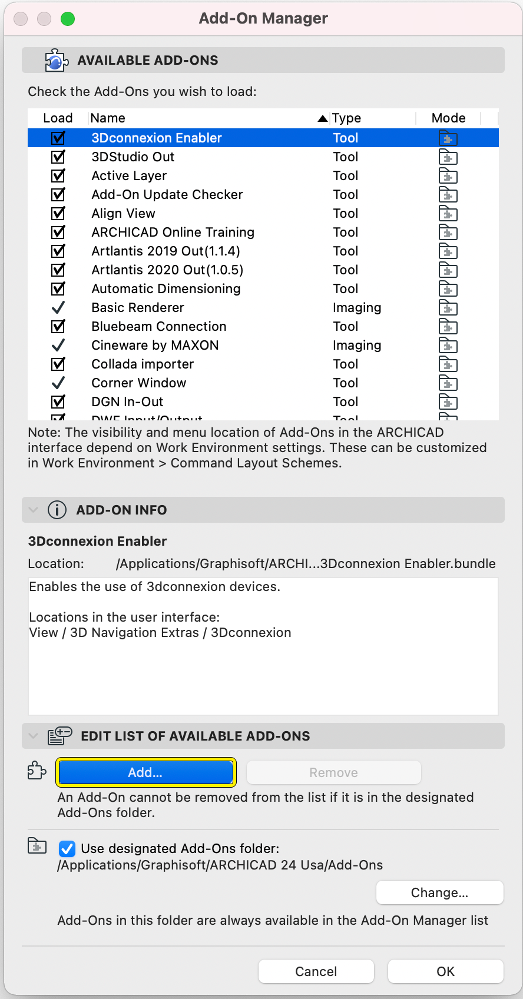
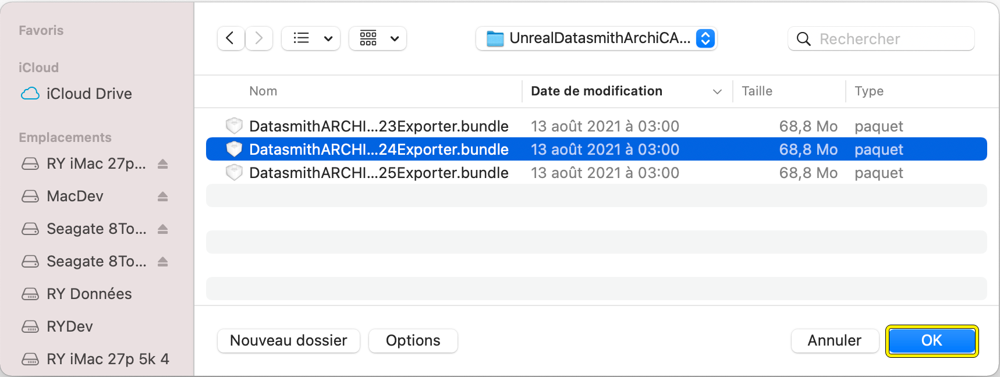
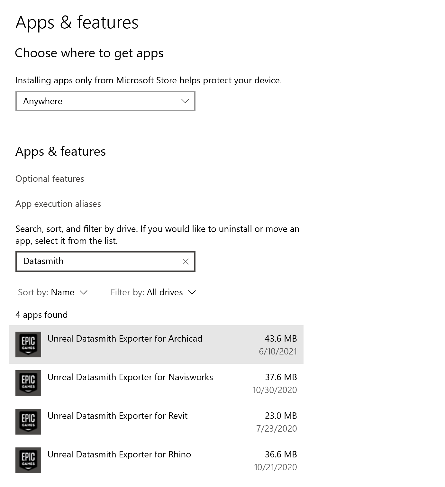
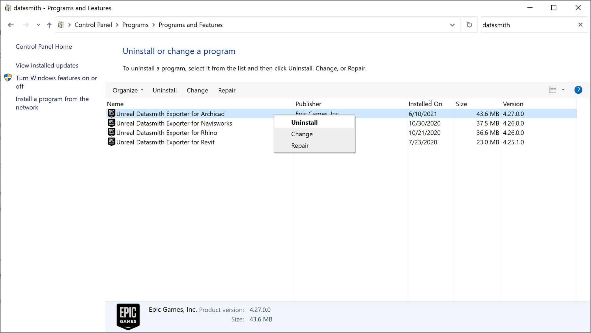
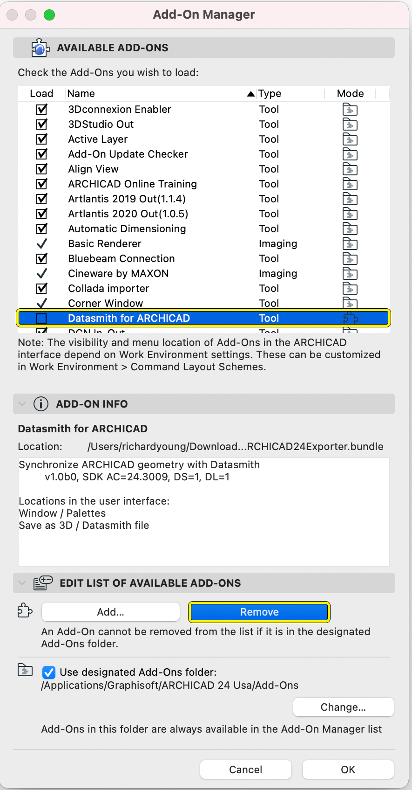

# 安装说明

> 路径：虚幻引擎5.7文档 / 管理内容 / Datasmith / Datasmith软件交互指南 / 将Datasmith与Archicad结合使用 / 安装说明

> 原始页面：https://dev.epicgames.com/documentation/unreal-engine/datasmith-plugin-for-archicad-installation-notes

选择操作系统：

Windows

macOS

Linux

开始导出Archicad内容之前，你需要下载[Unreal Datasmith Exporter for Archicad](https://www.unrealengine.com/en-US/datasmith/plugins)。

要查看插件支持哪些版本的Graphisoft Archicad，请参阅。

> [!TIP]
> 我们鼓励你将Datasmith Exporter插件的下载链接分享给他人。请注意，用户不可自行分发Datasmith Exporter插件。

## 安装Datasmith for Archicad插件

1. 关闭计算机上所有运行中的Archicad实例。假如当前有Archicad正在运行，安装将失败。
2. 如果已经安装旧版本的Datasmith Exporter插件，建议在继续之前先卸载该插件。欲知详情，请参阅[移除Datasmith Exporter for Archicad](#removingthedatasmithexporterforarchicad)。

   > [!WARNING]
   > Graphisoft提供自己的Datasmith Exporter for Archicad。Epic Games建议在安装自己的Datasmith for Archicad插件之前，移除Graphisoft插件。
3. 从[Datasmith Exporter插件下载](https://www.unrealengine.com/en-US/datasmith/plugins)页面下载Datasmith Exporter插件安装程序。
4. 下载完成后，前往文件所在位置并运行安装程序。

   

   Unreal Datasmith Exporter for Archicad设置向导。
5. 按照屏幕上的说明操作并接受许可协议以继续。
6. 安装程序将自动检测系统上安装的Archicad版本。选中要导出到Datasmith的每个版本的复选框，然后点击 **安装**。

   

   选择要与插件一起使用的Archicad版本。

1. 关闭计算机上运行的Archicad的所有正在运行的实例。如果当前正在运行任何实例，安装将失败。
2. 如果已经安装旧版本的Datasmith Exporter插件，建议在继续之前先卸载该插件。欲知详情，请参阅[移除Datasmith Exporter for Archicad](#removingthedatasmithexporterforarchicad)。

   > [!WARNING]
   > Graphisoft提供自己的Datasmith Exporter for Archicad。Epic Games建议在安装自己的Datasmith for Archicad插件之前，移除Graphisoft插件。
3. 从[Datasmith Exporter插件下载](https://www.unrealengine.com/en-US/datasmith/plugins)页面下载Datasmith Exporter插件安装程序。
4. 打开 **选项** 菜单并选择 **追加项目管理器**，即可打开Archicad实例并打开追加项目管理器。

   

   打开追加项目管理器。
5. 导航到 **编辑可用追加项目列表** 部分，然后点击 **添加** 按钮。

   

   在Archicad中添加新的追加项目。
6. 导航到Datasmith Exporter for Archicad文件的位置，并选择与你的Archicad版本相对应的包。点击"确定"继续。

   

   导航到Datasmith Exporter for Archicad安装文件的位置，并选择与你的Archicad版本相对应的软件包。

### 最终结果

安装Datasmith Exporter插件后，你现在可以使用Direct Link工作流，并将Archicad的场景导出为".udatasmith"文件。请参阅[从Archicad导出Datasmith内容](../exporting-datasmith-content-from-archicad-to/index.md)。

> [!NOTE]
> 每次发布虚幻引擎新版本时，Epic Games都会发布新的Unreal Datasmith Exporter for Archicad插件版本。如果切换到不同版本的虚幻引擎，请记住下载并安装插件匹配的版本。

## 移除Datasmith Exporter for Archicad

使用系统的标准控制面板实用程序查找并移除Unreal Datasmith Exporter for Archicad应用程序。

举例而言，在Windows 10上你可以使用 **程序和功能** 控制面板。

在"程序和功能"控制面板中，搜索Datasmith插件。

点击列表中Datasmith Exporter插件的条目，然后点击 **卸载**。

或者使用控制面板中的 **卸载或更改程序** 窗口。右键点击Datasmith exporter插件的条目，然后在上下文菜单中选择 **卸载**。

使用"卸载或更改程序"控制面板移除Datasmith插件。

使用Archicad内的追加项目管理器（Add-On Manager）移除Unreal Datasmith Exporter for Archicad。

1. 点击

   选项

   菜单并选择

   追加项目管理器

   ，打开追加项目管理器。
2. 点击

   可用追加项目

   列表中的

   Datasmith for ARCHICAD

   旁边的复选框来禁用该追加项目。
3. 点击"移除"按钮移除插件。

使用追加项目管理器移除Datasmith插件。
