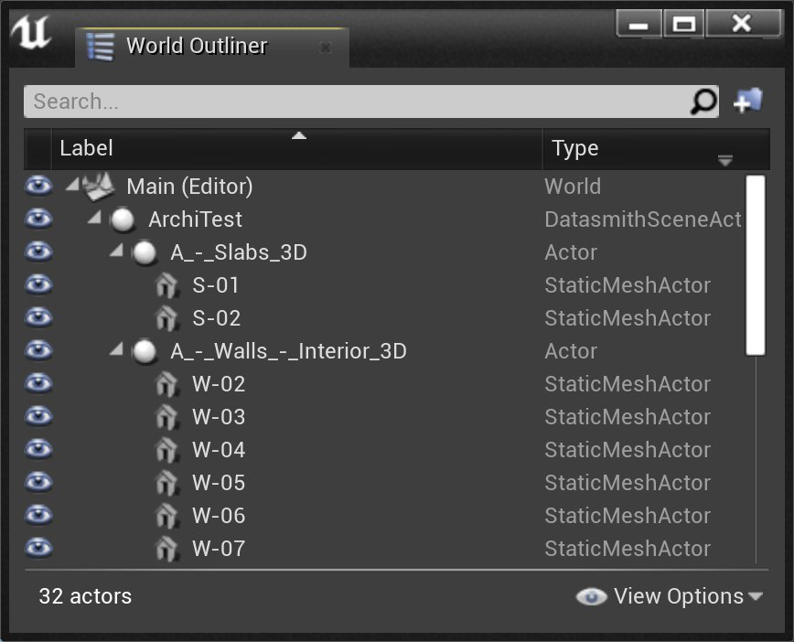
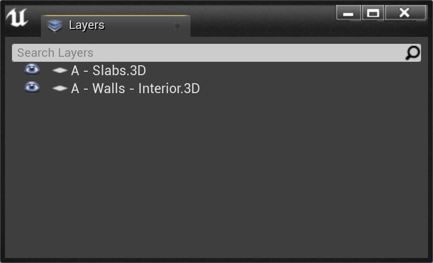
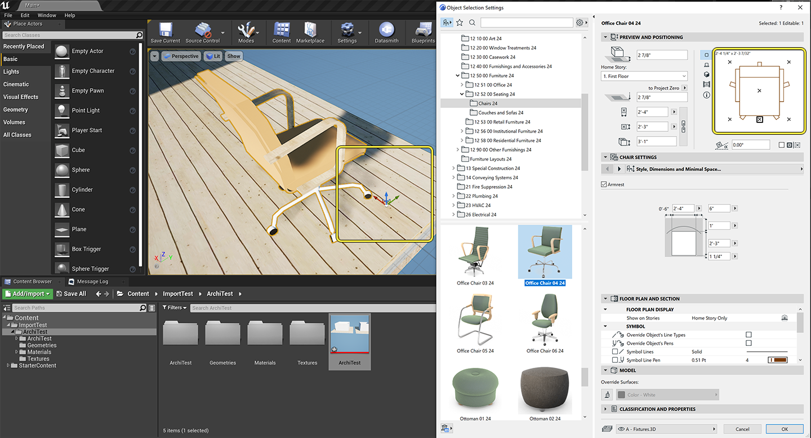
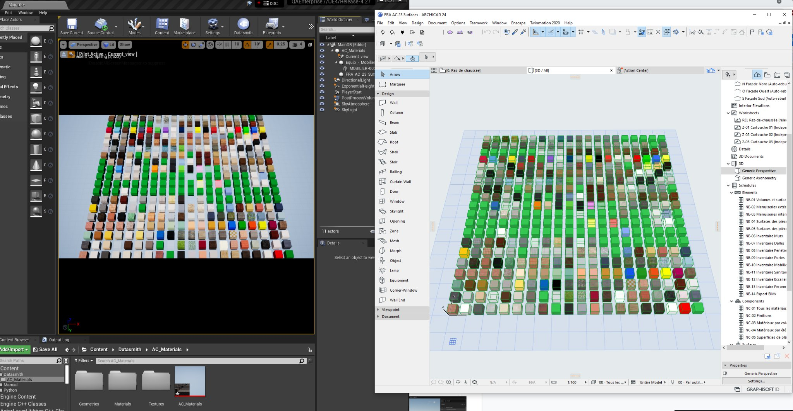
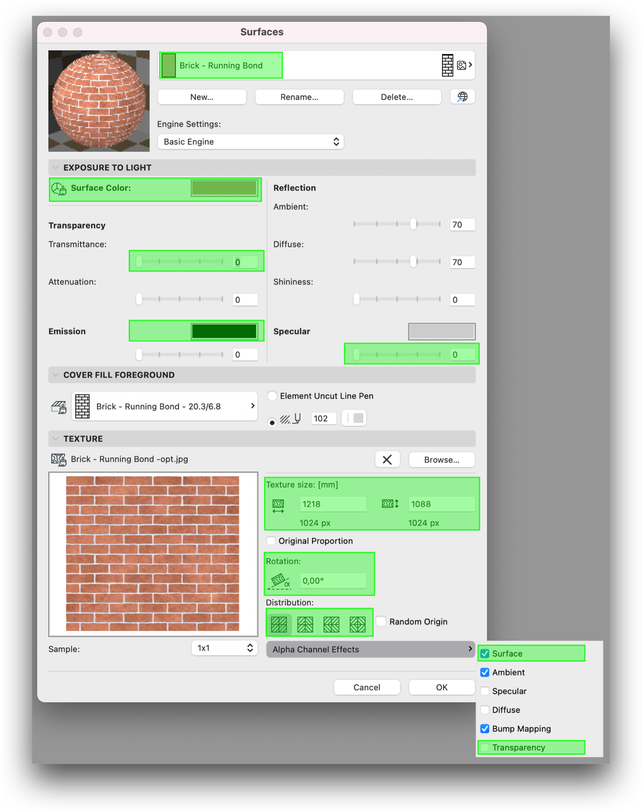
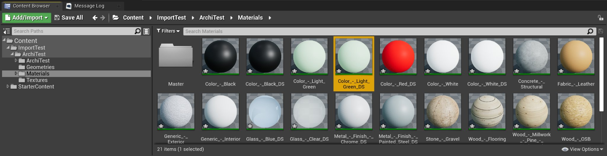
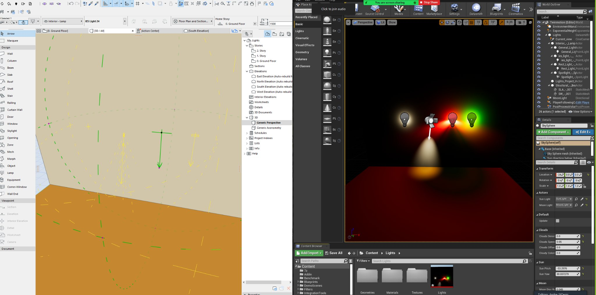

# 将Datasmith与Archicad结合使用

> 路径：虚幻引擎5.7文档 / 管理内容 / Datasmith / Datasmith软件交互指南 / 将Datasmith与Archicad结合使用

> 原始页面：https://dev.epicgames.com/documentation/unreal-engine/using-datasmith-with-archicad-in-unreal-engine

本页面介绍 **Datasmith** 如何将场景从 **Graphisoft Archicad** 导入 **虚幻引擎**。它遵循[Datasmith概述](../../datasmith-plugins-overview/index.md)和[关于Datasmith导入过程](../../datasmith-import-process/index.md)中概述的基本流程，但它提供了有关Direct Link工作流和Direct专用转译行为的更多详细信息。如果你打算使用Datasmith将场景从Archicad导入到虚幻引擎，阅读此页面可以帮助你了解场景如何转译，以及你如何在虚幻编辑器中使用导入场景。

## Archicad工作流

### Datasmith DirectLink

使用DirectLink工作流，你可以在Archicad和虚幻引擎或Twinmotion之间设置Datasmith DirectLink。此链接会更新你的虚幻引擎关卡或Twinmotion模型，从而无需在你每次进行更改时从Archicad场景重新导出 `*.udatasmith` 文件。

### 导出工作流

使用导出工作流，可以从Archicad导出 `.udatasmith` 文件，以便在虚幻引擎或Twinmotion中使用。请参阅[从Archicad导出Datasmith内容](exporting-datasmith-content-from-archicad-to/index.md)，详细了解如何从Archicad导出Datasmith内容。

请参阅[将Datasmith内容导入到虚幻引擎中](../../datasmith-tutorials/importing-datasmith-content-into/index.md)，详细了解如何将 `.udatasmith` 文件导入虚幻引擎。

## 使用Datasmith工具栏

Datasmith插件将Datasmith工具栏选项添加到 **Windows > 控制板（Palettes）** 菜单。


Datasmith DirectLink工具栏。

| 操作 | 按钮 | 说明 |
| --- | --- | --- |
| 与Direct Link同步（Synchronize with Direct Link） |  | 通过Direct Link连接将选定模型推送到虚幻引擎或Twinmotion。 |
| 管理连接（Manage Connections） |  | 启动连接状态对话框。 |
| 导出到Datasmith文件（Export to Datasmith File） |  | 启动现有的 `.udatasmith` 导出程序，用于将 `.udatasmith` 文件保存到磁盘。 |
| 显示消息（Show Messages） |  | 启动消息和日志记录窗口。这对于报告错误、丢失纹理和其他信息很有用。 |

## 几何体、图层和场景层级

Archicad的对象在导入虚幻引擎时，会转换成包含多个嵌套静态网格体组件的单个Actor。



正在显示已导入Archicad文件层级的世界大纲视图。

世界大纲视图中的每个Actor都代表Archicad中的一个层级，可在虚幻编辑器的层级面板中找到。



世界大纲视图中以Actor表示的层级也会在层级面板中显示。

> [!NOTE]
> 对象的枢轴点会导入虚幻引擎，并且保留其在Archicad中的原始位置。但是，在某些情况下，由于Archicad SDK存在限制，可能无法正确定义枢轴点位置，从而导致不匹配，如下所示：



注意，编辑器中椅子的枢轴点与其在Archicad中的位置不同。

## HotLinks模块

虚幻引擎会保留包含3D元素的Archicad HotLink外部引用，方法是将它们作为带有嵌套静态网格体的Actor导入关卡。

## 材质

虚幻引擎使用基于物理的渲染（PBR）图表在Datasmith场景中构建材质，其中主材质由Datasmith导入器实时构建。在将Archicad材质导入虚幻引擎时，此过程会保留它们的外观。



导入到虚幻引擎时，导出插件会保留材质在Archicad中的外观。

Archicad中有两种类型的材质：

- 从表面属性派生的标准材质。
- 从GDL对象派生的材质。

### 标准Archicad材质

Archicad中的材质会导出为PBR材质；在导入到虚幻引擎时会保留以下属性：

- 基础颜色
- 纹理透明度
- UV尺寸等



Datasmith导出程序会处理所有以绿色高亮显示的属性。

### GDL和双面材质

Archicad中的所有建筑对象都会被视为闭合类对象，并使用单面材质导出。

较薄的对象（例如GDL和Morph对象）会使用双面材质导出。出现这类情况时，材质名称会添加 `_DS` 作为后缀，确保其在虚幻引擎中有别于单面材质。



高亮显示的是双面材质，名称包含 _DS 后缀。

## 光源

Datasmith导出程序支持基本的光源类型及其参数。区域光源会作为点光源导入到虚幻引擎中。不支持环境光源和平行光源。



从Archicad导入虚幻引擎的各种光源类型。

| Archicad光源类型 | 虚幻引擎光源类 | 支持的参数 | 不支持的参数 |
| --- | --- | --- | --- |
| **通用光源（General Light）** | 点光源（Point Light） | 强度 颜色 衰减距离 绝对光源强度 | 阴影投射参数（不透明度和质量） |
| **点光源（Point Light）** | 点光源（Point Light） | 强度 颜色 衰减距离 绝对光源强度 在内角和外角之间淡出 | 阴影投射参数（不透明度和质量） 聚光灯几何体（仅限圆形） |
| **IES光源（IES Light）** | 带IES分析的点光源（Point Light with IES profile） | 强度 颜色 衰减距离 绝对光源强度 IES形状 IES强度 | 阴影投射参数（不透明度和质量） 使用光度学文件中的给定区域形状和大小 IES光照质量/粒状光照 |
| **区域光源（Area Light）** | Datasmith区域光源（Datasmith Area Light） | 强度 颜色 衰减距离 绝对光源强度 尺寸长度/宽度 | 阴影投射参数（不透明度和质量） 使用光度学文件中的给定区域形状和大小 IES光照质量/粒状光照 |
| **平行光源（Parallel Light）** | 不支持（Not Supported） | 不支持（Not Supported） | 不支持（Not Supported） |
| **太阳（Sun Object）** | 不支持（Not Supported） | 不支持（Not Supported） | 不支持（Not Supported） |
| **窗口光源（Window Light）** | 不支持（Not Supported） | 不支持（Not Supported） | 不支持（Not Supported） |

## 摄像机

导出时Archicad中的当前视点作为名为"当前视图（Current View）"的摄像机Actor导入虚幻引擎。支持以下摄像机属性：

- 变换（Transform）
- 传感器宽度和高度（Sensor Width and Height）
- 焦距最小值和最大值（Focal Length Min and Max）
- FStop最小值和最大值（FStop Min and Max）
- 对焦距离（Focus Distance）
- 当前焦距（Current Focal Length）
- 当前光圈（Current Aperture）

> 图片已省略：Archicad camera settings retained during the import into Unreal Engine.

Archicad摄像机设置在导入虚幻引擎期间保留。

虚幻引擎还支持路径摄像机。它们使用Archicad中的路径名作为场景Actor下的摄像机Actor导入。

Path Cameras in Archicad. Camera Actors in the World Outliner.

支持路径摄像机并作为摄像机Actor导入到世界大纲视图中。

## Metadata和分类

在以下情况下，Archicad中的大多数属性会作为元数据导出到虚幻引擎：

- 元素名称键ID值与元素名称相同。例如，门的ID值为"Wooden_Door"。
- 键值使用特定的分类，包括：

  - 键值使用后缀为"_ID"的分类系统。
  - 键值使用后缀为"_Name"的分类系统。这通常为空。
  - 键值使用后缀为"_Description"的分类系统。这通常为空。
- 类别键值包含前缀"CAT_Xyz"
- IFCProperties键值包含前缀"IFC_Xyz"
- IFCAttributes键值包含前缀"IFC_Attribute_Xyz"

> [!NOTE]
> 不会导出未定义的元数据。

例如，你要从Archicad导出门：

> 图片已省略：Properties of a wooden door in Archicad.

Archicad中木门的属性。

它将导出为：

```
 <MetaData name="MetaData_95D3E85A-69DE-4E5D-993D-74480D3FBDBA" reference="Actor.95D3E85A-69DE-4E5D-993D-74480D3FBDBA">	<KeyValueProperty name="ID" type="String" val="Porte_Bois"/>	<KeyValueProperty name="ARCHICAD_Classification_ID" type="String" val="Door"/>	<KeyValueProperty name="CAT_Position" type="String" val="Interior"/>	<KeyValueProperty name="CAT_Renovation_Status" type="String" val="Existing"/>	<KeyValueProperty name="CAT_Show_On_Renovation_Filter" type="String" val="All Relevant Filters"/>	<KeyValueProperty name="CAT_Structural_Function" type="String" val="Non-Load-Bearing Element"/>	<KeyValueProperty name="IFC_ProductionYear" type="String" val="2021"/>	<KeyValueProperty name="IFC_AcousticRating" type="String" val="patate"/>	<KeyValueProperty name="IFC_FireRating" type="String" val="radis"/>	<KeyValueProperty name="IFC_IsExternal" type="String" val="False"/>	<KeyValueProperty name="IFC_FireResistanceRating" type="String" val="pastop"/>	<KeyValueProperty name="IFC_IsCombustible" type="String" val="False"/>	<KeyValueProperty name="IFC_SerialNumber" type="String" val="serialnumber"/>	<KeyValueProperty name="IFC_Renovation_Status" type="String" val="Existing"/>	<KeyValueProperty name="IFC_Attribute_GlobalId" type="String" val="2Lq_XQQTvENPazT4WDFxsw"/>	<KeyValueProperty name="IFC_Attribute_Name" type="String" val="TestCustomName"/>	<KeyValueProperty name="IFC_Attribute_Tag" type="String" val="95D3E85A-69DE-4E5D-993D-74480D3FBDBA"/>	<KeyValueProperty name="IFC_Attribute_OverallHeight" type="String" val="210.00"/>	<KeyValueProperty name="IFC_Attribute_OverallWidth" type="String" val="90.00"/></MetaData> 
```

你可以使用分类管理器在Archicad中添加和编辑分类：

> 图片已省略：The Classification Manager within Archicad is used to add additional Classifications.

Archicad中的分类管理器用于添加额外的分类。

点击 **Windows** 菜单中的 **分类管理器（Classification Manager）* 选项可以找到此菜单。

## Actor标签

Archicad的技术数据可以借助编辑器中的Actor标签导入虚幻引擎。然后可以使用存储在Actor标签中的数据通过Visual Dataprep、Python脚本等执行各种操作。

目前Datasmith插件可导出：

- ID
- 类型
- LibPart（Main、Rev、Name）

> 图片已省略：Tag values are imported into Unreal as Actor Tags.

标签值作为Actor标签导入到虚幻引擎中。
