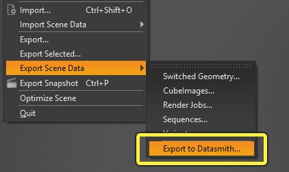

# 从VRED导出Datasmith内容

> 路径：虚幻引擎5.7文档 / 管理内容 / Datasmith / Datasmith软件交互指南 / 结合使用Datasmith与Deltagen/VRED / 从VRED导出Datasmith内容

> 原始页面：https://dev.epicgames.com/documentation/unreal-engine/exporting-datasmith-content-from-vred-to-unreal-engine

## 安装导出器插件脚本

需要先安装VRED插件脚本，然后才能开始在虚幻引擎中使用VRED内容。

要了解导出器插件当前支持哪些版本的VRED Professional，请参阅。

请按照以下步骤为计算机上安装的任何受支持的VRED版本安装Datasmith导出器插件脚本。

1. 在虚幻引擎安装文件夹中，找到在 `Engine/Plugins/Enterprise/DatasmithFBXImporter/Resources/VREDPlugin` 文件夹中的 *vrDatasmithExporter.py* 脚本。
2. 复制此文件夹及其中所有内容到VRED搜索插件的位置。 例如，在Windows平台，该位置可能是 `C:\Users\<username>\Documents\Autodesk\VRED-<internalVersion>\ScriptPlugins`，其中 `<username>` 是Windows用户ID，而 `<InternalVersion>` 表示安装的VRED版本。 关于寻找此路径的完整细节，请参阅[VRED文档](http://help.autodesk.com/view/VREDPRODUCTS/2018/ENU/?guid=GUID-C085B3DC-A66C-48EB-8FE4-43E4383AC46E)。

   > [!TIP]
   > VRED终端窗口也可以帮助寻找此路径。在主菜单中选择 **查看（View）> 终端（Terminal）** 打开终端，然后寻找以 **Looking for script plugins in** 开头的行。例如： vred-terminal.png
3. 重启VRED。

## 导出到Datasmith

在以希望的方式设置好VRED场景并注册好变体之后，将场景导出为FBX：

1. 在VRED主菜单中，选择：

   - 文件（File） > 导出（Export） > 导出到Datasmith..（Export to Datasmith...）

     （适用于VRED 2018）
   - **文件（File） > 导出场景数据（Export Scene Data） > 导出到Datasmith..（Export to Datasmith...）**（适用于VRED 2019）

     
2. 浏览至文件夹并选择文件名。

导出器将在所选择的位置创建 *.FBX* 文件。

### 最终结果

现在你可以尝试将新的 *.FBX* 文件导入到虚幻编辑器中。请参阅[将Datasmith内容导入到虚幻引擎中](../../../datasmith-tutorials/importing-datasmith-content-into/index.md)。

> [!NOTE]
> 除了 `.FBX` 文件以外，导出器还会创建附加文件，包括：
>
> - 包含场景光源的额外信息的
>
>   .lights
>
>   文件
> - 包含注册变体信息的
>
>   .var
>
>   文件。
> - 包含动画信息的
>
>   .clips
>
>   文件。
> - 包含材质额外信息的
>
>   .mats
>
>   文件。
>
> 这些文件中包含Datasmith导入程序所需的信息。如果将 `.FBX` 文件移到新位置，请确保将这些附加文件放在相同的相对路径中。
