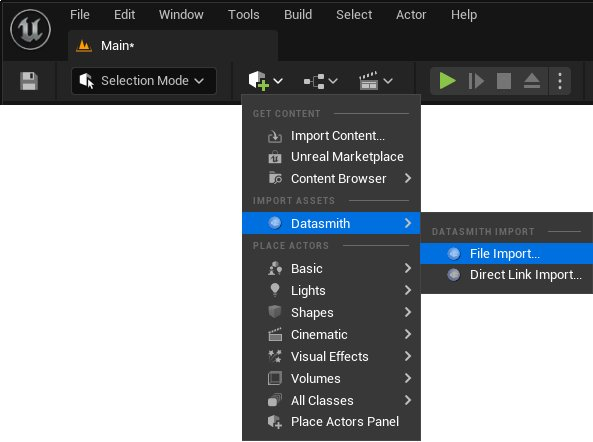
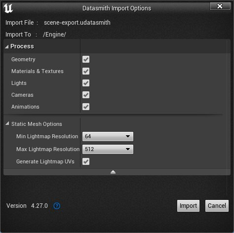

# 将Datasmith内容导入到虚幻引擎中

> 路径：虚幻引擎5.7文档 / 管理内容 / Datasmith / Datasmith教程 / 将Datasmith内容导入到虚幻引擎中

> 原始页面：https://dev.epicgames.com/documentation/unreal-engine/importing-datasmith-content-into-unreal-engine

本页将介绍如何使用Datasmith将内容从支持的3D设计应用程序或文件格式导入到虚幻引擎中。

## 先决条件

在用Datasmith导入内容之前，必须启用某些虚幻引擎插件或安装其他软件。

### Datasmith插件

要使用Datasmith将内容导入到虚幻引擎中，你的项目必须已启用 **Datasmith导入器（Datasmith Importer）** 。如果你不启用该插件，在虚幻引擎中就看不到Datasmith导入选项。某些受支持的文件格式需要其他插件。

- 有关支持的应用程序、文件格式和插件要求的列表，请参阅

  。
- 要了解如何在虚幻引擎中启用插件，参阅

  自定义虚幻引擎

  。

> [!TIP]
> 若从 **建筑（Architecture）** 或 **汽车（Automotive）、产品设计（Product Design）和制造（Manufacturing）** 类别中的一个模板启动了项目，部分或全部Datasmith插件会默认启用。

### 其他软件

要导入某些支持的文件格式，你必须安装其他软件。以下文件格式有特定的软件要求：

| 文件格式 | 要求 |
| --- | --- |
| `.wire` | 安装与 `.wire` 文件兼容的Autodesk Alias AutoStudio版本。 |

## 将Datasmith内容导入到虚幻引擎中

1. 在虚幻引擎编辑器中，打开你要向其导入Datasmith内容的项目。
2. 若要将内容导入项目的现有关卡中，立即打开该关卡。否则，创建新关卡，或使用默认关卡。
3. 在主工具栏中，打开"创建（Create）"菜单并选择 **Datasmith > 文件导入（File Import）** 。界面上将打开文件导入对话框。

   
4. 选择你要导入的文件，并点击 **打开（Open）** 。将打开文件对话框。

1.在项目中选择一个位置来存储所导入的内容，然后点击 **确定（OK）** 。界面上将打开 **Datasmith导入选项（Datasmith Import Options）** 对话框。

> [!TIP]
> 若要为Datasmith内容创建新的顶级文件夹，请右键点击文件对话框中的空白区域。要创建现有文件夹的子文件夹，请右键点击该文件夹。

1.在 **Datasmith导入选项（Datasmith Import Options）** 对话框中，选择你要从源文件中导入的内容类型，并按需设置其他导入选项。

对于不同的文件类型， **Datasmith导入选项（Datasmith Import Options）** 对话框将显示不同的导入选项。有关导入选项的更多信息，参阅[Datasmith导入选项](../../datasmith-import-options/index.md)。

1. 完成导入选项设置后，点击

   导入（Import）

   。Datasmith会进行以下操作：

   - 读取导入的文件。
   - 在你的项目中创建新资产。
   - 将Datasmith Scene场景置于当前关卡中。

   有关导入流程的更多信息，参阅[Datasmith概述](../../datasmith-plugins-overview/index.md)。

## 自定义导入流程

你可以通过以下方式自定义Datasmith导入流程：

- 使用蓝图视觉效果脚本或Python脚本自动化导入。如需了解详情，请参阅

  自定义Datasmith导入流程

  。
- 使用Dataprep在导入时对数据执行其他操作。你可以保存并复用Dataprep导入方案，以便创建定制化的资产导入流程。如需了解详情，请参阅

  Dataprep导入自定义

  。
