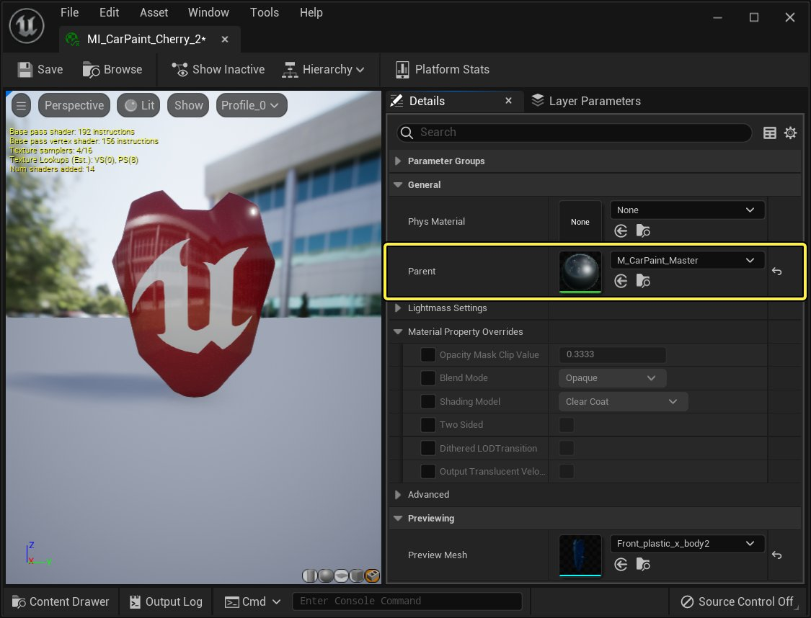
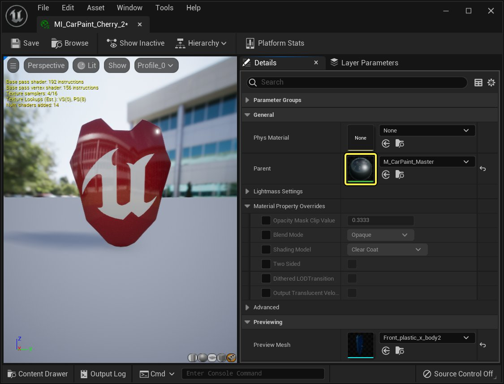
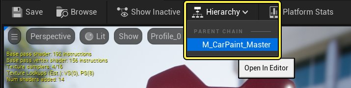
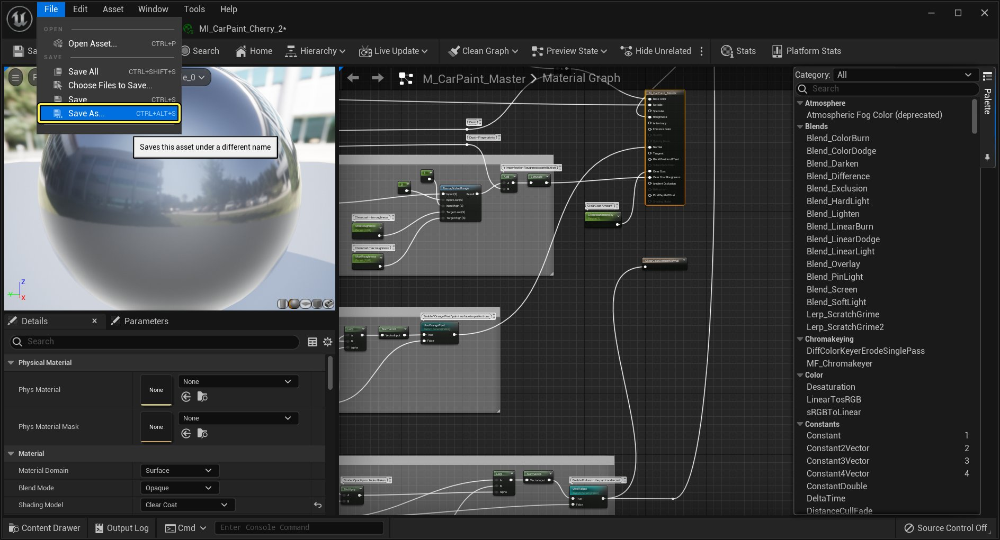
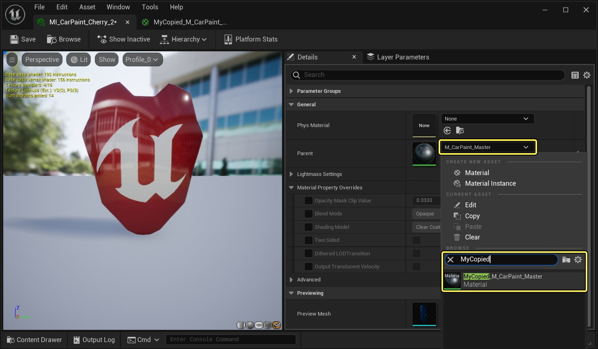

# 修改Datasmith主材质

> 路径：虚幻引擎5.7文档 / 管理内容 / Datasmith / Datasmith教程 / 修改Datasmith主材质

> 原始页面：https://dev.epicgames.com/documentation/unreal-engine/modifying-a-datasmith-master-material-in-unreal-engine

正如[Datasmith概述](../../datasmith-plugins-overview/index.md)和[Datasmith导入流程](../../datasmith-import-process/index.md)中介绍的，Datasmith会在你的项目中创建材质实例，每个材质实例都对应原始场景中检测到的一种表面。这些材质实例各自都会公开一个预设的属性列表，你可以在虚幻引擎项目中自由地修改这些属性。

但是，如果你想要修改作为你的任何Datasmith材质实例基础的主材质，一定要创建原主材质的副本，将该副本保存在项目内容中，对副本进行修改，然后设置材质实例指向副本主材质。

本页面的以下说明提供了进行此操作的逐步指导。

> [!WARNING]
> - Datasmith使用的预设父材质资源——例如 **Datasmith_Color**、**SketchUpMaster** 和 **RevitMaster** 材质——都包含在Datasmith插件内容中。如果你对这些父材质进行任何更改，就是在为所有项目更改它们，而不仅仅是针对你的当前项目。而且你的更改不会保存在项目中，所以如果你需要将项目分发给其他人，或者升级到新版本的虚幻引擎，你就会丢失这些更改。一定要在项目的content文件夹中制作一个副本。
> - 即使你是在项目的content文件夹中处理Datasmith创建的父材质——通常是针对从3ds Max或Rhino导入的自定义材质创建的父材质——你也应该始终按照这些程序创建原父材质的副本，而不应直接修改原父材质。对父材质图的更改不会保留，因为Datasmith会覆盖它们，所以在你下一次重新导入Datasmith场景资源时就会丢失你的更改。

## 步骤

要复制并修改Datasmith创建的任何材质实例的父材质：

1. 双击你要修改父材质的材质实例。这会在材质实例编辑器中打开该材质实例。
2. 在 **细节（Detail）** 面板中，找到 **常规（General）> 父代（Parent）** 设置。这可以让你找到提供此材质实例所基于的材质图的父材质。

   

   点击查看大图
3. 双击该 **父代** 的缩略图。

   

   点击查看大图

   这会在材质编辑器中打开父材质，你可以在其中看到它的材质图。

   > [!TIP]
   > 你也可以使用工具栏中的 **层级（Hierarchy）** 按钮选择并打开父材质。
   >
   > 
   >
   > 点击查看大图
4. 在父材质编辑器的主菜单中，选择 **文件（File）> 另存为（Save As）**，在项目的content文件夹的任何位置保存父材质的副本。

   

   点击查看大图
5. 回到你的材质实例，更改 **常规（General）> 父代（Parent）** 设置，使其指向你新创建的主材质。

   

   点击查看大图
6. **保存（Save）** 该材质实例。

## 最终结果

你已经创建了一个新的父材质，它是从Datasmith分配的默认父材质复制的，而且你已经将这个新的父材质分配给了你的材质实例。现在，你对复制的主材质中的图表和设置进行的任何更改都会立即应用到材质实例。而且在你下一次重新导入Datasmith场景资源时，将不会丢失你在复制的父材质中做过的任何更改。
