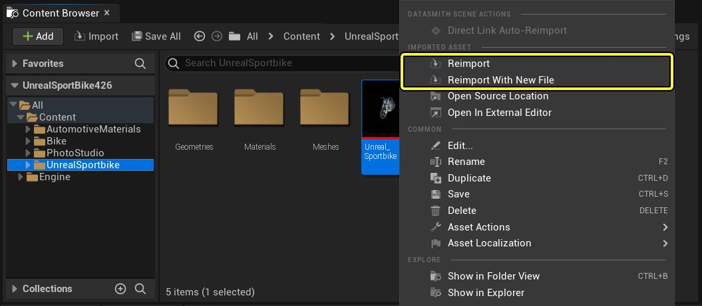
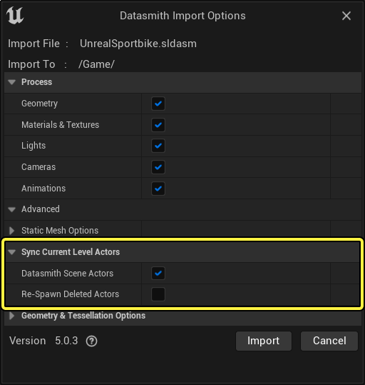
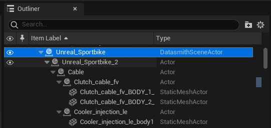
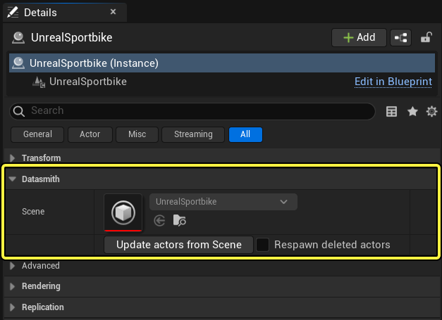
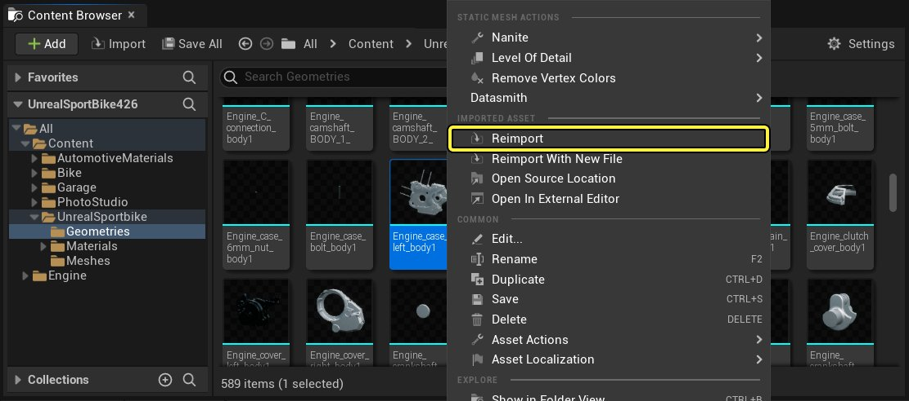
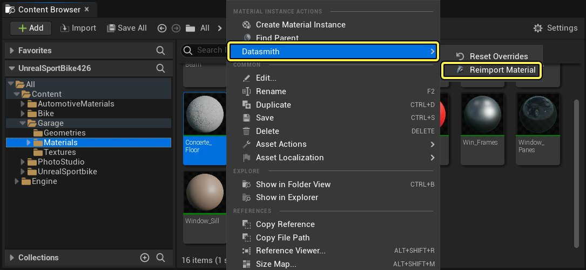

# 重新导入Datasmith内容

> 路径：虚幻引擎5.7文档 / 管理内容 / Datasmith / Datasmith教程 / 重新导入Datasmith内容

> 原始页面：https://dev.epicgames.com/documentation/unreal-engine/reimporting-datasmith-content-into-unreal-engine

本页面介绍如何将Datasmith内容重新导入到虚幻编辑器中，以及如何控制同步到关卡中的Actor的内容。

有关背景信息，包括重新导入过程对项目中的资产和关卡中的Actor的处理方式概述，请参阅[Datasmith重新导入工作流程](../../datasmith-reimport-workflow/index.md)。

## 重新导入Datasmith场景资产

要从新版本的源文件重新导入Datasmith场景资产：

1. 在内容浏览器中右键单击 **Datasmith场景** 资产。

   

   点击查看大图

   - 如果你已经将对源场景的修改保存到磁盘上原本用于创建或重新导入此DataSmith场景资产的文件内，就选择快捷菜单上的 **重新导入（Reimport）** 选项。
   - 如果你将对源场景的修改保存到了磁盘上的另一个文件内，就选择快捷菜单上的 **用新文件重新导入（Reimport With New File）** 选项并浏览想要使用的新文件。
2. 引擎将提示你指定一些重新导入选项。除增加的选项以外，这些选项与原先导入时设置的选项相同。 新选项位于 **同步当前关卡Actor（Sync Current Level Actors）** 下，它们将确定是否应将对Datasmith场景资产的更新也应用给当前关卡中之前从更新前的资产创建的Datasmith场景Actor。

   

   点击查看大图

   如果不希望立即同步Actor，也可以稍后再同步。请参阅下面的[使Datasmith场景Actor与其资产保持同步](#%E4%BD%BFdatasmith%E5%9C%BA%E6%99%AFactor%E4%B8%8E%E5%85%B6%E8%B5%84%E4%BA%A7%E4%BF%9D%E6%8C%81%E5%90%8C%E6%AD%A5)。 有关其他导入选项的更多信息，请参阅[Datasmith导入流程](../../datasmith-import-process/index.md)。
3. 设置希望导入程序使用的选项，然后单击 **导入（Import）**。

> [!WARNING]
> 重新导入过程可能会覆盖内容浏览器中的静态网格体几何体、父材质和纹理资产。有关细节，请参阅[Datasmith重新导入工作流程](../../datasmith-reimport-workflow/index.md)。

## 使Datasmith场景Actor与其资产保持同步

可通过两种方法将关卡中的Datasmith场景Actor与其对应的Datasmith场景资产重新同步。

- [重新导入中同步](#%E9%87%8D%E6%96%B0%E5%AF%BC%E5%85%A5%E4%B8%AD%E5%90%8C%E6%AD%A5)。
- [重新导入后同步](#%E9%87%8D%E6%96%B0%E5%AF%BC%E5%85%A5%E5%90%8E%E5%90%8C%E6%AD%A5)。

### 重新导入中同步

在重新导入Datasmith场景资产时重新同步：

1. 打开包含Datasmith场景Actor的关卡。
2. 按照上面[重新导入Datasmith场景资产](#%E9%87%8D%E6%96%B0%E5%AF%BC%E5%85%A5datasmith%E5%9C%BA%E6%99%AF%E8%B5%84%E4%BA%A7)下的说明重新导入Datasmith场景资产。
3. 在 **导入选项（Import Options）** 对话框中，找到 **同步当前关卡Actor（Sync Current Level Actors）** 部分。请确保选中 **Datasmith场景Actor（Datasmith Scene Actors）** 复选框。 如果要将之前已删除的Actor重新添加到关卡中，也请选中 **重新生成已删除的Actor（Re-Spawn Deleted Actors）** 选项。

   

   点击查看大图
4. 单击 **导入（Import）**。

### 重新导入后同步

在重新导入Datasmith场景资产之后的任何时间重新同步：

1. 打开包含Datasmith场景Actor的关卡。
2. 在 **大纲视图** 中选中Datasmith场景Actor。

   

   点击查看大图
3. 在 **细节（Details）** 面板中，找到 **Datasmith** 部分。

   

   点击查看大图
4. 如果要将之前已删除的Actor重新添加到关卡中，选中 **重新生成已删除的Actor（Respawn deleted actors）** 选项。
5. 单击 **从场景更新Actor（Update actors from Scene）**。

## 重新导入单个资产

除了可以重新导入整个Datasmith场景资产，你还可以选取单个静态网格体、材质和纹理资产来进行更新。

要重新导入单个资产：

1. 在内容浏览器中右键单击资产，然后从情境菜单中选择 **重新导入（Reimport）**。

   

   点击查看大图

   对于材质资产，选择 **Datasmith > 重新导入材质（Reimport Material）**。

   

   点击查看大图

   > [!NOTE]
   > 仅对于Datasmith从头创建以匹配源文件中的材质定义的材质资产，你才会看到 **Datasmith > 重新导入材质（Reimport Material）** 选项（从3ds Max导入父材质时，通常就是这样）。但是，对于那些是内置在Datasmith中的材质的实例的材质资产，该选项不会显示（从CAD文件或SketchUp导入材质时，通常就是这样）。
2. 引擎将提示你为资产指定一些重新导入选项。 这些选项与原先导入时设置的选项相同。有关所有这些选项的更多信息，请参阅[Datasmith导入流程](../../datasmith-import-process/index.md)。

> [!NOTE]
> 重新导入单个资产时，没有同步关卡Actor的选项。项目中对资产的每个引用都将自动使用资产的更新后的版本。请参阅[Datasmith重新导入工作流程](../../datasmith-reimport-workflow/index.md)。
