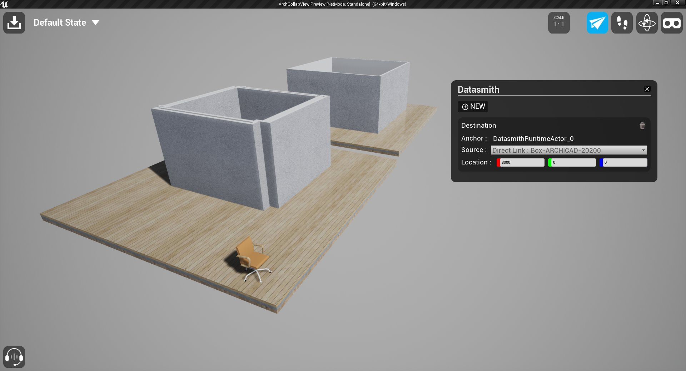
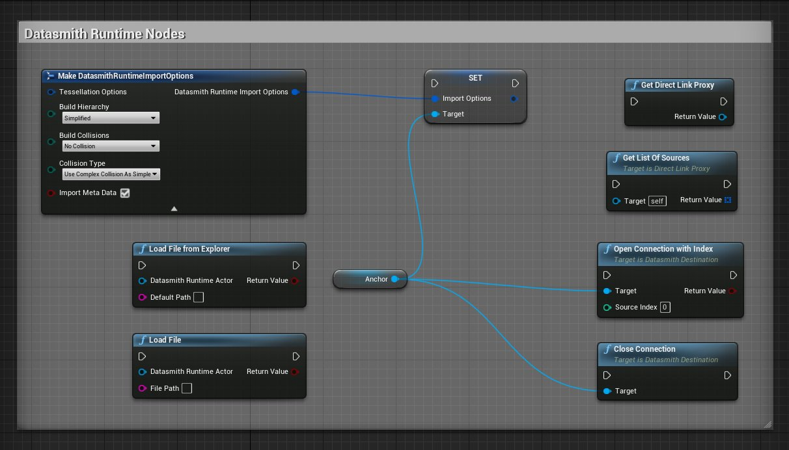
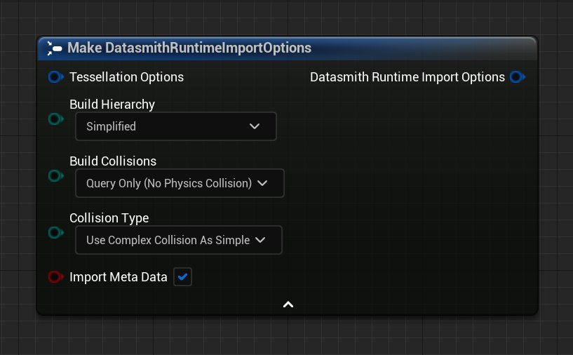
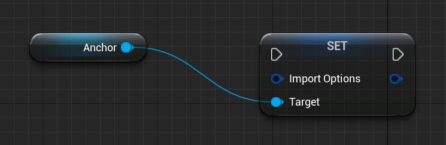
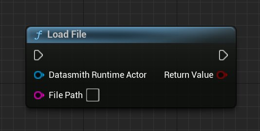
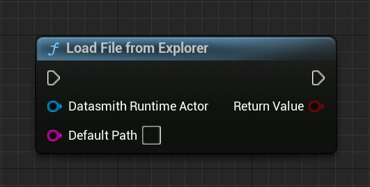
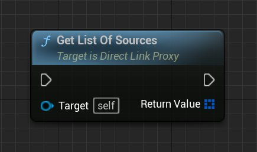
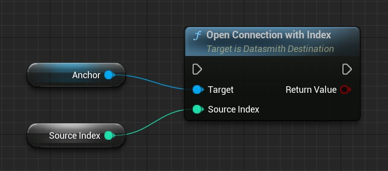

# 运行时使用Datasmith

> 路径：虚幻引擎5.7文档 / 管理内容 / Datasmith / Datasmith教程 / 运行时使用Datasmith

> 原始页面：https://dev.epicgames.com/documentation/unreal-engine/using-datasmith-at-runtime-in-unreal-engine

## 什么是Datasmith运行时

**Datasmith运行时（Datasmith Runtime）** 是一组在基于虚幻引擎的应用程序中运行时（与编辑器中的工作流相对）可用的Datasmith功能。你可以使用这些功能创建可以导入 `.udatasmith` 文件并使用蓝图操作它们的应用程序。

在使用Datasmith运行时和蓝图的基于虚幻引擎的烘焙应用程序中，可以访问Datasmith直接链接。

你可以使用Datasmith运行时创建利用[Datasmith Direct Link](../using-datasmith-direct-link/index.md)的自定义应用程序，或者将Datasmith数据作为迭代3D工作流程的一部分按需可视化。

在你的项目中启用以下插件，以使用Datasmith运行时：

- Datasmith内容（Datasmith Content）
- Datasmith导入器（Datasmith Importer）
- Datasmith运行时（Datasmith Runtime）

> [!NOTE]
> 使用Windows和MacOS的虚幻引擎4和虚幻引擎5正式支持Datasmith运行时。虽然Datasmith运行时可以用于Linux，但是目前处于试验性阶段，你可能会遇到运行不稳定和性能方面的问题。

## 将Datasmith运行时与蓝图结合使用

Datasmith运行时将使用多个蓝图节点公开各种Datasmith功能和导入选项。下面列出的是最常见的部分：

最常见的Datasmith运行时蓝图节点。

### 构造Datasmith运行时导入选项

公开几个导入参数，并将其转换为数据结构：

| **输入** | **说明** |
| --- | --- |
| **构建层级（Build Hierarchy）** | 确定是否构建了Actor的层级。选择细节更丰富的层级会增加加载和渲染时间。 **无（None）** ：使用存储在Datasmith运行时Actor中的层级导入源内容。你的内容将不会呈现在世界大纲视图中。 **简化（Simplified）** ：导入源内容，同时最大程度地减少创建的Actor的数量。允许公开对象，以便应用程序可以修改它们的属性，同时限制由于场景中Actor较多导致的绘制调用数量。 **未筛选（Unfiltered）** ：导入具有完整层级的源内容。 |
| **构建碰撞（Build Collision）** | 确定用于组件的碰撞类型。 **无碰撞（No Collision）** ：在物理引擎中没有任何呈现。提供最佳性能。 **仅查询（无物理碰撞）（Query Only（No Physical Collision））** ：仅使用空间查询。适用于不需要物理模拟的对象，例如Pawn导航。改进性能。 **仅物理（无查询碰撞）（Physics Only（No Query Collision））** ：仅使用物理仿真。适用于不需要空间查询的对象。改进性能。 **启用碰撞（查询和物理）（Collision Enabled（Query and Physics））** ：同时使用空间查询和物理模拟。 |
| **碰撞类型（Collision Type）** | 确定用于静态网格体的碰撞类型。 **项目默认值（Project Default）** ：使用项目的物理设置。 **简单和复杂（Simple and Complex）** ：同时使用简单和复杂的形状。简单的形状用于常规场景查询和碰撞。复杂的（逐个精度）形状用于复杂的场景查询。 **将简单碰撞形状用作复杂形状（Use Simple Collision as Complex）** ：对所有场景查询和碰撞测试仅使用简单形状。 **将复杂碰撞形状用作简单形状（Use Complex Collision as Simple）** ：对所有场景查询和碰撞测试使用复杂的（逐个精度）形状。仅用于静态形状的模拟。如果在导航场景时需要精确碰撞，则可能必要。 |
| **导入元数据（Import Metadata）** | 读取并导入Actor的元数据。增加加载时间。 |

> [!NOTE]
> 当前未启用 **曲面细分（Tesselation Options）** 输入。

### 设置导入选项

使用 **Datasmith运行时Actor（Datasmith Runtime Actor）** 为Datasmith内容设置所选导入选项的值。将Datasmith运行时Actor作为 **目标（Target）** 和 **Datasmith运行时导入选项（Datasmith Runtime Import Options）** ，如同其值一样。

### 加载文件（Load File）

加载位于指定文件路径的 `.udatasmith` 文件。需要 **文件路径（File Path）** 和 **Datasmith运行时Actor（Datasmith Runtime Actor）** 作为输入。

### 从浏览器加载文件

打开文件浏览器窗口，以便你可以浏览到某个位置，并选择 `.udatasmith` 文件。需要 **Datasmith运行时Actor（Datasmith Runtime Actor）** 作为输入。**默认文件路径（Default File Path）** 是可选项。

> [!NOTE]
> 虽然在编辑器中运行（PIE）时，它适用于Windows和Mac操作系统，但是从浏览器加载文件运行时，仅适用于Windows。

### 获取直接链接代理

将接口返回到称为直接链接代理（Direct Link Proxy）的 **直接链接（Direct Link）** 连接。这是创建 **Datasmith直接链接（Datasmith Direct Link）** 连接的第一步。

### 获取源列表

获取Datasmith直接链接源列表。需要 **直接链接代理（Direct Link Proxy）** 作为输入。

### 通过索引打开连接

通过位于指定索引值的源打开直接链接连接。需要 **Datasmith运行时Actor（Datasmith Runtime Actor）** 和 **源索引（Source Index）** 作为输入。

### 关闭连接

关闭与指定 **Datasmith运行时Actor（Datasmith Runtime Actor）** 关联的已打开直接链接连接。

> 图片已省略：关闭连接

## 运行时加载Datasmith内容

使用Datasmith运行时，你可以在烘焙的应用程序中加载Datasmith内容，同时可以访问层级和Actor属性。

> 图片已省略：The completed blueprint for loading a .udatasmith file at runtime.

点击查看大图。

使用蓝图加载Datasmith内容：

1. 创建新的 **Actor蓝图（Actor Blueprint）** ，以便包含Datasmith内容的锚点。右键点击 **内容浏览器（Content Browser）** ，并从上下文菜单中选择 **蓝图类（Blueprint Class）** 即可创建。在 **选取父类（Pick Parent Class）** 窗口中，选择 **Actor** ，并将新的蓝图类命名为 **DatasmithActor** 。双击该新蓝图，打开编辑器。

   > 图片已省略：选取父类

   > [!TIP]
   > 该锚点将作为导入的Datasmith内容的原点。如果你的内容与源应用程序中的原点存在偏移，则虚幻引擎将在导入内容时保持与锚点的偏移。
2. 选择 **事件图表（Event Graph）** 选项卡，并删除事件 **BeginPlay** 之外的所有事件。从事件BeginPlay（Event BeginPlay）中拖出连接，并添加 **Spawn Actor From Class** 节点。打开 **类（Class）** 下拉菜单，并选择 **DatasmithRuntimeActor** 。将 **返回值（Return Value）** 提升为变量，并将其命名为 **Anchor** 。

   > 图片已省略：运行时生成Actor
3. **生成Actor（Spawn Actor）** 需要变换来生成锚点。右键点击Spawn Actor的左侧，添加 **Make Transform** 节点。将Make Transform的输出连接到Spawn Actor上的 **生成变换（Spawn Transform）** 引脚。

   > 图片已省略：构造变换
4. 要完成蓝图，请点击 **Set** 节点的执行引脚并拖动，然后添加 **Load File from Explorer** 节点。将 **锚点（Anchor）** 变量的引用连接到 **Datasmith运行时Actor（Datasmith Runtime Actor）** 输入。

   > 图片已省略：运行时加载Datasmith
5. **保存（Save）** 并 **编译（Compile）** 蓝图。将锚点蓝图（Anchor Blueprint）的副本添加到关卡中，然后按 **播放（Play）** 进行测试。

虚幻引擎将打开文件资源管理器（File Explorer）窗口，并要求你选择文件。

## 使用蓝图创建Datasmith直接链接

你还可以在运行时使用Datasmith运行时打开位于一个或多个源应用程序与虚幻引擎项目之间的Datasmith直接链接。

1. 首先，创建新的

   Actor

   蓝图（Blueprint），以便包含Datasmith内容的锚点。双击该新蓝图，打开编辑器。
2. 与前面的示例类似，选择

   事件图表（Event Graph）

   的选项卡，并删除

   事件BeginPlay（Event BeginPlay）

   之外的所有事件。从事件BeginPlay（Event BeginPlay）中拖移连接，并添加

   Spawn Actor From Class

   节点。打开

   类（Class）

   下拉菜单，并选择

   DatasmithRuntimeActor

   。
3. 需要变换才能生成锚点。右键点击Spawn Actor的左侧，添加 **Make Transform** 节点。将Make Transform的输出连接到Spawn Actor上的 **生成变换（Spawn Transform）** 引脚。

   > 图片已省略：构造变换
4. 然后，你需要将 **直接链接代理（Direct Link Proxy）** 作为你的应用程序和源应用程序之间的连接点。从 **Set** 节点拖动连接，并创建 **Get Direct Link Proxy**。将输出提升为变量，并将其命名为 **Direct Link Sources Proxy** 。将其设置为公开（Public）。

   > 图片已省略：Load Direct Link Blueprint
5. 点击 **我的蓝图（My Blueprints）** 面板的 **函数（Functions）** 分段中的 **+** 按钮，创建新函数。将其命名为 **DirectLinkUpdate** 。你将使用此新函数在运行时触发直接链接连接。

   > 图片已省略：创建新蓝图函数
6. 首先，获取 **直接链接代理（Direct Link Proxy）** 变量的副本。从变量拖出一条线，并创建 **Get List of Sources** 节点。将输出提升到变量，保存直接链接源的列表，并将此变量设为公开。

   > 图片已省略：Get List of Sources
7. 从 **Set** 拖出一条线，并创建 **Set Import Options** 节点。在连接到直接链接源之前，使用此节点设置一些导入选项。它需要Datasmith运行时导入选项和锚点作为输入。

   > 图片已省略：Set Import Options
8. 右键点击并创建 **Make Datasmith Runtime Import Options** 节点，然后将连接从输出拖到 **导入选项（Import Options）** 输入。

   > 图片已省略：Make Import Options
9. 从Set Import Options节点中拖出一条线，并创建 **Open Connection with Index** 节点来完成该函数。这需要锚点和 **源索引（Source Index）** 作为输入。将锚点的引用连接到目标输入。

   > 图片已省略：通过索引打开连接
10. 单击"变量（Variables）"旁边的加号 **(+)** 以创建一个新变量。将该变量命名为 **SourceIndex**，并使其类型为整型。

    > 图片已省略：Adding a Source Index
11. 将这个新变量连接到 **通过索引打开连接（Open Connection with Index）** 节点上的 **源索引（Source Index）** 输入。索引值为0时将连接到列表中的第一个源。

    > 图片已省略：Connecting the Source Index
12. 最后，点击我的蓝图（My Blueprints）中的 **DirectLinkUpdate** 函数，并启用 **细节（Details）** 面板中的 **在编辑器中调用（Call In Editor）** 。此选项使运行时可用的函数在锚点对象的细节（Details）中可用。

    > 图片已省略：Enabling Call In Editor

    点击查看大图。
13. 保存（Save）

    并

    编译（Compile）

    。最终的蓝图看起来应该类似于下方示例：

> 图片已省略：Final Blueprint Function

点击查看大图。

启动你的源应用程序，并点击 **运行（Play）** 按钮运行项目。在 **世界大纲视图（World Outliner）** 中选择你的锚点，然后点击 **细节（Details）** 面板中的 **直接链接更新（Direct Link Update）** 按钮。然后，点击源应用程序中的 **与直接链接同步（Synchronize with Direct Link）** 按钮。使用蓝图中指定的导入选项，你将看到你的Datasmith内容出现在你的关卡中。

> [!TIP]
> 禁用 **在后台使用更少的CPU（Use Less CPU when in Background）** 选项，使引擎能够在虚幻引擎窗口未聚焦且未拥有关卡中的Pawn时更新3D视口。此选项位于 **通用（General）>性能（Performance）** 下的 **编辑器偏好设置（Editor Preferences）中** 。
