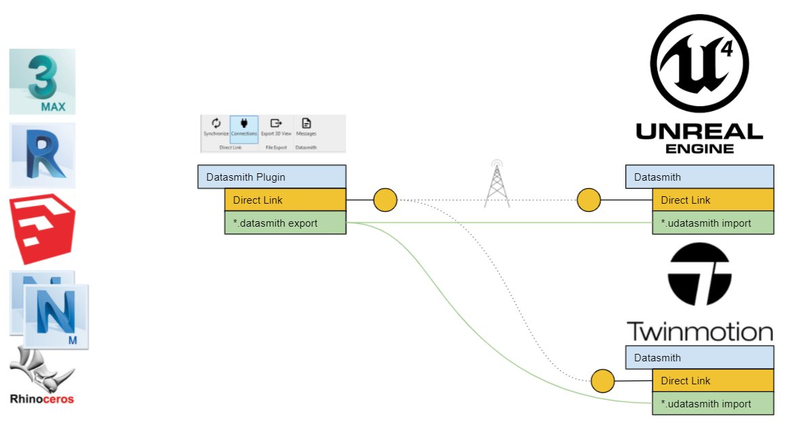
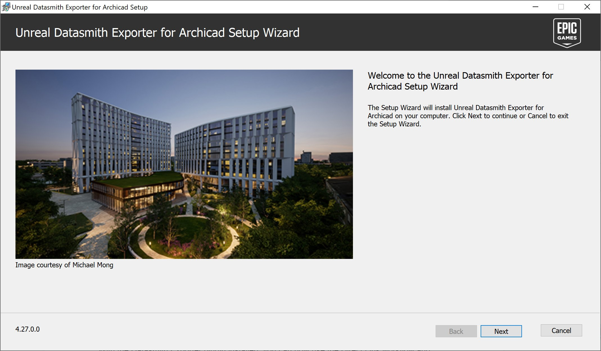
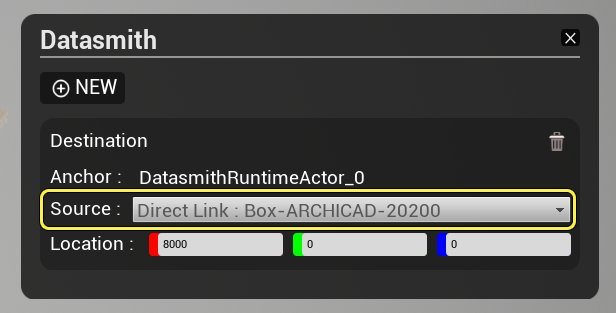
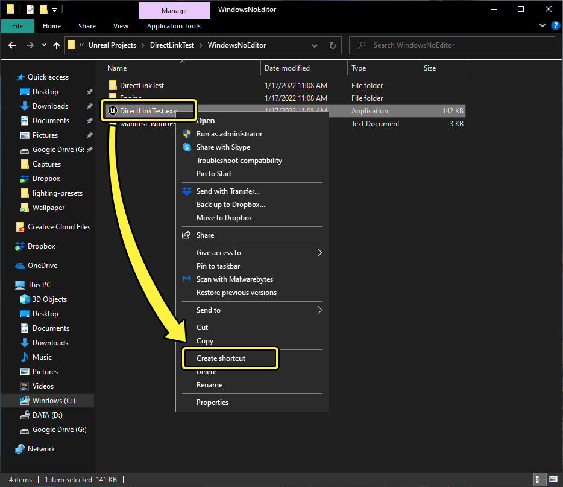
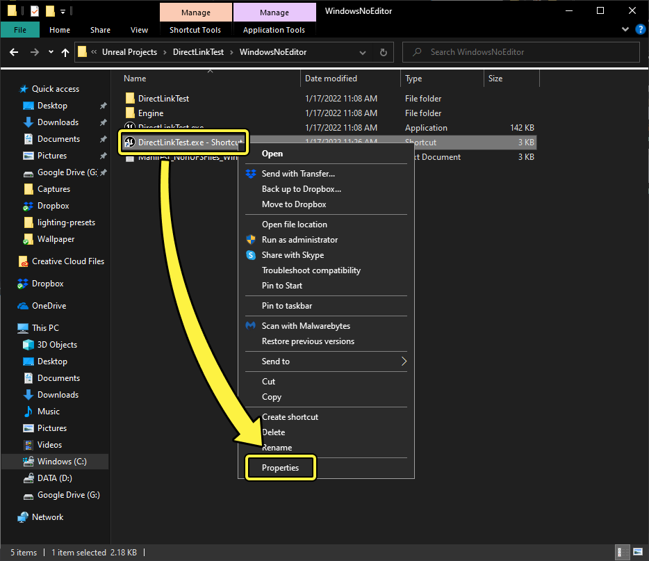
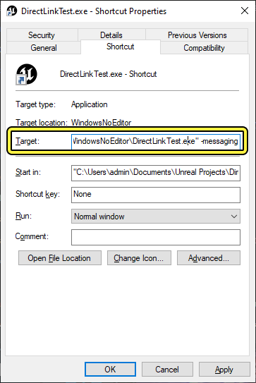

# 使用Datasmith Direct Link

> 路径：虚幻引擎5.7文档 / 管理内容 / Datasmith / Datasmith教程 / 使用Datasmith Direct Link

> 原始页面：https://dev.epicgames.com/documentation/unreal-engine/using-datasmith-direct-link-in-unreal-engine

**Datasmith Direct Link** 是许多Datasmith导出程序插件都有的功能，只需按一下按钮，即可在基于虚幻引擎的应用程序（例如 **Twinmotion**）中逐步更新视口。

|  |  |
| --- | --- |
| Archicad Direct Link | 协作查看器Direct Link |
| 源应用程序 | 目标应用程序 |

借助Direct Link工作流，你可以在一个或多个源应用程序与多个目的地（例如基于虚幻引擎的应用程序或Twinmotion）之间设置Datasmith DirectLink。

Datasmith Direct Link使多个源应用程序能够连接到一个或多个目的地。

此链接会更新你的虚幻引擎关卡或Twinmotion模型，从而无需在你每次进行更改时从源重新导出 `*.udatasmith` 文件。这样可以更容易近乎实时地更新和可视化3D场景的增量更改。

## 设置Direct Link连接

Datasmith Direct Link工作流的入门首先是，在你的3D应用程序和基于虚幻引擎的应用程序之间创建连接。

1. 为你的应用程序下载并安装合适的Datasmith导出程序插件。你可以在[此处](https://www.unrealengine.com/en-US/datasmith/plugins)下载相应的插件。请参阅[Datasmith软件交互指南](../../datasmith-software-interop-guides/index.md)，详细了解如何在你的应用程序中使用Datasmith导出器插件。

   

   安装适用于Archicad的Datasmith导出程序插件。
2. 为3D应用程序安装Datasmith导出程序插件后，请确保启用了Datasmith功能。这将视你的应用程序而定。
3. 打开你的目标应用程序，并选择你的3D应用程序作为 **源**。

   

   协作查看器模板中的Datasmith选项面板。

   例如，当使用 **协作查看器（Collab Viewer）** 模板在项目设置中运行本地会话时，按住 **空格键** 并选择 **Datasmith** 选项，将一个或多个DirectLink源添加到关卡。请参阅[协作查看器模板快速入门](../../../../sharing-and-releasing-projects/developing-for-xr-experiences/getting-started-with-xr-development/collab-viewer-templates/collab-viewer-template-quick-start/index.md)，详细了解协作查看器模板的用法。
4. 返回源应用程序，点击与DirectLink同步（Synchronize with DirectLink）按钮，同步DirectLink连接。

   

   点击与DirectLink同步（Synchronize with DirectLink）按钮，同步应用程序之间的更改。

## 在打包项目中使用Direct Link

要在打包项目中使用Direct Link，你还必须为项目的 `.exe` 文件启用UDP消息传输。

1. 在Windows资源管理器或其他文件资源管理器中，打开你的项目文件夹，然后打开

   WindowsNoEditor

   文件夹。
2. 右键单击你的项目的可执行文件，在上下文菜单中选择 **创建快捷方式**。

   
3. 右键单击您创建的快捷方式，并从上下文菜单中选择**属性**。

   
4. 在快捷方式的 **属性** 窗口中，在 **目标** 属性中添加 `-messaging` 参数。

   就本示例而言，如下所示： `"C:\Users\admin\Documents\Unreal Projects\DirectLinkTest\WindowsNoEditor\DirectLinkTest.exe" -messaging`

   
5. 点击

   确认（OK）

   保存修改。

## 最终结果

建立DirectLink连接后，你现在只需按一下按钮即可更新虚幻引擎或Twinmotion模型。

> 动图已省略：Direct Link示例

> [!TIP]
> 禁用 **在后台时降低CPU用量（Use Less CPU when in Background）** 选项，启用后，如果当前操作的窗口非虚幻引擎窗口，关卡中的Pawn未被持有时，3D视口仍然会更新。此选项位于 **编辑器偏好设置（Editor Preferences）中** 的 **通用（General）>性能（Performance）** 中。
