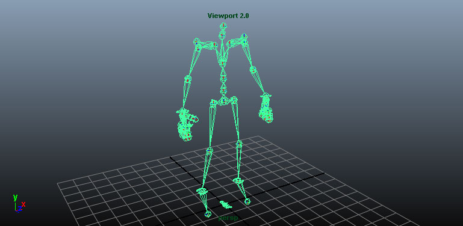
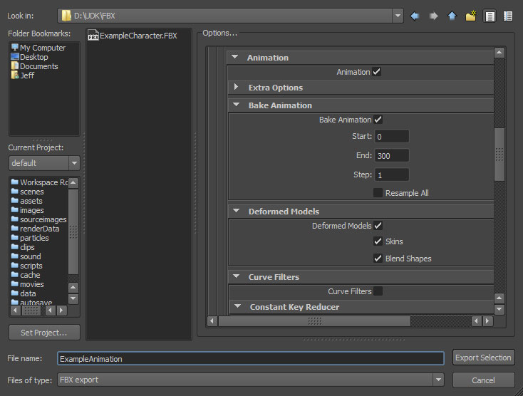
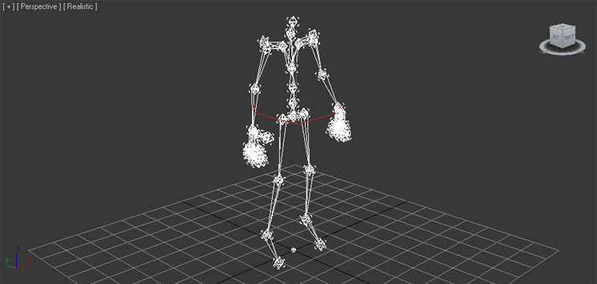
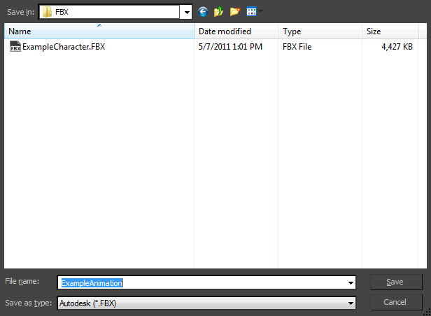
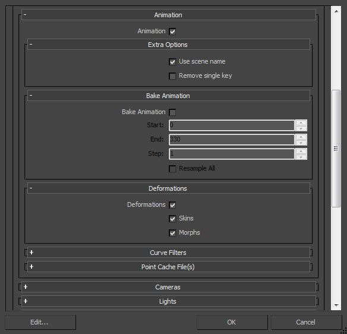

# 如何导入动画

> 路径：虚幻引擎5.7文档 / 管理内容 / FBX内容管线 / FBX动画流程 / 如何导入动画

> 原始页面：https://dev.epicgames.com/documentation/unreal-engine/importing-animations-using-fbx-in-unreal-engine

我们可从外部 3D 建模程序（如 **3DS Max**、**Maya** 或 **Blender**）导入动画到虚幻引擎。我们在此使用 3DS Max 和 Maya 进行演示，实际上您可将动画从任何带保存功能的 3D 建模程序中导入虚幻引擎。

> [!NOTE]
> 开始之前：请确保你可以有可供使用的3D建模程序。

## 目标

此指南的要点是为您展示如何从外部 3D 建模程序导入动画。

## 目的

完成此指南的阅读后，您将了解：

- 如何从外部 3D 建模程序导入动画。
- 如何将动画从外部 3D 建模程序导入到虚幻编辑器。

> [!WARNING]
> 虚幻引擎FBX导入管线使用 **FBX 2020.2**。在导出时使用不同版本可能会导致不兼容。

选择3D美术工具

Autodesk Maya

Autodesk 3ds Max

## 导出动画

动画必须被单个导出，单个文件中只能包含一个骨骼网格体的一个动画。

1. 在视口中选择要导出的关节。

   
2. 在 **文件（File）** 菜单中选择 **导出选项（Export Selection）**（如果需要无视选择导出场景中的所有内容，则选择 **导出所有（Export All）**）

   
3. 选择动画导出的FBX文件的所在路径和命名，并在 **FBX导出（FBX Export）** 对话中设置正确选项。为便于导出动画，必须启用 **动画（Animations）** 勾选框。

   
4. 点击maya_export_button.jpg按钮创建包含网格体的FBX文件。

1. 在视口中选择要导出的动画所相关的骨骼。

   
2. 在 **文件（File）** 菜单中选择 **导出选中项（Export Selected）**（如果需要无视选择导出场景中的所有内容，则选择 **导出所有（Export All）**）

   
3. 选择将动画导出的FBX文件的保存路径和命名，并点击max_save_button.jpg按钮。

   
4. 在 **FBX导出（FBX Export）** 对话中设置正确选项。为便于导出动画，必须启用 **动画（Animations）** 勾选框。

   
5. 点击max_ok_button.jpg按钮创建包含网格体的FBX文件。

## 导入动画

在虚幻引擎的 FBX 动画导入流程中，带或不带骨骼网格体的动画均可导入。

### 导入带骨骼网格体的动画

1. 在 **内容浏览器** 中点击 **Import** 按钮。
2. 找到并选择需要导入的 FBX 文件。
3. 点击 **Open** 开始导入 FBX 文件到项目。
4. 在 **FBX Import Options** 对话中进行适当设置。

   > [!NOTE]
   > 导入不共享现有骨骼的网格体时，默认设置便已足够。导入 LOD 时，导入网格体的命名将遵循默认 [命名规则](../../fbx-import-options-reference/index.md#%E5%91%BD%E5%90%8D%E8%A7%84%E8%8C%83)。在 [FBX 导入对话](../../fbx-import-options-reference/index.md) 文档中可查阅全部设置的更多信息。

   在FBX导入器中，有两个导入按钮供使用。第一个是"导入（Import）"按钮，允许我们将当前选定的FBX文件按照指定设置导入。第二个是"全部导入（Import All）"按钮，允许将当前选中的所有FBX文件按照指定设置导入。

   > [!NOTE]
   > 有关 FBX 导入器中可用的设置的更多信息，请访问 [FBX 导入选项参考]（working-with-content/fbx-content-pipeline/fbx-import-options-reference）页面。
5. 点击 **Import** 或 **Import All** 添加网格体到项目。
6. 如导入成功，导入的骨骼网格体和动画将出现在 **内容浏览器** 中。

   > [!NOTE]
   > 为保存导入动画而创建的动画序列默认以骨骼的根骨骼命名。

### 导入不带骨骼网格体的动画

> [!NOTE]
> 虚幻引擎允许将多个动画导入单个 FBX 文件中；然而许多 DCC 工具（如 3ds Max 和 Maya）不支持在单个文件中保存多个动画。如从支持的程序中（如 Motion Builder）导出，虚幻引擎将导入导出文件中包含的所有动画。

开始这部分的学习前，需要一个用于导入动画的 **动画序列**。动画序列可通过 **内容浏览器** 或直接在 **动画序列编辑器** 中进行创建。

1. 在编辑器中点击 **Import** 按钮。
2. 找到并 **选择** 需要导入的 FBX 文件。
3. 点击 **Open** 开始导入 FBX 文件到项目。
4. 在 **FBX Import Options** 对话中进行适当设置。

   > [!NOTE]
   > 导入不共享现有骨骼的网格体时，默认设置便已足够。导入 LOD 时，导入网格体的命名将遵循默认命名规范。在[FBX导入对话框](../../fbx-import-options-reference/index.md)文档中可查阅全部设置的更多信息。

   > [!WARNING]
   > 单个导入动画时，必须指定一个现有骨骼。
5. 如导入成功，导入的骨骼网格体和动画将出现在 **内容浏览器** 中。

   > [!NOTE]
   > 为保存导入动画而创建的动画序列默认以骨骼的根骨骼命名。

这便是该指南的全部内容，您已从中学习到：

✓ 如何从外部 3D 建模程序导入动画。 ✓ 如何将动画从外部 3D 建模程序导入到虚幻编辑器。
