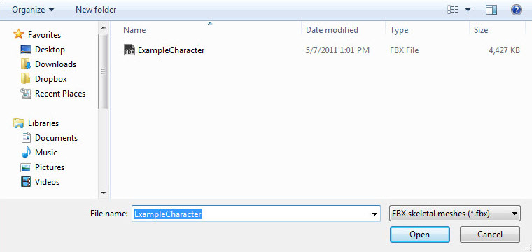

# FBX动画流程

> 路径：虚幻引擎5.7文档 / 管理内容 / FBX内容管线 / FBX动画流程

> 原始页面：https://dev.epicgames.com/documentation/unreal-engine/fbx-animation-pipeline-in-unreal-engine

FBX导入通道支持动画，使用者可通过简单工作流从3D软件将 *骨架网格体* 动画导入虚幻引擎以便在游戏中使用，当前单个文件中只能导入/导出每个 *骨架网格体* 的单一动画。

此页面是使用FBX内容通道将动画导入虚幻引擎的技术概览。

> [!WARNING]
> 虚幻引擎FBX导入管线使用 **FBX 2020.2**。在导出时，使用不同的版本可能会导致不兼容。

> [!TIP]
> 此页面包含Autodesk Maya和Autodesk 3ds Max二者的信息。请在下方选择您偏好的内容创建工具，之后页面便只会显示与选中工具相关的内容。

选择3D美术工具

Autodesk Maya

Autodesk 3ds Max

## 命名

使用FBX格式将动画导入虚幻引擎时，AnimationSequence将被设为与文件相同的命名。随骨架网格体导入动画时，创建的AnimationSequence将从动画序列中的根骨骼获取命名。导入进程完毕后，可通过 **内容浏览器** 进行重命名。

## 创建动画

动画可以特定于一个 *骨架网格体*，也可以重复用于多个骨架网格体（前提是每个 *骨架网格体* 使用的骨架相同）。使用FBX内容通道创建动画并将其导入虚幻引擎实际上只需要一个带动画的骨架。是否将网格体绑定到骨架则完全取决于使用者，绑定后创建动画将更为简单，因为使用者可以清楚地看到网格体在动画中的变形。而在导出时则只需要骨架。

## 从3D应用程序导出动画

动画必须单个导出；单个文件包含每个 *骨架网格体* 的一个动画。下方的步骤将说明单个动画如何将其自身导出到一个文件。绑定到此骨架的网格体已隐藏，因为动画自行导出时并不一定需要它们。

1. 在视口中选择要导出的关节。

   
2. 在 **文件（File）** 菜单中选择 **导出选项（Export Selection）**（如果需要无视选择导出场景中的所有内容，则选择 **导出所有（Export All）**）

   
3. 选择动画导出的FBX文件的所在路径和命名，并在 **FBX导出（FBX Export）** 对话中设置正确选项。为便于导出动画，必须启用 **动画（Animations）** 勾选框。

   
4. 点击maya_export_button.jpg按钮创建包含网格体的FBX文件。

1. 在视口中选择要导出的动画所相关的骨骼。

   
2. 在 **文件（File）** 菜单中选择 **导出选中项（Export Selected）**（如果需要无视选择导出场景中的所有内容，则选择 **导出所有（Export All）**）

   
3. 选择将动画导出的FBX文件的保存路径和命名，并点击max_save_button.jpg按钮。

   
4. 在 **FBX导出（FBX Export）** 对话中设置正确选项。为便于导出动画，必须启用 **动画（Animations）** 勾选框。

   
5. 点击max_ok_button.jpg按钮创建包含网格体的FBX文件。

## 导入动画

FBX动画导入通道可一次性导入 *骨架网格体* 和动画，或单独导入网格体/动画。

**含动画的骨架网格体**

1. 点击 **内容浏览器** 中的按钮。在打开的文件浏览器中找到并选中需要导入的FBX文件。**注意：**可能需要在下拉菜单中选择import_fbxformat.jpg，过滤掉不需要的文件。

   

   > [!NOTE]
   > 导入资源的导入路径取决于导入时 **内容浏览器** 的当前位置。在执行导入前必须导航至正确的文件夹。导入完成后也可将导入的资源拖入一个新文件夹。
2. 在 **FBX导入选项** 对话中选择正确的设置。导入网格体的命名将遵循默认的命名规则。请参见[**FBX导入对话**](../fbx-import-options-reference/index.md)，了解到所有设置的完整详情。
3. 点击button_import.png按钮来导入网格体和LOD。如进程成功，结果网格体、动画（AnimationSequence）、材质和纹理将显示在 **内容浏览器** 中。现在即可看到用于保存动画的AnimationSequence，其命名默认为骨架根骨骼的命名。

**单个动画**

要导入动画，首先需要一个可以将动画导入的AnimationSequence。可通过 **内容浏览器** 进行创建，或直接在AnimationSequence编辑器中创建。

> [!NOTE]
> 虚幻引擎支持同时导入一个FBX文件中包含的多个动画；但3ds Max和Maya之类的DCC工具当前并不支持将多个动画保存到单个文件中。如果从支持的软件（如Motion Builder）中进行导出，虚幻引擎将导入该文件中的所有动画。

1. 点击 **内容浏览器** 中的按钮。在打开的文件浏览器中找到并选中需要导入的FBX文件。**注意：** 可能需要在下拉菜单中选择import_fbxformat.jpg，过滤掉不需要的文件。

   > 图片已省略：import_file.jpg

   > [!NOTE]
   > 导入资源的导入路径取决于导入时 **内容浏览器** 的当前位置。在执行导入前必须导航至正确的文件夹。导入完成后也可将导入的资源拖入一个新文件夹。
2. 在 **FBX导入选项** 对话中选择正确的设置。导入网格体的命名将遵循默认的命名规则。请参见[**FBX导入对话**](../fbx-import-options-reference/index.md)，了解到所有设置的完整详情。

   > [!WARNING]
   > 导入动画时，必须指定一个现有的骨架！
3. 点击button_import.png按钮来导入网格体和LOD。如进程成功，结果网格体、动画（AnimationSequence）、材质和纹理将显示在 **内容浏览器** 中。现在即可看到用于保存动画的AnimationSequence，其命名默认为骨架根骨骼的命名。

> [!NOTE]
> 虚幻编辑器支持非等分缩放动画。导入动画时，如果存在缩放，其无需额外设置便可直接导入。出于内存原因，引擎不会保存所有动画的缩放，只会保存不为1的缩放。
>
> 请参见[**骨架网格体动画（Skeletal Mesh Animation）**](../../../animating-characters-and-objects/skeletal-mesh-animation-system/index.md)页面，了解更多内容和视频参考。
