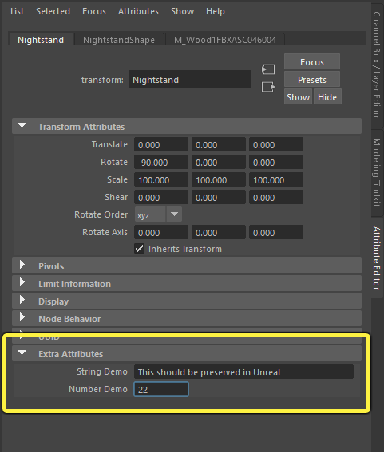
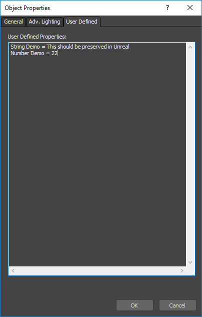
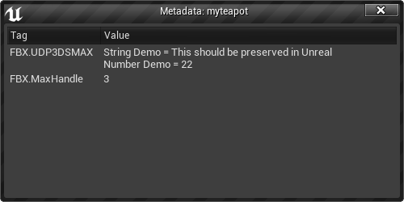

# FBX资源元数据管线

> 路径：虚幻引擎5.7文档 / 管理内容 / FBX内容管线 / FBX资源元数据管线

> 原始页面：https://dev.epicgames.com/documentation/unreal-engine/fbx-asset-metadata-pipeline-in-unreal-engine

随着实时3D制作大小和复杂程度的增加，以及构成现代制作流程的工具数量的不断增加，增加智能自动化来提高美术效率变得越发重要。这种智能自动化通常主要依靠元数据：有关资源的自定义数据，在项目中为资源赋予意义。

美术或创作者将元数据属性添加到一个应用程序中，通常在创建资源的时候进行添加。然后，这些元数据将一直与该资源保持关联，流程下游的应用程序可以读取该元数据，并用来做出有关如何处理该资源的决策。

在虚幻编辑器中，您可以使用蓝图或Python脚本来设置和检索资源的元数据键和值，如[资产元数据](../../../understanding-the-basics/assets-and-content-packs/asset-metadata/index.md)页面所述。这样有助于你完成仅在虚幻项目环境中执行的任何资源管理操作。

但是，为资源设置元数据的真正意义通常是与外部应用程序建立互操作性，并且能够创建横跨多个应用程序的更大规模的资源管理流程。为此，虚幻FBX导入器从FBX文件引入了特定类别的资源元数据，并使这些元数据可以在虚幻编辑器内部使用。

> [!NOTE]
> 由于该元数据是指定给项目中的资源，因此不能在运行时游戏代码中访问该元数据。它主要是为了在虚幻编辑器中借助脚本来完成资源管理操作。

## 元数据来源

当您将FBX文件导入虚幻中时，导入器将读取该文件中与对象关联的任何`FbxProperty`值，然后将它们作为字典或"标记-值"对映射连接到其所创建的虚幻资源。

以下应用程序已知支持通过该`FbxProperty`系统将用户自定义元数据导出FBX文件。

### Autodesk Maya

要在Maya中为资源创建元数据，请向对象添加额外自定义属性。有关具体操作的详细信息，请参阅[Maya帮助](http://help.autodesk.com/view/MAYAUL/2018/ENU/?guid=GUID-C7385EC4-74E1-4F6E-8C9D-60F5CCDA7994)。

您的自定义属性应显示在Maya **属性编辑器（Attribute Editor）** 中的对象的 **额外属性（Extra Attributes）** 列表中。例如，该对象创建有两个自定义属性：一个字符串属性，一个数字属性。

### Autodesk 3ds Max

要在3ds Max中为资源创建元数据，请将其添加到 **对象属性（Object Properties）** 对话框的 **用户定义（User Defined）** 选项卡：

> [!NOTE]
> 目前来自3ds Max的元数据作为单一字符串导入，其中包含 **用户定义（User Defined）** 文本框的完整内容，您可以通过`FBX.UDP3DSMAX`元数据标记进行访问。当您将这个字符串读取到虚幻编辑器Python或蓝图脚本中时，可能需要自行拆分这个字符串。
>
> 

## 导入后的元数据

资源元数据在虚幻中的显示方式有几点需要您有所了解。

- 所有元数据键和值以字符串类型存储在虚幻引擎中，无论其在外部应用程序中设置的原始类型为何。例如，如果您在Maya中将一个元数据值设置为数字（如

  22

  ），那么当您将其读取到虚幻的脚本中时，它将成为包含值"22"的字符串。如果您需要值是数字类型，请使用蓝图转换节点（如

  实用程序（Utilities）>字符串（String）>字符串转整数（String to Int）

  或

  字符串转浮点数（String to Float）

  ，或者内置Python字符串解析函数（如

  int()

  或

  float()

  ）。
- 如果您在来源应用程序中创建包含空格的标记名称，则空格将被FBX移除。
- 通常，标记名称都有一个用于指示值来源的前缀。对于通过FBX导入的资源，这个前缀是

  FBX.

  。其他应用程序或插件可能会使用其他前缀。例如，虚幻Shotgun集成使用前缀

  SG.

  。
- 在使用骨架网格体时，您或许可以将不同的元数据值指定给骨架中的每个单独骨骼。在这种情况下，FBX导入流程还会将所有元数据值指定给骨架网格体资源（Skeletal Mesh Asset），但它包含元数据标签名的前缀中的骨骼名称，以便您分辨应用给每个单独骨骼的值。例如，您可以在一个骨架网格体上看到类似

  FBX.Right_Arm.tag_name

  和

  FBX.Right_Hand.tag_name

  之类的标签。

因此，如果您在Maya中以名称 **Created By** 创建了一个标记，则该标记在虚幻中显示为 **FBX.CreatedBy**。

> [!TIP]
> 关于如何在虚幻编辑器中使用这些导入的元数据的更多详情，请参阅[资产元数据](../../../understanding-the-basics/assets-and-content-packs/asset-metadata/index.md)。
