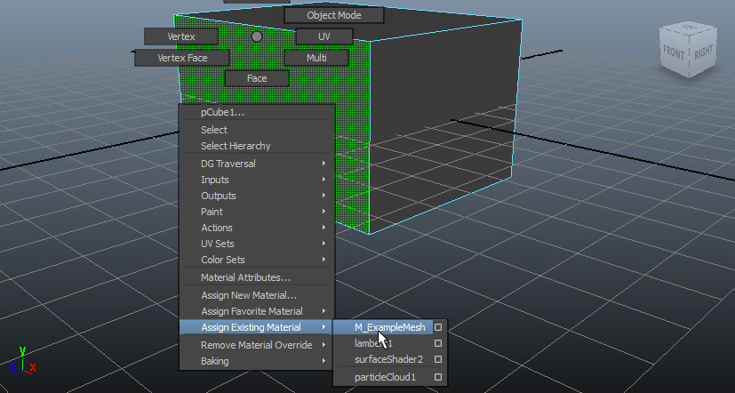
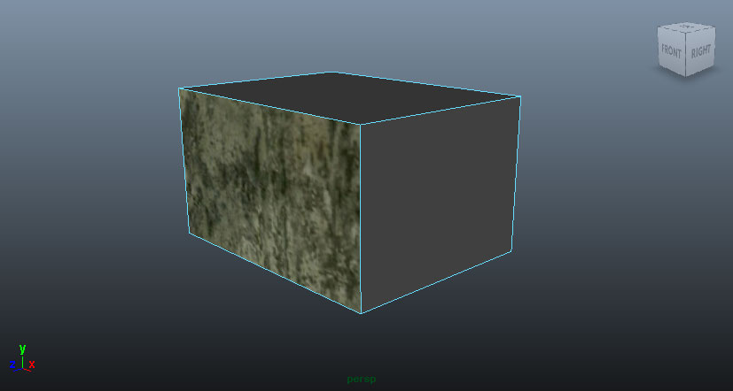
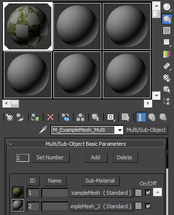
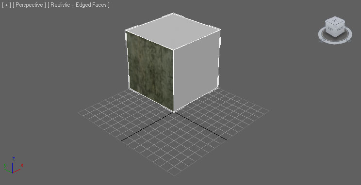
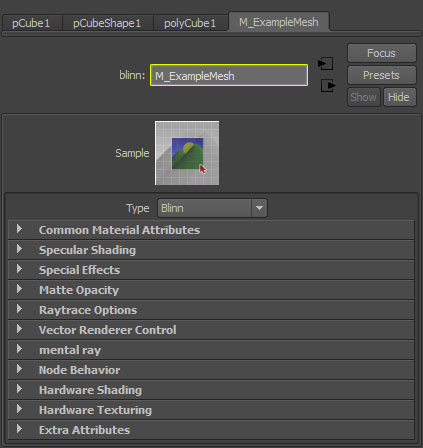
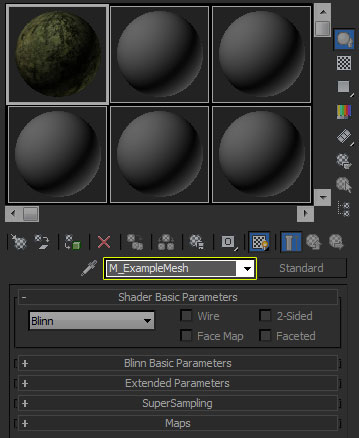

# FBX材质管道

> 路径：虚幻引擎5.7文档 / 管理内容 / FBX内容管线 / FBX材质管道

> 原始页面：https://dev.epicgames.com/documentation/unreal-engine/fbx-material-pipeline-in-unreal-engine

FBX管道将应用于网格体（静态网格体和骨架网格体）的材质和纹理从3D应用程序传输到虚幻。 要转换简单材质，可以导入源材质中使用的纹理，这样会在虚幻中创建已经将纹理连接到相应通道的材质， 最后将材质应用于导入的网格体。FBX管道简化了网格体导入流程， 自动完成过去需要人工完成的复杂流程。

> [!WARNING]
> 虚幻引擎FBX导入管线使用 **FBX 2020.2**。导出时使用其他版本可能会导致兼容问题。

> [!TIP]
> 本页包含有关 **Autodesk Maya** 和 **Autodesk 3ds Max** 的信息。请在下面选择您首选的内容创建工具。 然后会显示工具的相关文档。

选择3D美术工具

Autodesk Maya

Autodesk 3ds Max

## 材质支持

FBX管道仅支持导入基本材质。可以传输的材质类型包括：

*Surface* Anisotropic *Blinn* Lambert *Phong* Phone E

*Standard* Multi/Sub-Object

除了这些材质类型之外，还可以传输这些材质的仅特定功能。FBX材质管道不传输单独的设置， 但支持传输材质使用的特定贴图或纹理。

> [!WARNING]
> 目前，支持随着网格体导入的贴图（纹理）将添加到材质，某些常见类型将连接到材质的默认输入，但某些则需要手动连接。 此外，一些不太常见的贴图类型可能无法导入，例如Maya中用于环境光遮蔽的漫反射通道。

## 多种材质

网格体自身可以应用若干材质，每个材质覆盖网格体的特定表面，而FBX能够处理包含多个材质的网格体的导入（假设它们已经在3D应用程序中正确设置）。

就网格体上使用多种材质而言，Maya非常简单明了。您只需选择想要对其应用材质的网格体表面，然后应用材质即可。

针对Maya中应用于网格体的每个材质，都将在虚幻编辑器中创建一个材质，导入的网格体对于其中每种材质都有对应的材质插槽。应用于网格体后，材质仅影响网格体的对应多边形，就像Maya中一样。

在3dsMax中，多个材质通过使用 **Multi/Sub-Object** 材质进行处理。网格体的每个面有一个_Material ID_，Multi/Sub-Object材质中的每个Standard材质应用于对应的_Material ID_。

针对Multi/Sub-Object材质中的每个Standard材质，都将在虚幻编辑器中创建一个材质，导入的网格体对于其中每种材质都有对应的材质插槽。应用于网格体后，材质仅影响网格体的对应多边形，就像3dsMax中一样。

## 材质命名

虚幻编辑器在导入过程中创建的材质将根据3D应用程序中的源材质命名。具体从哪里抽取名称，则取决于是从哪个应用程序导出网格体的。

如果来自于Maya，则虚幻编辑器中的材质名称取自Maya中应用于网格体的着色引擎名称。

如果来自于3dsMax，则虚幻编辑器中的材质名称直接取自3dsMax中应用网格体的材质名称。

### 材质顺序

> [!NOTE]
> 截至4.14，不再需要`Skin##`命名约定来指定材质顺序。

当材质最初从FBX导入时，材质名称将分配到材质插槽，这样重新导入FBX时，可以使用 **原始导入材质名称** 将材质 与正确的元素索引相匹配。这种方法比使用`Skin##`命名约定来确定材质顺序更加一致，可以保证导入流程直接查找FBX文件中的名称， 以确定哪个分段应该与列表中已经填充的现有材质相匹配。这里的"插槽名称（Slot Name）"将匹配网格体" 细节层次（Level of Detail，LOD）"部分中的"材质名称（Material Name）"下拉选择。

> [!NOTE]
> 如果您将鼠标悬停于 **插槽名称（Slot Name）** 字样上方，工具提示将列出已经导入的材质名称。4.14之前导入的任何静态网格体或骨架网格体将在工具提示中显示`None`材质名称。

#### 添加或移除材质插槽

要添加或移除任何材质插槽，请使用"材质（Materials）"列表顶部的 **添加**（**+**）按钮和"插槽名称（Slot Name）"旁边的 **移除**（**x**）按钮。添加的插槽可以用来覆盖较低LOD分段，但不能覆盖基本LOD。

|  |  |
| --- | --- |
| 添加（+）材质插槽 | 移除（x）材质插槽 |

#### 在蓝图和C++中设置材质插槽

在运行时，调用 **按名称设置材质**，使用您为材质指定的插槽名称来设置组件上的材质。这样您就不必对材质元素索引号进行硬编码 来检索您所寻找的材质插槽。还可以确保Gameplay代码在网格体上的材质顺序一旦发生变化（因为它引用的是插槽名称，因此不太容易变化）时也能正常工作。

## 纹理导入

如果材质在3D应用程序中分配了纹理作为漫反射或法线贴图，只要在[FBX导入属性（FBX Import Properties）](../fbx-import-options-reference/index.md)中启用了 **导入纹理（Import Textures）**，就可以导入这些纹理。

将在虚幻编辑器中新创建的材质中将构建纹理取样表达式，导入的纹理将分配到该纹理取样。系统还会向材质添加纹理坐标表达式，并将它连接到纹理取样的 **UV** 输入。但是，您需要将某些纹理连接到它们的材质插槽。

如果在3D应用程序中应用于材质的纹理格式与虚幻不兼容，或者连接到了未知材质属性（例如，Maya中的漫反射），则它们不会导入。在此情况下，以及材质中不存在纹理的情况下，虚幻编辑器中的材质将通过随机着色的矢量参数进行填充。
