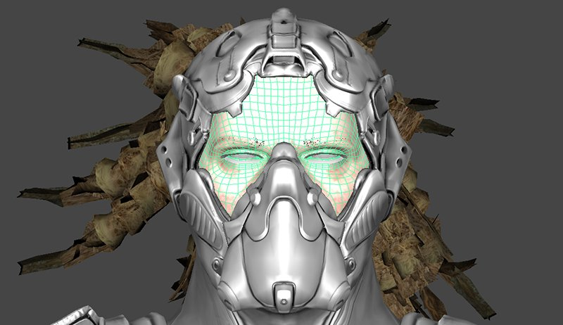
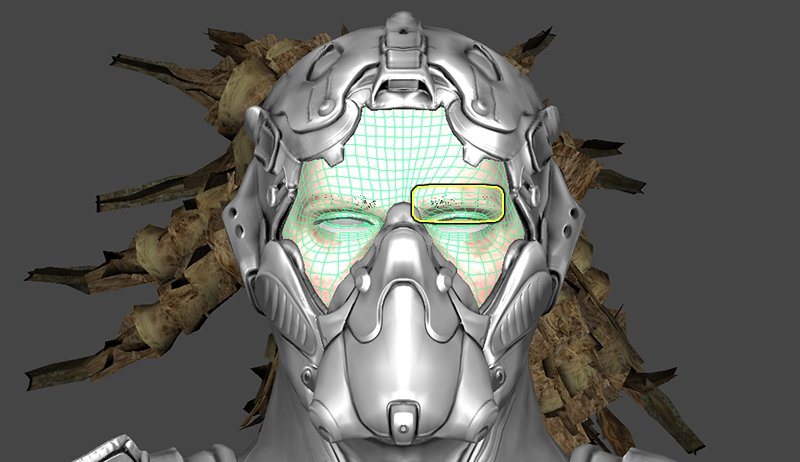
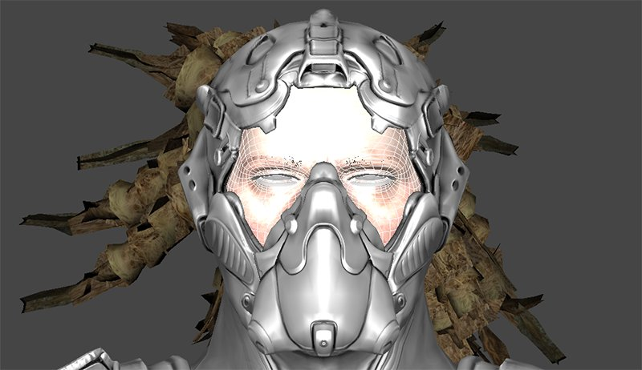
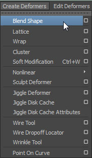
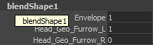
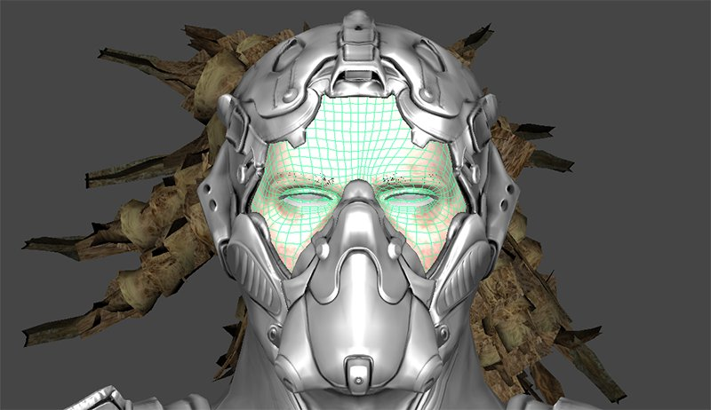
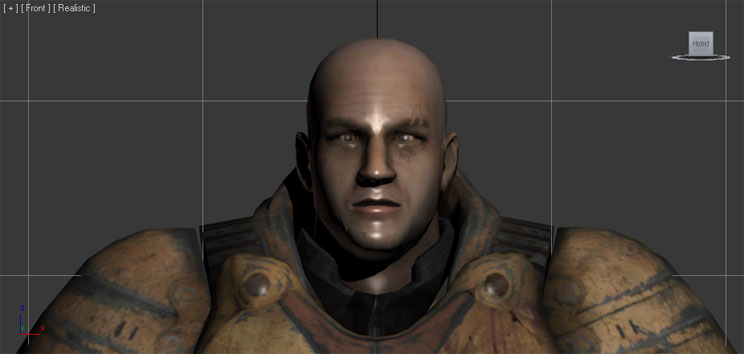

# FBX变换目标管线

> 路径：虚幻引擎5.7文档 / 管理内容 / FBX内容管线 / FBX变换目标管线

> 原始页面：https://dev.epicgames.com/documentation/unreal-engine/fbx-morph-target-pipeline-in-unreal-engine

**变换目标（Morph Target）** 是特定网格体的顶点位置的快照，该网格体在某种程度上已经变形。例如，您可以使用一个角色模型，对其面部进行重塑以创建一个面部表情，然后将编辑后的版本保存为变换目标。在Unreal中，您可以混合变换目标以使角色面部做出该表情。变换目标可以通过FBX导入到Unreal中，并封装在动画序列中。

这使得将复杂的变换目标动画导入到Unreal变得非常容易，因为您可以用任意数量的变换目标驱动单个动画。例如，您可以在您的动画包中使用变换目标以使角色活动起来并说出一些对话。这个动画可以使用任意数量的变换目标来捕捉面部的完整运动。但是，当导入时，结果看起来只是一个动画序列。您仍然可以通过[**曲线**](../../../animating-characters-and-objects/skeletal-mesh-animation-system/animation-assets-and-features/animation-sequences/animation-curves/index.md)访问每个变换目标的动画数据。

FBX导入通道中的变换目标支持提供了一种简单的方法，可以将骨架网格体的变换目标从三维应用程序放入Unreal中，以供在游戏中使用。通道允许在一个文件中导入任意数量骨架网格体的任意数量变换目标。

本页面是对使用FBX内容通道将变换目标导入虚幻引擎的技术概述。

> [!WARNING]
> 虚幻引擎FBX导入管线使用 **FBX 2020.2**。在导出时使用其他版本可能会导致不兼容。

> [!TIP]
> 本页面包含了有关于Autodesk Maya和Autodesk 3ds Max的信息，请在下面选择您首选的内容创建工具，以及仅与将显示之所选工具相关的信息：

选择3D美术工具

Autodesk Maya

Autodesk 3ds Max

## 命名

当使用FBX格式将变换目标导入Unreal时，各变换目标将根据三维应用程序中的混合形状或变换的名称命名。

* 该名称将是添加到blendshape节点名称中的blendshape的名称，即"[BlendShapeNode]_[BlendShape]"。

* 该名称将是变换器修饰符中信道的名称。

## 设置变换目标

在Maya中设置要导出到FBX的变换目标需要使用混合形状。下面的步骤简要说明了为导出设置变换目标所需的步骤。有关更详细的信息，请参阅应用程序的帮助文件。

1. 从基本网格体开始。

   
2. 复制需要修改以创建目标姿势的网格体。在本例中，该网格体为头部。创建目标姿势。本例的目标姿势是角色眨眼。

   
3. 选择目标网格体，然后按这个顺序选择基本网格体。

   
4. 在已设置的 **动画（Animation）** 菜单的 **创建变形器（Create Deformers）** 菜单中，选择 **混合形状（Blend Shape）**。必要时，可在完成此步骤后删除目标网格体。

   
5. 混合形状节点此时在基本网格体的属性中可见。这些是将在Unreal中使用的名称。您可以在此处更改blendshape节点和blendshape的名称。

   
6. 将blendshape的权重调整到高达1.0会导致基本网格体向目标姿势内插。

   

在3dsMax中设置要导出到FBX的变换目标需要使用变换器修饰符。下面的步骤简要说明了为导出设置变换目标所需的步骤。有关更详细的信息，请参阅应用程序的帮助文件。

1. 从基本网格体开始。

   
2. 复制需要修改以创建目标姿势的网格体。在本例中，该网格体为头部。创建目标姿势。本例的目标姿势是角色眨眼。

   
3. 将 **变换器（Morpher）** 修饰符添加到基本网格体。它需要放置在堆栈中的 **皮肤（Skin）** 修饰符之前。

   > 图片已省略：max_setup_3.jpg
4. 选择要填充的变换信道后，按下 **变换器（Morpher）** 修饰符属性转出中的max_pick_button.jpg或 **右键单击** 该信道并选择_从场景中选取对象（Pick Object From Scene）_。

   > 图片已省略：max_setup_4.jpg
5. 在视口中，单击目标网格体。

   > 图片已省略：max_setup_5.jpg
6. 变换信道现已填充，并显示目标网格体的名称。这是提供给Unreal中变换目标的名称。您可以在 **变换器（Morpher）** 修饰符的转出的 **信道参数（Channel Parameters）** 部分中更改它。

   > 图片已省略：max_setup_6.jpg
7. 将信道的权重调整到高达100.0会导致基本网格体向目标姿势内插。

   > 图片已省略：max_setup_7.jpg

## 导出变换目标

1. 在视口中选择要导出的基本网格体和关节。

   > 图片已省略：maya_export_1.png
2. 在_文件（File）*菜单中，选择_导出选择（Export Selection）*（或者如果您想要导出场景中的一切（无论选择了什么），请选择_全部导出（Export All）_）。

   > 图片已省略：maya_export_2.jpg
3. 选择要将变换目标导出至的FBX文件的位置和名称，并在 **FBX导出（FBX Export）** 对话框中设置合适的选项。为了导出变换目标，必须启用 **动画（Animations）** 复选框和所有 **变形模型（Deformed Models）** 选项。

   > 图片已省略：maya_export_3.jpg
4. 单击maya_export_button.jpg按钮以创建包含变换目标的FBX文件。

1. 在视口中选择要导出的基本网格体和骨骼。

   > 图片已省略：max_export_1.jpg
2. 在_文件（File）*菜单中，选择_导出选定项（Export Selected）*（或者如果您想要导出场景中的一切（无论选择了什么），请选择_全部导出（Export All）_）。

   > 图片已省略：max_export_2.jpg
3. 选择要将变换目标导出至的FBX文件的位置和名称，然后单击max_save_button.jpg按钮。

   > 图片已省略：max_export_3.jpg
4. 在 **FBX导出（FBX Export）** 对话框中设置合适的选项。为了导出变换目标，必须启用 **动画（Animations）** 复选框和所有 **变形（Deformations）** 选项。

   > 图片已省略：max_export_4.jpg
5. 单击max_ok_button.jpg按钮以创建包含变换目标的FBX文件。

## 导入变换目标

FBX变换目标导入通道允许同时导入_SkeletalMesh_和变换目标。如果您将变换目标导入并添加到已经应用了变换目标的现有骨架中，则现有骨架将被覆盖。

**带变换目标的骨架网格体（Skeletal Mesh with Morph Targets）**

1. 单击 **内容浏览器（Content Browser）** 中的 **导入（Import）** 按钮。导航到并选择要在打开的文件浏览器中导入的FBX文件。**注意：** 您可能需要在下拉菜单中选择import_fbxformat.jpg以过滤不需要的文件。
2. 在 **导入（Import）** 对话框中选择合适的设置。确保启用了_导入变换目标（Import Morph Targets）_。**注意：**导入的网格体的名称将遵循默认的[**命名规格**](../fbx-import-options-reference/index.md#%E5%91%BD%E5%90%8D%E8%A7%84%E8%8C%83)。有关所有设置的完整详情，请参阅[**FBX导入对话框**](../fbx-import-options-reference/index.md)部分。
3. 单击 **确定（OK）** 按钮以导入网格体和LOD。如果此过程成功，最终生成的网格体、变换目标(MorphTargetSet)、材质和纹理将显示在 **内容浏览器（Content Browser）** 中。您可以看到，为保存变换目标而创建的MorphTargetSet在默认情况下是以骨架的根骨骼命名的。

   通过查看Persona中导入的网格体并使用 **变换目标预览器（Morph Target Previewer）** 选项卡，您可以调整导入的变换目标的强度，并看到它正在按预期工作。

> 图片已省略：undefined

**变换目标（Morph Targets）** 的效果通常很微妙，但无论怎样强调它给动画师提供的控制和它给角色增加的可信度也不为过。
