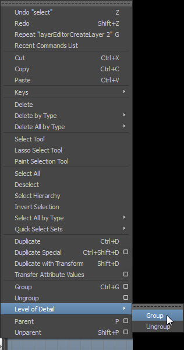
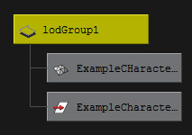
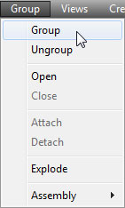
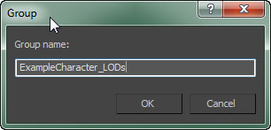
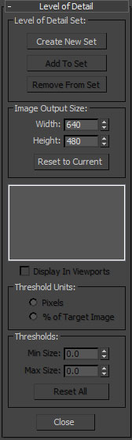
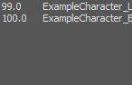

# 使用FBX导入骨骼网格体LOD

> 路径：虚幻引擎5.7文档 / 管理内容 / FBX内容管线 / 骨架网格体管道 / 使用FBX导入骨骼网格体LOD

> 原始页面：https://dev.epicgames.com/documentation/unreal-engine/importing-skeletal-mesh-lods-using-fbx-in-unreal-engine

选择操作系统：

Windows

macOS

Linux

可从外部 3D 建模程序（如 **3DS Max**、**Maya** 或 **Blender**）将骨骼网格体细节级别（LOD）导入虚幻引擎。我们在此使用 3DS Max 和 Maya 进行演示，实际上您可将骨骼网格体 LOD 从任何带保存功能的 3D 建模程序中导入虚幻引擎。

> [!NOTE]
> 在开始前，请确保你有可供使用的3D建模应用程序。

## 目标

此指南的要点是为您展示如何从外部 3D 建模程序导入骨骼网格体 LOD。

## 目的

完成此指南的阅读后，您将了解：

- 如何从外部 3D 建模程序设置骨骼网格体 LOD。
- 如何从外部 3D 建模程序导出骨骼网格体 LOD。
- 如何将骨骼网格体 LOD 从外部 3D 建模程序导入虚幻编辑器。

> [!WARNING]
> 虚幻引擎FBX导入管线使用 **FBX 2020.2**。在导出时使用其他版本可能会导致不兼容。

选择3D美术工具

Autodesk Maya

Autodesk 3ds Max

## 设置骨骼网格体 LOD

1. 从基础LOD到最低级LOD的顺序，依次选择所有网格体（基础和LOD）。按顺序选择非常重要，这样就可以按照复杂性以正确的顺序添加它们。然后从 *编辑（Edit）* 菜单中选择 *细节层级（Level of Detail） > 分组（Group）* 命令。

   
2. 现在所有的网格体都应该分组到了LOD组下。

   

1. 选中所有网格物体（基础网格物体和LOD——顺序不重要），然后从 *分组（Group）* 菜单中选择 *分组（Group）* 命令。

   
2. 在打开的对话框中输入新组的名称，单击max_lod_ok_button.jpg按钮来创建组。

   
3. 单击max_utilities_button.jpg按钮来查看 *实用程序（Utilities）* 面板，然后选择 *细节层级（Level of Detail）* 实用程序。**注意：**你可能需要单击max_utility_more_button.jpg，从列表中将其选中。

   
4. 选择组后，单击max_lod_create_button.jpg按钮来创建一套新LOD，并将所选组中的网格体添加到其中。这些网格体将根据复杂程度自动排序。

   

> [!NOTE]
> **多部位骨骼网格体** LOD 的设置和全网格体 LOD 的设置几乎相同，唯一的不同是包含 LOD 的每个部位均会创建 LOD 群组。这些 LOD 群组的设置过程与上述过程相同。

## 导出骨骼网格体 LOD

1. 选择要导出的LOD群组和关节。

   按照与基本网格体相同的导出步骤操作（具体请参见[从3D应用程序中导出网格体](../index.md#%E4%BB%8E3d%E5%BA%94%E7%94%A8%E7%A8%8B%E5%BA%8F%E4%B8%AD%E5%AF%BC%E5%87%BA%E7%BD%91%E6%A0%BC%E4%BD%93)部分）。
2. 选择包含要导出的LOD集以及骨骼的网格体群组。

   按照与基本网格体相同的导出步骤操作（具体请参见[从3D应用程序中导出网格体](../index.md#%E4%BB%8E3d%E5%BA%94%E7%94%A8%E7%A8%8B%E5%BA%8F%E4%B8%AD%E5%AF%BC%E5%87%BA%E7%BD%91%E6%A0%BC%E4%BD%93)部分）。

## 导入骨骼网格体 LOD

可通过 **Persona** 中 **LOD Settings** 下的 **Mesh Details** 面板导入 **骨骼网格体 LOD**。

> [!NOTE]
> Persona 是 UE4 中的动画编辑工具集。在 [动画编辑器](../../../../animating-characters-and-objects/skeletal-mesh-animation-system/animation-editors/index.md) 中可查看更多内容。

1. 如需将 **LOD** 应用至骨骼网格体，双击 **内容浏览器** 中的动画资源即可打开 **Persona**（操作示意图如下）。
2. 在 **Mesh Details** 面板中向下滚动，找到 **LOD Settings** 部分并点击 **LOD Import** 选项。
3. 在文件浏览器中找到并选择需要导入的 FBX 文件。
4. 导入的 LOD 现在已添加到 **Mesh Details** 面板。
5. 每个 LOD 下的 **Display Factor** 设置说明 LOD 何时使用。下图中，玩家位置靠近 **骨骼网格体** 时使用 LOD0，玩家位置远离 **骨骼网格体** 时使用 LOD1。

   > [!NOTE]
   > 玩家位置远离 **骨骼网格体** 时，使用较小的 **Display Factor** 数值告知虚幻引擎使用 LOD。玩家位置靠近 **骨骼网格体** 时，使用较大的 **Display Factor** 数值告知虚幻引擎使用 LOD。

这便是该教程的全部内容，您已从中学习到：

✓ 如何从外部 3D 建模程序设置骨骼网格体 LOD。 ✓ 如何从外部 3D 建模程序导出骨骼网格体 LOD。 ✓ 如何将骨骼网格体 LOD 从外部 3D 建模程序导入虚幻编辑器。
