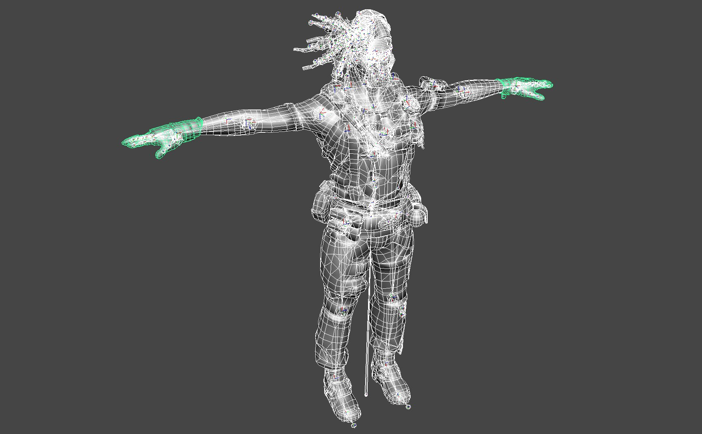
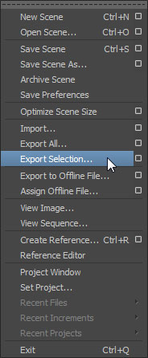
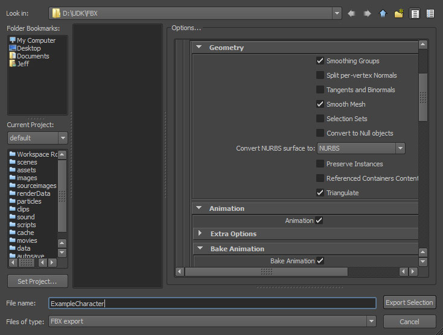
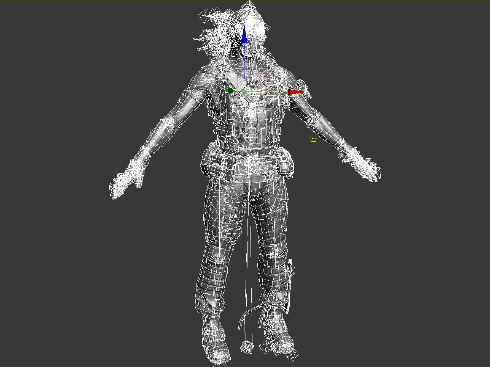
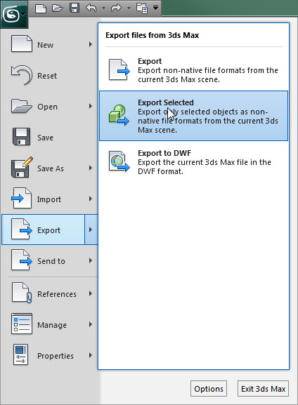
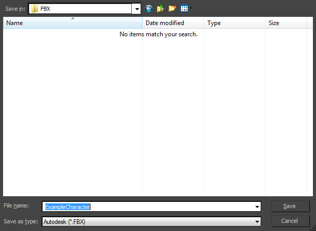
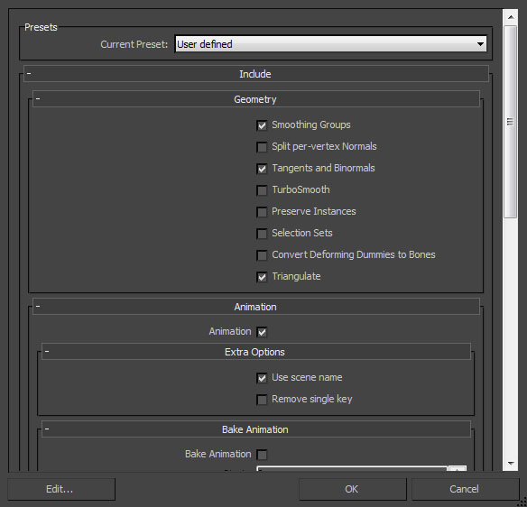
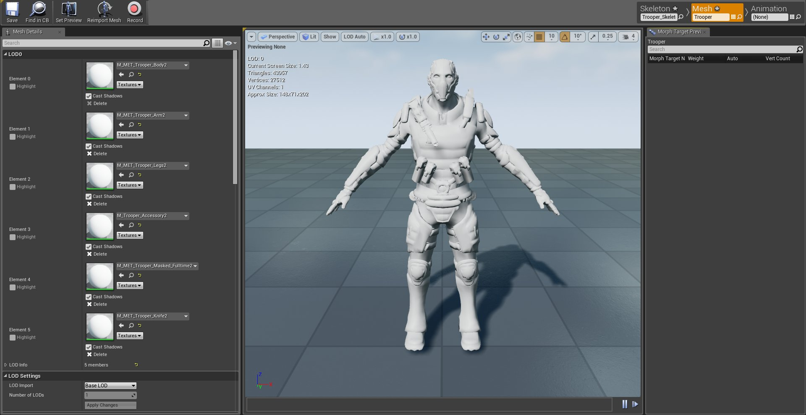

# 使用FBX方法导入骨骼网格体

> 路径：虚幻引擎5.7文档 / 管理内容 / FBX内容管线 / 骨架网格体管道 / 使用FBX方法导入骨骼网格体

> 原始页面：https://dev.epicgames.com/documentation/unreal-engine/importing-skeletal-meshes-using-fbx-in-unreal-engine

选择操作系统：

Windows

macOS

Linux

可从外部 3D 建模程序（如 **3DS Max**、**Maya** 或 **Blender**）将静态网格体导入到虚幻引擎。我们在此使用 3DS Max 和 Maya 进行演示，实际上您可将 **骨骼网格体** 从任何带保存功能的 3D 建模程序中导入虚幻引擎。

> [!NOTE]
> 在开始之前，请确保你有可供使用的3D建模应用程序。

## 目标

此指南的要点是为您展示如何从外部 3D 建模程序导入骨骼网格体。

## 目的

完成此指南的阅读后，您将了解：

- 如何从外部 3D 建模程序导出骨骼网格体。
- 如何将骨骼网格体导入虚幻编辑器。
- 如何验证骨骼网格体已正常导入。

> [!WARNING]
> 虚幻引擎FBX导入管线使用 **FBX 2020.2**。在导出时使用其他版本可能会导致不兼容。

选择3D美术工具

Autodesk Maya

Autodesk 3ds Max

## 从外部 3D 建模程序导出骨骼网格体

骨骼网格体可单独导出，多个网格体可导出到单个 FBX 文件中。导入流程将在目标包中将多个骨骼网格体拆分为多个资源。

1. 在视口中选中要导出的网格体和关节。

   
2. 在 *文件（File）* 菜单中选择 *导出选中项（Export Selection）*（或者如果你不管选中项是什么，都想导出场景中的所有资源，那就选择 *导出所有（Export All）*）。

   
3. 选择用于导入网格物体的FBX文件的位置和名称，并在 **FBX导出（FBX Export）** 对话框中设置适当的选项，然后单击maya_export_button.jpg按钮，创建包含网格体的FBX文件。

   

1. 在视口中选中要导出的网格体和骨骼。

   
2. 在 *文件（File）* 菜单中选择 *导出选中项（Export Selected）*（或者如果你不管选中项是什么，都想导出场景中的所有资源，那就选择 *导出所有（Export All）*）。

   
3. 选择用于导入网格体的FBX文件的位置和名称，并单击max_save_button.jpg按钮。

   
4. 在 **FBX导出（FBX Export）** 对话框中设置适当的选项，然后单击max_ok_button.jpg按钮，创建包含网格体的FBX文件。

   

## 导入骨骼网格体

1. 在 **内容浏览器** 中点击 **Import** 按钮。
2. 找到并选择需要导入的 FBX 文件。
3. 点击 **Open** 开始导入 FBX 文件到项目。
4. 在 **FBX Import Options** 对话中进行适当设置。

   > [!NOTE]
   > 导入不带现有骨骼的网格体时，默认设置便已足够。在 [FBX导入选项参考](../../fbx-import-options-reference/index.md) 中可查阅全部设置的详细信息。

   在FBX导入器中，有两个导入按钮供我们使用。第一个是"导入（Import）"按钮，允许我们将当前选定的FBX文件按照指定设置导入。第二个是"全部导入（Import All）"，允许我们将当前选中的所有FBX文件按照指定设置导入。

   > [!NOTE]
   > 有关FBX导入器中可用设置的更多信息，请参阅[FBX导入选项参考](../../fbx-import-options-reference/index.md)页面。
5. 点击 **Import** 或 **Import All** 添加网格体到项目。

   1. 如被导入的 **骨骼网格体** 共享现有的骨骼，点击 **Select Skeleton** 下拉菜单，从列表选择骨骼资源。
6. 如导入成功，导入的网格体将出现在 **内容浏览器** 中。

## 验证导入的骨骼网格体

双击导入的网格体在 **Persona** 中进行查看。

*在 **Persona** 中进行查看，验证资源已正常导入。*

这便是该指南的全部内容，您已从中学习到：

✓ 如何从外部 3D 建模程序导出骨骼网格体。 ✓ 如何将骨骼网格体导入虚幻编辑器。 ✓ 如何验证骨骼网格体已正常导入。
