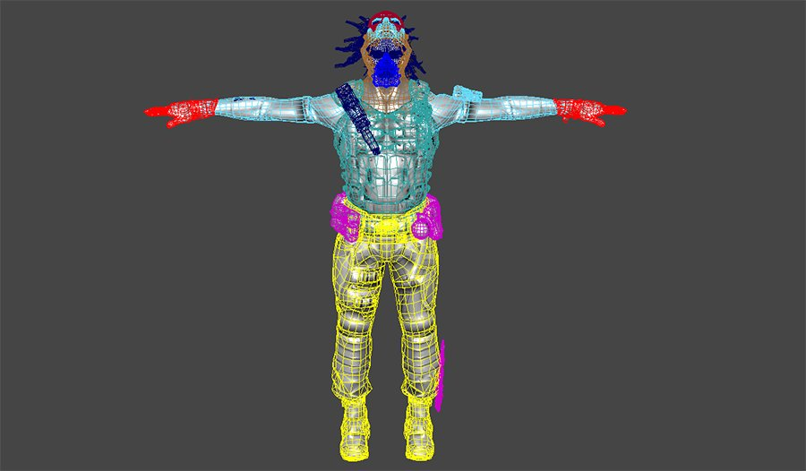
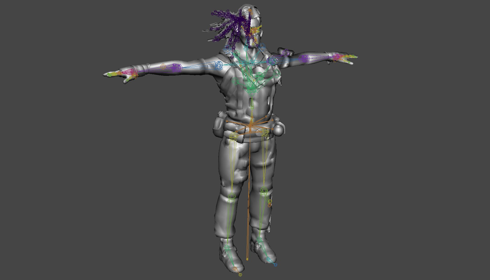
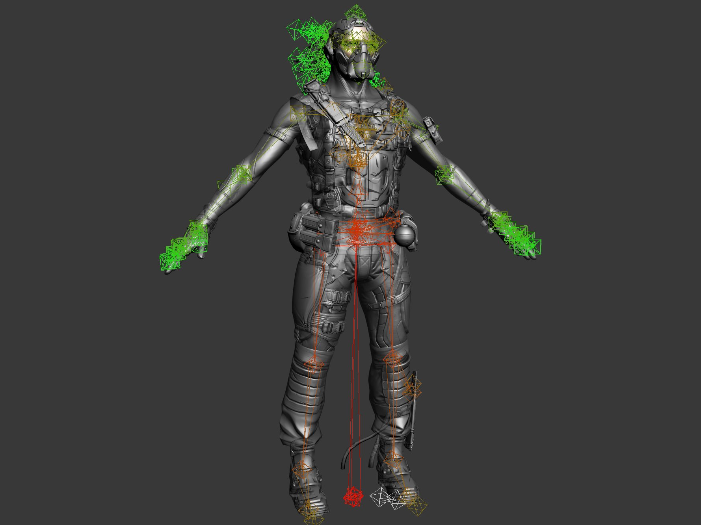
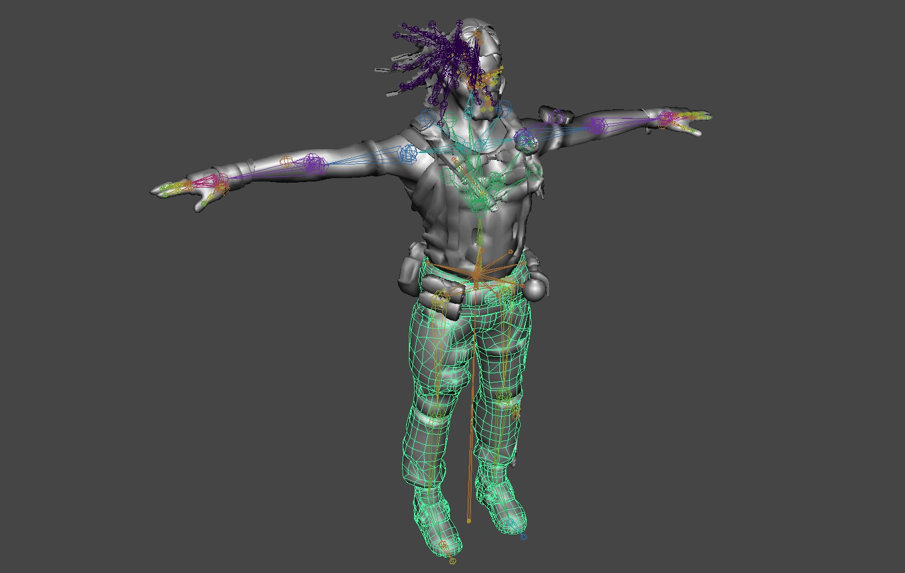
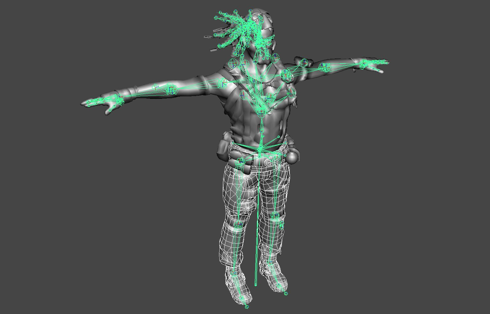
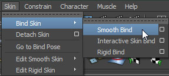
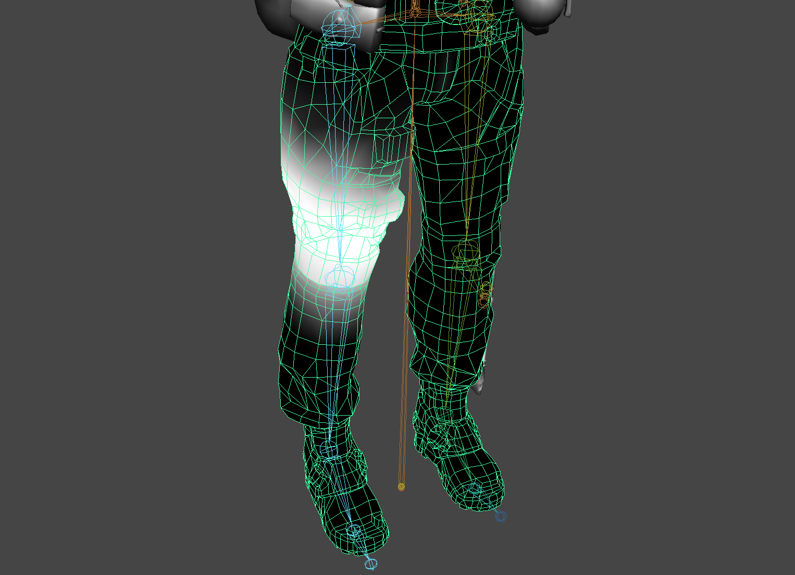
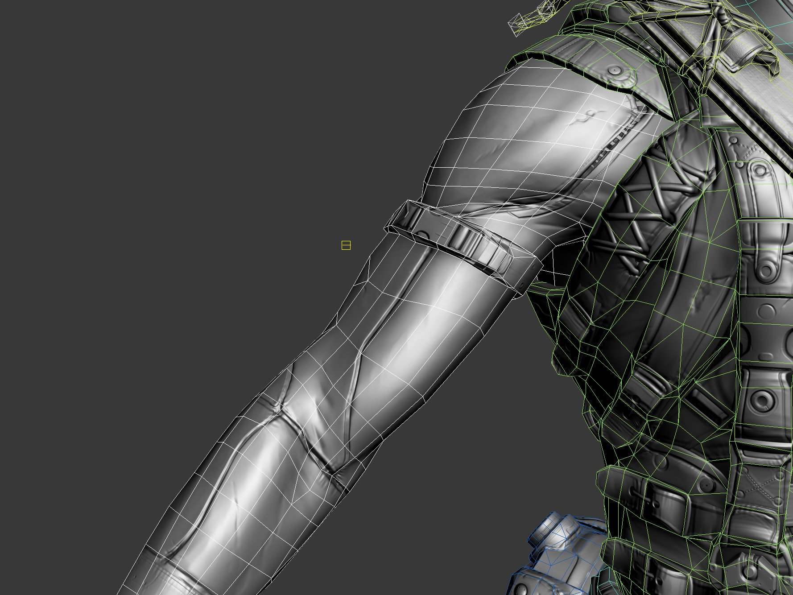

# 骨架网格体管道

> 路径：虚幻引擎5.7文档 / 管理内容 / FBX内容管线 / 骨架网格体管道

> 原始页面：https://dev.epicgames.com/documentation/unreal-engine/fbx-skeletal-mesh-pipeline-in-unreal-engine

FBX 导入管道支持 *骨架网格体（Skeletal Mesh）*。这提供了一种简化的处理流程来将有动画的网格体从 3D应用程序中导入到虚幻引擎内，以便在游戏中使用。除了导入网格体外，如果需要，动画和变形目标都可以使用FBX格式 在同一文件中传输。同时，还可以 导入3D应用程序中给这些网格体应用的材质所使用的纹理（仅限漫射和法线贴图）， 并且自动创建材质，将其应用于导入的网格体。

以下是使用FBX导入骨架网格体所支持的功能：

- 材质（包括纹理）
- 动画
- 变形目标
- 多个UV集合
- 平滑组
- 顶点颜色
- LOD

> [!NOTE]
> 目前，对于每个 *骨架网格体*，只能将单个动画导入单个文件。但是，在一个文件中可以传输 一个 *骨架网格体* 的多个变形目标。

本文是使用FBX内容通道将骨架网格体导入到虚幻的技术性概述。

> [!WARNING]
> 虚幻引擎FBX导入管线使用 **FBX 2020.2**。在导出时使用其他版本可能会导致不兼容。

> [!TIP]
> 在下文中任何指示使用 **导入资源（Import Asset）** 按钮的地方，只需在操作系统文件浏览器中单击并拖拽FBX文件即可。

> [!TIP]
> 此页面包含有关Autodesk Maya和Autodesk 3ds Max的信息。如果你在下面选择你的首选内容创建工具，则只会显示与该工具相关的信息：

选择3D美术工具

Autodesk Maya

Autodesk 3ds Max

## 一般设置

### 单一网格体和由多部分构成的网格体

*骨架网格体* 可以由一个连续网格体构成，也可以或几个独立的网格物体构成， 所有网格体都对同一个骨架进行皮肤处理。

使用多个网格体时，每个构成部分的LOD可以不同，并且每个部分可以单独导出， 以便在模块化的角色系统中使用。这种创建 *骨架网格体* 的方式不会使性能降低。 每个构成部分导入到虚幻编辑器之后，它们会组合到一起。

### 绑定

绑定是指将网格体绑定到骨骼/关节的骨架层级。这使得底下骨架的骨骼/关节可以影响网格体的顶点，当骨骼或关节移动时会使得网格体发生变形。

#### 骨架

在Maya中，一般使用 *关节工具* 为 *骨架网格体* 创建骨架。同样，也有 无数关于在Maya中如何使用这个工具及创建绑定的教程。Maya帮助文档也是获得关于这个主题信息 的很好资源。

如何在3dsMax中创建骨架层级，完全由你自己决定。你可以使用标准的 *骨骼工具*，因为 它们非常好用，也可以创建自己的对象层级，以便完全自定义几何体和功能按钮。 要剥一只猫的皮，不止一种方法而已（请原谅我使用这个双关语）。很多教程都展示了如何 为游戏角色创建动画绑定。你还可以参考3dsMax帮助文档了解关于工具原理的完成细节。

#### 绑定

Maya使用 *平滑绑定（Smooth Bind）* 命令将网格体绑定到骨架。无论 *骨架网格体* 是由一个完整网格体还是由多个网格体部分构成，过程都是相同的。

1. 选择要绑定的网格体。

   
2. 按住 **Shift** + 键并选择骨架的根关节。

   
3. 从 *皮肤（Skin） > 绑定皮肤（Bind Skin）* 菜单选择 *平滑绑定（Smooth Bind）*。

   
4. 现在，你可以为每个关节调整网格体的顶点的权重，从而决定哪些顶点受到哪些骨骼的影响及影响的程度。这可以使用 *描画皮肤权重工具（Paint Skin Weights Tool）* 或者其他你喜欢的方法来完成。

   

在3dsMax中，必须使用 *皮肤* 修饰符将网格体绑定到骨架。无论 *骨架网格体* 是由一个完整网格体还是由多个网格体部分构成，过程都是相同的。

1. 选择要绑定的网格体。

   
2. 从 *修饰符列表* 中添加 *皮肤* 修饰符。

   > 图片已省略：max_skin_2.jpg
3. 在 *皮肤* 修饰符的参数中，单击skin_add_button.jpg按钮来添加影响网格体的骨骼。此时将显示 **选择骨骼（Select Bones）** 窗口。

   > 图片已省略：max_skin_3.jpg
4. 在 **选择骨骼（Select Bones）** 窗口中选择骨骼，然后单击 **选择（Select）** 按钮来添加骨骼。

   > 图片已省略：max_skin_4.jpg
5. 现在，修饰符的 *骨骼（Bones）* 列表将显示骨骼。

   > 图片已省略：max_skin_5.jpg
6. 现在，你可以为每个骨骼调整网格体的顶点的权重，从而决定哪些顶点受到哪些骨骼的影响及影响的程度。这可以使用包络完成，只需直接输入顶点的权重，也可以使用你喜欢的任何方式。

   > 图片已省略：max_skin_6.png

### 支点

虚幻引擎中，网格体的支点决定了执行任何变换（平移、 旋转、缩放）时所围绕的点。

> 图片已省略：pivot.png

*骨架网格体* 的支点始终位于骨架的根骨骼/关节处。换句话说， 骨架的根位于场景中的哪个位置并没有关系。从3D建模应用程序导出时， 它就像在原点（0,0,0）一样。

> 图片已省略：pivot_root.png

### 三角剖分

图形硬件只处理三角形，因此虚幻引擎中的网格体必须进行三角剖分。

> 图片已省略：tris.jpg

要可靠地对网格体进行三角剖分，可以通过好几种方法来完成。

- 仅使用三角形对网格体建模——这是最好的方法，因为可以最大限度地控制最终结果。
- 在3D应用程序中对网格体进行三角剖分——这是也是较好的方法，可以在导出之前进行整理和修改。
- 让导入器对网格体进行三角剖分——这个方法一般，它不允许进行清除整理但对于简单网格体来说是有效的。
- 让FBX导入器对网格体进行三角剖分——这个方法也还可以，它不允许进行清除整理但对于简单网格体来说是有效的。

**注意：**当选中"分割不匹配的三角形（Split Non-Matching Triangles）"时，允许FBX导出器对网格体进行三角剖分将导致完全的 随机化平滑处理。将经过FBX三角剖分的网格体导回到Maya中并重新导入将会呈现正确的平滑效果。

在任何情况下，最好都在3D应用程序中手动对网格体进行三角剖分，这样可以控制边的方向和放置 位置。自动执行三角剖分可能会导致不合意的效果。

> 图片已省略：tris_bad.jpg

### 创建法线贴图

在大部分建模应用程序中可以通过创建低分辨率的渲染网格体和高分辨率的细节网格体来直接地为网格体创建法线贴图。

> 图片已省略：SideBySide.jpg

高分辨率细节网格体的几何体用于生成法线贴图的法线。Epic内部处理流程中引入了XNormal，因此在虚幻引擎4中渲染时通常会生成好得多的法线。关于此流程的细节，请参阅[纹理](../../../designing-visuals-rendering-and-graphics/textures/index.md)。

### 材质

应用于使用外部应用程序建模的网格体的材质将会随着网格体一同导出，然后导入到 虚幻编辑器中。这大大简化了处理流程，因为你不需要再单独地在虚幻编辑器中导入纹理，也不需要 创建及应用材质等。使用FBX通道时，导入过程可以处理所有这些操作。

这些材质也需要以特定的方式进行设置，尤其是当网格体有多个材质或者网格体上的材质的顺序非常重要时 （也就是，对于角色模型来说，材质0应该是躯干，材质1应该 是头部）。

关于设置材质进行导出的完整细节，请参阅[**FBX材质通道**](../fbx-material-pipeline/index.md)页面。

### 顶点颜色

*骨架网格体* 的顶点颜色（仅限一组）可以通过FBX通道转换。不需要特殊设置。

> 图片已省略：vertex_color.jpg

## 从3D应用程序中导出网格体

*骨架网格体* 可以独立导出，或者也可以把多个网格体导出到一个单独的FBX文件中。导入过程将会把多个 *骨架网格体* 分割为目标包中的多个资源。

1. 在视口中选中要导出的网格体和关节。

   > 图片已省略：meshAndJointsSel.png
2. 在 *文件（File）* 菜单中选择 *导出选中项（Export Selection）*（或者如果你不管选中项是什么，都想导出场景中的所有资源，那就选择 *导出所有（Export All）*）。

   > 图片已省略：maya_export_2.jpg
3. 选择用于导入网格物体的FBX文件的位置和名称，并在 **FBX导出（FBX Export）** 对话框中设置适当的选项，然后单击maya_export_button.jpg按钮，创建包含网格体的FBX文件。

   > 图片已省略：maya_export_3.jpg

1. 在视口中选中要导出的网格体和骨骼。

   > 图片已省略：max_export_1.png
2. 在 *文件（File）* 菜单中选择 *导出选中项（Export Selected）*（或者如果你不管选中项是什么，都想导出场景中的所有资源，那就选择 *导出所有（Export All）*）。

   > 图片已省略：max_export_2.jpg
3. 选择用于导入网格体的FBX文件的位置和名称，并单击max_save_button.jpg按钮。

   > 图片已省略：max_export_3.jpg
4. 在 **FBX导出（FBX Export）** 对话框中设置适当的选项，然后单击max_ok_button.jpg按钮，创建包含网格体的FBX文件。

   > 图片已省略：max_export_4.jpg

## 导入网格体

1. 单击 **内容浏览器** 中的按钮****。在打开的文件浏览器中导航到想导入到的FBX文件并选中它。**注意：** 你可以在下拉菜单中选择import_fbxformat.jpg来过滤不需要的文件。

   > 图片已省略：import_file.jpg

   > [!NOTE]
   > 所导入的资源的路径是由导入时 **内容浏览器** 的当前位置所决定的。请确保在执行导入之前导航到相应的文件夹。你也可以在导入后将导入的资源拖拽到一个新文件夹中。
2. 在 **FBX导入选项（FBX Import Options）** 对话框中选择适当的设置。如果导入不共享现有骨架的网格体，默认设置应该足够满足需求。关于这些设置的完整信息，请参阅[**FBX导入对话框**](../fbx-import-options-reference/index.md)部分。

   如果要导入的 *骨架网格体* 共享一个现有骨架，请单击 **选择骨架（Select Skeleton）** 下拉菜单，然后从列表中选择骨架资源。

   > 图片已省略：FBX骨架网格体骨架浏览器
3. 单击 导入按钮（Import Button）按钮来导入网格体。如果导入成功，**内容浏览器** 将显示生成的网格体（如果启用了相关选项，还会显示材质和贴图）。

   通过在Persona中查看所导入的网格体，可以判断导入是否成功。

   > 图片已省略：undefined

## 骨架网格体LOD

在游戏中使用 *骨架网格体* 的细节层级（LOD），可以通过使网格体远离摄像机 来限制其影响。一般来说，这意味着每个细节层级将具有较少的三角形、简化的骨骼、或者 可能会应用更简单的材质。

可以使用FBX通道来导入/导出这些LOD网格体。

### LOD设置

通常，为了处理LOD，我们会创建各种复杂程度的模型，包括从具有完整细节的基本网格体到具有最低细节级别的 LOD网格体。所有这些模型应该与同一支点对齐并占用相同的空间，并且应该对 同一骨架上进行皮肤处理。你也可以在3D应用程序中使用多个独立网格体来创建 *骨架网格体*。 每个部分都可以具有与其他网格体不同的LOD。这意味着，某些部分可以具有属于不同LOD的简化版本， 而其他部分则继续使用具有较高细节的版本。你可以为每个LOD网格体分配完全不同的材质， 包括不同的材质数量。也就是说，基础网格体可以使用多个材质来呈现聚焦时所需的足够细节， 而低细节网格体则不那么明显，因此可以使用单一材质。

1. 从基础LOD到最低级LOD的顺序，依次选择所有网格体（基础和LOD）。按顺序选择非常重要，这样就可以按照复杂性以正确的顺序添加它们。然后从 *编辑（Edit）* 菜单中选择 *细节层级（Level of Detail） > 分组（Group）* 命令。

   > 图片已省略：maya_lod_group.jpg
2. 现在所有的网格体都应该分组到了LOD组下。

   > 图片已省略：maya_lod_contents.jpg

1. 选中所有网格物体（基础网格物体和LOD——顺序不重要），然后从 *分组（Group）* 菜单中选择 *分组（Group）* 命令。

   > 图片已省略：max_lod_group.jpg
2. 在打开的对话框中输入新组的名称，单击max_lod_ok_button.jpg按钮来创建组。

   > 图片已省略：max_lod_group_name.jpg
3. 单击max_utilities_button.jpg按钮来查看 *实用程序（Utilities）* 面板，然后选择 *细节层级（Level of Detail）* 实用程序。**注意：**你可能需要单击max_utility_more_button.jpg，从列表中将其选中。

   > 图片已省略：max_lod_utility.jpg
4. 选择组后，单击max_lod_create_button.jpg按钮来创建一套新LOD，并将所选组中的网格体添加到其中。这些网格体将根据复杂程度自动排序。

   > 图片已省略：max_lod_contents.jpg

#### 多个构成部分的LOD

设置由多个部分组成的 *骨架网格体* 的LOD基本上和设置一个完整网格体的LOD一样， 只是会为具有LOD的每个独立部分创建一个LOD组。单独的LOD组设置过程 与上述相同。

### 导出LOD

要导出 *骨架网格体* LOD：

1. 选择LOD组和要导出的关节。

   > 图片已省略：meshAndJointsSel.png
2. 遵循导出基础网格体的步骤进行操作（见上文[导出网格体](#exportmesh)部分）。

1. 选择组成LOD集的网格体组和要导出的骨骼。

   > 图片已省略：max_export_1.png
2. 遵循导出基础网格体的步骤进行操作（见上文[导出网格体](#exportmesh)部分）。

### 导入LOD

在 **Persona** 中 **网格体细节（Mesh Details）** 面板上的 **LOD设置（LOD Settings）** 中可以轻松导入 **骨架网格体** LOD。

1. 在

   Persona

   中打开要应用LOD的

   骨架网格体

   ，并跳转到

   网格体（Mesh）

   选项卡。
2. 在 **网格体细节（Mesh Details）** 面板上向下滚动窗口，找到 **LOD设置（LOD Settings）** 部分，然后单击 **LOD导入（LOD Import）** 选项。
3. 在打开的文件浏览器中导航到想导入到的FBX文件并选中它。
4. 导入的LOD将添加到

   网格体细节（Mesh Details）

   面板中。

1. 每个LOD下的 **画面尺寸（Screen Size）** 设置指示何时使用该LOD。

   **注意：**数值越小，在越远处使用该LOD；数值越大，在越近处使用该LOD。 在上图中，当距离该 **骨架网格体** 较近时使用LOD0，而当距离较远时则使用LOD1。
2. 导入或添加LOD时，也可以调整该LOD的 **缩减设置（Reduction Settings）**。

## 从虚幻编辑器导出到FBX

先前导入到虚幻编辑器中的 *骨架网格体* 可以再次从 **内容浏览器** 导出到FBX文件。

> [!NOTE]
> 转化包中的资源不能导出，因为该导出过程需要已经转化的源码数据。

1. 在 **内容浏览器** 中选择要导出的 *骨架网格体*。
2. **右击** 该 *骨架网格体*，选择 **资源操作（Asset Actions）** > **导出（Export）**。
3. 在弹出的文件浏览器中选择要导出的文件的位置和名称。**注意：** 确保选择 *FBX File (*.FBX)* 作为文件类型。

   > 图片已省略：export_file.jpg

## 物理资源

关于使用物理资源工具（PhAT）的完整信息，请参阅[**物理资源工具**](../../../gameplay-systems/physics/physics-asset-editor/index.md)用户文档。

## 动画

关于使用FBX内容通道来创建及导入动画的完整细节，请参阅[**FBX动画通道**](../fbx-animation-pipeline/index.md)页面。

## 变形目标

关于使用FBX内容通道来创建及导入变形目标的完整细节，请参阅[**FBX变形目标通道**](../fbx-morph-target-pipeline/index.md)页面。
