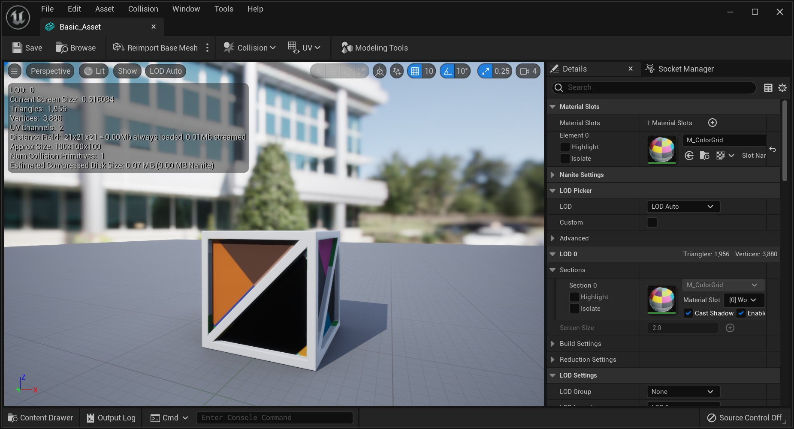

# 使用FBX方法导入静态网格体

> 路径：虚幻引擎5.7文档 / 管理内容 / FBX内容管线 / FBX静态网格体管线 / 使用FBX方法导入静态网格体

> 原始页面：https://dev.epicgames.com/documentation/unreal-engine/importing-static-meshes-using-fbx-in-unreal-engine

选择操作系统：

Windows

macOS

Linux

可从外部 3D 建模程序（如 **3DS Max**、**Maya** 或 **Blender**）将静态网格体导入到虚幻引擎。我们在此使用 3DS Max 和 Maya 进行演示，实际上您可将 **静态网格体** 从任何带保存功能的 3D 建模程序中导入虚幻引擎。

> [!NOTE]
> 在开始之前，请确保你有可供使用的3D建模应用程序。

## 目标

此指南的要点是为您展示如何从外部 3D 建模程序导入静态网格体。

## 目的

完成此指南的阅读后，您将了解：

- 如何将静态网格体从外部 3D 建模程序导入虚幻编辑器。
- 如何验证静态网格体已正常导入。

> [!WARNING]
> 虚幻引擎FBX导入管线使用 **FBX 2020.2**。在导出时使用其他版本可能会导致不兼容。

选择3D美术工具

Autodesk Maya

Autodesk 3ds Max

## 从外部 3D 建模程序导入静态网格体

1. 在视口中选中要导出的网格体和关节。

   
2. 在 *文件（File）* 菜单中选择 *导出选中项（Export Selection）*（或者如果你不管选中项是什么，都想导出场景中的所有资源，那就选择 *导出所有（Export All）*）。

   
3. 选择用于导入网格物体的FBX文件的位置和名称，并在 **FBX导出（FBX Export）** 对话框中设置适当的选项，然后单击maya_export_button.jpg按钮，创建包含网格体的FBX文件。

   

1. 在视口中选中要导出的网格体和骨骼。

   
2. 在 *文件（File）* 菜单中选择 *导出选中项（Export Selected）*（或者如果你不管选中项是什么，都想导出场景中的所有资源，那就选择 *导出所有（Export All）*）。

   
3. 选择用于导入网格体的FBX文件的位置和名称，并单击max_save_button.jpg按钮。

   
4. 在 **FBX导出（FBX Export）** 对话框中设置适当的选项，然后单击max_ok_button.jpg按钮，创建包含网格体的FBX文件。

   

## 验证导入的静态网格体

双击导入的网格体在 **静态网格体编辑器** 中进行查看。

点击查看大图。

> 图片已省略：Verify Static Mesh

点击查看大图。

*在 **静态网格体编辑器** 中查看导入的网格体，验证资源是否导入正常。*

这便是该指南的全部内容，您已从中学习到：

✓ 如何将静态网格体从外部 3D 建模程序导入虚幻编辑器。 ✓ 如何验证静态网格体已正常导入。
