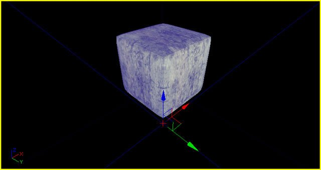
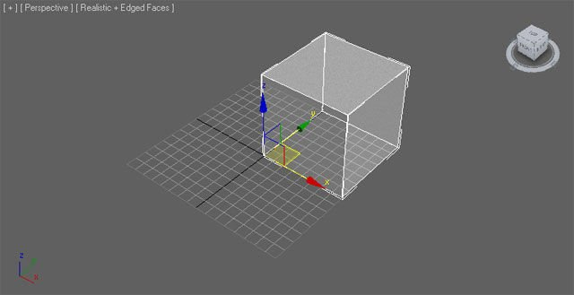
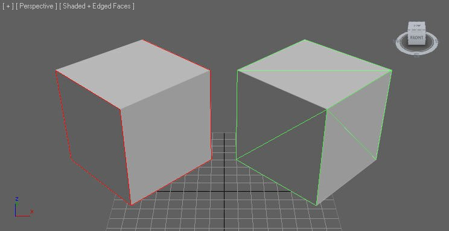
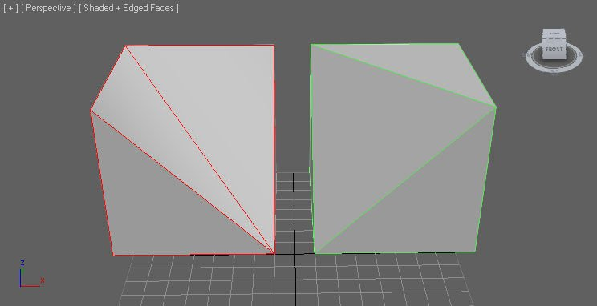
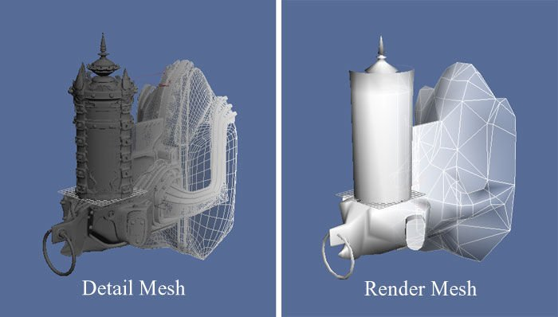
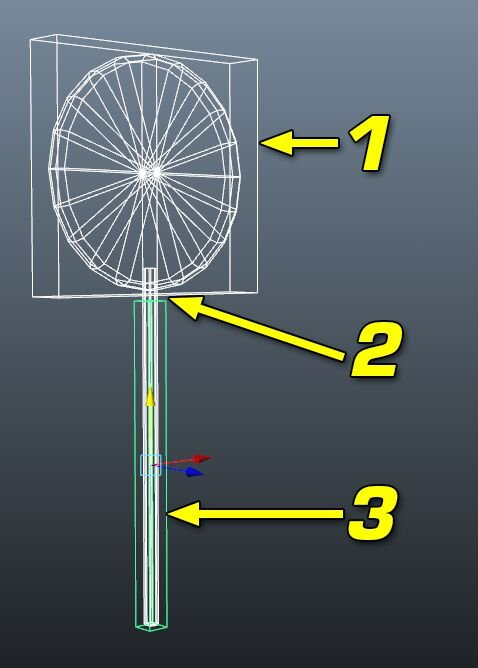
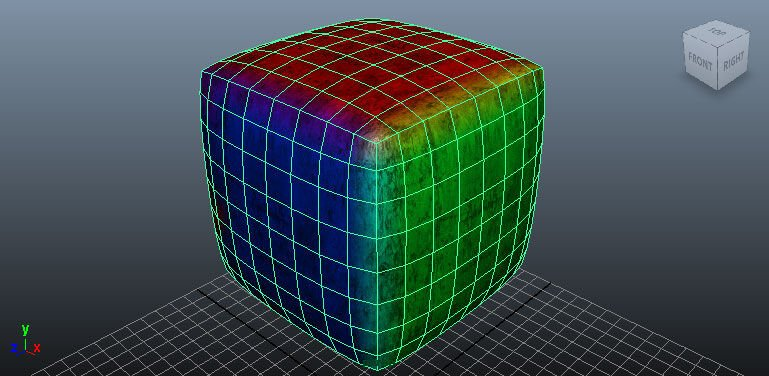
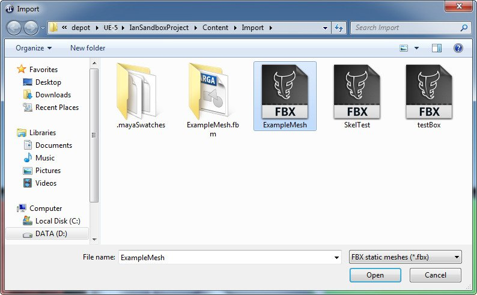

# FBX静态网格体管线

> 路径：虚幻引擎5.7文档 / 管理内容 / FBX内容管线 / FBX静态网格体管线

> 原始页面：https://dev.epicgames.com/documentation/unreal-engine/fbx-static-mesh-pipeline-in-unreal-engine

FBX导入流程中加入 *静态网格体* 支持后，将网格体从3D软件加入虚幻引擎5的操作便极为简便。网格体导入后，应用到3D软件中网格体的材质纹理（仅限漫反射和法线贴图）也将被导入，并用于生成应用到虚幻引擎5中网格体的材质。

利用FBX导入 *静态网格体* 所支持的功能：

- 带纹理材质的

  静态网格体
- 自定义碰撞
- 多个UV集
- 平滑组
- 顶点颜色
- LODs
- 多个单独的

  静态网格体

  （也可以在导入时组合到一个单独的网格体中）。

> [!NOTE]
> 当前，将多个拥有自定义碰撞的网格体导入一个单一文件中时，只有第一个网格体的碰撞才会被导入。

> [!WARNING]
> 虚幻引擎FBX导入管线使用 **FBX 2020.2**。在导出时使用其他版本可能会导致不兼容。

## 常规设置

通常而言，您可以随意使用任何工具和方法来创建 *静态网格体*。为将网格体顺利导出和导入到虚幻编辑器并使其拥有正常功能，在进行UV设置、网格体放置等操作时需要注意以下几点。

### 枢轴点

虚幻引擎中网格体的枢轴点决定了执行任意变换（平移、旋转、缩放）时所围绕的点。

点击查看大图。

从3D建模软件中导出网格体时，枢轴点固定位于原点处（0,0,0）。因此最好在原点处创建网格体，使原点位于网格体的一个角上，以便在对齐到虚幻编辑器中的网格时进行恰当的对齐。

点击查看大图。

### 三角剖分

因为图形硬件仅处理三角形，所以必须对虚幻引擎中的网格体进行三角剖分。

点击查看大图。

进行网格体三角剖分的方法有几种。

- 仅使用三角形进行网格体建模。这是最佳方案，能对最终结果进行最大程度的控制。
- 在3D软件中三角剖分网格体。这是较好方案，在导出之前可以进行清理和修改。
- 让FBX导出器三角剖分网格体。这是普通方案，无法进行清理，但适用于简单网格体。
- 让导入器三角剖分网格体。这是普通方案，无法进行清理，但适用于简单网格体。

最好在3D应用中手动设置网格体的三角剖分，控制边的方向和放置方式。自动三角剖分可能会导致不理想的效果。

点击查看大图。

### UV纹理坐标

虚幻引擎4中的FBX流程支持多个UV集的导入。对 *静态网格体* 而言，这通常用于处理漫反射的一个UV集。对使用FBX流程的 *静态网格体* UV进行设置时无特殊要求。

### 创建法线贴图

创建低分辨率渲染网格体和高分辨率的细节网格体即可直接在多数建模软件中创建网格体的法线贴图。

点击查看大图。

高分辨率细节网格体的几何体可用于生成法线贴图的法线。Epic的内部工作流中加入了XNormal，在虚幻引擎4中渲染时能够生成质量更佳的法线。欲知此流程的更多详情，请参见[纹理](../../../designing-visuals-rendering-and-graphics/textures/index.md)。

### 材质

应用到在第三方软件中建模的网格体上的材质将随网格体一同导出虚幻引擎。这样便简化了导入过程，因为无需再将纹理单独导入虚幻引擎，也不需要进行材质创建和应用等操作。使用FBX流程时，导入进程可以执行全部操作。

也需要以特定方式对这些材质进行设置，网格体拥有多个材质、或网格体材质的排序很重要时（举例而言：角色模型的材质0需用于躯体，材质1需用于头部）尤为如此。

欲知设置材质进行导出的完整细节，请参见[**FBX材质流程**](../fbx-material-pipeline/index.md)页面。

### 碰撞

简化的碰撞几何体对优化游戏中的碰撞侦测十分重要。虚幻引擎4在 **静态网格体编辑器** 中提供了创建碰撞几何体的基本工具。但在某些情况下，最佳方案是在3D建模软件中创建自定义碰撞几何体，然后将其随渲染网格体一同导出。通常而言，这适用于对象不需要发生碰撞的开放或凹陷区域网格体。

举例而言：

- 门道网格体
- 拥有窗框的墙壁
- 形状古怪的网格体

导入器基于碰撞网格体的名称对其进行识别。碰撞命名语法应为：

| **网格体前缀和命名** | **描述** |
| --- | --- |
| **UBX_[RenderMeshName]_##** | **盒体** 必须使用常规的矩形3D对象来创建。你无法移动顶点或使其改变形状，使其变为矩形棱柱之外的其它形状，否则其将无法正常使用。 |
| **UCP_[RenderMeshName]_##** | **胶囊体** 是两端半圆的圆柱体对象。胶囊体完全不需要过多分段（8段为佳），因为它将被转换为一个真正的胶囊体进行碰撞。和盒体一样，不能对单个顶点进行移动。 |
| **USP_[RenderMeshName]_##** | **球体** 没有必要设置过多分段（8段为佳），因为它将被转换为一个真正的球体进行碰撞。和盒体一样，不能对单个顶点进行移动。 |
| **UCX_[RenderMeshName]_##** | **凸** 对象可以是任何完全封闭的凸型3D形状。例如，一个盒体也是一个凸对象。下图说明了哪些是凸对象，哪些不是。 Image comparing correct and incorrect ways to create convex objects |

#### 警告和注意事项

- `RenderMeshName` 名称必须与3D软件中碰撞网格体关联的渲染网格体的命名一致。如果3D软件中渲染网格体的命名为 `Tree_01`，那么碰撞网格体将与渲染网格体处于同一场景中，命名为 `UCX_Tree_01`，之后其将随渲染网格体导出到同一个FBX文件中。如果需要为一个网格体设置多个碰撞对象，可以使用额外的辨识符对其命名进行扩展，如：`UCX_Tree_01_00`、`UCX_Tree_01_01`、`UCX_Tree_01_02`，以此类推。这些碰撞对象均会和此网格体相关联。
- 当前球体仅应用于钢体碰撞和虚幻引擎的零范围追踪（如武器），而不应用于非零范围追踪（如玩家运动）。如 *静态网格体* 并非等分缩放，则球体和盒体将无法正常使用。通常需要创建 *UCX* 基元。
- 碰撞对象设置完毕后，便可以把渲染和碰撞网格体导出到同一个FBX文件中。将FBX文件导入虚幻编辑器时，它将找到碰撞网格体，将其从渲染网格体上移除，并将其转换为碰撞模型。
- 将非凸面网格体分解为凸面基元是非常复杂的操作，还可能产生不可预知的效果。另一个方法是在3D MAX或Maya中将碰撞模型分解为凸面块。
- 如一个对象的碰撞由多个凸包所定义，那么这些凸包相互未交叉时产生的结果为最佳。举例而言，如果一个棒棒糖的碰撞由两个凸包所定义（一个用于糖果、另一个用于棒），那么两者之间应留有空隙。详情如下所示：

点击查看大图。

1. UCX_Candy
2. 碰撞表面之间的小缝隙
3. UCX_Stick

### 插槽

在游戏中通常使用插槽来将一个对象附加到另一个对象（可以是骨架网格体、也可以是静态网格体）。虚幻引擎4中拥有在静态网格体编辑器中创建插槽的工具。 有时可能需要在3D建模软件中对插槽进行设置，然后再随渲染网格体导出。 可相对于骨架网格体上的骨骼或静态网格体的大小对插槽进行平移、旋转和缩放。

如要在建模软件中使用插槽，需要使用一个带 `SOCKET_` 前缀的虚拟或助手对象。

| 网格体前缀和命名 | 描述 |
| --- | --- |
| **SOCKET_[RenderMeshName]_##** | 将此用于建模软件中的任意虚拟或助手对象，以便将插槽指定到网格体。 |

#### 警告和注意事项

- `RenderMeshName` 名称必须与3D软件中插槽对象关联的渲染网格体的命名一致。 如果3D软件中渲染网格体的命名是 `Object_01`，则插槽对象应与此网格体处于同一场景中，命名为SOCKET_Object_01， 并随渲染网格体导出到同一个FBX文件中。如果一个网格体需要多个插槽对象，则以额外的辨识符来延展其命名， 如SOCKET_Object_01_00、SOCKET_Object_01_01、SOCKET_Object_01_02，以此类推。这些插槽皆与该网格体相关联。
- 为网格体创建插槽时，可导入虚幻引擎4的插槽只能拥有一个网格体FBX设置。 举例而言，如果需要将两个渲染网格体设为单独的资源，则需要将其导入为单独的FBX文件。 这意味着无法导入多个网格体并将插槽指定到每个单独的网格体；如果两组渲染网格体拥有其自身的插槽，其将无法正确导入。 举例而言，如果Object_01带SOCKET_Object_01_00，另一个渲染网格体Box_01带SOCKET_Box_01_00，此时便无法让插槽随这些网格体一同导入。 它们需要导出为独立的FBX文件。

### 顶点颜色

可以通过使用FBX流程来转移 *静态网格体* 的顶点颜色。无需特殊设置。

点击查看大图。

## 导出网格体

*静态网格体* 可以单独导出，也可把多个网格体导出到一个单独的FBX文件中。除非在导入时启用 **组合网格体（Combine Meshes）** 设置，否则导入流程将会将多个 *静态网格体* 在目标包中分离为多个资源。

> [!WARNING]
> 虚幻引擎FBX导入管线使用 **FBX 2020.2**。在导出时使用其他版本可能会导致不兼容。

## 导入网格体

1. 点击 **内容浏览器** 中的 **添加/导入（Add/Import）** 按钮并选择 *导入*。在打开的文件浏览器中找到并选中需要导入的FBX文件。

   > [!NOTE]
   > 你可能需要在下拉菜单中选择FBX file extension，过滤掉不需要的文件。
   >
   > 
   >
   > 点击查看大图。
   >
   > 导入资产的路径取决于 **内容浏览器** 中的当前位置。在执行导入前，请确保导航到相应的文件夹。你也可以在导入完成后将导入的资产拖入新的文件夹。
2. 在 **导入** 对话框中选择合适的设置。大多数情况下，默认值应该就可以了。请参阅[FBX导入对话框](../fbx-import-options-reference/index.md)部分，了解所有设置的完整细节。

   > 图片已省略：Static mesh import options

   点击查看大图。
3. 点击 **导入（Import）** 按钮来导入网格体。如果导入过程成功，将在 **内容浏览器** 中显示最终的网格体、材质和贴图。

   > 图片已省略：An imported material, mesh, and texture in the content browser

   点击查看大图。

   > [!NOTE]
   > 虽然纹理和材质将随静态网格体导入，但只有 **颜色（Color）** 和 **法线（Normal）** 将被自动连接（假定[Max/Maya中使用了支持的材质](../fbx-material-pipeline/index.md)）；**高光（Specular）** 贴图也将被导入，但不会连接；其他贴图（如 **漫反射（Diffuse）** 槽中的 **环境光遮蔽（Ambient Occlusion）** 贴图）则不会被导入。最好的方法是对材质进行检查，连接所有未连接的贴图，并检查哪些贴图未导入。**双击** 新材质并将可用纹理连接到其相应的输入中即可。

   在 **静态网格体编辑器** 中查看导入的网格体并启用显示碰撞后，即可验证进程是否正常进行。

   > 图片已省略：Sample mesh displayed in the static mesh editor

   点击查看大图。

> [!TIP]
> 另外还可以从Windows点击并将一个FBX文件拖入 **内容浏览器**，此操作将呼出导入对话。

## 静态网格体LOD

为将网格体逐渐远离相机而产生的性能影响降至最低，可以在游戏中使用 *静态网格体* 的细节级别（LOD）。通常而言，这意味着每个细节级别拥有的三角形数量更少，或对其应用的材质更为简单。

> 图片已省略：Four levels of detail comparison

点击查看大图。

FBX流程可用于导入DCC工具创建的LOD网格体；也可以直接在UE内部为导入的静态网格创建LOD。

### LOD设置

通常而言，LOD的处理方式是创建复杂程度不一的模型，从完整细节的基础网格体到最低细节的LOD网格体。这些LOD网格体应该全部对齐，拥有相同的枢轴点且占有相同空间。每个LOD网格体可以指定完全不同的材质，包括不同数量的材质。这意味着基础网格体可以使用多个材质在近处产生理想的细节；但低细节网格体可以使用一个单独的材质，因为细节不甚明显。

每个DCC工具都有自己的工作流程来创建静态网格体的 LOD，因此请参考你所选工具的文档，了解如何创建LOD 并将其添加到你的FBX输出中。

### 导入LOD

在 **内容浏览器** 中，静态网格体LOD可随基础网格体一同导入，或通过静态网格体编辑器单独导入。

1. 点击 **内容浏览器** 中的 **添加/导入（Add/Import）** 按钮并选择 *导入*。在打开的文件浏览器中找到并选中需要导入的FBX文件。

   > [!NOTE]
   > 你可能需要在下拉菜单中选择 FBX file extension ，过滤掉不需要的文件。
   >
   > 导入资产的路径取决于 **内容浏览器** 中的当前位置。在执行导入之前，请确保导航到相应的文件夹。你也可以在导入完成后，将导入的资产拖入新的文件夹内。
2. 在 **导入（Import）** 对话中选择正确的设置。默认设置即可，但必须启用 *导入LOD（Import LODs）*。**注意：** 导入LOD时，导入网格体的命名将遵循默认的[**命名规则**](../fbx-import-options-reference/index.md#namingconventions)。在[**FBX导入对话**](../fbx-import-options-reference/index.md)部分可了解到所有设置的完整详情。

   > 图片已省略：Import Options LOD

   点击查看大图。
3. 点击 **导入（Import）** 按钮来导入网格体和LOD。如果导入过程成功，将在 **内容浏览器** 中显示最终的网格体、材质和贴图。

   > 图片已省略：An imported material, mesh, and texture in the content browser

   点击查看大图。

   > [!NOTE]
   > 虽然纹理和材质将随静态网格体导入，但只有 **颜色（Color）** 和 **法线（Normal）** 将被自动连接（假定[Max/Maya中使用了支持的材质](../fbx-material-pipeline/index.md)）；**高光（Specular）** 贴图也将被导入，但不会连接；其他贴图（如 **漫反射（Diffuse）** 槽中的 **环境光遮蔽（Ambient Occlusion）** 贴图）则不会被导入。最好的方法是对材质进行检查，连接所有未连接的贴图，并检查哪些贴图未导入。**双击** 新材质并将可用纹理连接到其相应的输入中即可。

   在 **静态网格体编辑器** 中查看导入的网格体时，可使用 **细节** 面板中的 **LOD拾取器（LOD Picker）** 来循环切换LOD。

> 图片已省略：Static mesh editor level of detail picker

点击查看大图。

### 为导入的静态网格体创建LOD

静态网格体导入后，你可以[手动为它创建LOD](../../static-meshes/creating-and-using-lods/index.md)，虽然较为耗时，但会得到最好的结果（特别是复杂的网格体）；或者你可以使用UE的[LOD自动生成工具](../../static-meshes/static-mesh-automatic-lod-generation/index.md)，当你需要为多个简单网格体生成LOD时，这种方法更快。
