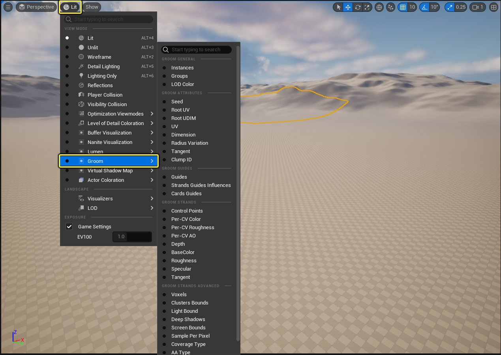
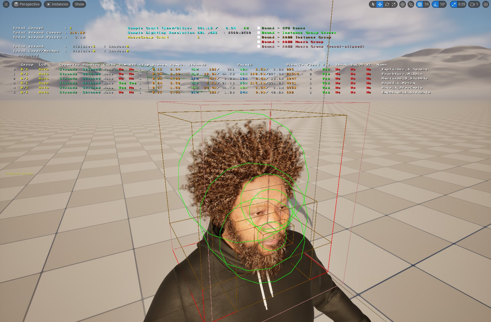
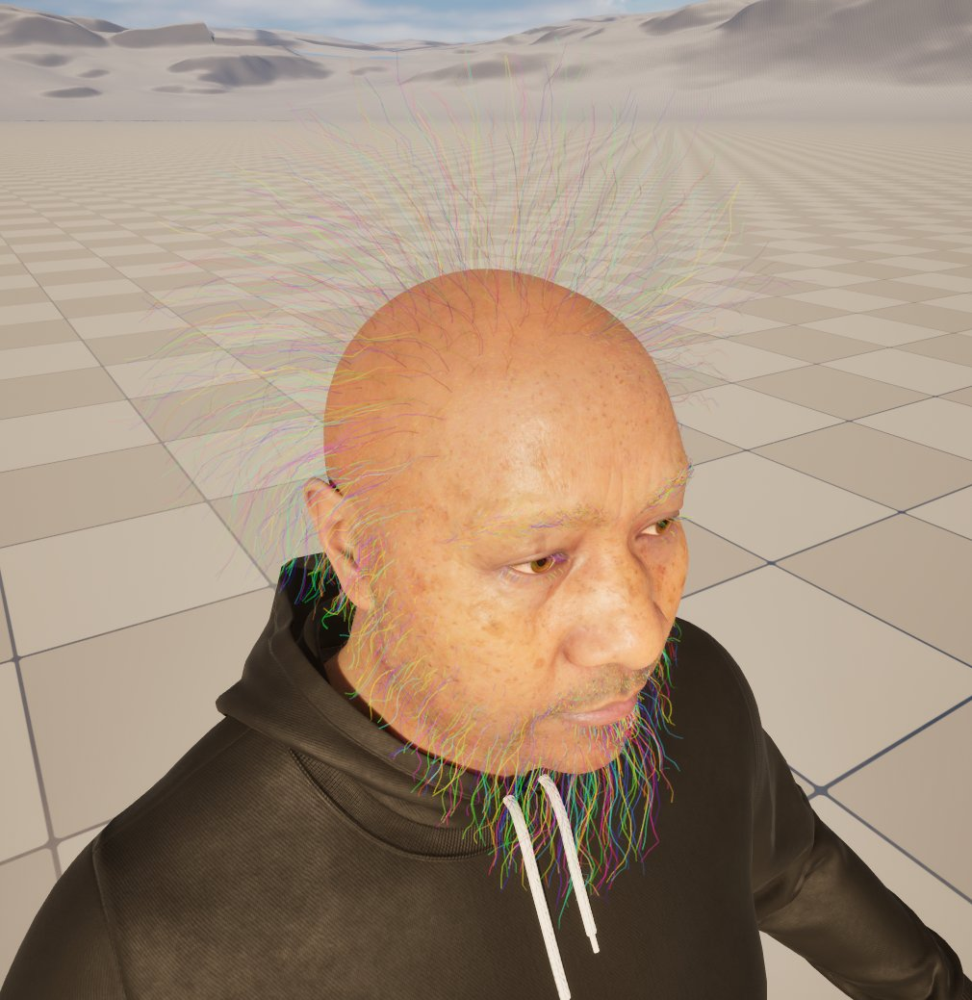
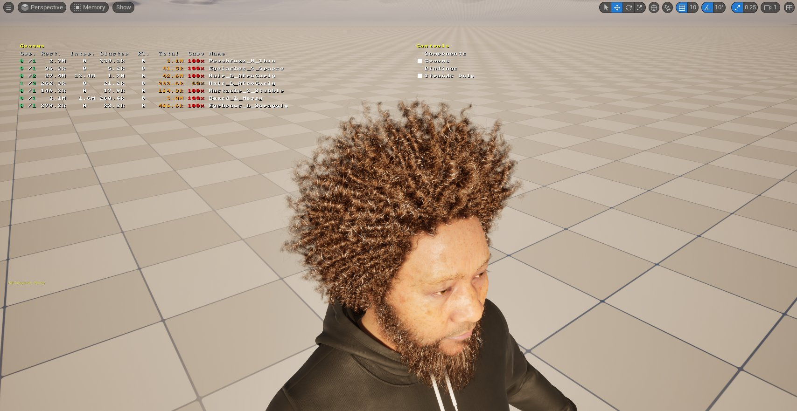
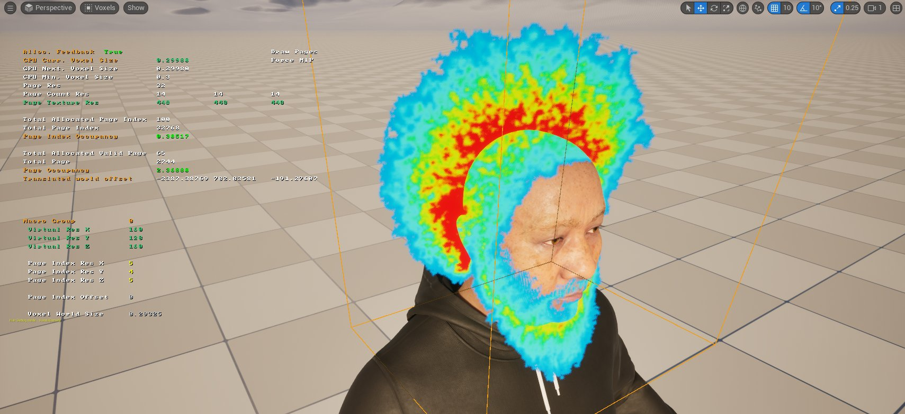

# 调试Groom

> 路径：虚幻引擎5.7文档 / 管理内容 / 毛发渲染与模拟 / 调试Groom

> 原始页面：https://dev.epicgames.com/documentation/unreal-engine/debugging-grooms-in-unreal-engine

本页信息旨在帮助你用虚幻引擎调试和检查Groom。

## Groom调试的可视化选项

关卡编辑器视口选项包含有用的可视化功能，可用于检查Groom的各个方面。你可以通过 **光照（Lit） > Groom** 访问这些选项。

Groom可视化列表中一个有用的示例是 **实例（Instances）** 。通过此可视化功能，你可以检查所有可见实例的属性。该视图显示每个可见的毛发组及其LOD索引、几何体类型、绑定类型、模拟、RBF等信息。对于发束几何体，视图还显示激活曲线和点的数量。

点击查看大图。

**导线（Guides）** 也是一个有用的可视化功能，可显示可见Groom的模拟导线。

点击查看大图。

要获取所有Groom资产、Groom绑定资产以及Groom组件内存占用的摘要信息，你可以使用控制台命令 `r.HairStrands.Dump` 将信息输出到日志。此输出包含关于这些资产所耗CPU和GPU内存的信息。你还可以通过 **内存（Memory）** 可视化模式获取信息摘要。

点击查看大图。

## Groom阴影瑕疵

默认情况下，使用体素化曲线计算由发束几何体投射的阴影。默认设置可能不适合你的用例，需要使用控制台变量来针对你的项目进行调整。发束使用由页面构成的稀疏体素结构进行体素化，你可以将其视为体素"砖块"。当Groom被体素化时，就会分配砖块来覆盖Groom。这些砖块的尺寸根据与Groom的距离进行调整。如果关卡中有许多Groom，或者摄像机距离大型Groom非常近，则可能会耗尽页面。

你可以使用控制台变量 `r.HairStrands.Voxelization.Virtual.VoxelPageCountPerDim` 增加页数。增加此值可能会导致分配的内存快速上升。

如果摄像机靠近Groom，体素分辨率可能会显得太低。你可以使用控制台命令 `r.HairStrands.Voxelization.Virtual.VoxelWorldSize` 缩减体素尺寸，以提升体素分辨率。

你可以使用 **体素（Voxels）** 可视化模式来显示Groom体素。将鼠标悬停在视口中的 **绘制页面（Draw Pages）** 上会显示Groom页面。

点击查看大图。

## 调整运动向量以减少可见瑕疵

在摄像机快速移动时，发束上可能会出现你不想看到的可见瑕疵。控制台变量 `r.HiarStrands.Visibility.WriteVelocityCoverageThreshold` 对于调整发束运动向量覆盖范围非常有用，它可以定义像素写入毛发速度的覆盖阈值，从而消除这些瑕疵。

在调整此值时，将其设置为 `0`（默认值）时，毛发会始终记录其速度。当值大于0时，毛发只有在给定像素的毛发覆盖范围大于此值时，才会记录其速度。的值。
