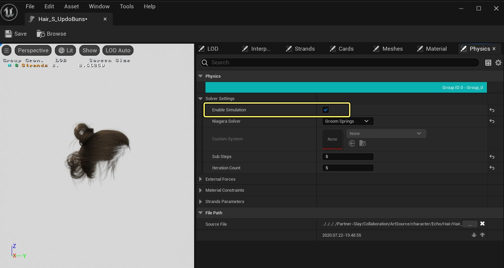
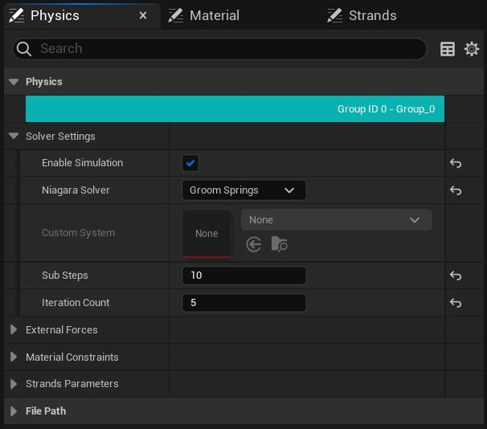
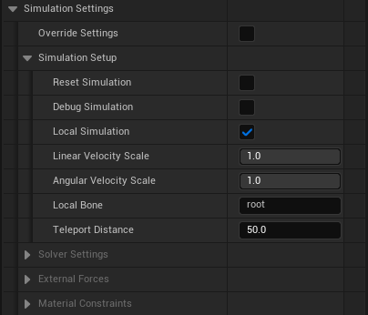

# 对Groom启用物理模拟

> 路径：虚幻引擎5.7文档 / 管理内容 / 毛发渲染与模拟 / 对Groom启用物理模拟

> 原始页面：https://dev.epicgames.com/documentation/unreal-engine/enabling-physics-simulation-on-grooms-in-unreal-engine

通过启用[Groom资产编辑器](../groom-asset-editor-user-guide/index.md)和Groom组件中的设置，你可以为你的Groom设置物理模拟。

## 对Groom启用物理模拟

要为Groom启用物理模拟，请前往 **Groom资产编辑器（Groom Asset Editor）> 物理（Physics）** 面板。勾选 **启用模拟（Enable Simulation）** 复选框。

启用后，Groom将模拟物理。下图是角色行走时的Groom模拟示例。

## 物理模拟属性

你可以在Groom资产编辑器和Groom组件中找到Groom的模拟属性。

### Groom资产编辑器模拟属性

在 **Groom资产编辑器（Groom Asset Editor）** 的 **物理（Physics）** 和 **LOD** 面板中，可以找到以下模拟属性。

#### 物理面板设置

在 **物理（Physics）** 面板中，可以找到以下设置：

| 属性 | 说明 |
| --- | --- |
| 解算器设置（Solver Settings） |  |
| **启用模拟（Enable Simulation）** | 为该Groom分组启用物理模拟。 |
| **Niagara解算器（Niagara Solver）** | 选择用于模拟的解算器： **Groom杆（Groom Rods）** **Groom弹簧（Groom Springs）** **自定义解算器（Custom Solver）** |
| **自定义系统（Custom System）** | 添加当属性Niagara解算器被设置为自定义解算器时要使用的自定义Niagara系统。 |
| **子步骤（Sub Steps）** | 每帧要完成的子步骤数。解算器调用将以每秒24帧的速度完成。 |
| **迭代次数（Iteration Count）** | 使用XPBD解算器解算约束的迭代次数。 |
| 外力（External Forces） |  |
| **重力向量（Gravity Vector）** | 用于重力的加速度向量，测量单位为cm/s2。 |
| **空气阻力（Air Drag）** | 0到1之间的系数，用于空气阻力。 |
| **空气速度（Air Velocity）** | 周围空气的速度，单位为cm/s。 |
| 弯曲约束（Bend Constraint） |  |
| **解算弯曲（Solve Bend）** | 在XPBD循环期间启用弯曲约束的解算。 |
| **投影弯曲（Project Bend）** | 在XPBD循环后启用弯曲约束的投影。 |
| **弯曲阻尼（Bend Damping）** | 对弯曲约束施加的介于0到1之间的阻尼。 |
| **弯曲刚度（Bend Stiffness）** | 弯曲约束的刚度，单位为GPa。 |
| **弯曲刚度缩放（Bend Stiffness Scale）** | 该曲线可确定弯曲刚度沿每股发束缩放的程度。X轴范围是0,1，其中0映射到根部，1映射到梢部。 |
| 拉伸约束（Stretch Constraint） |  |
| **解算拉伸（Solve Stretch）** | 在XPBD循环期间启用拉伸约束的解算。 |
| **投影拉伸（Project Stretch）** | 在XPBD循环后启用拉伸约束的投影。 |
| **拉伸阻尼（Stretch Damping）** | 对拉伸约束施加的介于0到1之间的阻尼。 |
| **拉伸刚度（Bend Stiffness）** | 拉伸约束的刚度，单位为GPa。 |
| **拉伸刚度缩放（Stretch Stiffness Scale）** | 该曲线可确定拉伸刚度沿每股发束缩放的程度。X轴范围是0,1，其中0映射到根部，1映射到梢部。 |
| 碰撞约束（Collision Constraint） |  |
| **解算碰撞（Solve Collision）** | 在XPBD循环期间启用碰撞约束的解算。 |
| **投影碰撞（Project Collision）** | 在XPBD循环后启用碰撞约束的投影。 |
| **静态摩擦（Static Friction）** | 用于物理资产碰撞的静态摩擦。 |
| **动态摩擦（Kinetic Friction）** | 用于物理资产碰撞的动态摩擦。 |
| **发束粘度（Strand Viscosity）** | 用于自碰撞的介于0和1之间的粘度。 |
| **网格维度（Grid Dimension）** | 用于计算粘度力的网格维度。 |
| **碰撞半径（Collision Radius）** | 用于物理资产碰撞检测的半径。 |
| **半径缩放（Radius Scale）** | 该曲线可确定碰撞半径沿每股发束缩放的程度。X轴范围是0,1，其中0映射到根部，1映射到梢部。 |
| 发束参数（Strand Parameters） |  |
| **发束大小（Strands Size）** | 用于模拟的每根导线上的粒子数。 |
| **发束密度（Strands Density）** | 发束密度，测量单位为g/cm3。 |
| **发束平滑（Strands Smoothing）** | 传入导线曲线的、介于0至1之间的平滑度，旨在提升稳定性。 |
| **发束厚度（Strands Thickness）** | 发束厚度（以厘米为单位），用于计算质量和惯性。 |
| **厚度缩放（Thickness Scale）** | 该曲线可确定发束厚度沿每股发束的缩放程度。X轴范围是0,1，其中0映射到根部，1映射到梢部。 |

#### LOD面板属性

在 **LOD** 面板中可以找到以下设置：

| 属性 | 说明 |
| --- | --- |
| **模拟（Simulation）** | 重载用于表示该细节级别的模拟。可用的选项有： **自动（Auto）** ：使用全局值。 **启用（Enable）** ：为此LOD强制启用模拟。 **禁用（Disable）** ：为此LOD强制禁用模拟。 |

### Groom组件属性

Groom组件上提供以下属性，用于重载Groom资产编辑器中设置的模拟设置。

> [!NOTE]
> 在使用Groom组件重载Groom模拟之前，必须首先在Groom资产编辑器中为该Groom资产 **启用模拟（Enable Simulation）** 。

| 属性 | 说明 |
| --- | --- |
| **物理资产（Physics Asset）** | 用于模拟毛发的物理资产。 |
| 模拟设置（Simulation Settings） |  |
| **重载设置（Override Settings）** | 使该组件的设置重载Groom资产物理设置。 |
| 模拟设置（Simulation Setup） |  |
| **重置模拟（Reset Simulation）** | 让该模拟在某个时间点重置。 |
| **调试模拟（Debug Simulation）** | 使该模拟发束可见。 |
| **本地模拟（Local Simulation）** | 使发束模拟在本地空间中完成。 |
| **线性速度缩放（Linear Velocity Scale）** | 从参考骨骼发送到本地Groom空间的线性速度量。 |
| **角速度缩放围（Angular Velocity Scale）** | 从参考骨骼发送到本地Groom空间的角速度量。 |
| **本地骨骼（Local Bone）** | 用于模拟本地空间的骨骼名称。 |
| **传送距离（Teleport Distance）** | 用于重置模拟的传送距离阈值。 |
| 解算器设置（Solver Settings） |  |
| **启用模拟（Enable Simulation）** | 启用Groom组/细节级别的模拟。需要同时启用此设置和Groom资产中的设置。 |
| 外力（External Forces） |  |
| **重力向量（Gravity Vector）** | 用于重力的加速度向量，测量单位为cm/s2。 |
| **空气阻力（Air Drag）** | 0到1之间的系数，用于空气阻力。 |
| **空气速度（Air Velocity）** | 周围空气的速度，单位为cm/s。 |
| 材质约束（Material Constraints） |  |
| **弯曲阻尼（Bend Damping）** | 对弯曲约束施加的介于0到1之间的阻尼。 |
| **弯曲刚度（Bend Stiffness）** | 弯曲约束的刚度，单位为GPa。 |
| **拉伸阻尼（Stretch Damping）** | 对拉伸约束施加的介于0到1之间的阻尼。 |
| **拉伸刚度（Bend Stiffness）** | 拉伸约束的刚度，单位为GPa。 |
| **静态摩擦（Static Friction）** | 用于物理资产碰撞的静态摩擦。 |
| **动态摩擦（Kinetic Friction）** | 用于物理资产碰撞的动态摩擦。 |
| **发束粘度（Strand Viscosity）** | 用于自碰撞的介于0和1之间的粘度。 |
| **碰撞半径（Collision Radius）** | 用于物理资产碰撞检测的半径。 |
