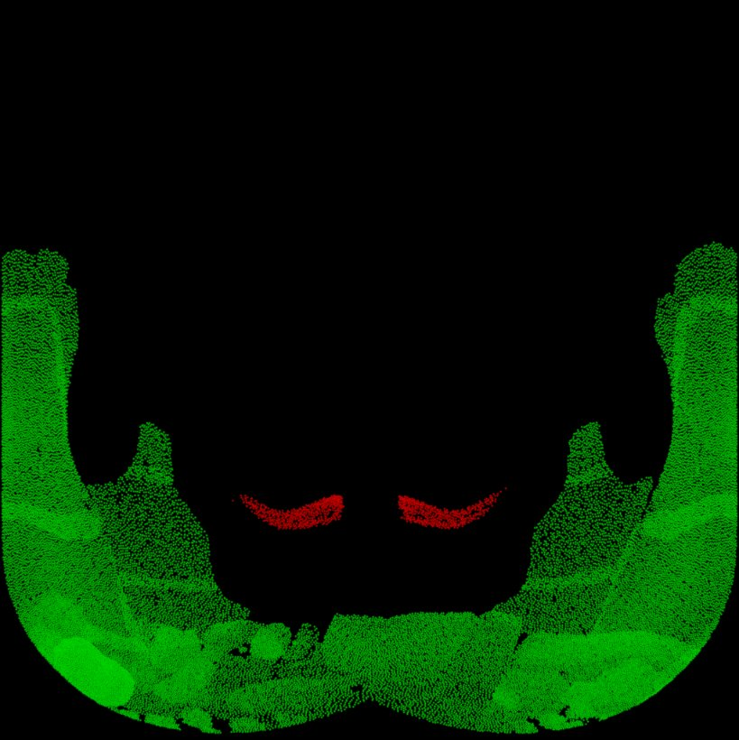
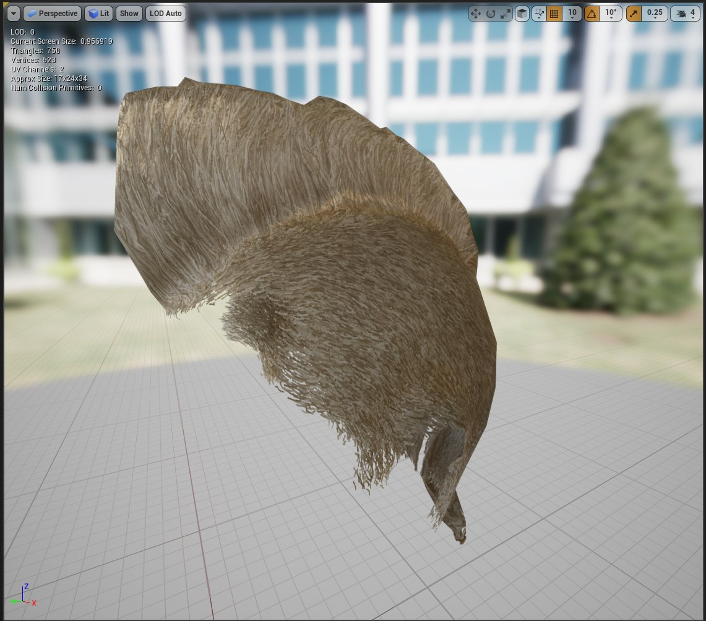

# 生成Groom纹理

> 路径：虚幻引擎5.7文档 / 管理内容 / 毛发渲染与模拟 / 生成Groom纹理

> 原始页面：https://dev.epicgames.com/documentation/unreal-engine/generating-groom-textures-in-unreal-engine

利用 **Groom** 资产，你可以根据导入的groom中的发束数据创建纹理。你可以为骨架网格体生成毛囊遮罩，以将毛发与其网格体表面更好地混合起来。你还可以创建多种发束纹理，以使用这些纹理创建毛发网格体或毛发方块。

要开始流程，请按照以下步骤操作：

1. 在 **内容浏览器（Content Browser）** 中右键单击你的 **Groom** 资产。
2. 选择要创建的纹理类型：**创建毛囊纹理（Create Follicle Texture）** 和 **创建发束纹理（Create Strands Texture）**。

## 毛囊纹理

**毛囊（Follicle）** 纹理包含根部的小型距离场，利用此距离场，可以从骨架网格体中捕获底层表面材质的着色器中的某些效果。生成的纹理中包含用于存储纹理信息的多个通道。你可以同时选择多个groom来填充生成的纹理中的这些通道。

选择 **创建毛囊纹理（Create Follicle Texture）** 时，将会打开 **Groom毛囊遮罩选项（Groom Follicle Mask Options）** 窗口。选择你的选项，然后单击 **创建（Create）** 来生成你的毛囊纹理遮罩。这些纹理将保存在与Groom资产相同的位置。

| 属性 | 说明 |
| --- | --- |
| **分辨率（Resolution）** | 毛囊遮罩的纹理分辨率。分辨率四舍五入到最接近的2的n次方大小，例如256、512和1024。 |
| **根半径（Root Radius）** | 生成的毛囊遮罩中的发束根大小，用像素来衡量。 |
| Groom |  |
| **Groom** | 用于生成毛囊纹理遮罩的Groom资产。 |
| **通道（Channel）** | 用于将此groom的毛囊纹理遮罩存储在其中的纹理遮罩的色彩通道。 |

下例中选择了两个groom，第一个groom将其毛囊遮罩输出到R（或红色）通道，第二个将毛囊遮罩输出到G（或绿色）通道。

点击查看大图。

## 发束纹理

**发束（Strands）** 纹理包括根据你的groom生成的多个纹理，将应用到指定的毛发网格体。

选择 **创建发束纹理（Create Strands Texture）** 时，将会打开 **Groom发束纹理选项（Groom Strands Textures Options）** 窗口。选择你的选项，然后单击 **创建（Create）** 来生成你的发束纹理。这些纹理将保存在与Groom资产相同的位置。

| 属性 | 说明 |
| --- | --- |
| **分辨率（Resolution）** | 所生成的发束纹理（切线、不透明度、深度和属性）的纹理分辨率。分辨率四舍五入到最接近的2的n次方大小，例如256、512和1024。 |
| **追踪类型（Trace Type）** | 选择在生成发束纹理时要为投影执行的追踪方向。 **向外追踪（Trace Outside）** 从网格体的表面向外部执行追踪。这对于面部毛发非常有效。 **向内追踪（Trace Inside）** 从网格体的表面向内部执行追踪。这对于毛发groom非常有效。 **双向追踪（Trace Bidirectional）** 在两个方向上（内部和外部）执行追踪。 |
| **追踪距离（Trace Distance）** | 与网格体表面之间的距离，超过此距离后，会将发束投影到网格体上。 |
| **网格体类型（Mesh Type）** | 选择用于追踪的输入网格体类型：**静态网格体（Static Mesh）** 或 **骨架网格体（Skeletal Mesh）**。 |
| **静态网格体（Static Mesh）** | groom发束将投影至该静态网格体资产，以生成纹理。这要求你将 **网格体类型（Mesh Type）** 设置为 **静态网格体（Static Mesh）**。 |
| **骨架网格体（Skeletal Mesh）** | groom发束将投影至该静态网格体资产，以生成纹理。这要求你将 **网格体类型（Mesh Type）** 设置为 **骨架网格体（Skeletal Mesh）**。 |
| **LOD索引（LOD Index）** | 将在其上执行纹理投影的细节层次网格体索引。 |
| **分段索引（Section Index ）** | 将在其上执行纹理投影的网格体分段。 |
| **UV通道索引（UV Channel Index）** | 用于纹理投影的UV通道索引。 |
| **组索引（Group Index）** | 应烘焙到纹理中的groom索引。数组变空之后，默认包括所有组。 |

结果可以产生多种纹理资产，包括深度、特性、不透明度和切线，这些资产可以应用至毛发网格体。以下是从groom贴到毛发网格体的两个示例纹理输出。

|  |  |
| --- | --- |
| 深度纹理 | 切线纹理 |

应用了所生成纹理的groom的毛发网格体呈现示例：

点击查看大图。
