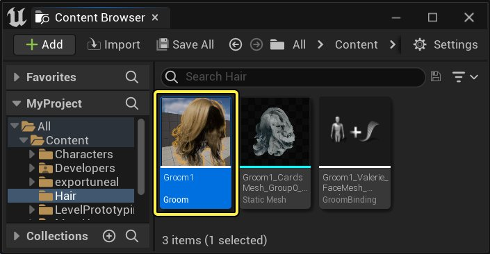
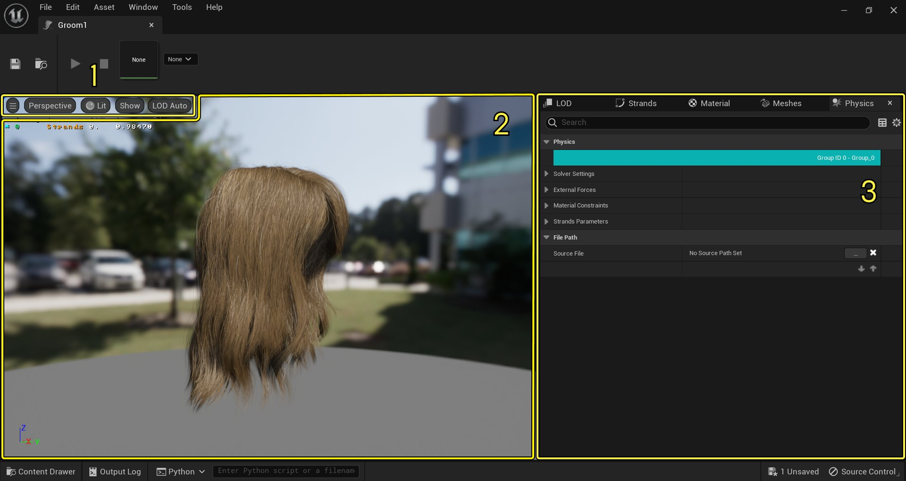
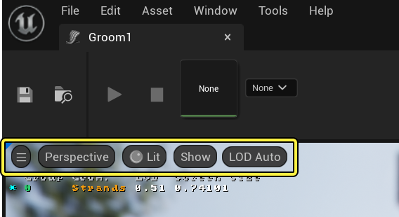
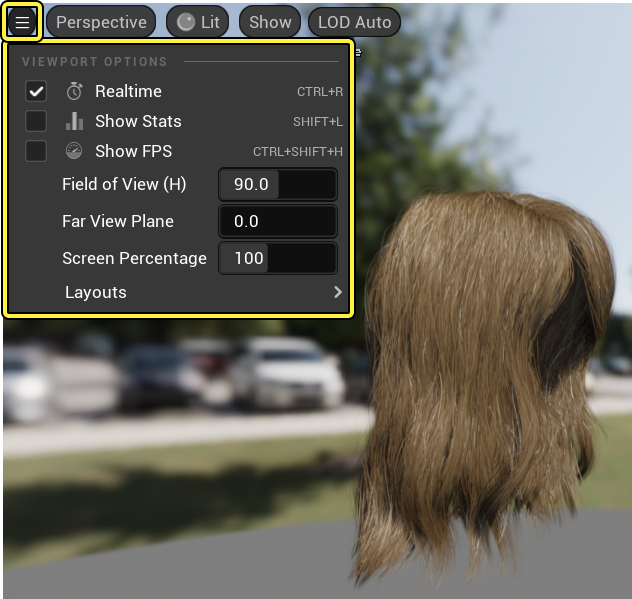
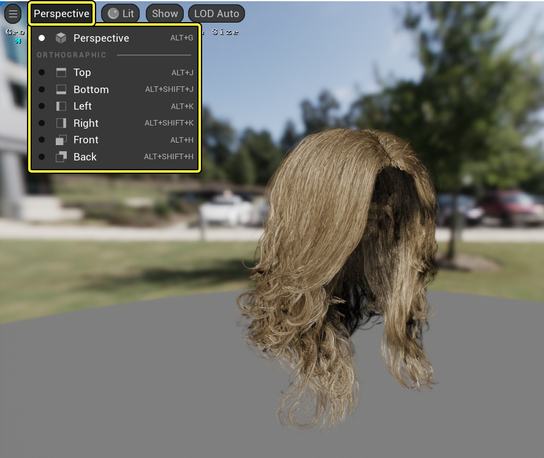
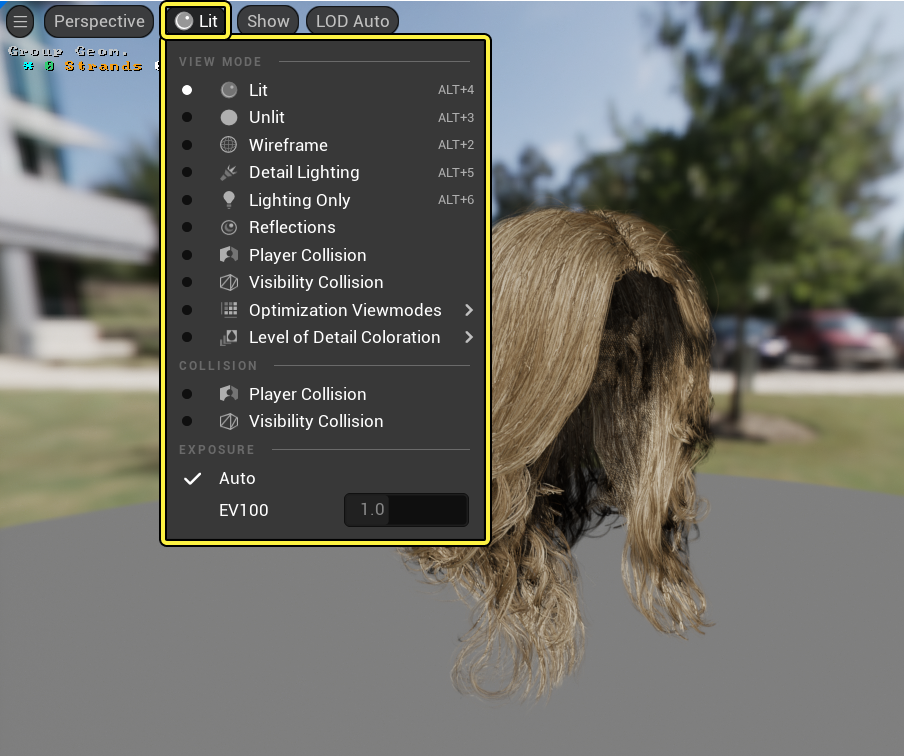
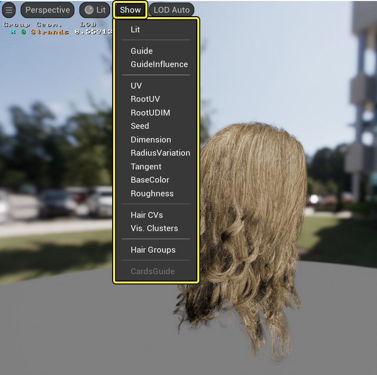
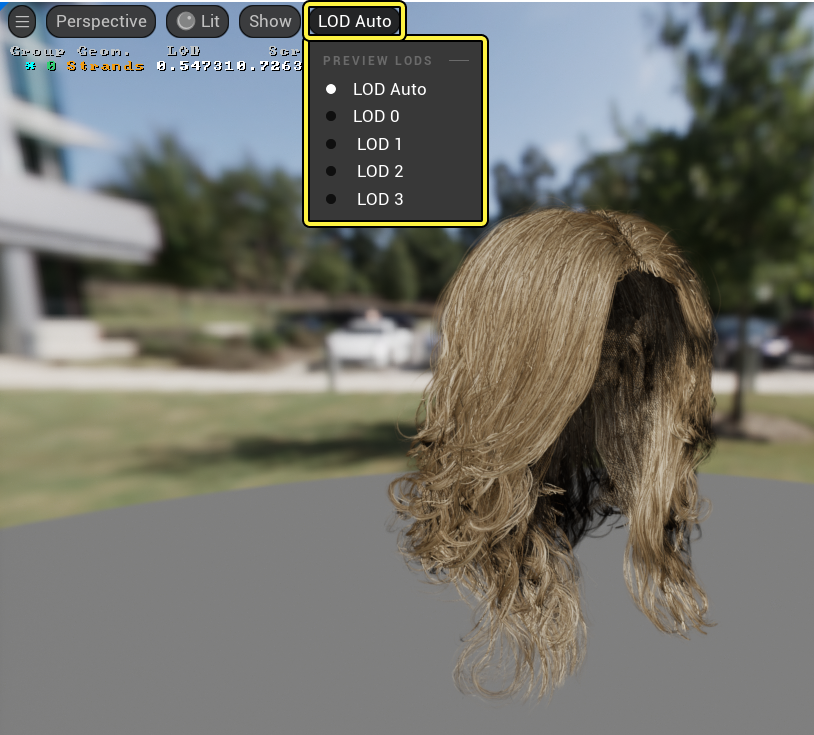

# Groom资产编辑器

> 路径：虚幻引擎5.7文档 / 管理内容 / 毛发渲染与模拟 / Groom资产编辑器

> 原始页面：https://dev.epicgames.com/documentation/unreal-engine/groom-asset-editor-user-guide-in-unreal-engine

**毛发造型（Groom）** 系统主要用于处理导入的Alembic `.abc` 文件中的毛发发束。但是，出于扩展考虑，它还支持发片、网格体等其他几何体形式来表现毛发。为方便设置，所有这些几何体表现类型都可以在单个资产和组件中管理。**毛发资产编辑器（Groom Asset Editor）** 负责管理毛发的大部分内容，你可以用它来修改毛发的不同部分，确定其渲染方式以及物理模拟方式，或者创建并管理毛发的LOD。

## 打开毛发资产编辑器

要打开毛发资产编辑器，你可在内容浏览器中 **双击毛发资产** ，或者使用 **毛发资产的上下文菜单** 打开。

## 毛发资产编辑器界面

毛发资产编辑器由这些区域组成：

点击查看大图

1. 视口显示选项（Viewport Display Options）

   ：包括视口选项、视图视角、视图模式、调试视图和LOD可视化选项。
2. 视口（Viewport）

   ：显示毛发资产及其指定材质、细节层级和物理呈现。
3. 细节面板（Details Panels）

   ：包括

## 视口显示选项

**视口显示选项（Viewport Display Options）** 工具栏提供基本的渲染和可视化选项。

### 视口选项

**视口选项（Viewport Options）** 下拉菜单提供视口中的基本渲染选项。你可以切换实时模式、更改视野和设置超采样的界面百分比。

这些选项和其他选项可以使用视口显示选项工具栏中的下拉 **箭头** 进行访问。

### 视角

**视角（Perspectives）** 下拉菜单提供透视和正交两种视图模式；透视视图相当于以普通3D视角显示关卡，而正交视角则是以2D视口的方式俯瞰关卡。

### 视图模式

**视图模式（View Modes）** 下拉菜单提供所有编辑器视口中通用的多种可视化选项，例如视口的光照、优化、材质和曝光数值控制。

### 显示

**显示（Show）** 下拉菜单提供了与毛发资产编辑器相关的可视化选项，帮助你查看场景中要处理的数据类型，以及于此毛发相关的诊断错误或意外结果。

| 属性 | 说明 |
| --- | --- |
| **导线（Guide）** | 显示用于模拟的导线。 |
| **导线影响（Guide Influence）** | 以彩色显示模拟中的毛发聚丛（所有受某根导线影响的发束）。 |
| **UV** | 显示每个发束的UV。 |
| **根UV（Root UV）** | 显示每个发束根部的UV。 |
| **根UDIM（Root UDIM）** | 在每个发束的根部显示UDIM。 |
| **尺寸（Dimension）** | 显示每个发束的宽度/长度变体。 |
| **种子（Seed）** | （用彩色）显示每个发束使用的随机种子。 |
| **半径差异（Radius Variation）** | （用彩色）显示发束的大小。蓝色表示较细的发束。黄色表示较粗的发束。 |
| **切线（Tangent）** | 显示每股发束的切线法相。 |
| **底色（Base Color）** | 显示每个顶点存储的底色。如果建模应用导出的毛发不包含底色，发束将显示为黑色。 |
| **粗糙度（Roughness）** | 显示每个顶点存储的粗糙度。如果建模应用导出的毛发不包含粗糙度，发束将显示为黑色。 |
| **毛发CV（Hair CVs）** | 显示毛发发束CVs。 |
| **Vis.簇（Vis Cluster）** | 显示用于剔除和细节层次用途的毛发簇。 |
| **毛发群组（Hair Groups）** | 显示毛发群组 |
| **发片导线（Cards Guide）** |  |

**显示（Show）** 下拉菜单中有一些可视化示例。

|  |  |  |  |
| --- | --- | --- | --- |
| Show Seed Visualization | Show Hair CVs Visualization | Show Vis. Clusters Visualization | Show Base Color Visualization |
| 种子 | 毛发CV | Vis.簇 | 底色 |

### LOD

LOD下拉菜单允许你自动调节视口中的细节层次，或者以某一个指定的细节层次来显示毛发。

使用"LOD自动（LOD Auto）"选项时，LOD会根据[细节层次（Level of Detail）](#levelofdetail)面板中指定的选项自动切换。此选项根据LOD在视口中的屏幕尺寸来自动切换LOD。或者忽视毛发的屏幕尺寸，使用下拉菜单从已经生成的可用LOD中选择，查看它们的效果。

## 视口

在 **视口（Viewport）** 中，你可以查看导入的毛发资产，并在其不同的细节面板中进行更改；你还可以使用不同的可视化和调试模式来检验毛发。

## 细节面板

毛发资产编辑器中包含多个 **细节（Details）** 面板，用于控制与毛发有关的多种特性。

> 图片已省略：Groom Asset Editor Details Panels

探索下文，详细了解这些细节面板：

| 细节面板 | 说明 |
| --- | --- |
| [细节级别（Level of Detail）](../setting-up-level-of-detail-for-grooms/index.md) | 使用此面板配置你的Groom拥有的LOD数量，以其各自的属性。 |
| [插值（Interpolation）](../groom-interpolation/index.md) | 使用此面板定义Groom的曲线该如何根据蒙皮和物理模拟移动。 |
| [发束（Strands）](../groom-strands/index.md) | 使用此面板配置Groom的发束几何体的属性。 |
| [发片（Cards）](../setting-up-cards-and-meshes-for-grooms/index.md) | 使用此面板为Groom的LOD配置和生成发片几何体。这些发片将按LOD生成和分配。 |
| [网格体（Meshes）](../setting-up-cards-and-meshes-for-grooms/index.md) | 使使用此面板为Groom的LOD配置和生成网格体几何体。这些网格体将按LOD生成和分配。 |
| [材质（Materials）](../groom-materials/index.md) | 使用此面板为Groom分配材质。 |
| [物理（Physics）](../enabling-physics-simulation-on-grooms/index.md) | 使用此面板设置Groom的物理模拟。 |
