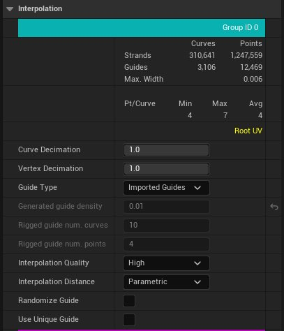
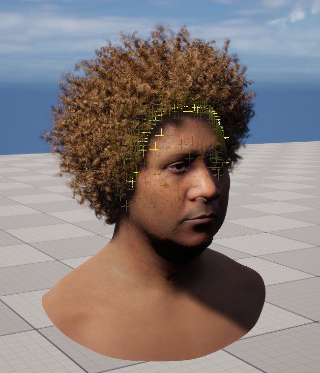
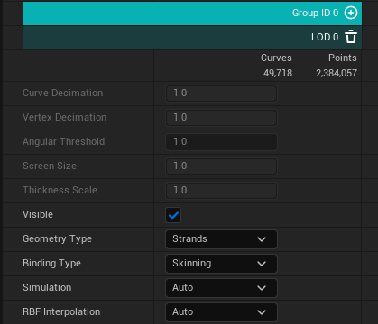
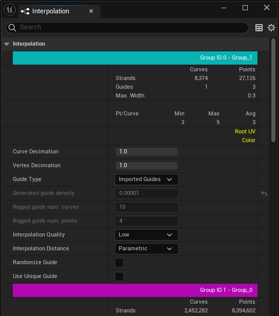
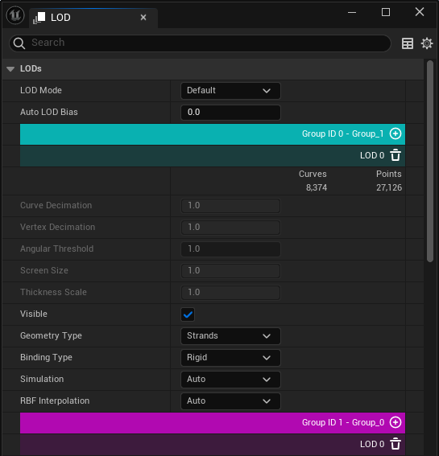

# Groom插值

> 路径：虚幻引擎5.7文档 / 管理内容 / 毛发渲染与模拟 / Groom插值

> 原始页面：https://dev.epicgames.com/documentation/unreal-engine/groom-interpolation-in-unreal-engine

Groom **插值（Interpolation）** 设置定义了Groom曲线应如何基于蒙皮和物理模拟移动。根据蒙皮变形和曲线长度，你可能需要进行不同的设置。

## 直观显示导线影响

你可以在Groom资产编辑器中和关卡内直观显示导线的影响：

| Groom资产编辑器导线可视化选项 | 关卡编辑器Groom导线可视化选项 |
| --- | --- |
| Groom资产编辑器导线可视化 | 关卡编辑器Groom导线可视化 |

- 在Groom资产编辑器中，使用

  显示（Show）

  菜单，选择

  导线（Guides）

  或

  发束导线影响（Strands Guides Influences）

  。
- 在关卡中，使用

  查看模式（View Modes）

  菜单，选择

  Groom > 导线（Guides）

  或

  Groom > 发束导线影响（Strands Guides Influences）

  。

下方示例展示了渲染发束和导线以及导线如何影响每股渲染发束。

| Groom渲染发束 | Groom导线 |
| --- | --- |
| 渲染发束 | 导线 |

> [!TIP]
> 出于外观或性能原因，你可以使用设置 **使用唯一导线（Use Unique Guide）** 来降低毛发插值的开销。

## 全局插值

全局插值选项在较大的骨骼网格体变形和模拟下保留原始的Groom形状。即，即使发生了变形，底层系统也会使用 **径向基函数** （RBF）来保留原始Groom的位置。将一组样本放置在蒙皮网格体上，并对其余样本使用差值。蒙皮位置和当前变形位置用于计算校正值。这意味着仅当Groom绑定到骨骼网格体并使用蒙皮进行变形时，全局变形才有效（请参阅 **Groom资产编辑器** 中的 **LOD** 面板）。

你可以选择 **光照（Lit） > Groom > 根部绑定（Root Bindings）** ，从而直观地显示放在关卡中的Groom的RBF样本。将鼠标悬停在视口中的变形RBF复选框上。

在Groom资产编辑器的 **LOD** 面板中，每个LOD都可以选择加入或退出 **RBF插值（RBF Interpolation）** ，从而具有高度灵活性。

## Groom资产编辑器插值属性

**插值（Interpolation）** 面板可修改初次导入Groom时设置的一些属性。

| 属性 | 说明 |
| --- | --- |
| 毛发组（Hair Group） |  |
| **曲线消减（Curve Decimation）** | 通过减少发束数量来消减Groom。去除的发束将从Groom的导入发束中随机选择。 |
| **顶点消减（Vertex Decimation）** | 通过移除发束上的顶点来消减Groom。 |
| **导线类型（Guide Type）** | 定义使用了哪些导线： **导入型（Imported）** ：使用导入的导线。 **生成型（Generated）** ：根据发束生成导线。 **绑定型（Rigged）** ：根据发束生成绑定的导线。 |
| **毛发导线密度（Hair to Guide Density）** | 定义用作导线的发束比例。 |
| **已绑定导线曲线数量（Rigged guide num. curves）** | 在Groom和骨骼网格体上生成的导线数量。 |
| **已绑定导线点数量（Rigged guide num. points）** | 每根导线分配的点/骨骼数量。 |
| **插值质量（Interpolation Quality）** | 定义在将导线运动插值到发束上时的插值质量。对于短发，我们建议使用低（Low）设置，因为计算速度更快，对最终质量的影响较小。对于中长发和长发，使用高（High）设置有利于实现更好的变形。 **低（Low）** ：根据最近邻搜索编译插值数据。这会导致插值数据质量降低，但编译速度快。此设置可能需要几分钟才能完成。 **中（Medium）** ：使用曲线形状匹配搜索在有限的空间范围内编译插值数据。此选项是在质量高低和编译时间长短设置之间进行取舍。此设置可能需要几十分钟才能完成。 **高（High）** ：使用曲线形状匹配搜索编译插值数据。这可以得到高质量的插值数据，但编译速度相对较慢。此选项设置可能需要几十分钟才能完成。 |
| **插值距离（Interpolation Distance）** | 定义用于将导线和发束配对在一起的指标。从以下选项中选择： **参数化（Parametric）** ：根据曲线参数距离编译插值数据。 **根部（Root）** ：根据导线根部和发束根部之间的距离编译插值数据。 **索引（Index）** ：根据导线和发束顶点索引编译插值数据。 **距离（Distance）** ：根据曲线欧几里得距离编译插值数据。 |
| **随机化导线（Randomize Guide）** | 启用后，用于插值的导线会略微随机化，以拆分可能发生的发簇。 |
| **使用唯一导线（Use Unique Guide）** | 启用后，将使用单根导线进行运动插值 |
| 毛发插值（Hair Interpolation） |  |
| **RBF插值（RBF Interpolation）** | 启用后，将径向偏差函数（RBF）用于插值，而非局部皮肤刚体变换。此值用于将RBF插值属性设置为 **自动（Auto）** 的所有细节级别（LOD）。 |
| **RBF类型（RBF Type）** | 选择当Groom绑定到骨骼网格体时要使用的插值类型： **刚性变换（Rigid Transform）** ：插值期间仅使用最接近根部的蒙皮三角形的平移。 **偏移变换（Offset Transform）** ：插值期间仅使用最接近根部的皮肤三角形的平移。 **平滑变换（Smooth Transform）** ：插值过程中使用最接近根部的皮肤三角形的平移和根据导线计算的平滑旋转。 最接近根部的三角形的平移用于根据插值期间使用的导线计算的平滑旋转。 **无蒙皮（No Skinning）** ：不会发生蒙皮。 |
| **启用导线缓存支持（Enable Guide-Cache Support）** | 启用导线缓存支持，以允许此Groom在运行时动态附加模拟缓存。 |
| **毛发插值类型（Hair Interpolation Type）** | 选择当Groom绑定到骨骼网格体时要使用的插值类型： **刚性变换（Rigid Transform）** ：插值期间仅使用最接近根部的蒙皮三角形的平移。 **偏移变换（Offset Transform）** ：插值期间仅使用最接近根部的皮肤三角形的平移。 **平滑变换（Smooth Transform）** ：插值过程中使用最接近根部的皮肤三角形的平移和根据导线计算的平滑旋转。 最接近根部的三角形的平移用于根据插值期间使用的导线计算的平滑旋转。 **无蒙皮（No Skinning）** ：不会发生蒙皮。 |

## Groom资产编辑器LOD插值属性

**LOD** 面板中有以下与Groom插值相关的属性：

| 属性 | 说明 |
| --- | --- |
| **RBF插值（RBF Interpolation）** | 设置全局插值模式以表示此细节级别。此选择将重载在[插值](#groom%E8%B5%84%E4%BA%A7%E7%BC%96%E8%BE%91%E5%99%A8%E6%8F%92%E5%80%BC%E8%AE%BE%E7%BD%AE)面板中设置的默认RBF插值值。可用的选项有： **自动（Auto）** ：使用设置的全局值。 **启用（Enable）** ：强制启用RBF插值。 **禁用（Disable）** ：强制禁用RBF插值。 |
