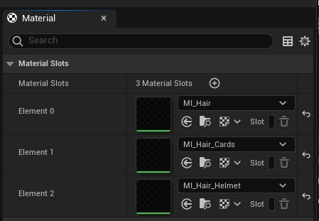
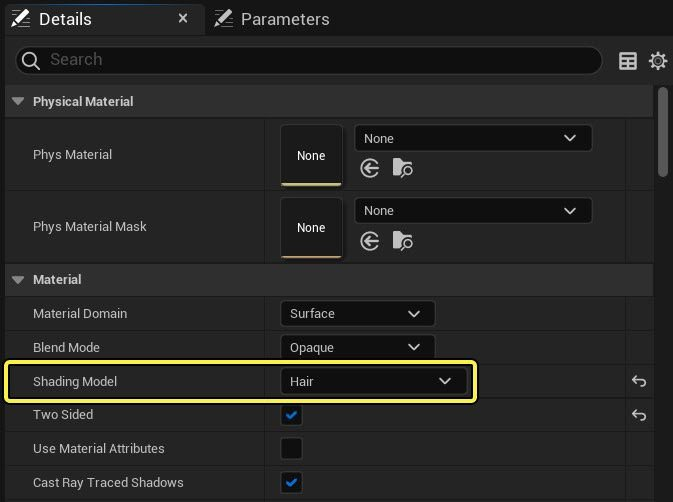
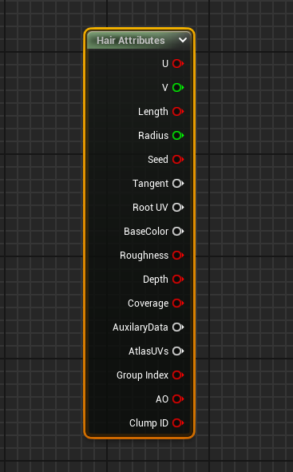
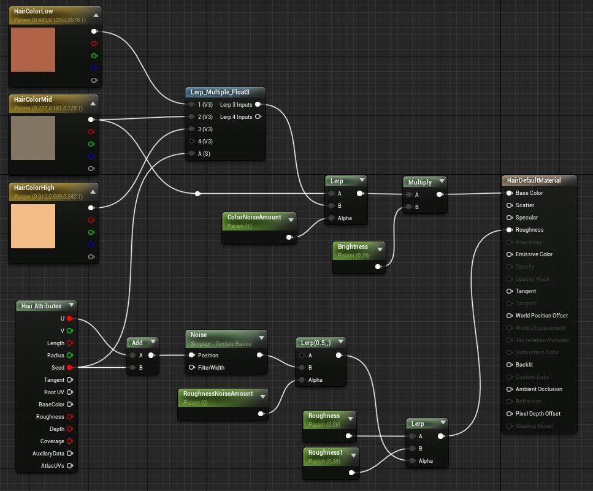

# Groom材质

> 路径：虚幻引擎5.7文档 / 管理内容 / 毛发渲染与模拟 / Groom材质

> 原始页面：https://dev.epicgames.com/documentation/unreal-engine/groom-materials-in-unreal-engine

[Groom资产编辑器](../groom-asset-editor-user-guide/index.md)中的 **材质（Material）** 面板重新组合了Groom所使用的所有材质。你可以使用 **添加（+）** 图标添加材质插槽，并使用 **删除（垃圾箱）** 图标将其删除。每种材质都有唯一名称，以下拉菜单的形式出现在 **发片（Cards）** 、 **网格体（Meshes）** 和 **发束（Strands）** 面板中。在每个Groom组件上，材质插槽可以重载Groom资产编辑器中设置的材质插槽。

为了使材质能够有效地用于Groom，该材质必须使用 **毛发（Hair）** 着色模型。

> [!NOTE]
> 还必须在材质编辑器的 **用法（Usage）** 分段中启用标记 **与发束结合使用（Use with Hair Strands）** 。当你第一次将材质应用于Groom时，会自动设置此标记，但如果没有，你可以手动启用。

在材质图表中，你可以使用 **毛发属性（Hair Attributes）** 表达式访问毛发属性。

| 属性 | 说明 |
| --- | --- |
| **U / V** | 毛发的UV坐标。U坐标始终 *沿着* 毛发，其中0表示根部，而1表示梢部。 |
| **长度（Length）** | 当前曲线的长度。 |
| **半径（Radius）** | 当前位置的曲线半径。 |
| **种子（Seed）** | 0到1之间的随机值，且沿曲线均匀分布。 |
| **切线（Tangent）** | 与曲线方向一致的切线向量。 |
| **根部UV（Root UV）** | 曲线根部位置处底层网格体的UV。 |
| **BaseColor** | 每条曲线的点颜色。 |
| **粗糙度（Roughness）** | 每条曲线的点粗糙度。 |
| **深度（Depth）** | 深度偏移。仅用于发片和网格体几何体。 |
| **覆盖（Coverage）** | 覆盖遮罩值。仅用于发片和网格体几何体。 |
| **AuxiliaryData** | 仅用于发片和网格体几何体的辅助数据。 |
| **AtlasUVs** | 仅用于发片和网格体几何体的发片UV。 |
| **组索引（Group Index）** | 曲线的组索引。 |
| **AO** | 每条曲线的环境光遮蔽。 |
| **发簇ID（Clump ID）** | 曲线的发簇ID。 |

下面是使用"毛发"材质中毛发属性（Hair Attributes）表达式的示例：

