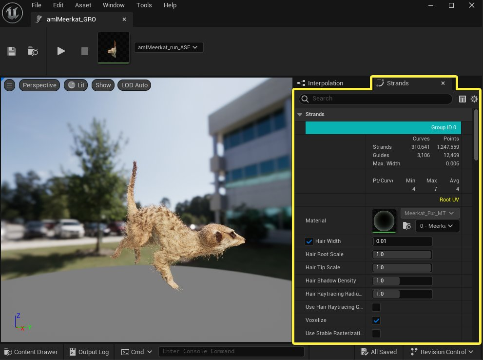
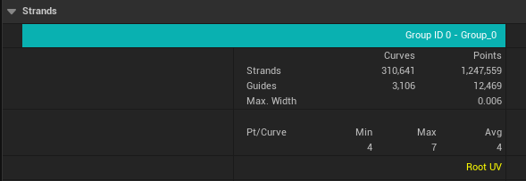
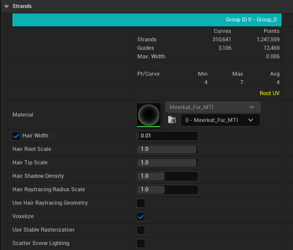
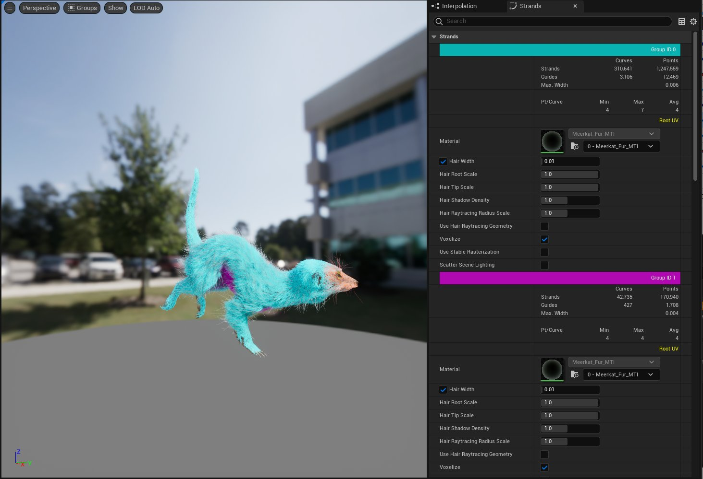

# Groom发束

> 路径：虚幻引擎5.7文档 / 管理内容 / 毛发渲染与模拟 / Groom发束

> 原始页面：https://dev.epicgames.com/documentation/unreal-engine/groom-strands-in-unreal-engine

在[Groom资产编辑器](../groom-asset-editor-user-guide/index.md)的 **发束（Strands）** 面板中，你可以为构成Groom的发束几何体配置设置。每个Groom分为几组，每组有自己的属性和设置。

每组毛发的顶部显示有关该分组的统计数据。其中包括：

- 用于已渲染

  发束

  的曲线和点的数量。
- 用于

  导线

  的曲线和点的数量。
- 各个已渲染发束的

  最大宽度

  。
- 每条曲线点

  数量的最小值、最大值和平均值。
- Groom的可用

  属性

  ，例如根部UV、每个点的颜色、发簇ID等等。

以下设置是每组毛发的一部分：

| 属性 | 说明 |
| --- | --- |
| **材质（Material）** | 用于渲染发束的材质。 |
| **毛发宽度（Hair Width）** | 指定毛发的宽度，以厘米为单位。 |
| **毛发根部缩放（Hair Root Scale）** | 应用于每个曲线根部的缩放因子，并从根部到梢部进行线性插值。 |
| **毛发梢部缩放（Hair Tip Scale）** | 应用于每个曲线梢部的缩放因子，并从根部到梢部进行线性插值。 |
| **毛发阴影密度（Hair Shadow Density）** | 应用于体素化的缩放因子，以增加或减少毛发透射。 |
| **毛发光线追踪半径缩放（Hair Raytracing Radius Scale）** | 应用于光线追踪毛发几何体的缩放因子。仅在启用[硬件光线追踪](../../../building-virtual-worlds/lighting-the-environment/ray-tracing-and-path-tracing-features/hardware-ray-tracing/index.md)时适用。 |
| **使用毛发光线追踪几何体（Use Hair Raytracing Geometry）** | 启用光线追踪以使用毛发几何体。不使用时，光线追踪效果（例如阴影）会使用毛发体素化作为几何体代理。 |
| **体素化（Voxelize）** | 启用发束体素化，用于投射阴影和环境遮挡。 |
| **使用稳定的光栅化（Use Stable Rasterization）** | 启用后，可确保毛发几何体与像素对齐，以避免锯齿。成组的毛发可能看起来更浓密，而孤立的毛发则仍然稀疏。这只适用于毛发稀少且散乱的Groom。 |
| **散射场景光照（Scatter Scene Lighting）** | 启用后，毛发会被照亮成场景颜色。你可以将此属性用于汗毛和短发，以便从周围表面（如皮肤）吸收光线。 |

## 直观显示毛发组

你可以在预览窗口中选择 **视图（View） > 组（Groups）** ，直观地显示Groom资产内的不同组。每个组的颜色与 **发束（Strands）** 细节面板中 **组ID（Group ID）** 分段的颜色相匹配。

预览窗口中毛发组的颜色与发束细节面板中彩色组ID的颜色相匹配。
